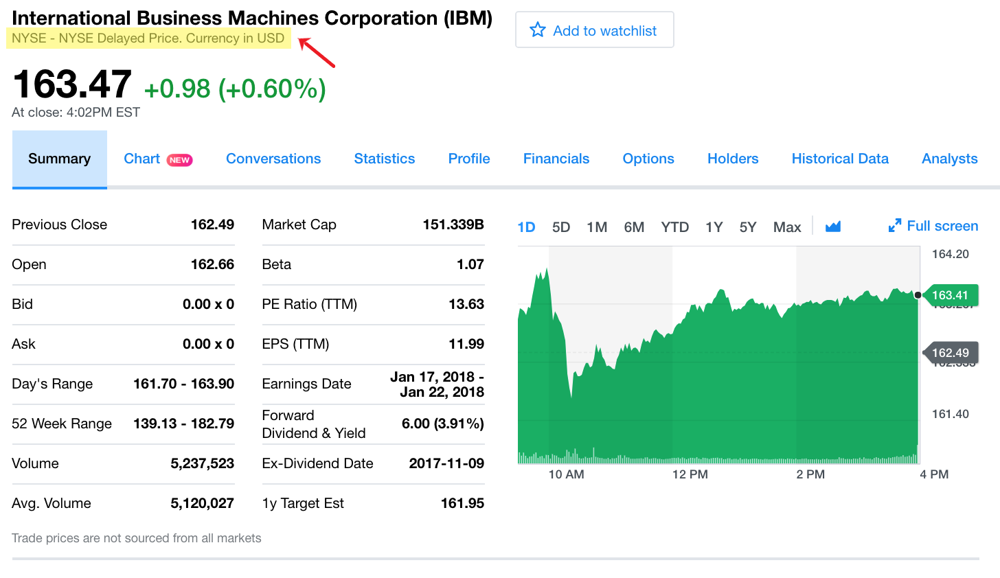

## Objetivo

  + Ejemplificar cómo se utilizan en la práctica los modelos basados en Teoría Moderna de Portafolios 
    - Repaso de términos básicos usados en el día a día de los manejadores de portafolios
    - Utilizar la paquetería optimist
    - Conocer los conceptos: *paridad de riesgo*, *optimización inversa*, *rendimientos implícitos*

# Un recorrido de conceptos básicos

+ Usando https://finance.yahoo.com/ y `get_prices_yahoo()`
    - Tickers
    - OHLC (Open, High, Low, Close)
    - Rendimiento acumulado
    - Liquidez
    - Precios Ajustados
+ Valor de un portafolio
    - Rebalanceo

> Buscar AMZN, SPOT, TSLA en Yahoo! Finance

## Tickers

* El *National Numbering Agency* (NNA) creo el ISIN (*International Securities Identification Number*).
* El *CUSIP Service Bureau*, operado por *Standard & Poor's for the American Bankers Association* creo el CUSIP (*Committee on Uniform Securities Identification Procedures*).
* También empresas como Yahoo! Finance y Bloomberg crean sus propios identificadores (aunque muchas veces son iguales a los tickers de las casas de bolsa). 

Veamos algunos ejemplos en la siguiente tabla:

Ticker| Yahoo! Finance | ISIN | CUSIP 
-- | -- | -- | -- | -- | --
IBM | IBM | US4592001014 | 459200101 
AAPL | AAPL | US0378331005 | 037833100

* Para encontrar tickers usar [https://finance.yahoo.com/lookup](https://finance.yahoo.com/lookup)

> ¿Porqué hay un brico del punto verde al punto naranja?

```{r, ibm-series, fig.cap="Serie de precios de IBM", echo=FALSE, out.width="70%", fig.align="center"}
knitr::include_graphics("./figure/OHLC.png")
```

## OHLC

*El NYSE, donde se hacen las transacciones de las acciones de IBM, funciona días hábiles entre 9:30am y 4:00pm EST (Eastern Standard Time). Se dice que el **precio de apertura** (open) es el primer precio después de las 9:30am al que se pacta una transacción de IBM en el día. El **precio de cierre** (close) es el último precio antes de las 4:00pm al que se pacta una transacción de IBM en el día.*

*En realidad, los precios de cierre y apertura no son exactamente el primer y último precio al que se cierra una transacción. Dependiendo de la casa de bolsa, los precios de cierre y apertura que se publican pueden ser **el promedio de los precios pactados en los últimos/primeros minutos del día de operación**.*

# Optimist demo

* Paquetería **R** disponible en github en  [https://github.com/audiracmichelle/optimist](https://github.com/audiracmichelle/optimist)

* En **R** para descargarla se usa

```{r}
#devtools::install_github("audiracmichelle/optimist")
```

* Para cargarla a la sesión se usa

```{r, warning=FALSE, message=FALSE}
library(optimist)
```

* Para probar que se ha cargado en **RStudio** podemos escribir 

```
get_
```

y en el drop-down aparecerán varias opciones de la paquetería junto con su descripción y parámetros

**¿Cómo se usa?**

* `optimist` está inspirada en los lenguajes que usan **sintaxis de lenguaje natural**
* funciona con un flujo secuencial que aprovecha los **pipe operators**

**Cargamos los datos**

    + AMZN, SPOT, TSLA

```{r, message=FALSE, warning=FALSE}
price <- get_prices_yahoo(c('AMZN','SPOT','TSLA'), 
                                  from = '2012-12-31', 
                                  to = '2019-04-30')
```

* Veamos qué tipo de objeto es `price`

```{r}
class(price)
```

```{r}
head(price)
tail(price)
```

```{r, warning=FALSE, message=FALSE}
#Para el seminario usamos plotly
#install.packages("plotly")
library(plotly)

#' @title plotly_xts
#' @description Plots time series from xts
#' @param x xts

plotly_xts <- function(x, ...){
 x %<>%
   as.data.frame() %>%
   tibble::rownames_to_column("date") %>%
   mutate(date = as.Date(date)) %>%
   gather(key, value, -date)

 p <- x %>%
   plot_ly(x = ~date,
           y = ~value,
           color = ~key, ...) %>%
   add_lines()

 p
}
```

> ¿Cuál es la diferencia de la siguiente gráfica y la que vimos en Yahoo! Finance?

```{r}
price %>% 
  plotly_xts()
```

## Rendimiento acumulado

```{r}
price %>% 
  get_dlyChg_from_price() %>% 
  get_cumRet_from_dlyChg() %>% 
  plotly_xts()
```

> Veamos las gráficas de los precios ajustados diarios en los objetos `herdez` y `gigante`

```{r, message=FALSE, warning=FALSE}
herdez <- getSymbols('herdez.mx', auto.assign=FALSE, 
                     from = '2016-12-31', to = '2017-12-31')

herdez <- Ad(herdez)
gigante <- getSymbols('gigante.mx', auto.assign=FALSE, 
                      from = '2016-12-31', to = '2017-12-31')
gigante <- Ad(gigante)
```

```{r out.width="70%", fig.align="center", fig.pos="H"}
plot_xts(herdez) + 
  labs(title = 'Precios ajustados de Herdez')
```

```{r out.width="70%", fig.align="center", fig.pos="H"}
plot_xts(gigante) + 
  labs(title = 'Precios ajustados de Gigante')
```

> ¿Porqué el precio de Gigante parece que se estaciona en distintos periodos en comparación con el precio de Herdez?

```{r}
head(herdez)
```

```{r}
head(gigante)
```

## Liquidez

*Las bolsas de valores determinan los sistemas y medios electrónicos en los que se hacen las operaciones de compra-venta de instrumentos financieros. Supongamos que manejamos un portafolio en una casa de bolsa que tiene acciones de Gigante que queremos vender. El 3 de Enero de 2017 colocamos un precio de venta de 42 pesos en los sistemas de la casa de bolsa, pero no hay ninguna postura de compra en todo el día. Entonces el precio de cierre del 3 de Enero se queda igual al precio de cierre del 2 de Enero (39 pesos). Esto se repite día con día, no hay posturas de compra y no logramos vender esas acciones. Entonces el precio de Gigante se mantiene en 39 pesos.*

*El 27 de Febrero decidimos bajar nuestra postura a 41 pesos y finalmente alguien accede a colocar una postura de compra a ese precio. Se cierra la operación y el precio de cierre de Gigante de ese día se fija en 41 pesos como se ve en la gráfica.*


> ¿Cómo crees que se mide que tan líquido es un instrumento?

> ¿Porqué no son comparables los rendimientos aculumados de los siguientes activos?

```{r}
price <- get_prices_yahoo(c('IBM', 
                            'herdez.mx', 
                            'gigante.mx', 
                            'MXN=X'),
                           from = '2016-12-31',
                           to = '2017-12-31')

price %>% 
  get_dlyChg_from_price() %>% 
  get_cumRet_from_dlyChg() %>% 
  plotly_xts()
```

### Rendimiento en diferentes tipos de cambio

*Supongamos que un inversionista americano decide invertir por un año en $\text{xyz}$, una acción mexicana listada en la BMV (Bolsa Mexicana de Valores). Para poder comprar $\text{xyz}$ el inversionista debe cambiar sus dólares a pesos.*

*Al final del año el rendimiento en pesos de $\text{xyz}$ es 0% y el peso se fortalece contra el dolar. El inversionista vende $\text{xyz}$ y recibe pesos. Al cambiar los pesos por dólares el inversionista recibe más pesos que los que invirtió inicialmente pues el valor del peso contra el dolar aumentó.*

*Esto significa que, aunque el rendimiento en pesos de $\text{xyz}$ fue 0%, el rendimiento en dólares que recibó el inversionista fue mayor a cero.* 

En la imagen podemos ver marcado en amarillo el nombre la casa de valores donde están listadas las acciones de IBM (NYSE) y la denominación de la emisión (USD).

```{r, yahoo-finance, fig.cap="Información de IBM en Yahoo! Finance", echo=FALSE, out.width="70%", fig.align="center"}

```

Calculemos el rendimiento de IBM en pesos usando cambios relativos:

1) Sean $\delta_\text{ibm}^t$ el cambio diario de IBM en dólares y $\delta_\text{mxn/usd}^t$ el cambio diario del peso contra el dólar, entonces $\delta_\text{ibm.mxn}^t = \delta_\text{ibm}^t * \delta_\text{mxn/usd}^t$ es el cambio diario de IBM en pesos.
2) Usando esto, guardemos en `dlyChg$IBM_MXN.Adjusted` la serie de cambios diarios de IBM en pesos. 
3) Finalmente, acumulemos los cambios diarios para obtener el rendimiento en pesos que buscamos.

```{r}
dlyChg <- price %>% get_dlyChg_from_price()
dlyChg$IBM_MXN.Adjusted <- dlyChg$IBM.Adjusted * dlyChg$MXN.X.Adjusted
dlyChg %>% get_cumRet_from_dlyChg() %>% plotly_xts()
```

> Comparemos en Yahoo! Finance: AMX.MX y AMX, AMZN y AMZN.MX

>¿Cuál es la diferencia de los precios de cierre y ajustados?

```{r, close-adjusted, fig.cap="Precios de cierre y ajustados", out.width="70%", fig.align="center", fig.pos="H"}
ibm <- getSymbols.yahoo('IBM', auto.assign=FALSE, 
                        from = '2016-12-31', to = '2017-12-31')

# obtenemos los cambios diarios de ibm
ibm_dlyChg  <-  get_dlyChg_from_price(ibm)

# acumulamos los cambios diarios
ibm_cumRet <- get_cumRet_from_dlyChg(ibm_dlyChg)

plot_xts(ibm_cumRet[, c('IBM.Close', 'IBM.Adjusted')])
```

### Precios Ajustados

Los **precios ajustados eliminan el efecto que tienen los dividendos en los precios de cierre de los instrumentos financieros**.

```{r}
ibm_dividends <- getDividends('IBM', 
                              from = '2016-12-31', 
                              to = '2017-12-31')
ibm_dividends
```

Veamos los precios de cierre y los pagos de dividendo de IBM entre el 7 y el 9 de febrero de 2017.

```{r}
cbind(ibm[, 'IBM.Close'], ibm_dividends)['2017-02-07/2017-02-09', ]
```

*Si solo vemos el precio debajo de `IBM.Close`, podríamos pensar que un inversionista que tenía una acción de IBM tuvo una perdida de `r sprintf("%0.2f", as.numeric(abs(ibm$IBM.Close['2017-02-08']) - as.numeric(ibm$IBM.Close['2017-02-07'])))`  (`r sprintf("%0.2f", as.numeric(ibm$IBM.Close['2017-02-08']))` - `r sprintf("%0.2f", as.numeric(ibm$IBM.Close['2017-02-07']))`) dólares del 7 al 8 de febrero de 2017 . Sin embargo, esto no es cierto porque el inversionista recibió `r as.numeric(ibm_dividends['2017-02-08'])` dólares como pago en dividendos.*

Una **serie de precios ajustados es una serie de precios 'hipotéticos'** cuyo valor representa una inversión:

* en la que se invierte en una sola acción, y
* en la que se reinvirtien inmediatamente los dividendos pagados por esa misma acción (suponiendo que se pueden comprar fracciones de títulos de acciones).

----

**Construcción de pesos ajustados**

Supongamos que tenemos una serie de precios de cierre $p^0, p^1, \dots, p^T$  de una acción $\text{xyz}$ y que en $d$ esta acción tuvo un pago de dividendos por un monto $\text{div}^d$.

Queremos construir una serie de precios $p^0_\text{prima}, p^1_\text{prima}, \dots, p^d_\text{prima}$ de una acción hipotética $\text{xyz}_\text{prima}$ que replique a $\text{xyz}$ pero sin pagos de dividendos. Esto significa que deben cumplirse los siguientes tres supuestos:

(1) $p^d_\text{prima}= p^d$
(2) $p_\text{prima}^{d-1} = p^{d-1} - \text{div}^d$
(3) $\delta_\text{prima}^t=\delta^t$ para toda $t$ distinta a $d$

Combinando (2) y (3) llegamos a

$$
\delta^{d-1} = \delta_\text{prima}^{d-1} \\
\frac{p^{d-1}}{p^{d-2}} = \frac{p_\text{prima}^{d-1}}{p_\text{prima}^{d-2}} = \frac{p^{d-1} - \text{div}^d}{p^{d-2}_\text{prima}}
$$

de donde obtenemos el valor de $p^{d-2}_\text{prima}$

$$
p^{d-2}_\text{prima} = \left(\frac{p^{d-1}-\text{div}^d}{p^{d-1}}\right)p^{d-2}
$$

Usando (3) y el resultado anterior, obtenemos el valor de $p^{d-3}_\text{prima}$

$$
\delta^{d-2} = \delta^{d-2}_\text{prima} \\
\frac{p^{d-2}}{p^{d-3}} =\frac{p^{d-2}_\text{prima}}{p^{d-3}_\text{prima}} =
\frac{\left(\frac{p^{d-1} - \text{div}^d}{p^{d-1}}\right)p^{d-2}}{p^{d-3}_\text{prima}}  \\
p^{d-3}_\text{prima} = \left(\frac{p^{d-1}-\text{div}^d}{p^{d-1}}\right)p^{d-3}
$$

Si continuamos con este proceso (con inducción), entonces se cumple para toda $t$ distinta de $d$ que

$$
p_\text{prima}^t = \left(\frac{p^{d-1}-\text{div}^d}{p^{d-1}}\right)p^t
$$

Así $\left(\frac{p^{d-1}-\text{div}^d}{p^{d-1}}\right)$ es el **factor de ajuste** del precio al tiempo $d$, y $p^t_\text{prima}$ es el precio ajustado de $p^t$.

----

## Valor de un portafolio

Vamos a suponer que podemos comprar fracciones de títulos de acciones.Normalmente, no son fáciles de conseguir en el mercado fracciones de títulos de instrumentos listados en casas de bolsa. En contraste, es fácil invertir en fracciones de tipos de cambio.

Imaginemos que al inicio del 2017 invertimos en un portafolio con la siguiente composición:

* 30% en Herdez, 
* 20% en Gigante, 
* 40% en dólares, y 
* 10% en IBM

Estos pesos los guardamos en `H0` (initial holdings).

```{r}
H0 <- c(
  HERDEZ.MX.Adjusted = 0.3,
  GIGANTE.MX.Adjusted = 0.2,
  MXN.X.Adjusted = 0.4,
  IBM_MXN.Adjusted = 0.1
)
```

Quisiéramos conocer el rendimiento acumulado en 2017 de este portafolio.

----

**Construcción de rendimiento acumulado de un portafolio**

Supongamos que tenemos un portafolio con $n$ activos y el **peso inicial de apertura de las componentes del portafolio** está dado por $H^0 = (H_1^0, H_2^0, \dots, H_n^0)$ con $\sum H_i^0 = 1$. Con esto, tenemos que 

* El **rendimiento acumulado del portafolio al tiempo $t$** es

$$
\sum_j H_j^0 \delta_j^{0,t}
$$

donde $\delta_j^{0,t}$ es el rendimiento acumulado del activo $j$ al tiempo $t$.

* La **contribución del activo $i$ al rendimiento acumulado del portafolio al tiempo $t$** está dada por

$$
H_i^0\delta_i^{0,t} + (1-H_i^0)
$$

* El **peso de cierre del portafolio invertido en el activo $i$ al tiempo $t$** denotado por $h_i^t$ es:

$$
h_i^t = \frac{H_i^0 \delta_i^{0,t}}{\sum_j H_j^0 \delta_j^{0,t}}
$$

Regularmente nos referiremos a los pesos de cierre de un portafolio simplemente como pesos del portafolio.

----

Calculemos el rendimiento acumulado de nuestro portfalio, así como las contribuciones al rendimiento acumulado y los pesos en cada $t$ de los componentes.

```{r}
cumRet <- dlyChg %>% get_cumRet_from_dlyChg() 
cumRet <- cumRet[, c('HERDEZ.MX.Adjusted', 
                     'GIGANTE.MX.Adjusted', 
                     'MXN.X.Adjusted', 
                     'IBM_MXN.Adjusted')]

portfolio_cumterm <- xts(order.by = index(cumRet))

portfolio_cumRet <- xts(order.by = index(cumRet))
portfolio_cumRet$portfolio <- 0

portfolio_contrib <- xts(order.by = index(cumRet))

for(c in 1:ncol(cumRet)) {
  portfolio_cumterm <- cbind(portfolio_cumterm,
                             H0[c] * cumRet[ ,c])

  portfolio_cumRet$portfolio <- 
    portfolio_cumRet$portfolio + portfolio_cumterm[ ,c]

  portfolio_contrib <- cbind(portfolio_contrib,
                             portfolio_cumterm[ ,c] + (1 - H0[c]))
}

portfolio_weights <- 
  portfolio_cumterm / as.numeric(portfolio_cumRet$portfolio)
```

Ahora, veamos las contribuciones y el rendimiento acumulado que acabamos de calcular.

```{r, contrib, fig.cap='Contribuciones al rendimiento de un portafolio', out.width="70%", fig.align="center", fig.pos="H"}
plotly_xts(cbind(portfolio_cumRet, portfolio_contrib))
```

En la medida en la que se mueven los precios de los componentes los pesos de cierre se van moviendo los peso iniciales (de apertura) de cada activo dentro del portafolio.

```{r portfolio-weights, fig.cap='Pesos de cierre de los componentes de un portafolio', out.width="70%", fig.align="center", fig.pos="H"}
plot_xts(portfolio_weights)
```

*A las posiciones $H_i^0<0$ se les llama **posiciones cortas**. Tener una posición corta en el componente $i$ de un portafolio significa colocar una venta en corto en el activo $i$. Si ese activo da un rendimiento $\delta_i^\mathbb{T}$ en el periodo $\mathbb{T}$, entonces la contribución del activo $i$ al tiempo $T$ será $(-H_i^0 \delta_i^\mathbb{T})(1-H_i^0)$.*

## Rebalanceo y costos de transacción

*Se dice que se está **rebalanceado** un portafolio cuando en una fecha se decide cambiar los pesos de los componentes del portafolio a un nivel específico. Para esto, se tienen que realizar transacciones de compra venta. **Las casas de bolsa cobran **costos de transacción** que son comisiones por realizar transacciones de compra venta**.*

*En la vida real se tienen que considerar los costos de transacción para deteminar el desempeño de una inversión. Además las operaciones se cierran a precios de mercado (intradía) y no necesariamente a precio de cierre. Es posible que haya operaciones de compra venta que no logran ejecutarse por temas operativos o de liquidez.*

Vamos a suponer que siempre que deseamos modificar los porcentajes de los componente de un portafolio:

* No hay costos de transacción.
* Se logran cerrar todas las operaciones de compra venta.
* Estas operaciones se efectuan a precio de cierre y al día siguiente se amanece con la nueva composición.

El 30 de junio del 2017 decidimos hacer un rebalanceo de nuestro portafolio para llevar los pesos de los componentes a los siguientes niveles:

* 25% en Herdez,
* 20% en Gigante, 
* 55% en dólares, y
* 0% en IBM

Estos pesos los guardamos en `Hb`.

```{r}
Hb <- c(
  HERDEZ.MX.Adjusted = 0.25,
  GIGANTE.MX.Adjusted = 0.2,
  MXN.X.Adjusted = 0.55,
  IBM_MXN.Adjusted = 0.0
)
```

Con este cambio, ¿cuál es el rendimiento acumulado en 2017?

----

**Construcción de rendimiento acumulado de un portafolio después de un rebalanceo**

Si el día $b$ se realiza un rebalanceo, asumimos que ese día se vende a precio de cierre la posición con pesos $h^b =  (h_1^b, h_2^b, \dots, h_n^b)$ y se compra a ese mismo precio la posición con **pesos de rebalanceo** $H^b =  (H_1^b, H_2^b, \dots, H_n^b)$ tales que $\sum H_i^b = 1$. De esta manera el día $b+1$ los pesos de apertura de los componentes del portafolio quedan en $H^b$.

Dado este rebalanceo y bajo estos supuestos tenemos que, para $t \leq b$ el rendimiento acumulado, las contribuciones y pesos se calculan igual que antes. En el caso de $t > b$ se cumple que:

* El rendimiento acumulado esta dado por

$$
\sum_j H_j^0 \delta_j^{0,b} \sum_k H_k^b \delta_j^{b,t}
$$

* La contribución del activo $i$ al rendimiento acumulado del portafolio es

$$
\left(H_i^0\delta_i^{0,b} + (1-H_i^0)\right)\left(H_i^b\delta_i^{b,t} + (1 - H_i^b)\right)
$$

* El peso de cierre $h_i^t$ del activo $i$ del portafolio está dado por

$$
h_i^t = \frac{\left(\sum_j H_j^0 \delta_j^{0,b}\right)\left(H_i^b \delta_i^{b,t}\right)}{\left(\sum_j H_j^0 \delta_j^{0,b}\right)\left(\sum_j H_j^b \delta_j^{b,t}\right)} = \frac{H_i^b \delta_i^{b,t}}{\sum_j H_j^b \delta_j^{b,t}}
$$

Para obtener estos valores nos será util tomar en cuenta que

$$
\delta_j^{b,t} = \frac{\delta_j^{0,t}}{\delta_j^{0,b}}
$$

----

Considerando los pesos de rebalanceo del 30 de junio, vamos a obtener el nuevo rendimiento acumulado de nuestro portfalio y las contribuciones de los componentes.

```{r contrib-rebalanceo, fig.cap='Contribuciones al rendimiento después del rebalanceo', out.width="70%", fig.align="center", fig.pos="H"}
dlyChg <- dlyChg[, c('HERDEZ.MX.Adjusted', 
                     'GIGANTE.MX.Adjusted', 
                     'MXN.X.Adjusted', 
                     'IBM_MXN.Adjusted')]

rebWeight <- xts(rbind(H0, Hb),
                 order.by = c(index(cumRet)[1], as.Date('2017-06-30')))

rebalance <- get_rebalance(dlyChg, rebWeight)

plotly_xts(cbind(rebalance$portValue, rebalance$portContrib))
```

* El rebalanceo que se hizo el 30 de junio provocó que disminuyera el rendimiento final del portafolio

* Después del rebalanceo, al fijar el peso de IBM en cero, a partir del 30 de junio su contribución se mantiene fija

* Los pesos de cierre del portafolio antes y después del rebalanceo del 30 de junio muestran cambios

```{r pesos-rebalanceo, fig.cap='Pesos de cierre despues del rebalanceo', out.width="70%", fig.align="center", fig.pos="H"}
plot_xts(rebalance$portWeight)
```

El **valor de un portafolio en $t$** es el rendimiento acumulado en $t$ por un valor inicial $V_0$ que puede ser un precio, una cantidad de dinero o un nivel de puntos arbitrario.

> ¿Qué son los índices?

> ¿Cómo se calcula la capitalización de mercado de un activo?**

## Índices

Algunos índices de acciones famosos son:

* S&P500 - índice con 500 acciones de Estados Unidos creado por Standard and Poors (S&P)
* Dow Jones - uno de los primeros índices del mundo constituido por acciones de Estados Unidos
* All County World Index - índice de referencia compuesto por acciones de todo el mundo creado por MSCI
* IPC (Índice de Precios y Cotizaciones) - índice de acciones mexicanas creado por la Bolsa Mexicana de Valores

También existen índices de bonos y de commodities:

* Barclays Capital U.S. Aggregate Bond Index - índice compuesto por bonos del tesoro americanos
* S&P GSCI Crude Oil Index - índice cuyo valor se basa en la producción de petróleo

*Los primeros índices fueron creados y publicados por periódicos financieros para resumir las fluctuaciones diarias de los precios de las acciones. El precursor del *Wall Street Journal* llamado *Dow Jones and Co’s Customer’s Afternoon letter* creó en 1884 al **Dow Jones**, este índice sigue siendo una de las principales referencias para los inversionistas americanos junto con el **S&P500**.*

*Hoy existen empresas como *Standard & Poor's Financial Services LLC* (S&P) y *Morgan Stanley Capital International* (MSCI) que son **proveedores de índices**. Estas empresas desarrollan metodologías proprietarias para definir sus índices.*

Por lo regular las **metodologías para construir índices** de acciones y bonos consisten en:

1. Definir una regla de selección de instrumentos líquidos. Éstos determinan la composición del índice (index composition)
2. Asignar pesos de rebalanceo a cada componente del índice. Los tipos de índices más comunes son:

    * **índices con pesos de capitalización de mercado** (market-cap weighted indices) - al rebalancearse este tipo de índices, el peso que se asigna a cada componente es su *capitalización de mercado*
    * **índices con pesos iguales** (equally weighted indices) - índices que al rebalancearse asignan un mismo peso a todos sus componentes
    
3. Determinar la frecuencia de los rebalanceos del índice. Regularmente los índices se rebalancean semestralmente o trimestralmente

> Ver mapa que muestra la capitalización de mercado en miles de millones de dólares para cada país en el mundo en 2015

```{r, market-cap, out.width = "70%", echo=FALSE, fig.align="center", fig.cap="Mapa del mundo por capitalización de mercado", fig.pos="H"}
library(knitr)
include_graphics('./figure/mkt_cap.png')
```

*Estados Unidos, con un market cap de 19.8 billones de dólares, es el más grande y representa el 52% del valor del mercado en el mundo. Japón es el segundo lugar con $3 billones, seguido por UK en $2.7 billones.*

## ETFs

Fondo que replica el valor de algún índice o activo (puede no ser operado en bolsa, como el oro). Una de sus cualidades es que los ETF's son listados en bolsa y pueden ser operados como cualquier acción.

>¿Porqué no comprar todas las acciones de un índice y replicarlo en un portafolio?

Si quisiéramos replicar el valor de un índice necesitaríamos el capital necesario para comprar todos las activos en el índice con su peso correspondiente. Para eso, necesitaríamos mucho capital. De igual manera, si quisiéramos aumentar o disminuir nuestra posición en el índice sería muy complicado porque tendríamos que comprar o vender todos los componentes con consecuencias de costos de transacción y operativos. 

Por otro lado, si quisiéramos invertir en el valor del oro tendríamos que conseguir lingotes de oro y no podríamos comprar fracciones de lingotes. Además al momento de vender, podría ser complicado encontrar alguien interesado en esos lingotes.

*Los ETFs se han vuelto muy populares porque son muy fáciles de operar y permiten tener exposición a distintas fuentes de valor. **A partir del 2013, éstos son los instrumentos más operados globalmente; de hecho, el instrumento más operado en el mundo es el SPY**. Este ETF lo ofrece *State Street Global Advisors* y replica el valor del S&P 500.*

> ¿En qué unidades está el índice, en qué unidades está el SPY?

Dependiendo de la serie que se consiga, el SPY cobra distintas comisiones.

```{r, message=FALSE, warning=FALSE}
#Modificar get_prices_yahoo

get_prices_yahoo2 <- function (yahoo_id, column = "Adjusted", from = "2007-01-01", 
    to = Sys.Date(), ..., periodicity = "daily") 
{
    series <- list()
    i <- 0
    for (id in yahoo_id) {
        col <- paste(toupper(gsub("\\^", "", id)), ".", column, sep = "")
        ss <- getSymbols.yahoo(id, auto.assign = FALSE, from = from, 
            to = to, periodicity = periodicity, ...)[, col]
        i <- i + 1
        series[[i]] <- ss
    }
    series <- do.call(cbind, series)
    series <- na.locf(series, na.rm = FALSE, fromLast = TRUE)
    series
}

spy <- get_prices_yahoo2(c('spy', '^GSPC'), 
                        from = '2016-12-31', 
                        to = '2018-12-31', 
                        periodicity = 'weekly')
spy %>% plotly_xts()
```

```{r, message=FALSE, warning=FALSE}
spy %>% get_dlyChg_from_price() %>% get_cumRet_from_dlyChg() %>% plotly_xts()
```

*Para conocer los valores en los que se encuentra invertido un ETF es necesario encontrar el **prospecto de información del ETF**. Para el caso de ETFs de índices, el prospecto indica el nombre del índice que busca replicar. También resulta muy útil visitar la página [https://www.etf.com/](https://www.etf.com/) para encontrar los específicos de un ETF particular.*
