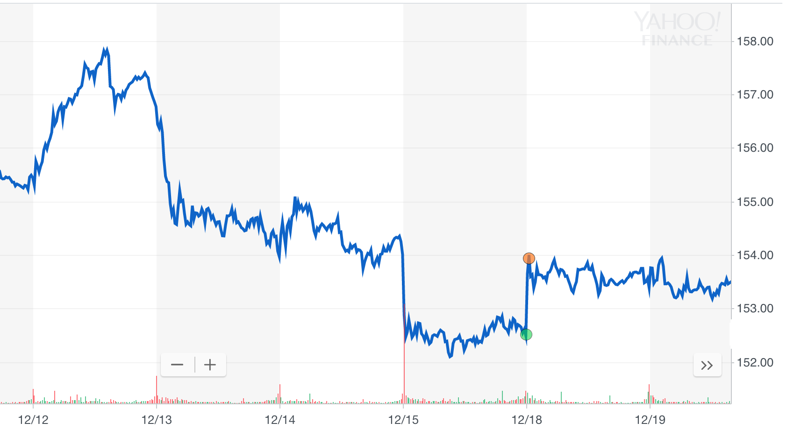
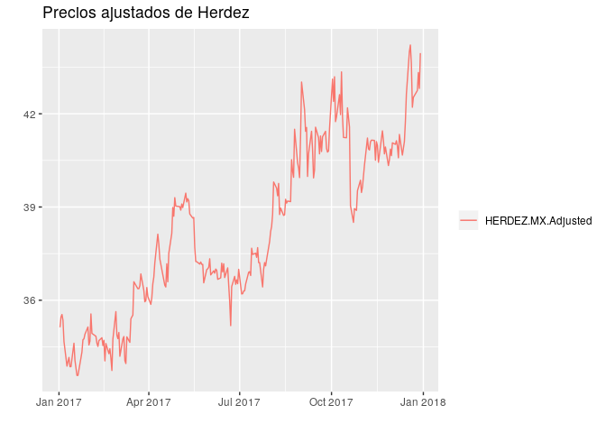
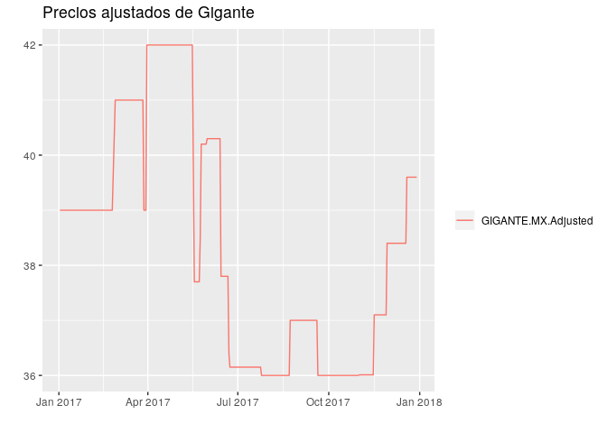
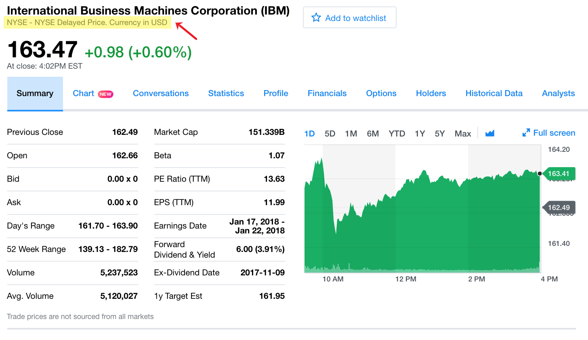
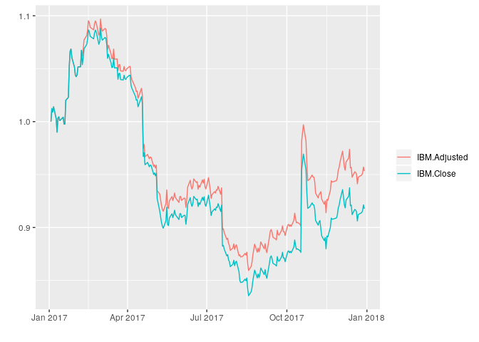
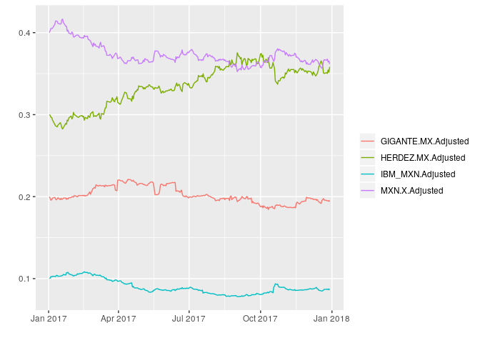
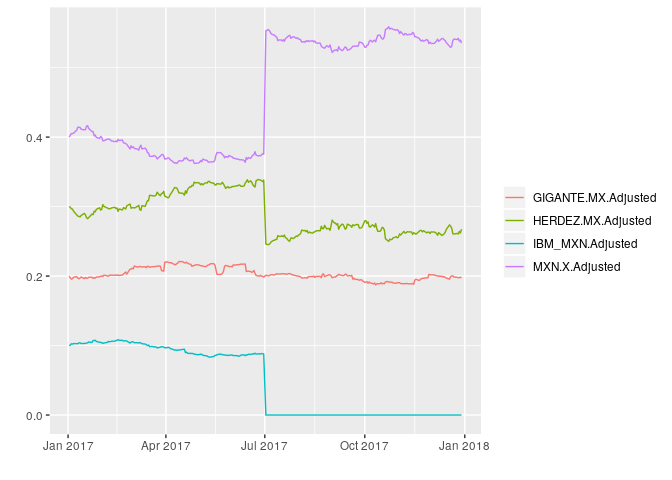
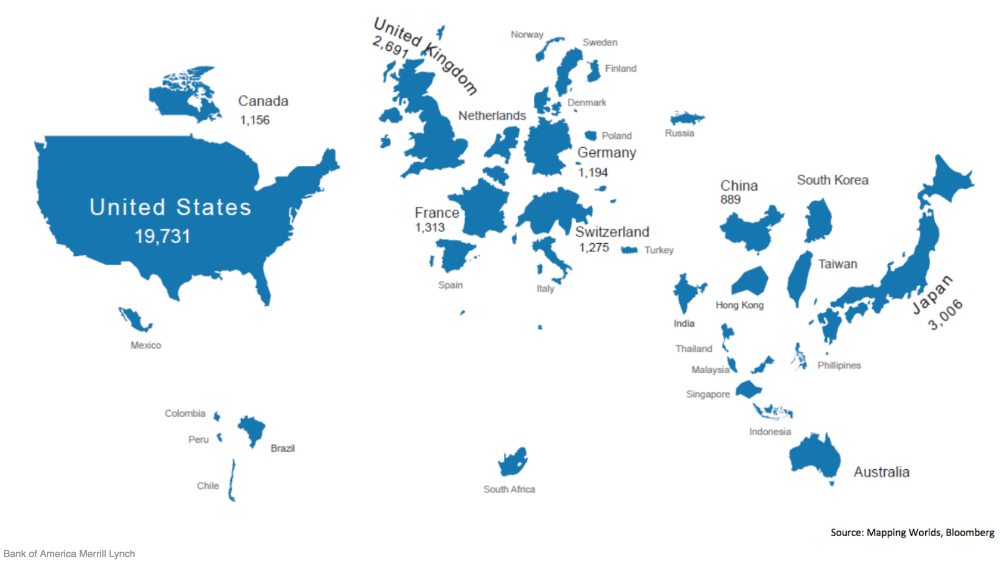

## Objetivo

  + Ejemplificar cómo se utilizan en la práctica los modelos basados en Teoría Moderna de Portafolios 
    - Repaso de términos básicos usados en el día a día de los manejadores de portafolios
    - Utilizar la paquetería optimist
    - Conocer los conceptos: *paridad de riesgo*, *optimización inversa*, *rendimientos implícitos*

# Un recorrido de conceptos básicos

+ Usando https://finance.yahoo.com/ y `get_prices_yahoo()`
    - Tickers
    - OHLC (Open, High, Low, Close)
    - Rendimiento acumulado
    - Liquidez
    - Precios Ajustados
+ Valor de un portafolio
    - Rebalanceo

> Buscar AMZN, SPOT, TSLA en Yahoo! Finance

## Tickers

* El *National Numbering Agency* (NNA) creo el ISIN (*International Securities Identification Number*).
* El *CUSIP Service Bureau*, operado por *Standard & Poor's for the American Bankers Association* creo el CUSIP (*Committee on Uniform Securities Identification Procedures*).
* También empresas como Yahoo! Finance y Bloomberg crean sus propios identificadores (aunque muchas veces son iguales a los tickers de las casas de bolsa). 

Veamos algunos ejemplos en la siguiente tabla:

Ticker| Yahoo! Finance | ISIN | CUSIP 
-- | -- | -- | -- | -- | --
IBM | IBM | US4592001014 | 459200101 
AAPL | AAPL | US0378331005 | 037833100

* Para encontrar tickers usar [https://finance.yahoo.com/lookup](https://finance.yahoo.com/lookup)

> ¿Porqué hay un brico del punto verde al punto naranja?

<div class="figure" style="text-align: center">

<p class="caption">Serie de precios de IBM</p>
</div>

## OHLC

*El NYSE, donde se hacen las transacciones de las acciones de IBM, funciona días hábiles entre 9:30am y 4:00pm EST (Eastern Standard Time). Se dice que el **precio de apertura** (open) es el primer precio después de las 9:30am al que se pacta una transacción de IBM en el día. El **precio de cierre** (close) es el último precio antes de las 4:00pm al que se pacta una transacción de IBM en el día.*

*En realidad, los precios de cierre y apertura no son exactamente el primer y último precio al que se cierra una transacción. Dependiendo de la casa de bolsa, los precios de cierre y apertura que se publican pueden ser **el promedio de los precios pactados en los últimos/primeros minutos del día de operación**.*

# Optimist demo

* Paquetería **R** disponible en github en  [https://github.com/audiracmichelle/optimist](https://github.com/audiracmichelle/optimist)

* En **R** para descargarla se usa


```r
#devtools::install_github("audiracmichelle/optimist")
```

* Para cargarla a la sesión se usa


```r
library(optimist)
```

* Para probar que se ha cargado en **RStudio** podemos escribir 

```
get_
```

y en el drop-down aparecerán varias opciones de la paquetería junto con su descripción y parámetros

**¿Cómo se usa?**

* `optimist` está inspirada en los lenguajes que usan **sintaxis de lenguaje natural**
* funciona con un flujo secuencial que aprovecha los **pipe operators**

**Cargamos los datos**

    + AMZN, SPOT, TSLA


```r
price <- get_prices_yahoo(c('AMZN','SPOT','TSLA'), 
                                  from = '2012-12-31', 
                                  to = '2019-04-30')
```

* Veamos qué tipo de objeto es `price`


```r
class(price)
```

```
## [1] "xts" "zoo"
```


```r
head(price)
```

```
##            AMZN.Adjusted SPOT.Adjusted TSLA.Adjusted
## 2012-12-31        250.87        149.01         33.87
## 2013-01-02        257.31        149.01         35.36
## 2013-01-03        258.48        149.01         34.77
## 2013-01-04        259.15        149.01         34.40
## 2013-01-07        268.46        149.01         34.34
## 2013-01-08        266.38        149.01         33.68
```

```r
tail(price)
```

```
##            AMZN.Adjusted SPOT.Adjusted TSLA.Adjusted
## 2019-04-22       1887.31        135.92        262.75
## 2019-04-23       1923.77        138.79        263.90
## 2019-04-24       1901.75        135.62        258.66
## 2019-04-25       1902.25        132.82        247.63
## 2019-04-26       1950.63        138.25        235.14
## 2019-04-29       1938.43        138.14        241.47
```


```r
#Para el seminario usamos plotly
#install.packages("plotly")
library(plotly)

#' @title plotly_xts
#' @description Plots time series from xts
#' @param x xts

plotly_xts <- function(x, ...){
 x %<>%
   as.data.frame() %>%
   tibble::rownames_to_column("date") %>%
   mutate(date = as.Date(date)) %>%
   gather(key, value, -date)

 p <- x %>%
   plot_ly(x = ~date,
           y = ~value,
           color = ~key, ...) %>%
   add_lines()

 p
}
```

> ¿Cuál es la diferencia de la siguiente gráfica y la que vimos en Yahoo! Finance?


```r
price %>% 
  plotly_xts()
```

<!--html_preserve--><div id="htmlwidget-0258610e0ae72af36536" style="width:672px;height:480px;" class="plotly html-widget"></div>
<script type="application/json" data-for="htmlwidget-0258610e0ae72af36536">{"x":{"visdat":{"1e7542d7c4fb":["function () ","plotlyVisDat"]},"cur_data":"1e7542d7c4fb","attrs":{"1e7542d7c4fb":{"x":{},"y":{},"color":{},"alpha_stroke":1,"sizes":[10,100],"spans":[1,20],"type":"scatter","mode":"lines","inherit":true}},"layout":{"margin":{"b":40,"l":60,"t":25,"r":10},"xaxis":{"domain":[0,1],"automargin":true,"title":"date"},"yaxis":{"domain":[0,1],"automargin":true,"title":"value"},"hovermode":"closest","showlegend":true},"source":"A","config":{"showSendToCloud":false},"data":[{"x":["2012-12-31","2013-01-02","2013-01-03","2013-01-04","2013-01-07","2013-01-08","2013-01-09","2013-01-10","2013-01-11","2013-01-14","2013-01-15","2013-01-16","2013-01-17","2013-01-18","2013-01-22","2013-01-23","2013-01-24","2013-01-25","2013-01-28","2013-01-29","2013-01-30","2013-01-31","2013-02-01","2013-02-04","2013-02-05","2013-02-06","2013-02-07","2013-02-08","2013-02-11","2013-02-12","2013-02-13","2013-02-14","2013-02-15","2013-02-19","2013-02-20","2013-02-21","2013-02-22","2013-02-25","2013-02-26","2013-02-27","2013-02-28","2013-03-01","2013-03-04","2013-03-05","2013-03-06","2013-03-07","2013-03-08","2013-03-11","2013-03-12","2013-03-13","2013-03-14","2013-03-15","2013-03-18","2013-03-19","2013-03-20","2013-03-21","2013-03-22","2013-03-25","2013-03-26","2013-03-27","2013-03-28","2013-04-01","2013-04-02","2013-04-03","2013-04-04","2013-04-05","2013-04-08","2013-04-09","2013-04-10","2013-04-11","2013-04-12","2013-04-15","2013-04-16","2013-04-17","2013-04-18","2013-04-19","2013-04-22","2013-04-23","2013-04-24","2013-04-25","2013-04-26","2013-04-29","2013-04-30","2013-05-01","2013-05-02","2013-05-03","2013-05-06","2013-05-07","2013-05-08","2013-05-09","2013-05-10","2013-05-13","2013-05-14","2013-05-15","2013-05-16","2013-05-17","2013-05-20","2013-05-21","2013-05-22","2013-05-23","2013-05-24","2013-05-28","2013-05-29","2013-05-30","2013-05-31","2013-06-03","2013-06-04","2013-06-05","2013-06-06","2013-06-07","2013-06-10","2013-06-11","2013-06-12","2013-06-13","2013-06-14","2013-06-17","2013-06-18","2013-06-19","2013-06-20","2013-06-21","2013-06-24","2013-06-25","2013-06-26","2013-06-27","2013-06-28","2013-07-01","2013-07-02","2013-07-03","2013-07-05","2013-07-08","2013-07-09","2013-07-10","2013-07-11","2013-07-12","2013-07-15","2013-07-16","2013-07-17","2013-07-18","2013-07-19","2013-07-22","2013-07-23","2013-07-24","2013-07-25","2013-07-26","2013-07-29","2013-07-30","2013-07-31","2013-08-01","2013-08-02","2013-08-05","2013-08-06","2013-08-07","2013-08-08","2013-08-09","2013-08-12","2013-08-13","2013-08-14","2013-08-15","2013-08-16","2013-08-19","2013-08-20","2013-08-21","2013-08-22","2013-08-23","2013-08-26","2013-08-27","2013-08-28","2013-08-29","2013-08-30","2013-09-03","2013-09-04","2013-09-05","2013-09-06","2013-09-09","2013-09-10","2013-09-11","2013-09-12","2013-09-13","2013-09-16","2013-09-17","2013-09-18","2013-09-19","2013-09-20","2013-09-23","2013-09-24","2013-09-25","2013-09-26","2013-09-27","2013-09-30","2013-10-01","2013-10-02","2013-10-03","2013-10-04","2013-10-07","2013-10-08","2013-10-09","2013-10-10","2013-10-11","2013-10-14","2013-10-15","2013-10-16","2013-10-17","2013-10-18","2013-10-21","2013-10-22","2013-10-23","2013-10-24","2013-10-25","2013-10-28","2013-10-29","2013-10-30","2013-10-31","2013-11-01","2013-11-04","2013-11-05","2013-11-06","2013-11-07","2013-11-08","2013-11-11","2013-11-12","2013-11-13","2013-11-14","2013-11-15","2013-11-18","2013-11-19","2013-11-20","2013-11-21","2013-11-22","2013-11-25","2013-11-26","2013-11-27","2013-11-29","2013-12-02","2013-12-03","2013-12-04","2013-12-05","2013-12-06","2013-12-09","2013-12-10","2013-12-11","2013-12-12","2013-12-13","2013-12-16","2013-12-17","2013-12-18","2013-12-19","2013-12-20","2013-12-23","2013-12-24","2013-12-26","2013-12-27","2013-12-30","2013-12-31","2014-01-02","2014-01-03","2014-01-06","2014-01-07","2014-01-08","2014-01-09","2014-01-10","2014-01-13","2014-01-14","2014-01-15","2014-01-16","2014-01-17","2014-01-21","2014-01-22","2014-01-23","2014-01-24","2014-01-27","2014-01-28","2014-01-29","2014-01-30","2014-01-31","2014-02-03","2014-02-04","2014-02-05","2014-02-06","2014-02-07","2014-02-10","2014-02-11","2014-02-12","2014-02-13","2014-02-14","2014-02-18","2014-02-19","2014-02-20","2014-02-21","2014-02-24","2014-02-25","2014-02-26","2014-02-27","2014-02-28","2014-03-03","2014-03-04","2014-03-05","2014-03-06","2014-03-07","2014-03-10","2014-03-11","2014-03-12","2014-03-13","2014-03-14","2014-03-17","2014-03-18","2014-03-19","2014-03-20","2014-03-21","2014-03-24","2014-03-25","2014-03-26","2014-03-27","2014-03-28","2014-03-31","2014-04-01","2014-04-02","2014-04-03","2014-04-04","2014-04-07","2014-04-08","2014-04-09","2014-04-10","2014-04-11","2014-04-14","2014-04-15","2014-04-16","2014-04-17","2014-04-21","2014-04-22","2014-04-23","2014-04-24","2014-04-25","2014-04-28","2014-04-29","2014-04-30","2014-05-01","2014-05-02","2014-05-05","2014-05-06","2014-05-07","2014-05-08","2014-05-09","2014-05-12","2014-05-13","2014-05-14","2014-05-15","2014-05-16","2014-05-19","2014-05-20","2014-05-21","2014-05-22","2014-05-23","2014-05-27","2014-05-28","2014-05-29","2014-05-30","2014-06-02","2014-06-03","2014-06-04","2014-06-05","2014-06-06","2014-06-09","2014-06-10","2014-06-11","2014-06-12","2014-06-13","2014-06-16","2014-06-17","2014-06-18","2014-06-19","2014-06-20","2014-06-23","2014-06-24","2014-06-25","2014-06-26","2014-06-27","2014-06-30","2014-07-01","2014-07-02","2014-07-03","2014-07-07","2014-07-08","2014-07-09","2014-07-10","2014-07-11","2014-07-14","2014-07-15","2014-07-16","2014-07-17","2014-07-18","2014-07-21","2014-07-22","2014-07-23","2014-07-24","2014-07-25","2014-07-28","2014-07-29","2014-07-30","2014-07-31","2014-08-01","2014-08-04","2014-08-05","2014-08-06","2014-08-07","2014-08-08","2014-08-11","2014-08-12","2014-08-13","2014-08-14","2014-08-15","2014-08-18","2014-08-19","2014-08-20","2014-08-21","2014-08-22","2014-08-25","2014-08-26","2014-08-27","2014-08-28","2014-08-29","2014-09-02","2014-09-03","2014-09-04","2014-09-05","2014-09-08","2014-09-09","2014-09-10","2014-09-11","2014-09-12","2014-09-15","2014-09-16","2014-09-17","2014-09-18","2014-09-19","2014-09-22","2014-09-23","2014-09-24","2014-09-25","2014-09-26","2014-09-29","2014-09-30","2014-10-01","2014-10-02","2014-10-03","2014-10-06","2014-10-07","2014-10-08","2014-10-09","2014-10-10","2014-10-13","2014-10-14","2014-10-15","2014-10-16","2014-10-17","2014-10-20","2014-10-21","2014-10-22","2014-10-23","2014-10-24","2014-10-27","2014-10-28","2014-10-29","2014-10-30","2014-10-31","2014-11-03","2014-11-04","2014-11-05","2014-11-06","2014-11-07","2014-11-10","2014-11-11","2014-11-12","2014-11-13","2014-11-14","2014-11-17","2014-11-18","2014-11-19","2014-11-20","2014-11-21","2014-11-24","2014-11-25","2014-11-26","2014-11-28","2014-12-01","2014-12-02","2014-12-03","2014-12-04","2014-12-05","2014-12-08","2014-12-09","2014-12-10","2014-12-11","2014-12-12","2014-12-15","2014-12-16","2014-12-17","2014-12-18","2014-12-19","2014-12-22","2014-12-23","2014-12-24","2014-12-26","2014-12-29","2014-12-30","2014-12-31","2015-01-02","2015-01-05","2015-01-06","2015-01-07","2015-01-08","2015-01-09","2015-01-12","2015-01-13","2015-01-14","2015-01-15","2015-01-16","2015-01-20","2015-01-21","2015-01-22","2015-01-23","2015-01-26","2015-01-27","2015-01-28","2015-01-29","2015-01-30","2015-02-02","2015-02-03","2015-02-04","2015-02-05","2015-02-06","2015-02-09","2015-02-10","2015-02-11","2015-02-12","2015-02-13","2015-02-17","2015-02-18","2015-02-19","2015-02-20","2015-02-23","2015-02-24","2015-02-25","2015-02-26","2015-02-27","2015-03-02","2015-03-03","2015-03-04","2015-03-05","2015-03-06","2015-03-09","2015-03-10","2015-03-11","2015-03-12","2015-03-13","2015-03-16","2015-03-17","2015-03-18","2015-03-19","2015-03-20","2015-03-23","2015-03-24","2015-03-25","2015-03-26","2015-03-27","2015-03-30","2015-03-31","2015-04-01","2015-04-02","2015-04-06","2015-04-07","2015-04-08","2015-04-09","2015-04-10","2015-04-13","2015-04-14","2015-04-15","2015-04-16","2015-04-17","2015-04-20","2015-04-21","2015-04-22","2015-04-23","2015-04-24","2015-04-27","2015-04-28","2015-04-29","2015-04-30","2015-05-01","2015-05-04","2015-05-05","2015-05-06","2015-05-07","2015-05-08","2015-05-11","2015-05-12","2015-05-13","2015-05-14","2015-05-15","2015-05-18","2015-05-19","2015-05-20","2015-05-21","2015-05-22","2015-05-26","2015-05-27","2015-05-28","2015-05-29","2015-06-01","2015-06-02","2015-06-03","2015-06-04","2015-06-05","2015-06-08","2015-06-09","2015-06-10","2015-06-11","2015-06-12","2015-06-15","2015-06-16","2015-06-17","2015-06-18","2015-06-19","2015-06-22","2015-06-23","2015-06-24","2015-06-25","2015-06-26","2015-06-29","2015-06-30","2015-07-01","2015-07-02","2015-07-06","2015-07-07","2015-07-08","2015-07-09","2015-07-10","2015-07-13","2015-07-14","2015-07-15","2015-07-16","2015-07-17","2015-07-20","2015-07-21","2015-07-22","2015-07-23","2015-07-24","2015-07-27","2015-07-28","2015-07-29","2015-07-30","2015-07-31","2015-08-03","2015-08-04","2015-08-05","2015-08-06","2015-08-07","2015-08-10","2015-08-11","2015-08-12","2015-08-13","2015-08-14","2015-08-17","2015-08-18","2015-08-19","2015-08-20","2015-08-21","2015-08-24","2015-08-25","2015-08-26","2015-08-27","2015-08-28","2015-08-31","2015-09-01","2015-09-02","2015-09-03","2015-09-04","2015-09-08","2015-09-09","2015-09-10","2015-09-11","2015-09-14","2015-09-15","2015-09-16","2015-09-17","2015-09-18","2015-09-21","2015-09-22","2015-09-23","2015-09-24","2015-09-25","2015-09-28","2015-09-29","2015-09-30","2015-10-01","2015-10-02","2015-10-05","2015-10-06","2015-10-07","2015-10-08","2015-10-09","2015-10-12","2015-10-13","2015-10-14","2015-10-15","2015-10-16","2015-10-19","2015-10-20","2015-10-21","2015-10-22","2015-10-23","2015-10-26","2015-10-27","2015-10-28","2015-10-29","2015-10-30","2015-11-02","2015-11-03","2015-11-04","2015-11-05","2015-11-06","2015-11-09","2015-11-10","2015-11-11","2015-11-12","2015-11-13","2015-11-16","2015-11-17","2015-11-18","2015-11-19","2015-11-20","2015-11-23","2015-11-24","2015-11-25","2015-11-27","2015-11-30","2015-12-01","2015-12-02","2015-12-03","2015-12-04","2015-12-07","2015-12-08","2015-12-09","2015-12-10","2015-12-11","2015-12-14","2015-12-15","2015-12-16","2015-12-17","2015-12-18","2015-12-21","2015-12-22","2015-12-23","2015-12-24","2015-12-28","2015-12-29","2015-12-30","2015-12-31","2016-01-04","2016-01-05","2016-01-06","2016-01-07","2016-01-08","2016-01-11","2016-01-12","2016-01-13","2016-01-14","2016-01-15","2016-01-19","2016-01-20","2016-01-21","2016-01-22","2016-01-25","2016-01-26","2016-01-27","2016-01-28","2016-01-29","2016-02-01","2016-02-02","2016-02-03","2016-02-04","2016-02-05","2016-02-08","2016-02-09","2016-02-10","2016-02-11","2016-02-12","2016-02-16","2016-02-17","2016-02-18","2016-02-19","2016-02-22","2016-02-23","2016-02-24","2016-02-25","2016-02-26","2016-02-29","2016-03-01","2016-03-02","2016-03-03","2016-03-04","2016-03-07","2016-03-08","2016-03-09","2016-03-10","2016-03-11","2016-03-14","2016-03-15","2016-03-16","2016-03-17","2016-03-18","2016-03-21","2016-03-22","2016-03-23","2016-03-24","2016-03-28","2016-03-29","2016-03-30","2016-03-31","2016-04-01","2016-04-04","2016-04-05","2016-04-06","2016-04-07","2016-04-08","2016-04-11","2016-04-12","2016-04-13","2016-04-14","2016-04-15","2016-04-18","2016-04-19","2016-04-20","2016-04-21","2016-04-22","2016-04-25","2016-04-26","2016-04-27","2016-04-28","2016-04-29","2016-05-02","2016-05-03","2016-05-04","2016-05-05","2016-05-06","2016-05-09","2016-05-10","2016-05-11","2016-05-12","2016-05-13","2016-05-16","2016-05-17","2016-05-18","2016-05-19","2016-05-20","2016-05-23","2016-05-24","2016-05-25","2016-05-26","2016-05-27","2016-05-31","2016-06-01","2016-06-02","2016-06-03","2016-06-06","2016-06-07","2016-06-08","2016-06-09","2016-06-10","2016-06-13","2016-06-14","2016-06-15","2016-06-16","2016-06-17","2016-06-20","2016-06-21","2016-06-22","2016-06-23","2016-06-24","2016-06-27","2016-06-28","2016-06-29","2016-06-30","2016-07-01","2016-07-05","2016-07-06","2016-07-07","2016-07-08","2016-07-11","2016-07-12","2016-07-13","2016-07-14","2016-07-15","2016-07-18","2016-07-19","2016-07-20","2016-07-21","2016-07-22","2016-07-25","2016-07-26","2016-07-27","2016-07-28","2016-07-29","2016-08-01","2016-08-02","2016-08-03","2016-08-04","2016-08-05","2016-08-08","2016-08-09","2016-08-10","2016-08-11","2016-08-12","2016-08-15","2016-08-16","2016-08-17","2016-08-18","2016-08-19","2016-08-22","2016-08-23","2016-08-24","2016-08-25","2016-08-26","2016-08-29","2016-08-30","2016-08-31","2016-09-01","2016-09-02","2016-09-06","2016-09-07","2016-09-08","2016-09-09","2016-09-12","2016-09-13","2016-09-14","2016-09-15","2016-09-16","2016-09-19","2016-09-20","2016-09-21","2016-09-22","2016-09-23","2016-09-26","2016-09-27","2016-09-28","2016-09-29","2016-09-30","2016-10-03","2016-10-04","2016-10-05","2016-10-06","2016-10-07","2016-10-10","2016-10-11","2016-10-12","2016-10-13","2016-10-14","2016-10-17","2016-10-18","2016-10-19","2016-10-20","2016-10-21","2016-10-24","2016-10-25","2016-10-26","2016-10-27","2016-10-28","2016-10-31","2016-11-01","2016-11-02","2016-11-03","2016-11-04","2016-11-07","2016-11-08","2016-11-09","2016-11-10","2016-11-11","2016-11-14","2016-11-15","2016-11-16","2016-11-17","2016-11-18","2016-11-21","2016-11-22","2016-11-23","2016-11-25","2016-11-28","2016-11-29","2016-11-30","2016-12-01","2016-12-02","2016-12-05","2016-12-06","2016-12-07","2016-12-08","2016-12-09","2016-12-12","2016-12-13","2016-12-14","2016-12-15","2016-12-16","2016-12-19","2016-12-20","2016-12-21","2016-12-22","2016-12-23","2016-12-27","2016-12-28","2016-12-29","2016-12-30","2017-01-03","2017-01-04","2017-01-05","2017-01-06","2017-01-09","2017-01-10","2017-01-11","2017-01-12","2017-01-13","2017-01-17","2017-01-18","2017-01-19","2017-01-20","2017-01-23","2017-01-24","2017-01-25","2017-01-26","2017-01-27","2017-01-30","2017-01-31","2017-02-01","2017-02-02","2017-02-03","2017-02-06","2017-02-07","2017-02-08","2017-02-09","2017-02-10","2017-02-13","2017-02-14","2017-02-15","2017-02-16","2017-02-17","2017-02-21","2017-02-22","2017-02-23","2017-02-24","2017-02-27","2017-02-28","2017-03-01","2017-03-02","2017-03-03","2017-03-06","2017-03-07","2017-03-08","2017-03-09","2017-03-10","2017-03-13","2017-03-14","2017-03-15","2017-03-16","2017-03-17","2017-03-20","2017-03-21","2017-03-22","2017-03-23","2017-03-24","2017-03-27","2017-03-28","2017-03-29","2017-03-30","2017-03-31","2017-04-03","2017-04-04","2017-04-05","2017-04-06","2017-04-07","2017-04-10","2017-04-11","2017-04-12","2017-04-13","2017-04-17","2017-04-18","2017-04-19","2017-04-20","2017-04-21","2017-04-24","2017-04-25","2017-04-26","2017-04-27","2017-04-28","2017-05-01","2017-05-02","2017-05-03","2017-05-04","2017-05-05","2017-05-08","2017-05-09","2017-05-10","2017-05-11","2017-05-12","2017-05-15","2017-05-16","2017-05-17","2017-05-18","2017-05-19","2017-05-22","2017-05-23","2017-05-24","2017-05-25","2017-05-26","2017-05-30","2017-05-31","2017-06-01","2017-06-02","2017-06-05","2017-06-06","2017-06-07","2017-06-08","2017-06-09","2017-06-12","2017-06-13","2017-06-14","2017-06-15","2017-06-16","2017-06-19","2017-06-20","2017-06-21","2017-06-22","2017-06-23","2017-06-26","2017-06-27","2017-06-28","2017-06-29","2017-06-30","2017-07-03","2017-07-05","2017-07-06","2017-07-07","2017-07-10","2017-07-11","2017-07-12","2017-07-13","2017-07-14","2017-07-17","2017-07-18","2017-07-19","2017-07-20","2017-07-21","2017-07-24","2017-07-25","2017-07-26","2017-07-27","2017-07-28","2017-07-31","2017-08-01","2017-08-02","2017-08-03","2017-08-04","2017-08-07","2017-08-08","2017-08-09","2017-08-10","2017-08-11","2017-08-14","2017-08-15","2017-08-16","2017-08-17","2017-08-18","2017-08-21","2017-08-22","2017-08-23","2017-08-24","2017-08-25","2017-08-28","2017-08-29","2017-08-30","2017-08-31","2017-09-01","2017-09-05","2017-09-06","2017-09-07","2017-09-08","2017-09-11","2017-09-12","2017-09-13","2017-09-14","2017-09-15","2017-09-18","2017-09-19","2017-09-20","2017-09-21","2017-09-22","2017-09-25","2017-09-26","2017-09-27","2017-09-28","2017-09-29","2017-10-02","2017-10-03","2017-10-04","2017-10-05","2017-10-06","2017-10-09","2017-10-10","2017-10-11","2017-10-12","2017-10-13","2017-10-16","2017-10-17","2017-10-18","2017-10-19","2017-10-20","2017-10-23","2017-10-24","2017-10-25","2017-10-26","2017-10-27","2017-10-30","2017-10-31","2017-11-01","2017-11-02","2017-11-03","2017-11-06","2017-11-07","2017-11-08","2017-11-09","2017-11-10","2017-11-13","2017-11-14","2017-11-15","2017-11-16","2017-11-17","2017-11-20","2017-11-21","2017-11-22","2017-11-24","2017-11-27","2017-11-28","2017-11-29","2017-11-30","2017-12-01","2017-12-04","2017-12-05","2017-12-06","2017-12-07","2017-12-08","2017-12-11","2017-12-12","2017-12-13","2017-12-14","2017-12-15","2017-12-18","2017-12-19","2017-12-20","2017-12-21","2017-12-22","2017-12-26","2017-12-27","2017-12-28","2017-12-29","2018-01-02","2018-01-03","2018-01-04","2018-01-05","2018-01-08","2018-01-09","2018-01-10","2018-01-11","2018-01-12","2018-01-16","2018-01-17","2018-01-18","2018-01-19","2018-01-22","2018-01-23","2018-01-24","2018-01-25","2018-01-26","2018-01-29","2018-01-30","2018-01-31","2018-02-01","2018-02-02","2018-02-05","2018-02-06","2018-02-07","2018-02-08","2018-02-09","2018-02-12","2018-02-13","2018-02-14","2018-02-15","2018-02-16","2018-02-20","2018-02-21","2018-02-22","2018-02-23","2018-02-26","2018-02-27","2018-02-28","2018-03-01","2018-03-02","2018-03-05","2018-03-06","2018-03-07","2018-03-08","2018-03-09","2018-03-12","2018-03-13","2018-03-14","2018-03-15","2018-03-16","2018-03-19","2018-03-20","2018-03-21","2018-03-22","2018-03-23","2018-03-26","2018-03-27","2018-03-28","2018-03-29","2018-04-02","2018-04-03","2018-04-04","2018-04-05","2018-04-06","2018-04-09","2018-04-10","2018-04-11","2018-04-12","2018-04-13","2018-04-16","2018-04-17","2018-04-18","2018-04-19","2018-04-20","2018-04-23","2018-04-24","2018-04-25","2018-04-26","2018-04-27","2018-04-30","2018-05-01","2018-05-02","2018-05-03","2018-05-04","2018-05-07","2018-05-08","2018-05-09","2018-05-10","2018-05-11","2018-05-14","2018-05-15","2018-05-16","2018-05-17","2018-05-18","2018-05-21","2018-05-22","2018-05-23","2018-05-24","2018-05-25","2018-05-29","2018-05-30","2018-05-31","2018-06-01","2018-06-04","2018-06-05","2018-06-06","2018-06-07","2018-06-08","2018-06-11","2018-06-12","2018-06-13","2018-06-14","2018-06-15","2018-06-18","2018-06-19","2018-06-20","2018-06-21","2018-06-22","2018-06-25","2018-06-26","2018-06-27","2018-06-28","2018-06-29","2018-07-02","2018-07-03","2018-07-05","2018-07-06","2018-07-09","2018-07-10","2018-07-11","2018-07-12","2018-07-13","2018-07-16","2018-07-17","2018-07-18","2018-07-19","2018-07-20","2018-07-23","2018-07-24","2018-07-25","2018-07-26","2018-07-27","2018-07-30","2018-07-31","2018-08-01","2018-08-02","2018-08-03","2018-08-06","2018-08-07","2018-08-08","2018-08-09","2018-08-10","2018-08-13","2018-08-14","2018-08-15","2018-08-16","2018-08-17","2018-08-20","2018-08-21","2018-08-22","2018-08-23","2018-08-24","2018-08-27","2018-08-28","2018-08-29","2018-08-30","2018-08-31","2018-09-04","2018-09-05","2018-09-06","2018-09-07","2018-09-10","2018-09-11","2018-09-12","2018-09-13","2018-09-14","2018-09-17","2018-09-18","2018-09-19","2018-09-20","2018-09-21","2018-09-24","2018-09-25","2018-09-26","2018-09-27","2018-09-28","2018-10-01","2018-10-02","2018-10-03","2018-10-04","2018-10-05","2018-10-08","2018-10-09","2018-10-10","2018-10-11","2018-10-12","2018-10-15","2018-10-16","2018-10-17","2018-10-18","2018-10-19","2018-10-22","2018-10-23","2018-10-24","2018-10-25","2018-10-26","2018-10-29","2018-10-30","2018-10-31","2018-11-01","2018-11-02","2018-11-05","2018-11-06","2018-11-07","2018-11-08","2018-11-09","2018-11-12","2018-11-13","2018-11-14","2018-11-15","2018-11-16","2018-11-19","2018-11-20","2018-11-21","2018-11-23","2018-11-26","2018-11-27","2018-11-28","2018-11-29","2018-11-30","2018-12-03","2018-12-04","2018-12-06","2018-12-07","2018-12-10","2018-12-11","2018-12-12","2018-12-13","2018-12-14","2018-12-17","2018-12-18","2018-12-19","2018-12-20","2018-12-21","2018-12-24","2018-12-26","2018-12-27","2018-12-28","2018-12-31","2019-01-02","2019-01-03","2019-01-04","2019-01-07","2019-01-08","2019-01-09","2019-01-10","2019-01-11","2019-01-14","2019-01-15","2019-01-16","2019-01-17","2019-01-18","2019-01-22","2019-01-23","2019-01-24","2019-01-25","2019-01-28","2019-01-29","2019-01-30","2019-01-31","2019-02-01","2019-02-04","2019-02-05","2019-02-06","2019-02-07","2019-02-08","2019-02-11","2019-02-12","2019-02-13","2019-02-14","2019-02-15","2019-02-19","2019-02-20","2019-02-21","2019-02-22","2019-02-25","2019-02-26","2019-02-27","2019-02-28","2019-03-01","2019-03-04","2019-03-05","2019-03-06","2019-03-07","2019-03-08","2019-03-11","2019-03-12","2019-03-13","2019-03-14","2019-03-15","2019-03-18","2019-03-19","2019-03-20","2019-03-21","2019-03-22","2019-03-25","2019-03-26","2019-03-27","2019-03-28","2019-03-29","2019-04-01","2019-04-02","2019-04-03","2019-04-04","2019-04-05","2019-04-08","2019-04-09","2019-04-10","2019-04-11","2019-04-12","2019-04-15","2019-04-16","2019-04-17","2019-04-18","2019-04-22","2019-04-23","2019-04-24","2019-04-25","2019-04-26","2019-04-29"],"y":[250.869995,257.309998,258.480011,259.149994,268.459991,266.380005,266.350006,265.339996,267.940002,272.730011,271.899994,268.929993,270.480011,272.119995,270.190002,268.109985,273.459991,283.98999,276.040009,260.350006,272.76001,265.5,265,259.980011,266.890015,262.220001,260.230011,261.950012,257.209991,258.700012,269.470001,269.23999,265.089996,269.75,266.410004,265.940002,265.420013,259.869995,259.359985,263.25,264.269989,265.73999,273.109985,275.589996,273.790009,273.880005,274.190002,271.23999,274.130005,275.100006,265.73999,261.820007,257.890015,256.410004,257.279999,253.389999,257.75,256.019989,260.309998,265.299988,266.48999,261.609985,263.320007,259.029999,259.079987,255.479996,258.950012,261.140015,264.769989,269.850006,272.869995,267.720001,272.339996,267.399994,259.420013,260.320007,263.549988,268.899994,268.779999,274.700012,254.809998,249.740005,253.809998,248.229996,252.550003,258.049988,255.720001,257.730011,258.679993,260.160004,263.630005,264.51001,268.329987,266.559998,264.119995,269.899994,267.630005,268.859985,262.959991,261.799988,261.73999,267.290009,265.529999,266.829987,269.200012,266.880005,265.700012,267.170013,267.829987,276.869995,281.070007,274.779999,271.670013,275.790009,273.98999,278.059998,281.76001,278.160004,273.440002,273.359985,270.609985,272.089996,277.570007,277.549988,277.690002,282.100006,283.730011,284.029999,285.880005,290.589996,291.529999,292.329987,299.660004,307.549988,306.570007,306.869995,308.690002,304.109985,305.230011,303.480011,301.059998,298.940002,303.399994,312.01001,306.100006,302.410004,301.220001,305.570007,304.209991,300.98999,300.75,296.910004,295.73999,297.26001,296.690002,293.970001,291.339996,286.470001,284.820007,285.570007,287.089996,284.570007,289.730011,290.01001,286.209991,280.929993,281.579987,283.980011,280.980011,288.799988,293.640015,294.100006,295.859985,299.709991,300.359985,299.640015,298.859985,297.920013,296.059998,304.170013,312.029999,312.059998,316.339996,311.48999,314.130005,312.649994,318.119995,316.01001,312.640015,320.950012,320.51001,314.76001,319.040009,310.029999,303.230011,298.230011,305.170013,310.890015,310.700012,306.399994,310.48999,310.769989,328.929993,326.440002,332.540009,326.76001,332.209991,363.390015,358.160004,362.700012,361.079987,364.029999,359,358.73999,358.890015,356.179993,343.559998,350.309998,354.380005,349.529999,356.220001,367.399994,369.170013,366.179993,364.940002,362.570007,368.920013,372.309998,376.640015,381.369995,386.709991,393.619995,392.299988,384.660004,385.959991,384.48999,386.950012,384.890015,387.779999,382.190002,381.25,384.23999,388.970001,387.649994,395.959991,395.190002,402.200012,402.920013,399.200012,404.390015,398.079987,393.369995,398.790009,397.970001,396.440002,393.630005,398.029999,401.920013,401.01001,397.660004,390.980011,397.540009,395.869995,395.799988,399.609985,407.049988,404.540009,399.869995,387.600006,386.279999,394.429993,384.200012,403.01001,358.690002,346.149994,347.950012,346.450012,354.589996,361.079987,360.869995,361.790009,349.25,357.200012,357.350006,353.649994,347.380005,349.799988,346.76001,351.779999,358.320007,359.799988,360.130005,362.100006,359.779999,363.899994,372.369995,372.160004,372.059998,370.529999,368.820007,370.640015,371.51001,373.73999,375.040009,378.769989,373.230011,368.970001,360.619995,351.850006,354.709991,343.410004,338.470001,338.290009,336.369995,342.98999,341.959991,333.619995,323,317.76001,327.070007,331.809998,317.109985,311.730011,315.910004,316.079987,323.679993,324.910004,330.869995,329.320007,324.579987,337.149994,303.829987,296.579987,300.380005,304.130005,307.890015,308.01001,310.049988,297.380005,292.709991,288.320007,292.23999,302.859985,304.640015,297.619995,295.190002,297.700012,296.76001,301.190002,305.01001,304.910004,312.23999,310.820007,310.160004,313.779999,312.549988,308.839996,307.190002,306.779999,323.570007,329.670013,327.5,332.410004,335.200012,325.910004,326.269989,327.619995,325.619995,334.380005,327,324.200012,327.23999,324.160004,327.440002,325.690002,324.570007,324.779999,332.390015,332.850006,337.48999,333.549988,323.809998,329.970001,327.920013,346.200012,355.320007,354.440002,355.899994,352.450012,358.660004,359.76001,360.839996,358.140015,358.609985,324.01001,320.410004,320,322.51001,312.98999,307.059998,313.649994,312.320007,313.890015,311.450012,316.799988,318.329987,319.320007,326.279999,333.209991,333.630005,334.529999,335.130005,335.779999,332.910004,331.589996,334.019989,341.829987,343.179993,340.019989,339.040009,342.380005,339,345.950012,346.380005,342.339996,329.75,331.329987,330.519989,331.190002,323.890015,327.76001,324,325,331.320007,324.5,323.630005,328.209991,321.929993,323.209991,321.820007,322.440002,317.459991,318.410004,322.73999,322.200012,316.980011,322.700012,315.369995,311.390015,306.450012,308.309998,305.970001,302.859985,303.640015,306.209991,315.329987,312.970001,313.179993,287.059998,289.970001,295.589996,294.119995,299.070007,305.459991,305.720001,302.809998,296.519989,296.640015,299.859985,305.109985,312.01001,311.51001,316.480011,327.820007,323.049988,324.929993,326.540009,330.540009,332.630005,335.640015,335.040009,333.570007,338.640015,326,326.309998,316.5,316.929993,312.630005,306.640015,312.5,305.839996,307.359985,307.320007,306.070007,295.059998,298.880005,297.730011,299.899994,306.540009,306.290009,303.029999,309.089996,312.040009,310.299988,310.350006,308.519989,302.190002,295.290009,298.420013,300.459991,296.929993,291.410004,294.73999,293.269989,286.950012,290.73999,289.440002,297.25,310.320007,312.390015,309.660004,306.75,303.910004,311.779999,354.529999,364.470001,363.549988,364.75,373.890015,374.279999,370.559998,373,375.140015,377.170013,381.829987,375.429993,373.369995,379,383.660004,380.140015,378.589996,385.369995,384.799988,380.160004,385.660004,384.609985,382.720001,387.829987,380.089996,378.559998,369.51001,366.369995,374.23999,370.579987,373.350006,371.920013,375.140015,373.23999,378.48999,375.109985,374.089996,370.959991,367.350006,370.559998,374.589996,372.100006,370.26001,372.25,377.040009,374.410004,381.200012,383.540009,382.649994,382.359985,385.109985,383.450012,386.040009,375.559998,389.51001,391.179993,389.799988,389.98999,445.100006,438.559998,429.309998,429.369995,421.779999,422.869995,423.040009,421.190002,419.100006,426.880005,433.690002,432.850006,431.019989,426.869995,432.279999,426,425.23999,421.709991,423.859985,431.630005,427.630005,425.470001,431.420013,426.570007,429.230011,430.920013,430.98999,436.589996,430.779999,426.950012,423.5,425.480011,430.769989,432.970001,429.920013,423.670013,427.26001,427.809998,439.390015,434.920013,436.290009,445.98999,440.839996,440.100006,438.100006,429.859985,434.089996,437.390015,437.709991,436.040009,436.720001,429.700012,434.390015,443.51001,455.570007,465.570007,461.190002,475.480011,483.01001,488.100006,488,488.269989,482.179993,529.419983,531.409973,526.030029,529,536.76001,536.150024,535.030029,531.900024,537.01001,529.460022,522.619995,524,527.460022,525.909973,529.659973,531.52002,535.219971,535.02002,532.919983,515.780029,494.470001,463.369995,466.369995,500.769989,518.369995,518.01001,512.890015,496.540009,510.549988,504.720001,499,517.539978,516.890015,522.23999,529.440002,521.380005,522.369995,527.390015,538.869995,540.26001,548.390015,538.400024,536.070007,533.75,524.25,504.059998,496.070007,511.890015,520.719971,532.539978,543.679993,537.47998,541.940002,533.159973,539.799988,550.190002,548.900024,544.830017,562.440002,570.76001,573.150024,560.880005,555.77002,563.909973,599.030029,608.609985,611.01001,617.099976,626.549988,625.900024,628.349976,625.309998,640.950012,655.650024,659.369995,655.48999,659.679993,673.25,665.599976,642.349976,647.809998,643.299988,663.539978,661.27002,668.450012,678.98999,671.150024,675.340027,673.26001,664.799988,679.059998,676.01001,666.25,672.640015,669.830017,677.330017,664.789978,662.320007,640.150024,657.909973,658.640015,675.77002,670.650024,664.140015,664.51001,663.150024,663.700012,662.789978,675.200012,693.969971,689.070007,675.890015,636.98999,633.789978,632.650024,607.940002,607.049988,617.73999,617.890015,581.809998,593,570.179993,574.47998,571.77002,575.02002,596.380005,596.530029,601.25,583.349976,635.349976,587,574.809998,552.099976,531.070007,536.26001,502.130005,488.100006,482.070007,490.480011,503.820007,507.079987,521.099976,534.099976,525,534.900024,559.5,552.940002,554.039978,555.150024,555.22998,552.52002,579.039978,580.210022,577.48999,575.140015,562.799988,560.26001,559.469971,558.929993,569.609985,573.369995,577.02002,574.27002,559.440002,552.080017,553.97998,560.47998,569.630005,582.950012,579.869995,593.859985,598.690002,593.640015,598.5,593.190002,586.140015,602.080017,591.429993,594.599976,595.929993,603.169983,614.820007,620.75,625.890015,635.349976,627.900024,632.98999,631,620.5,626.200012,616.880005,606.570007,602,659.590027,683.849976,671.320007,670.900024,659.090027,673.950012,679.75,703.070007,713.22998,717.929993,709.919983,710.659973,695.27002,697.450012,698.52002,702.799988,696.75,704.200012,708.349976,714.909973,712.23999,722.789978,719.440002,728.23999,725.539978,726.72998,723.73999,726.640015,727.650024,717.909973,715.23999,719.299988,714.26001,717.51001,706.390015,714.01001,715.820007,710.599976,722.080017,698.960022,691.359985,707.950012,715.599976,715.619995,725.679993,728.099976,737.609985,736.570007,745.809998,753.780029,748.210022,742.630005,741.200012,735.440002,736.070007,739.950012,745.719971,744.429993,744.859985,739.609985,735.590027,736.669983,752.609985,758.809998,767.73999,760.580017,754.640015,760.77002,765.97998,766.559998,768.309998,768.559998,771.23999,772.559998,768.48999,764.039978,764.630005,764.460022,757.309998,759.47998,762.450012,757.25,759.219971,769,771.289978,767.580017,769.159973,770.619995,772.440002,788.869995,784.47998,784.059998,760.140015,771.48999,761.01001,761.090027,769.690002,778.52002,775.099976,780.219971,789.73999,804.700012,805.75,799.159973,816.109985,828.719971,829.049988,837.309998,836.73999,834.030029,844.359985,841.659973,839.429993,841.710022,831,834.090027,829.280029,822.960022,812.950012,817.650024,817.690002,810.320007,818.98999,838.090027,835.179993,822.590027,818.359985,776.320007,789.820007,785.409973,765.559998,767.030029,755.049988,784.929993,787.75,771.880005,742.380005,739.01001,719.070007,743.23999,746.48999,756.400024,760.159973,780,785.330017,780.119995,780.369995,766.77002,762.52002,750.570007,743.650024,740.340027,759.359985,764.719971,770.419983,767.330017,768.659973,760.119995,774.340027,768.820007,761,757.77002,766,771.219971,770.599976,766.340027,760.590027,771.400024,772.130005,765.150024,749.869995,753.669983,757.179993,780.450012,795.98999,796.919983,795.900024,799.02002,813.640015,817.140015,809.719971,807.47998,809.039978,808.330017,817.880005,822.440002,836.52002,839.150024,835.77002,830.380005,823.47998,832.349976,839.950012,810.200012,807.640015,812.5,819.710022,821.359985,827.460022,836.530029,836.390015,842.700012,844.140015,845.070007,856.440002,855.609985,852.190002,845.23999,848.640015,845.039978,853.080017,848.909973,849.880005,846.609985,846.02002,850.5,853,852.460022,854.590027,852.530029,852.969971,853.419983,852.309998,856.969971,843.200012,848.059998,847.380005,845.609985,846.820007,856,874.320007,876.340027,886.539978,891.51001,906.830017,909.280029,898.280029,894.880005,907.039978,902.359985,896.22998,884.669983,901.98999,903.780029,899.200012,902.059998,898.530029,907.409973,907.619995,909.289978,918.380005,924.98999,948.22998,946.940002,941.030029,937.530029,934.150024,949.039978,952.820007,948.950012,947.619995,961.349976,957.969971,966.070007,944.76001,958.48999,959.840027,970.669983,971.539978,980.349976,993.380005,995.780029,996.700012,994.619995,995.950012,1006.72998,1011.340027,1003,1010.070007,1010.27002,978.309998,964.909973,980.789978,976.469971,964.169983,987.710022,995.169983,992.590027,1002.22998,1001.299988,1003.73999,993.97998,976.780029,990.330017,975.929993,968,953.659973,971.400024,965.140015,978.76001,996.469971,994.130005,1006.51001,1000.630005,1001.809998,1010.039978,1024.449951,1026.869995,1028.699951,1025.670044,1038.949951,1039.869995,1052.800049,1046,1020.039978,987.780029,996.190002,995.890015,986.919983,987.580017,992.27002,989.840027,982.01001,956.919983,967.98999,983.299988,982.73999,978.179993,960.570007,958.469971,953.289978,966.900024,958,952.450012,945.26001,946.02002,954.059998,967.590027,980.599976,978.25,965.27002,967.799988,979.469971,965.900024,977.960022,982.580017,999.599976,992.210022,986.789978,974.190002,969.859985,973.210022,964.650024,955.099976,939.789978,938.599976,950.869995,956.400024,961.349976,959.190002,957.099976,965.450012,980.849976,989.580017,990.98999,987.200012,995,1000.929993,1002.940002,1006.340027,1009.130005,997,986.609985,982.909973,966.299988,975.900024,972.909973,972.429993,1100.949951,1110.849976,1105.280029,1103.680054,1094.219971,1111.599976,1120.660034,1123.170044,1132.880005,1129.130005,1125.349976,1129.170044,1136.839966,1126.689941,1137.290039,1129.880005,1126.310059,1139.48999,1156.160034,1186,1195.829956,1193.599976,1161.27002,1176.75,1162.349976,1133.949951,1141.569946,1152.349976,1159.790039,1162,1168.920044,1165.079956,1164.130005,1174.26001,1179.140015,1190.579956,1187.380005,1177.619995,1174.76001,1168.359985,1176.76001,1182.26001,1186.099976,1169.469971,1189.01001,1204.199951,1209.589966,1229.140015,1246.869995,1252.699951,1254.329956,1276.680054,1305.199951,1304.859985,1295,1293.319946,1294.579956,1327.310059,1362.540039,1357.51001,1377.949951,1402.050049,1417.680054,1437.819946,1450.890015,1390,1429.949951,1390,1442.839966,1416.780029,1350.5,1339.599976,1386.22998,1414.51001,1451.050049,1461.76001,1448.689941,1468.349976,1482.920044,1485.339966,1500,1521.949951,1511.97998,1512.449951,1493.449951,1500.25,1523.609985,1537.640015,1545,1551.859985,1578.890015,1598.390015,1588.180054,1591,1582.319946,1571.680054,1544.930054,1586.51001,1581.859985,1544.920044,1495.560059,1555.859985,1497.050049,1431.420044,1447.339966,1371.98999,1392.050049,1410.569946,1451.75,1405.22998,1406.079956,1436.219971,1427.050049,1448.5,1430.790039,1441.5,1503.829956,1527.839966,1556.910034,1527.48999,1517.859985,1460.089966,1460.170044,1517.959961,1572.619995,1566.130005,1582.26001,1569.680054,1572.079956,1580.949951,1600.140015,1592.390015,1608,1609.079956,1602.910034,1601.540039,1576.119995,1587.280029,1581.76001,1574.369995,1585.459961,1581.400024,1601.859985,1603.069946,1610.150024,1612.869995,1624.890015,1629.619995,1641.540039,1665.27002,1696.349976,1695.75,1689.300049,1683.98999,1689.119995,1698.75,1704.859985,1723.859985,1715.969971,1723.790039,1734.780029,1750.079956,1730.219971,1715.670044,1663.150024,1691.089966,1660.51001,1701.449951,1699.800049,1713.780029,1693.959961,1699.72998,1710.630005,1739.02002,1743.069946,1755,1796.619995,1813.030029,1822.48999,1843.930054,1842.920044,1812.969971,1813.699951,1802,1829.23999,1863.609985,1808,1817.27002,1779.219971,1777.439941,1797.170044,1834.329956,1823.290039,1847.75,1862.47998,1886.52002,1898.52002,1886.300049,1896.199951,1919.650024,1882.619995,1886.52002,1882.219971,1876.709961,1883.420044,1904.900024,1902.900024,1905.390015,1927.680054,1932.819946,1998.099976,2002.380005,2012.709961,2039.51001,1994.819946,1958.310059,1952.069946,1939.01001,1987.150024,1990,1989.869995,1970.189941,1908.030029,1941.050049,1926.420044,1944.300049,1915.01001,1934.359985,1974.550049,1974.849976,2012.97998,2003,2004.359985,1971.310059,1952.76001,1909.420044,1889.650024,1864.420044,1870.319946,1755.25,1719.359985,1788.609985,1760.949951,1819.959961,1831.72998,1770.719971,1764.030029,1789.300049,1768.699951,1664.199951,1782.170044,1642.810059,1538.880005,1530.420044,1598.01001,1665.530029,1665.530029,1627.800049,1642.810059,1755.48999,1754.910034,1712.430054,1636.849976,1631.170044,1599.01001,1619.439941,1593.410034,1512.290039,1495.459961,1516.72998,1502.060059,1581.329956,1581.420044,1677.75,1673.569946,1690.170044,1772.359985,1668.400024,1699.189941,1629.130005,1641.030029,1643.23999,1663.540039,1658.380005,1591.910034,1520.910034,1551.47998,1495.079956,1460.829956,1377.449951,1343.959961,1470.900024,1461.640015,1478.02002,1501.969971,1539.130005,1500.280029,1575.390015,1629.51001,1656.579956,1659.420044,1656.219971,1640.560059,1617.209961,1674.560059,1683.780029,1693.219971,1696.199951,1632.170044,1640.02002,1654.930054,1670.569946,1637.890015,1593.880005,1670.430054,1718.72998,1626.22998,1633.310059,1658.810059,1640.26001,1614.369995,1588.219971,1591,1638.01001,1640,1622.650024,1607.949951,1627.579956,1622.099976,1619.439941,1631.560059,1633,1636.400024,1641.089966,1639.829956,1671.72998,1696.170044,1692.430054,1668.949951,1625.949951,1620.800049,1670.619995,1673.099976,1690.810059,1686.219971,1712.359985,1742.150024,1761.849976,1797.27002,1819.26001,1764.77002,1774.26001,1783.76001,1765.699951,1773.420044,1780.75,1814.189941,1813.97998,1820.699951,1818.859985,1837.280029,1849.859985,1835.839966,1847.329956,1844.069946,1843.060059,1844.869995,1863.040039,1864.819946,1861.689941,1887.310059,1923.77002,1901.75,1902.25,1950.630005,1938.430054],"type":"scatter","mode":"lines","name":"AMZN.Adjusted","marker":{"color":"rgba(102,194,165,1)","line":{"color":"rgba(102,194,165,1)"}},"textfont":{"color":"rgba(102,194,165,1)"},"error_y":{"color":"rgba(102,194,165,1)"},"error_x":{"color":"rgba(102,194,165,1)"},"line":{"color":"rgba(102,194,165,1)"},"xaxis":"x","yaxis":"y","frame":null},{"x":["2012-12-31","2013-01-02","2013-01-03","2013-01-04","2013-01-07","2013-01-08","2013-01-09","2013-01-10","2013-01-11","2013-01-14","2013-01-15","2013-01-16","2013-01-17","2013-01-18","2013-01-22","2013-01-23","2013-01-24","2013-01-25","2013-01-28","2013-01-29","2013-01-30","2013-01-31","2013-02-01","2013-02-04","2013-02-05","2013-02-06","2013-02-07","2013-02-08","2013-02-11","2013-02-12","2013-02-13","2013-02-14","2013-02-15","2013-02-19","2013-02-20","2013-02-21","2013-02-22","2013-02-25","2013-02-26","2013-02-27","2013-02-28","2013-03-01","2013-03-04","2013-03-05","2013-03-06","2013-03-07","2013-03-08","2013-03-11","2013-03-12","2013-03-13","2013-03-14","2013-03-15","2013-03-18","2013-03-19","2013-03-20","2013-03-21","2013-03-22","2013-03-25","2013-03-26","2013-03-27","2013-03-28","2013-04-01","2013-04-02","2013-04-03","2013-04-04","2013-04-05","2013-04-08","2013-04-09","2013-04-10","2013-04-11","2013-04-12","2013-04-15","2013-04-16","2013-04-17","2013-04-18","2013-04-19","2013-04-22","2013-04-23","2013-04-24","2013-04-25","2013-04-26","2013-04-29","2013-04-30","2013-05-01","2013-05-02","2013-05-03","2013-05-06","2013-05-07","2013-05-08","2013-05-09","2013-05-10","2013-05-13","2013-05-14","2013-05-15","2013-05-16","2013-05-17","2013-05-20","2013-05-21","2013-05-22","2013-05-23","2013-05-24","2013-05-28","2013-05-29","2013-05-30","2013-05-31","2013-06-03","2013-06-04","2013-06-05","2013-06-06","2013-06-07","2013-06-10","2013-06-11","2013-06-12","2013-06-13","2013-06-14","2013-06-17","2013-06-18","2013-06-19","2013-06-20","2013-06-21","2013-06-24","2013-06-25","2013-06-26","2013-06-27","2013-06-28","2013-07-01","2013-07-02","2013-07-03","2013-07-05","2013-07-08","2013-07-09","2013-07-10","2013-07-11","2013-07-12","2013-07-15","2013-07-16","2013-07-17","2013-07-18","2013-07-19","2013-07-22","2013-07-23","2013-07-24","2013-07-25","2013-07-26","2013-07-29","2013-07-30","2013-07-31","2013-08-01","2013-08-02","2013-08-05","2013-08-06","2013-08-07","2013-08-08","2013-08-09","2013-08-12","2013-08-13","2013-08-14","2013-08-15","2013-08-16","2013-08-19","2013-08-20","2013-08-21","2013-08-22","2013-08-23","2013-08-26","2013-08-27","2013-08-28","2013-08-29","2013-08-30","2013-09-03","2013-09-04","2013-09-05","2013-09-06","2013-09-09","2013-09-10","2013-09-11","2013-09-12","2013-09-13","2013-09-16","2013-09-17","2013-09-18","2013-09-19","2013-09-20","2013-09-23","2013-09-24","2013-09-25","2013-09-26","2013-09-27","2013-09-30","2013-10-01","2013-10-02","2013-10-03","2013-10-04","2013-10-07","2013-10-08","2013-10-09","2013-10-10","2013-10-11","2013-10-14","2013-10-15","2013-10-16","2013-10-17","2013-10-18","2013-10-21","2013-10-22","2013-10-23","2013-10-24","2013-10-25","2013-10-28","2013-10-29","2013-10-30","2013-10-31","2013-11-01","2013-11-04","2013-11-05","2013-11-06","2013-11-07","2013-11-08","2013-11-11","2013-11-12","2013-11-13","2013-11-14","2013-11-15","2013-11-18","2013-11-19","2013-11-20","2013-11-21","2013-11-22","2013-11-25","2013-11-26","2013-11-27","2013-11-29","2013-12-02","2013-12-03","2013-12-04","2013-12-05","2013-12-06","2013-12-09","2013-12-10","2013-12-11","2013-12-12","2013-12-13","2013-12-16","2013-12-17","2013-12-18","2013-12-19","2013-12-20","2013-12-23","2013-12-24","2013-12-26","2013-12-27","2013-12-30","2013-12-31","2014-01-02","2014-01-03","2014-01-06","2014-01-07","2014-01-08","2014-01-09","2014-01-10","2014-01-13","2014-01-14","2014-01-15","2014-01-16","2014-01-17","2014-01-21","2014-01-22","2014-01-23","2014-01-24","2014-01-27","2014-01-28","2014-01-29","2014-01-30","2014-01-31","2014-02-03","2014-02-04","2014-02-05","2014-02-06","2014-02-07","2014-02-10","2014-02-11","2014-02-12","2014-02-13","2014-02-14","2014-02-18","2014-02-19","2014-02-20","2014-02-21","2014-02-24","2014-02-25","2014-02-26","2014-02-27","2014-02-28","2014-03-03","2014-03-04","2014-03-05","2014-03-06","2014-03-07","2014-03-10","2014-03-11","2014-03-12","2014-03-13","2014-03-14","2014-03-17","2014-03-18","2014-03-19","2014-03-20","2014-03-21","2014-03-24","2014-03-25","2014-03-26","2014-03-27","2014-03-28","2014-03-31","2014-04-01","2014-04-02","2014-04-03","2014-04-04","2014-04-07","2014-04-08","2014-04-09","2014-04-10","2014-04-11","2014-04-14","2014-04-15","2014-04-16","2014-04-17","2014-04-21","2014-04-22","2014-04-23","2014-04-24","2014-04-25","2014-04-28","2014-04-29","2014-04-30","2014-05-01","2014-05-02","2014-05-05","2014-05-06","2014-05-07","2014-05-08","2014-05-09","2014-05-12","2014-05-13","2014-05-14","2014-05-15","2014-05-16","2014-05-19","2014-05-20","2014-05-21","2014-05-22","2014-05-23","2014-05-27","2014-05-28","2014-05-29","2014-05-30","2014-06-02","2014-06-03","2014-06-04","2014-06-05","2014-06-06","2014-06-09","2014-06-10","2014-06-11","2014-06-12","2014-06-13","2014-06-16","2014-06-17","2014-06-18","2014-06-19","2014-06-20","2014-06-23","2014-06-24","2014-06-25","2014-06-26","2014-06-27","2014-06-30","2014-07-01","2014-07-02","2014-07-03","2014-07-07","2014-07-08","2014-07-09","2014-07-10","2014-07-11","2014-07-14","2014-07-15","2014-07-16","2014-07-17","2014-07-18","2014-07-21","2014-07-22","2014-07-23","2014-07-24","2014-07-25","2014-07-28","2014-07-29","2014-07-30","2014-07-31","2014-08-01","2014-08-04","2014-08-05","2014-08-06","2014-08-07","2014-08-08","2014-08-11","2014-08-12","2014-08-13","2014-08-14","2014-08-15","2014-08-18","2014-08-19","2014-08-20","2014-08-21","2014-08-22","2014-08-25","2014-08-26","2014-08-27","2014-08-28","2014-08-29","2014-09-02","2014-09-03","2014-09-04","2014-09-05","2014-09-08","2014-09-09","2014-09-10","2014-09-11","2014-09-12","2014-09-15","2014-09-16","2014-09-17","2014-09-18","2014-09-19","2014-09-22","2014-09-23","2014-09-24","2014-09-25","2014-09-26","2014-09-29","2014-09-30","2014-10-01","2014-10-02","2014-10-03","2014-10-06","2014-10-07","2014-10-08","2014-10-09","2014-10-10","2014-10-13","2014-10-14","2014-10-15","2014-10-16","2014-10-17","2014-10-20","2014-10-21","2014-10-22","2014-10-23","2014-10-24","2014-10-27","2014-10-28","2014-10-29","2014-10-30","2014-10-31","2014-11-03","2014-11-04","2014-11-05","2014-11-06","2014-11-07","2014-11-10","2014-11-11","2014-11-12","2014-11-13","2014-11-14","2014-11-17","2014-11-18","2014-11-19","2014-11-20","2014-11-21","2014-11-24","2014-11-25","2014-11-26","2014-11-28","2014-12-01","2014-12-02","2014-12-03","2014-12-04","2014-12-05","2014-12-08","2014-12-09","2014-12-10","2014-12-11","2014-12-12","2014-12-15","2014-12-16","2014-12-17","2014-12-18","2014-12-19","2014-12-22","2014-12-23","2014-12-24","2014-12-26","2014-12-29","2014-12-30","2014-12-31","2015-01-02","2015-01-05","2015-01-06","2015-01-07","2015-01-08","2015-01-09","2015-01-12","2015-01-13","2015-01-14","2015-01-15","2015-01-16","2015-01-20","2015-01-21","2015-01-22","2015-01-23","2015-01-26","2015-01-27","2015-01-28","2015-01-29","2015-01-30","2015-02-02","2015-02-03","2015-02-04","2015-02-05","2015-02-06","2015-02-09","2015-02-10","2015-02-11","2015-02-12","2015-02-13","2015-02-17","2015-02-18","2015-02-19","2015-02-20","2015-02-23","2015-02-24","2015-02-25","2015-02-26","2015-02-27","2015-03-02","2015-03-03","2015-03-04","2015-03-05","2015-03-06","2015-03-09","2015-03-10","2015-03-11","2015-03-12","2015-03-13","2015-03-16","2015-03-17","2015-03-18","2015-03-19","2015-03-20","2015-03-23","2015-03-24","2015-03-25","2015-03-26","2015-03-27","2015-03-30","2015-03-31","2015-04-01","2015-04-02","2015-04-06","2015-04-07","2015-04-08","2015-04-09","2015-04-10","2015-04-13","2015-04-14","2015-04-15","2015-04-16","2015-04-17","2015-04-20","2015-04-21","2015-04-22","2015-04-23","2015-04-24","2015-04-27","2015-04-28","2015-04-29","2015-04-30","2015-05-01","2015-05-04","2015-05-05","2015-05-06","2015-05-07","2015-05-08","2015-05-11","2015-05-12","2015-05-13","2015-05-14","2015-05-15","2015-05-18","2015-05-19","2015-05-20","2015-05-21","2015-05-22","2015-05-26","2015-05-27","2015-05-28","2015-05-29","2015-06-01","2015-06-02","2015-06-03","2015-06-04","2015-06-05","2015-06-08","2015-06-09","2015-06-10","2015-06-11","2015-06-12","2015-06-15","2015-06-16","2015-06-17","2015-06-18","2015-06-19","2015-06-22","2015-06-23","2015-06-24","2015-06-25","2015-06-26","2015-06-29","2015-06-30","2015-07-01","2015-07-02","2015-07-06","2015-07-07","2015-07-08","2015-07-09","2015-07-10","2015-07-13","2015-07-14","2015-07-15","2015-07-16","2015-07-17","2015-07-20","2015-07-21","2015-07-22","2015-07-23","2015-07-24","2015-07-27","2015-07-28","2015-07-29","2015-07-30","2015-07-31","2015-08-03","2015-08-04","2015-08-05","2015-08-06","2015-08-07","2015-08-10","2015-08-11","2015-08-12","2015-08-13","2015-08-14","2015-08-17","2015-08-18","2015-08-19","2015-08-20","2015-08-21","2015-08-24","2015-08-25","2015-08-26","2015-08-27","2015-08-28","2015-08-31","2015-09-01","2015-09-02","2015-09-03","2015-09-04","2015-09-08","2015-09-09","2015-09-10","2015-09-11","2015-09-14","2015-09-15","2015-09-16","2015-09-17","2015-09-18","2015-09-21","2015-09-22","2015-09-23","2015-09-24","2015-09-25","2015-09-28","2015-09-29","2015-09-30","2015-10-01","2015-10-02","2015-10-05","2015-10-06","2015-10-07","2015-10-08","2015-10-09","2015-10-12","2015-10-13","2015-10-14","2015-10-15","2015-10-16","2015-10-19","2015-10-20","2015-10-21","2015-10-22","2015-10-23","2015-10-26","2015-10-27","2015-10-28","2015-10-29","2015-10-30","2015-11-02","2015-11-03","2015-11-04","2015-11-05","2015-11-06","2015-11-09","2015-11-10","2015-11-11","2015-11-12","2015-11-13","2015-11-16","2015-11-17","2015-11-18","2015-11-19","2015-11-20","2015-11-23","2015-11-24","2015-11-25","2015-11-27","2015-11-30","2015-12-01","2015-12-02","2015-12-03","2015-12-04","2015-12-07","2015-12-08","2015-12-09","2015-12-10","2015-12-11","2015-12-14","2015-12-15","2015-12-16","2015-12-17","2015-12-18","2015-12-21","2015-12-22","2015-12-23","2015-12-24","2015-12-28","2015-12-29","2015-12-30","2015-12-31","2016-01-04","2016-01-05","2016-01-06","2016-01-07","2016-01-08","2016-01-11","2016-01-12","2016-01-13","2016-01-14","2016-01-15","2016-01-19","2016-01-20","2016-01-21","2016-01-22","2016-01-25","2016-01-26","2016-01-27","2016-01-28","2016-01-29","2016-02-01","2016-02-02","2016-02-03","2016-02-04","2016-02-05","2016-02-08","2016-02-09","2016-02-10","2016-02-11","2016-02-12","2016-02-16","2016-02-17","2016-02-18","2016-02-19","2016-02-22","2016-02-23","2016-02-24","2016-02-25","2016-02-26","2016-02-29","2016-03-01","2016-03-02","2016-03-03","2016-03-04","2016-03-07","2016-03-08","2016-03-09","2016-03-10","2016-03-11","2016-03-14","2016-03-15","2016-03-16","2016-03-17","2016-03-18","2016-03-21","2016-03-22","2016-03-23","2016-03-24","2016-03-28","2016-03-29","2016-03-30","2016-03-31","2016-04-01","2016-04-04","2016-04-05","2016-04-06","2016-04-07","2016-04-08","2016-04-11","2016-04-12","2016-04-13","2016-04-14","2016-04-15","2016-04-18","2016-04-19","2016-04-20","2016-04-21","2016-04-22","2016-04-25","2016-04-26","2016-04-27","2016-04-28","2016-04-29","2016-05-02","2016-05-03","2016-05-04","2016-05-05","2016-05-06","2016-05-09","2016-05-10","2016-05-11","2016-05-12","2016-05-13","2016-05-16","2016-05-17","2016-05-18","2016-05-19","2016-05-20","2016-05-23","2016-05-24","2016-05-25","2016-05-26","2016-05-27","2016-05-31","2016-06-01","2016-06-02","2016-06-03","2016-06-06","2016-06-07","2016-06-08","2016-06-09","2016-06-10","2016-06-13","2016-06-14","2016-06-15","2016-06-16","2016-06-17","2016-06-20","2016-06-21","2016-06-22","2016-06-23","2016-06-24","2016-06-27","2016-06-28","2016-06-29","2016-06-30","2016-07-01","2016-07-05","2016-07-06","2016-07-07","2016-07-08","2016-07-11","2016-07-12","2016-07-13","2016-07-14","2016-07-15","2016-07-18","2016-07-19","2016-07-20","2016-07-21","2016-07-22","2016-07-25","2016-07-26","2016-07-27","2016-07-28","2016-07-29","2016-08-01","2016-08-02","2016-08-03","2016-08-04","2016-08-05","2016-08-08","2016-08-09","2016-08-10","2016-08-11","2016-08-12","2016-08-15","2016-08-16","2016-08-17","2016-08-18","2016-08-19","2016-08-22","2016-08-23","2016-08-24","2016-08-25","2016-08-26","2016-08-29","2016-08-30","2016-08-31","2016-09-01","2016-09-02","2016-09-06","2016-09-07","2016-09-08","2016-09-09","2016-09-12","2016-09-13","2016-09-14","2016-09-15","2016-09-16","2016-09-19","2016-09-20","2016-09-21","2016-09-22","2016-09-23","2016-09-26","2016-09-27","2016-09-28","2016-09-29","2016-09-30","2016-10-03","2016-10-04","2016-10-05","2016-10-06","2016-10-07","2016-10-10","2016-10-11","2016-10-12","2016-10-13","2016-10-14","2016-10-17","2016-10-18","2016-10-19","2016-10-20","2016-10-21","2016-10-24","2016-10-25","2016-10-26","2016-10-27","2016-10-28","2016-10-31","2016-11-01","2016-11-02","2016-11-03","2016-11-04","2016-11-07","2016-11-08","2016-11-09","2016-11-10","2016-11-11","2016-11-14","2016-11-15","2016-11-16","2016-11-17","2016-11-18","2016-11-21","2016-11-22","2016-11-23","2016-11-25","2016-11-28","2016-11-29","2016-11-30","2016-12-01","2016-12-02","2016-12-05","2016-12-06","2016-12-07","2016-12-08","2016-12-09","2016-12-12","2016-12-13","2016-12-14","2016-12-15","2016-12-16","2016-12-19","2016-12-20","2016-12-21","2016-12-22","2016-12-23","2016-12-27","2016-12-28","2016-12-29","2016-12-30","2017-01-03","2017-01-04","2017-01-05","2017-01-06","2017-01-09","2017-01-10","2017-01-11","2017-01-12","2017-01-13","2017-01-17","2017-01-18","2017-01-19","2017-01-20","2017-01-23","2017-01-24","2017-01-25","2017-01-26","2017-01-27","2017-01-30","2017-01-31","2017-02-01","2017-02-02","2017-02-03","2017-02-06","2017-02-07","2017-02-08","2017-02-09","2017-02-10","2017-02-13","2017-02-14","2017-02-15","2017-02-16","2017-02-17","2017-02-21","2017-02-22","2017-02-23","2017-02-24","2017-02-27","2017-02-28","2017-03-01","2017-03-02","2017-03-03","2017-03-06","2017-03-07","2017-03-08","2017-03-09","2017-03-10","2017-03-13","2017-03-14","2017-03-15","2017-03-16","2017-03-17","2017-03-20","2017-03-21","2017-03-22","2017-03-23","2017-03-24","2017-03-27","2017-03-28","2017-03-29","2017-03-30","2017-03-31","2017-04-03","2017-04-04","2017-04-05","2017-04-06","2017-04-07","2017-04-10","2017-04-11","2017-04-12","2017-04-13","2017-04-17","2017-04-18","2017-04-19","2017-04-20","2017-04-21","2017-04-24","2017-04-25","2017-04-26","2017-04-27","2017-04-28","2017-05-01","2017-05-02","2017-05-03","2017-05-04","2017-05-05","2017-05-08","2017-05-09","2017-05-10","2017-05-11","2017-05-12","2017-05-15","2017-05-16","2017-05-17","2017-05-18","2017-05-19","2017-05-22","2017-05-23","2017-05-24","2017-05-25","2017-05-26","2017-05-30","2017-05-31","2017-06-01","2017-06-02","2017-06-05","2017-06-06","2017-06-07","2017-06-08","2017-06-09","2017-06-12","2017-06-13","2017-06-14","2017-06-15","2017-06-16","2017-06-19","2017-06-20","2017-06-21","2017-06-22","2017-06-23","2017-06-26","2017-06-27","2017-06-28","2017-06-29","2017-06-30","2017-07-03","2017-07-05","2017-07-06","2017-07-07","2017-07-10","2017-07-11","2017-07-12","2017-07-13","2017-07-14","2017-07-17","2017-07-18","2017-07-19","2017-07-20","2017-07-21","2017-07-24","2017-07-25","2017-07-26","2017-07-27","2017-07-28","2017-07-31","2017-08-01","2017-08-02","2017-08-03","2017-08-04","2017-08-07","2017-08-08","2017-08-09","2017-08-10","2017-08-11","2017-08-14","2017-08-15","2017-08-16","2017-08-17","2017-08-18","2017-08-21","2017-08-22","2017-08-23","2017-08-24","2017-08-25","2017-08-28","2017-08-29","2017-08-30","2017-08-31","2017-09-01","2017-09-05","2017-09-06","2017-09-07","2017-09-08","2017-09-11","2017-09-12","2017-09-13","2017-09-14","2017-09-15","2017-09-18","2017-09-19","2017-09-20","2017-09-21","2017-09-22","2017-09-25","2017-09-26","2017-09-27","2017-09-28","2017-09-29","2017-10-02","2017-10-03","2017-10-04","2017-10-05","2017-10-06","2017-10-09","2017-10-10","2017-10-11","2017-10-12","2017-10-13","2017-10-16","2017-10-17","2017-10-18","2017-10-19","2017-10-20","2017-10-23","2017-10-24","2017-10-25","2017-10-26","2017-10-27","2017-10-30","2017-10-31","2017-11-01","2017-11-02","2017-11-03","2017-11-06","2017-11-07","2017-11-08","2017-11-09","2017-11-10","2017-11-13","2017-11-14","2017-11-15","2017-11-16","2017-11-17","2017-11-20","2017-11-21","2017-11-22","2017-11-24","2017-11-27","2017-11-28","2017-11-29","2017-11-30","2017-12-01","2017-12-04","2017-12-05","2017-12-06","2017-12-07","2017-12-08","2017-12-11","2017-12-12","2017-12-13","2017-12-14","2017-12-15","2017-12-18","2017-12-19","2017-12-20","2017-12-21","2017-12-22","2017-12-26","2017-12-27","2017-12-28","2017-12-29","2018-01-02","2018-01-03","2018-01-04","2018-01-05","2018-01-08","2018-01-09","2018-01-10","2018-01-11","2018-01-12","2018-01-16","2018-01-17","2018-01-18","2018-01-19","2018-01-22","2018-01-23","2018-01-24","2018-01-25","2018-01-26","2018-01-29","2018-01-30","2018-01-31","2018-02-01","2018-02-02","2018-02-05","2018-02-06","2018-02-07","2018-02-08","2018-02-09","2018-02-12","2018-02-13","2018-02-14","2018-02-15","2018-02-16","2018-02-20","2018-02-21","2018-02-22","2018-02-23","2018-02-26","2018-02-27","2018-02-28","2018-03-01","2018-03-02","2018-03-05","2018-03-06","2018-03-07","2018-03-08","2018-03-09","2018-03-12","2018-03-13","2018-03-14","2018-03-15","2018-03-16","2018-03-19","2018-03-20","2018-03-21","2018-03-22","2018-03-23","2018-03-26","2018-03-27","2018-03-28","2018-03-29","2018-04-02","2018-04-03","2018-04-04","2018-04-05","2018-04-06","2018-04-09","2018-04-10","2018-04-11","2018-04-12","2018-04-13","2018-04-16","2018-04-17","2018-04-18","2018-04-19","2018-04-20","2018-04-23","2018-04-24","2018-04-25","2018-04-26","2018-04-27","2018-04-30","2018-05-01","2018-05-02","2018-05-03","2018-05-04","2018-05-07","2018-05-08","2018-05-09","2018-05-10","2018-05-11","2018-05-14","2018-05-15","2018-05-16","2018-05-17","2018-05-18","2018-05-21","2018-05-22","2018-05-23","2018-05-24","2018-05-25","2018-05-29","2018-05-30","2018-05-31","2018-06-01","2018-06-04","2018-06-05","2018-06-06","2018-06-07","2018-06-08","2018-06-11","2018-06-12","2018-06-13","2018-06-14","2018-06-15","2018-06-18","2018-06-19","2018-06-20","2018-06-21","2018-06-22","2018-06-25","2018-06-26","2018-06-27","2018-06-28","2018-06-29","2018-07-02","2018-07-03","2018-07-05","2018-07-06","2018-07-09","2018-07-10","2018-07-11","2018-07-12","2018-07-13","2018-07-16","2018-07-17","2018-07-18","2018-07-19","2018-07-20","2018-07-23","2018-07-24","2018-07-25","2018-07-26","2018-07-27","2018-07-30","2018-07-31","2018-08-01","2018-08-02","2018-08-03","2018-08-06","2018-08-07","2018-08-08","2018-08-09","2018-08-10","2018-08-13","2018-08-14","2018-08-15","2018-08-16","2018-08-17","2018-08-20","2018-08-21","2018-08-22","2018-08-23","2018-08-24","2018-08-27","2018-08-28","2018-08-29","2018-08-30","2018-08-31","2018-09-04","2018-09-05","2018-09-06","2018-09-07","2018-09-10","2018-09-11","2018-09-12","2018-09-13","2018-09-14","2018-09-17","2018-09-18","2018-09-19","2018-09-20","2018-09-21","2018-09-24","2018-09-25","2018-09-26","2018-09-27","2018-09-28","2018-10-01","2018-10-02","2018-10-03","2018-10-04","2018-10-05","2018-10-08","2018-10-09","2018-10-10","2018-10-11","2018-10-12","2018-10-15","2018-10-16","2018-10-17","2018-10-18","2018-10-19","2018-10-22","2018-10-23","2018-10-24","2018-10-25","2018-10-26","2018-10-29","2018-10-30","2018-10-31","2018-11-01","2018-11-02","2018-11-05","2018-11-06","2018-11-07","2018-11-08","2018-11-09","2018-11-12","2018-11-13","2018-11-14","2018-11-15","2018-11-16","2018-11-19","2018-11-20","2018-11-21","2018-11-23","2018-11-26","2018-11-27","2018-11-28","2018-11-29","2018-11-30","2018-12-03","2018-12-04","2018-12-06","2018-12-07","2018-12-10","2018-12-11","2018-12-12","2018-12-13","2018-12-14","2018-12-17","2018-12-18","2018-12-19","2018-12-20","2018-12-21","2018-12-24","2018-12-26","2018-12-27","2018-12-28","2018-12-31","2019-01-02","2019-01-03","2019-01-04","2019-01-07","2019-01-08","2019-01-09","2019-01-10","2019-01-11","2019-01-14","2019-01-15","2019-01-16","2019-01-17","2019-01-18","2019-01-22","2019-01-23","2019-01-24","2019-01-25","2019-01-28","2019-01-29","2019-01-30","2019-01-31","2019-02-01","2019-02-04","2019-02-05","2019-02-06","2019-02-07","2019-02-08","2019-02-11","2019-02-12","2019-02-13","2019-02-14","2019-02-15","2019-02-19","2019-02-20","2019-02-21","2019-02-22","2019-02-25","2019-02-26","2019-02-27","2019-02-28","2019-03-01","2019-03-04","2019-03-05","2019-03-06","2019-03-07","2019-03-08","2019-03-11","2019-03-12","2019-03-13","2019-03-14","2019-03-15","2019-03-18","2019-03-19","2019-03-20","2019-03-21","2019-03-22","2019-03-25","2019-03-26","2019-03-27","2019-03-28","2019-03-29","2019-04-01","2019-04-02","2019-04-03","2019-04-04","2019-04-05","2019-04-08","2019-04-09","2019-04-10","2019-04-11","2019-04-12","2019-04-15","2019-04-16","2019-04-17","2019-04-18","2019-04-22","2019-04-23","2019-04-24","2019-04-25","2019-04-26","2019-04-29"],"y":[149.009995,149.009995,149.009995,149.009995,149.009995,149.009995,149.009995,149.009995,149.009995,149.009995,149.009995,149.009995,149.009995,149.009995,149.009995,149.009995,149.009995,149.009995,149.009995,149.009995,149.009995,149.009995,149.009995,149.009995,149.009995,149.009995,149.009995,149.009995,149.009995,149.009995,149.009995,149.009995,149.009995,149.009995,149.009995,149.009995,149.009995,149.009995,149.009995,149.009995,149.009995,149.009995,149.009995,149.009995,149.009995,149.009995,149.009995,149.009995,149.009995,149.009995,149.009995,149.009995,149.009995,149.009995,149.009995,149.009995,149.009995,149.009995,149.009995,149.009995,149.009995,149.009995,149.009995,149.009995,149.009995,149.009995,149.009995,149.009995,149.009995,149.009995,149.009995,149.009995,149.009995,149.009995,149.009995,149.009995,149.009995,149.009995,149.009995,149.009995,149.009995,149.009995,149.009995,149.009995,149.009995,149.009995,149.009995,149.009995,149.009995,149.009995,149.009995,149.009995,149.009995,149.009995,149.009995,149.009995,149.009995,149.009995,149.009995,149.009995,149.009995,149.009995,149.009995,149.009995,149.009995,149.009995,149.009995,149.009995,149.009995,149.009995,149.009995,149.009995,149.009995,149.009995,149.009995,149.009995,149.009995,149.009995,149.009995,149.009995,149.009995,149.009995,149.009995,149.009995,149.009995,149.009995,149.009995,149.009995,149.009995,149.009995,149.009995,149.009995,149.009995,149.009995,149.009995,149.009995,149.009995,149.009995,149.009995,149.009995,149.009995,149.009995,149.009995,149.009995,149.009995,149.009995,149.009995,149.009995,149.009995,149.009995,149.009995,149.009995,149.009995,149.009995,149.009995,149.009995,149.009995,149.009995,149.009995,149.009995,149.009995,149.009995,149.009995,149.009995,149.009995,149.009995,149.009995,149.009995,149.009995,149.009995,149.009995,149.009995,149.009995,149.009995,149.009995,149.009995,149.009995,149.009995,149.009995,149.009995,149.009995,149.009995,149.009995,149.009995,149.009995,149.009995,149.009995,149.009995,149.009995,149.009995,149.009995,149.009995,149.009995,149.009995,149.009995,149.009995,149.009995,149.009995,149.009995,149.009995,149.009995,149.009995,149.009995,149.009995,149.009995,149.009995,149.009995,149.009995,149.009995,149.009995,149.009995,149.009995,149.009995,149.009995,149.009995,149.009995,149.009995,149.009995,149.009995,149.009995,149.009995,149.009995,149.009995,149.009995,149.009995,149.009995,149.009995,149.009995,149.009995,149.009995,149.009995,149.009995,149.009995,149.009995,149.009995,149.009995,149.009995,149.009995,149.009995,149.009995,149.009995,149.009995,149.009995,149.009995,149.009995,149.009995,149.009995,149.009995,149.009995,149.009995,149.009995,149.009995,149.009995,149.009995,149.009995,149.009995,149.009995,149.009995,149.009995,149.009995,149.009995,149.009995,149.009995,149.009995,149.009995,149.009995,149.009995,149.009995,149.009995,149.009995,149.009995,149.009995,149.009995,149.009995,149.009995,149.009995,149.009995,149.009995,149.009995,149.009995,149.009995,149.009995,149.009995,149.009995,149.009995,149.009995,149.009995,149.009995,149.009995,149.009995,149.009995,149.009995,149.009995,149.009995,149.009995,149.009995,149.009995,149.009995,149.009995,149.009995,149.009995,149.009995,149.009995,149.009995,149.009995,149.009995,149.009995,149.009995,149.009995,149.009995,149.009995,149.009995,149.009995,149.009995,149.009995,149.009995,149.009995,149.009995,149.009995,149.009995,149.009995,149.009995,149.009995,149.009995,149.009995,149.009995,149.009995,149.009995,149.009995,149.009995,149.009995,149.009995,149.009995,149.009995,149.009995,149.009995,149.009995,149.009995,149.009995,149.009995,149.009995,149.009995,149.009995,149.009995,149.009995,149.009995,149.009995,149.009995,149.009995,149.009995,149.009995,149.009995,149.009995,149.009995,149.009995,149.009995,149.009995,149.009995,149.009995,149.009995,149.009995,149.009995,149.009995,149.009995,149.009995,149.009995,149.009995,149.009995,149.009995,149.009995,149.009995,149.009995,149.009995,149.009995,149.009995,149.009995,149.009995,149.009995,149.009995,149.009995,149.009995,149.009995,149.009995,149.009995,149.009995,149.009995,149.009995,149.009995,149.009995,149.009995,149.009995,149.009995,149.009995,149.009995,149.009995,149.009995,149.009995,149.009995,149.009995,149.009995,149.009995,149.009995,149.009995,149.009995,149.009995,149.009995,149.009995,149.009995,149.009995,149.009995,149.009995,149.009995,149.009995,149.009995,149.009995,149.009995,149.009995,149.009995,149.009995,149.009995,149.009995,149.009995,149.009995,149.009995,149.009995,149.009995,149.009995,149.009995,149.009995,149.009995,149.009995,149.009995,149.009995,149.009995,149.009995,149.009995,149.009995,149.009995,149.009995,149.009995,149.009995,149.009995,149.009995,149.009995,149.009995,149.009995,149.009995,149.009995,149.009995,149.009995,149.009995,149.009995,149.009995,149.009995,149.009995,149.009995,149.009995,149.009995,149.009995,149.009995,149.009995,149.009995,149.009995,149.009995,149.009995,149.009995,149.009995,149.009995,149.009995,149.009995,149.009995,149.009995,149.009995,149.009995,149.009995,149.009995,149.009995,149.009995,149.009995,149.009995,149.009995,149.009995,149.009995,149.009995,149.009995,149.009995,149.009995,149.009995,149.009995,149.009995,149.009995,149.009995,149.009995,149.009995,149.009995,149.009995,149.009995,149.009995,149.009995,149.009995,149.009995,149.009995,149.009995,149.009995,149.009995,149.009995,149.009995,149.009995,149.009995,149.009995,149.009995,149.009995,149.009995,149.009995,149.009995,149.009995,149.009995,149.009995,149.009995,149.009995,149.009995,149.009995,149.009995,149.009995,149.009995,149.009995,149.009995,149.009995,149.009995,149.009995,149.009995,149.009995,149.009995,149.009995,149.009995,149.009995,149.009995,149.009995,149.009995,149.009995,149.009995,149.009995,149.009995,149.009995,149.009995,149.009995,149.009995,149.009995,149.009995,149.009995,149.009995,149.009995,149.009995,149.009995,149.009995,149.009995,149.009995,149.009995,149.009995,149.009995,149.009995,149.009995,149.009995,149.009995,149.009995,149.009995,149.009995,149.009995,149.009995,149.009995,149.009995,149.009995,149.009995,149.009995,149.009995,149.009995,149.009995,149.009995,149.009995,149.009995,149.009995,149.009995,149.009995,149.009995,149.009995,149.009995,149.009995,149.009995,149.009995,149.009995,149.009995,149.009995,149.009995,149.009995,149.009995,149.009995,149.009995,149.009995,149.009995,149.009995,149.009995,149.009995,149.009995,149.009995,149.009995,149.009995,149.009995,149.009995,149.009995,149.009995,149.009995,149.009995,149.009995,149.009995,149.009995,149.009995,149.009995,149.009995,149.009995,149.009995,149.009995,149.009995,149.009995,149.009995,149.009995,149.009995,149.009995,149.009995,149.009995,149.009995,149.009995,149.009995,149.009995,149.009995,149.009995,149.009995,149.009995,149.009995,149.009995,149.009995,149.009995,149.009995,149.009995,149.009995,149.009995,149.009995,149.009995,149.009995,149.009995,149.009995,149.009995,149.009995,149.009995,149.009995,149.009995,149.009995,149.009995,149.009995,149.009995,149.009995,149.009995,149.009995,149.009995,149.009995,149.009995,149.009995,149.009995,149.009995,149.009995,149.009995,149.009995,149.009995,149.009995,149.009995,149.009995,149.009995,149.009995,149.009995,149.009995,149.009995,149.009995,149.009995,149.009995,149.009995,149.009995,149.009995,149.009995,149.009995,149.009995,149.009995,149.009995,149.009995,149.009995,149.009995,149.009995,149.009995,149.009995,149.009995,149.009995,149.009995,149.009995,149.009995,149.009995,149.009995,149.009995,149.009995,149.009995,149.009995,149.009995,149.009995,149.009995,149.009995,149.009995,149.009995,149.009995,149.009995,149.009995,149.009995,149.009995,149.009995,149.009995,149.009995,149.009995,149.009995,149.009995,149.009995,149.009995,149.009995,149.009995,149.009995,149.009995,149.009995,149.009995,149.009995,149.009995,149.009995,149.009995,149.009995,149.009995,149.009995,149.009995,149.009995,149.009995,149.009995,149.009995,149.009995,149.009995,149.009995,149.009995,149.009995,149.009995,149.009995,149.009995,149.009995,149.009995,149.009995,149.009995,149.009995,149.009995,149.009995,149.009995,149.009995,149.009995,149.009995,149.009995,149.009995,149.009995,149.009995,149.009995,149.009995,149.009995,149.009995,149.009995,149.009995,149.009995,149.009995,149.009995,149.009995,149.009995,149.009995,149.009995,149.009995,149.009995,149.009995,149.009995,149.009995,149.009995,149.009995,149.009995,149.009995,149.009995,149.009995,149.009995,149.009995,149.009995,149.009995,149.009995,149.009995,149.009995,149.009995,149.009995,149.009995,149.009995,149.009995,149.009995,149.009995,149.009995,149.009995,149.009995,149.009995,149.009995,149.009995,149.009995,149.009995,149.009995,149.009995,149.009995,149.009995,149.009995,149.009995,149.009995,149.009995,149.009995,149.009995,149.009995,149.009995,149.009995,149.009995,149.009995,149.009995,149.009995,149.009995,149.009995,149.009995,149.009995,149.009995,149.009995,149.009995,149.009995,149.009995,149.009995,149.009995,149.009995,149.009995,149.009995,149.009995,149.009995,149.009995,149.009995,149.009995,149.009995,149.009995,149.009995,149.009995,149.009995,149.009995,149.009995,149.009995,149.009995,149.009995,149.009995,149.009995,149.009995,149.009995,149.009995,149.009995,149.009995,149.009995,149.009995,149.009995,149.009995,149.009995,149.009995,149.009995,149.009995,149.009995,149.009995,149.009995,149.009995,149.009995,149.009995,149.009995,149.009995,149.009995,149.009995,149.009995,149.009995,149.009995,149.009995,149.009995,149.009995,149.009995,149.009995,149.009995,149.009995,149.009995,149.009995,149.009995,149.009995,149.009995,149.009995,149.009995,149.009995,149.009995,149.009995,149.009995,149.009995,149.009995,149.009995,149.009995,149.009995,149.009995,149.009995,149.009995,149.009995,149.009995,149.009995,149.009995,149.009995,149.009995,149.009995,149.009995,149.009995,149.009995,149.009995,149.009995,149.009995,149.009995,149.009995,149.009995,149.009995,149.009995,149.009995,149.009995,149.009995,149.009995,149.009995,149.009995,149.009995,149.009995,149.009995,149.009995,149.009995,149.009995,149.009995,149.009995,149.009995,149.009995,149.009995,149.009995,149.009995,149.009995,149.009995,149.009995,149.009995,149.009995,149.009995,149.009995,149.009995,149.009995,149.009995,149.009995,149.009995,149.009995,149.009995,149.009995,149.009995,149.009995,149.009995,149.009995,149.009995,149.009995,149.009995,149.009995,149.009995,149.009995,149.009995,149.009995,149.009995,149.009995,149.009995,149.009995,149.009995,149.009995,149.009995,149.009995,149.009995,149.009995,149.009995,149.009995,149.009995,149.009995,149.009995,149.009995,149.009995,149.009995,149.009995,149.009995,149.009995,149.009995,149.009995,149.009995,149.009995,149.009995,149.009995,149.009995,149.009995,149.009995,149.009995,149.009995,149.009995,149.009995,149.009995,149.009995,149.009995,149.009995,149.009995,149.009995,149.009995,149.009995,149.009995,149.009995,149.009995,149.009995,149.009995,149.009995,149.009995,149.009995,149.009995,149.009995,149.009995,149.009995,149.009995,149.009995,149.009995,149.009995,149.009995,149.009995,149.009995,149.009995,149.009995,149.009995,149.009995,149.009995,149.009995,149.009995,149.009995,149.009995,149.009995,149.009995,149.009995,149.009995,149.009995,149.009995,149.009995,149.009995,149.009995,149.009995,149.009995,149.009995,149.009995,149.009995,149.009995,149.009995,149.009995,149.009995,149.009995,149.009995,149.009995,149.009995,149.009995,149.009995,149.009995,149.009995,149.009995,149.009995,149.009995,149.009995,149.009995,149.009995,149.009995,149.009995,149.009995,149.009995,149.009995,149.009995,149.009995,149.009995,149.009995,149.009995,149.009995,149.009995,149.009995,149.009995,149.009995,149.009995,149.009995,149.009995,149.009995,149.009995,149.009995,149.009995,149.009995,149.009995,149.009995,149.009995,149.009995,149.009995,149.009995,149.009995,149.009995,149.009995,149.009995,149.009995,149.009995,149.009995,149.009995,149.009995,149.009995,149.009995,149.009995,149.009995,149.009995,149.009995,149.009995,149.009995,149.009995,149.009995,149.009995,149.009995,149.009995,149.009995,149.009995,149.009995,149.009995,149.009995,149.009995,149.009995,149.009995,149.009995,149.009995,149.009995,149.009995,149.009995,149.009995,149.009995,149.009995,149.009995,149.009995,149.009995,149.009995,149.009995,149.009995,149.009995,149.009995,149.009995,149.009995,149.009995,149.009995,149.009995,149.009995,149.009995,149.009995,149.009995,149.009995,149.009995,149.009995,149.009995,149.009995,149.009995,149.009995,149.009995,149.009995,149.009995,149.009995,149.009995,149.009995,149.009995,149.009995,149.009995,149.009995,149.009995,149.009995,149.009995,149.009995,149.009995,149.009995,149.009995,149.009995,149.009995,149.009995,149.009995,149.009995,149.009995,149.009995,149.009995,149.009995,149.009995,149.009995,149.009995,149.009995,149.009995,149.009995,149.009995,149.009995,149.009995,149.009995,149.009995,149.009995,149.009995,149.009995,149.009995,149.009995,149.009995,149.009995,149.009995,149.009995,149.009995,149.009995,149.009995,149.009995,149.009995,149.009995,149.009995,149.009995,149.009995,149.009995,149.009995,149.009995,149.009995,149.009995,149.009995,149.009995,149.009995,149.009995,149.009995,149.009995,149.009995,149.009995,149.009995,149.009995,149.009995,149.009995,149.009995,149.009995,149.009995,149.009995,149.009995,149.009995,149.009995,149.009995,149.009995,149.009995,149.009995,149.009995,149.009995,149.009995,149.009995,149.009995,149.009995,149.009995,149.009995,149.009995,149.009995,149.009995,149.009995,149.009995,149.009995,149.009995,149.009995,149.009995,149.009995,149.009995,149.009995,149.009995,149.009995,149.009995,149.009995,149.009995,149.009995,149.009995,149.009995,149.009995,149.009995,149.009995,149.009995,149.009995,149.009995,149.009995,149.009995,149.009995,149.009995,149.009995,149.009995,149.009995,149.009995,149.009995,149.009995,149.009995,149.009995,149.009995,149.009995,149.009995,149.009995,149.009995,149.009995,149.009995,149.009995,149.009995,149.009995,149.009995,149.009995,149.009995,149.009995,149.009995,149.009995,149.009995,149.009995,149.009995,149.009995,149.009995,149.009995,149.009995,144.220001,143.990005,147.919998,150,154.899994,149.570007,149.100006,149,144.320007,148.490005,154.910004,153.470001,158.449997,158.039993,155.070007,153.330002,156.600006,159.979996,161.669998,164.880005,170,160.380005,154.259995,150,150.639999,150.070007,158.130005,156.770004,159.970001,158.710007,161.389999,158.759995,150.800003,150.220001,150.429993,154.369995,154.589996,156.600006,154.619995,156.380005,157.710007,159.240005,162.830002,164.960007,165.639999,166.029999,171.479996,172.369995,170.229996,170.820007,178.100006,175.020004,174.350006,169.889999,176.399994,179.529999,180.940002,170.369995,175.979996,172.149994,167.699997,168.240005,170.690002,168.660004,176.440002,175.699997,177.440002,180.429993,182.350006,188.350006,187.210007,184.220001,187.050003,186.149994,182.190002,182.789993,188.050003,187.809998,187.990005,196.279999,186.270004,176.789993,182.830002,180.119995,179.710007,175.5,179.949997,179.520004,178.699997,187.380005,189.059998,191.550003,193.75,190.330002,192.360001,188.369995,186.399994,190.380005,191.029999,190,192.380005,194.690002,191.960007,191.259995,189.850006,189.520004,187.529999,177.360001,175.559998,177.800003,182.490005,182.669998,183.789993,184.889999,180.630005,175.100006,175.520004,171.139999,172.639999,175.020004,176.970001,179.910004,182.050003,184.410004,180.830002,180.399994,178.880005,176.949997,168.580002,164.380005,163.470001,161.529999,149.479996,152.270004,158.490005,159.25,164.75,159.279999,152.490005,148.929993,148.539993,153.25,146.320007,149.679993,146.240005,139.110001,141.679993,149.690002,141.160004,138.990005,143.600006,142.610001,145.770004,137,138.059998,131.309998,131.630005,134.009995,136.960007,134.210007,126.699997,129.699997,131.979996,129.410004,138,138.75,138.240005,138.960007,136.380005,140.679993,134.5,136.830002,135.309998,130.789993,128.369995,128.470001,125.550003,125.68,120.470001,120.510002,118.669998,114.529999,106.839996,107.75,114.040001,113.82,112.160004,113.5,113.739998,109.019997,118.510002,119.360001,117.480003,122.690002,123.93,120.519997,126.709999,131.25,134.25,133.25,133.660004,133.800003,130.919998,132.699997,134.669998,133.25,132.460007,136.470001,135.449997,137.210007,138.600006,139.399994,135.449997,131.190002,134.710007,137.820007,140.460007,143.539993,146.869995,148.520004,146.279999,147.830002,148.520004,151.190002,149.330002,145.070007,145,140.139999,138,139.229996,143.600006,145.119995,140.179993,140.179993,146.360001,145.330002,143.490005,140.240005,141.910004,139.179993,141.550003,143.899994,143.990005,139,142.100006,137.449997,133.350006,137.639999,138.800003,140.059998,142.550003,143.820007,140.270004,141.130005,142.279999,141.339996,143.570007,141.800003,144.949997,138.550003,139.410004,137.690002,139.649994,135.919998,138.789993,135.619995,132.820007,138.25,138.139999],"type":"scatter","mode":"lines","name":"SPOT.Adjusted","marker":{"color":"rgba(252,141,98,1)","line":{"color":"rgba(252,141,98,1)"}},"textfont":{"color":"rgba(252,141,98,1)"},"error_y":{"color":"rgba(252,141,98,1)"},"error_x":{"color":"rgba(252,141,98,1)"},"line":{"color":"rgba(252,141,98,1)"},"xaxis":"x","yaxis":"y","frame":null},{"x":["2012-12-31","2013-01-02","2013-01-03","2013-01-04","2013-01-07","2013-01-08","2013-01-09","2013-01-10","2013-01-11","2013-01-14","2013-01-15","2013-01-16","2013-01-17","2013-01-18","2013-01-22","2013-01-23","2013-01-24","2013-01-25","2013-01-28","2013-01-29","2013-01-30","2013-01-31","2013-02-01","2013-02-04","2013-02-05","2013-02-06","2013-02-07","2013-02-08","2013-02-11","2013-02-12","2013-02-13","2013-02-14","2013-02-15","2013-02-19","2013-02-20","2013-02-21","2013-02-22","2013-02-25","2013-02-26","2013-02-27","2013-02-28","2013-03-01","2013-03-04","2013-03-05","2013-03-06","2013-03-07","2013-03-08","2013-03-11","2013-03-12","2013-03-13","2013-03-14","2013-03-15","2013-03-18","2013-03-19","2013-03-20","2013-03-21","2013-03-22","2013-03-25","2013-03-26","2013-03-27","2013-03-28","2013-04-01","2013-04-02","2013-04-03","2013-04-04","2013-04-05","2013-04-08","2013-04-09","2013-04-10","2013-04-11","2013-04-12","2013-04-15","2013-04-16","2013-04-17","2013-04-18","2013-04-19","2013-04-22","2013-04-23","2013-04-24","2013-04-25","2013-04-26","2013-04-29","2013-04-30","2013-05-01","2013-05-02","2013-05-03","2013-05-06","2013-05-07","2013-05-08","2013-05-09","2013-05-10","2013-05-13","2013-05-14","2013-05-15","2013-05-16","2013-05-17","2013-05-20","2013-05-21","2013-05-22","2013-05-23","2013-05-24","2013-05-28","2013-05-29","2013-05-30","2013-05-31","2013-06-03","2013-06-04","2013-06-05","2013-06-06","2013-06-07","2013-06-10","2013-06-11","2013-06-12","2013-06-13","2013-06-14","2013-06-17","2013-06-18","2013-06-19","2013-06-20","2013-06-21","2013-06-24","2013-06-25","2013-06-26","2013-06-27","2013-06-28","2013-07-01","2013-07-02","2013-07-03","2013-07-05","2013-07-08","2013-07-09","2013-07-10","2013-07-11","2013-07-12","2013-07-15","2013-07-16","2013-07-17","2013-07-18","2013-07-19","2013-07-22","2013-07-23","2013-07-24","2013-07-25","2013-07-26","2013-07-29","2013-07-30","2013-07-31","2013-08-01","2013-08-02","2013-08-05","2013-08-06","2013-08-07","2013-08-08","2013-08-09","2013-08-12","2013-08-13","2013-08-14","2013-08-15","2013-08-16","2013-08-19","2013-08-20","2013-08-21","2013-08-22","2013-08-23","2013-08-26","2013-08-27","2013-08-28","2013-08-29","2013-08-30","2013-09-03","2013-09-04","2013-09-05","2013-09-06","2013-09-09","2013-09-10","2013-09-11","2013-09-12","2013-09-13","2013-09-16","2013-09-17","2013-09-18","2013-09-19","2013-09-20","2013-09-23","2013-09-24","2013-09-25","2013-09-26","2013-09-27","2013-09-30","2013-10-01","2013-10-02","2013-10-03","2013-10-04","2013-10-07","2013-10-08","2013-10-09","2013-10-10","2013-10-11","2013-10-14","2013-10-15","2013-10-16","2013-10-17","2013-10-18","2013-10-21","2013-10-22","2013-10-23","2013-10-24","2013-10-25","2013-10-28","2013-10-29","2013-10-30","2013-10-31","2013-11-01","2013-11-04","2013-11-05","2013-11-06","2013-11-07","2013-11-08","2013-11-11","2013-11-12","2013-11-13","2013-11-14","2013-11-15","2013-11-18","2013-11-19","2013-11-20","2013-11-21","2013-11-22","2013-11-25","2013-11-26","2013-11-27","2013-11-29","2013-12-02","2013-12-03","2013-12-04","2013-12-05","2013-12-06","2013-12-09","2013-12-10","2013-12-11","2013-12-12","2013-12-13","2013-12-16","2013-12-17","2013-12-18","2013-12-19","2013-12-20","2013-12-23","2013-12-24","2013-12-26","2013-12-27","2013-12-30","2013-12-31","2014-01-02","2014-01-03","2014-01-06","2014-01-07","2014-01-08","2014-01-09","2014-01-10","2014-01-13","2014-01-14","2014-01-15","2014-01-16","2014-01-17","2014-01-21","2014-01-22","2014-01-23","2014-01-24","2014-01-27","2014-01-28","2014-01-29","2014-01-30","2014-01-31","2014-02-03","2014-02-04","2014-02-05","2014-02-06","2014-02-07","2014-02-10","2014-02-11","2014-02-12","2014-02-13","2014-02-14","2014-02-18","2014-02-19","2014-02-20","2014-02-21","2014-02-24","2014-02-25","2014-02-26","2014-02-27","2014-02-28","2014-03-03","2014-03-04","2014-03-05","2014-03-06","2014-03-07","2014-03-10","2014-03-11","2014-03-12","2014-03-13","2014-03-14","2014-03-17","2014-03-18","2014-03-19","2014-03-20","2014-03-21","2014-03-24","2014-03-25","2014-03-26","2014-03-27","2014-03-28","2014-03-31","2014-04-01","2014-04-02","2014-04-03","2014-04-04","2014-04-07","2014-04-08","2014-04-09","2014-04-10","2014-04-11","2014-04-14","2014-04-15","2014-04-16","2014-04-17","2014-04-21","2014-04-22","2014-04-23","2014-04-24","2014-04-25","2014-04-28","2014-04-29","2014-04-30","2014-05-01","2014-05-02","2014-05-05","2014-05-06","2014-05-07","2014-05-08","2014-05-09","2014-05-12","2014-05-13","2014-05-14","2014-05-15","2014-05-16","2014-05-19","2014-05-20","2014-05-21","2014-05-22","2014-05-23","2014-05-27","2014-05-28","2014-05-29","2014-05-30","2014-06-02","2014-06-03","2014-06-04","2014-06-05","2014-06-06","2014-06-09","2014-06-10","2014-06-11","2014-06-12","2014-06-13","2014-06-16","2014-06-17","2014-06-18","2014-06-19","2014-06-20","2014-06-23","2014-06-24","2014-06-25","2014-06-26","2014-06-27","2014-06-30","2014-07-01","2014-07-02","2014-07-03","2014-07-07","2014-07-08","2014-07-09","2014-07-10","2014-07-11","2014-07-14","2014-07-15","2014-07-16","2014-07-17","2014-07-18","2014-07-21","2014-07-22","2014-07-23","2014-07-24","2014-07-25","2014-07-28","2014-07-29","2014-07-30","2014-07-31","2014-08-01","2014-08-04","2014-08-05","2014-08-06","2014-08-07","2014-08-08","2014-08-11","2014-08-12","2014-08-13","2014-08-14","2014-08-15","2014-08-18","2014-08-19","2014-08-20","2014-08-21","2014-08-22","2014-08-25","2014-08-26","2014-08-27","2014-08-28","2014-08-29","2014-09-02","2014-09-03","2014-09-04","2014-09-05","2014-09-08","2014-09-09","2014-09-10","2014-09-11","2014-09-12","2014-09-15","2014-09-16","2014-09-17","2014-09-18","2014-09-19","2014-09-22","2014-09-23","2014-09-24","2014-09-25","2014-09-26","2014-09-29","2014-09-30","2014-10-01","2014-10-02","2014-10-03","2014-10-06","2014-10-07","2014-10-08","2014-10-09","2014-10-10","2014-10-13","2014-10-14","2014-10-15","2014-10-16","2014-10-17","2014-10-20","2014-10-21","2014-10-22","2014-10-23","2014-10-24","2014-10-27","2014-10-28","2014-10-29","2014-10-30","2014-10-31","2014-11-03","2014-11-04","2014-11-05","2014-11-06","2014-11-07","2014-11-10","2014-11-11","2014-11-12","2014-11-13","2014-11-14","2014-11-17","2014-11-18","2014-11-19","2014-11-20","2014-11-21","2014-11-24","2014-11-25","2014-11-26","2014-11-28","2014-12-01","2014-12-02","2014-12-03","2014-12-04","2014-12-05","2014-12-08","2014-12-09","2014-12-10","2014-12-11","2014-12-12","2014-12-15","2014-12-16","2014-12-17","2014-12-18","2014-12-19","2014-12-22","2014-12-23","2014-12-24","2014-12-26","2014-12-29","2014-12-30","2014-12-31","2015-01-02","2015-01-05","2015-01-06","2015-01-07","2015-01-08","2015-01-09","2015-01-12","2015-01-13","2015-01-14","2015-01-15","2015-01-16","2015-01-20","2015-01-21","2015-01-22","2015-01-23","2015-01-26","2015-01-27","2015-01-28","2015-01-29","2015-01-30","2015-02-02","2015-02-03","2015-02-04","2015-02-05","2015-02-06","2015-02-09","2015-02-10","2015-02-11","2015-02-12","2015-02-13","2015-02-17","2015-02-18","2015-02-19","2015-02-20","2015-02-23","2015-02-24","2015-02-25","2015-02-26","2015-02-27","2015-03-02","2015-03-03","2015-03-04","2015-03-05","2015-03-06","2015-03-09","2015-03-10","2015-03-11","2015-03-12","2015-03-13","2015-03-16","2015-03-17","2015-03-18","2015-03-19","2015-03-20","2015-03-23","2015-03-24","2015-03-25","2015-03-26","2015-03-27","2015-03-30","2015-03-31","2015-04-01","2015-04-02","2015-04-06","2015-04-07","2015-04-08","2015-04-09","2015-04-10","2015-04-13","2015-04-14","2015-04-15","2015-04-16","2015-04-17","2015-04-20","2015-04-21","2015-04-22","2015-04-23","2015-04-24","2015-04-27","2015-04-28","2015-04-29","2015-04-30","2015-05-01","2015-05-04","2015-05-05","2015-05-06","2015-05-07","2015-05-08","2015-05-11","2015-05-12","2015-05-13","2015-05-14","2015-05-15","2015-05-18","2015-05-19","2015-05-20","2015-05-21","2015-05-22","2015-05-26","2015-05-27","2015-05-28","2015-05-29","2015-06-01","2015-06-02","2015-06-03","2015-06-04","2015-06-05","2015-06-08","2015-06-09","2015-06-10","2015-06-11","2015-06-12","2015-06-15","2015-06-16","2015-06-17","2015-06-18","2015-06-19","2015-06-22","2015-06-23","2015-06-24","2015-06-25","2015-06-26","2015-06-29","2015-06-30","2015-07-01","2015-07-02","2015-07-06","2015-07-07","2015-07-08","2015-07-09","2015-07-10","2015-07-13","2015-07-14","2015-07-15","2015-07-16","2015-07-17","2015-07-20","2015-07-21","2015-07-22","2015-07-23","2015-07-24","2015-07-27","2015-07-28","2015-07-29","2015-07-30","2015-07-31","2015-08-03","2015-08-04","2015-08-05","2015-08-06","2015-08-07","2015-08-10","2015-08-11","2015-08-12","2015-08-13","2015-08-14","2015-08-17","2015-08-18","2015-08-19","2015-08-20","2015-08-21","2015-08-24","2015-08-25","2015-08-26","2015-08-27","2015-08-28","2015-08-31","2015-09-01","2015-09-02","2015-09-03","2015-09-04","2015-09-08","2015-09-09","2015-09-10","2015-09-11","2015-09-14","2015-09-15","2015-09-16","2015-09-17","2015-09-18","2015-09-21","2015-09-22","2015-09-23","2015-09-24","2015-09-25","2015-09-28","2015-09-29","2015-09-30","2015-10-01","2015-10-02","2015-10-05","2015-10-06","2015-10-07","2015-10-08","2015-10-09","2015-10-12","2015-10-13","2015-10-14","2015-10-15","2015-10-16","2015-10-19","2015-10-20","2015-10-21","2015-10-22","2015-10-23","2015-10-26","2015-10-27","2015-10-28","2015-10-29","2015-10-30","2015-11-02","2015-11-03","2015-11-04","2015-11-05","2015-11-06","2015-11-09","2015-11-10","2015-11-11","2015-11-12","2015-11-13","2015-11-16","2015-11-17","2015-11-18","2015-11-19","2015-11-20","2015-11-23","2015-11-24","2015-11-25","2015-11-27","2015-11-30","2015-12-01","2015-12-02","2015-12-03","2015-12-04","2015-12-07","2015-12-08","2015-12-09","2015-12-10","2015-12-11","2015-12-14","2015-12-15","2015-12-16","2015-12-17","2015-12-18","2015-12-21","2015-12-22","2015-12-23","2015-12-24","2015-12-28","2015-12-29","2015-12-30","2015-12-31","2016-01-04","2016-01-05","2016-01-06","2016-01-07","2016-01-08","2016-01-11","2016-01-12","2016-01-13","2016-01-14","2016-01-15","2016-01-19","2016-01-20","2016-01-21","2016-01-22","2016-01-25","2016-01-26","2016-01-27","2016-01-28","2016-01-29","2016-02-01","2016-02-02","2016-02-03","2016-02-04","2016-02-05","2016-02-08","2016-02-09","2016-02-10","2016-02-11","2016-02-12","2016-02-16","2016-02-17","2016-02-18","2016-02-19","2016-02-22","2016-02-23","2016-02-24","2016-02-25","2016-02-26","2016-02-29","2016-03-01","2016-03-02","2016-03-03","2016-03-04","2016-03-07","2016-03-08","2016-03-09","2016-03-10","2016-03-11","2016-03-14","2016-03-15","2016-03-16","2016-03-17","2016-03-18","2016-03-21","2016-03-22","2016-03-23","2016-03-24","2016-03-28","2016-03-29","2016-03-30","2016-03-31","2016-04-01","2016-04-04","2016-04-05","2016-04-06","2016-04-07","2016-04-08","2016-04-11","2016-04-12","2016-04-13","2016-04-14","2016-04-15","2016-04-18","2016-04-19","2016-04-20","2016-04-21","2016-04-22","2016-04-25","2016-04-26","2016-04-27","2016-04-28","2016-04-29","2016-05-02","2016-05-03","2016-05-04","2016-05-05","2016-05-06","2016-05-09","2016-05-10","2016-05-11","2016-05-12","2016-05-13","2016-05-16","2016-05-17","2016-05-18","2016-05-19","2016-05-20","2016-05-23","2016-05-24","2016-05-25","2016-05-26","2016-05-27","2016-05-31","2016-06-01","2016-06-02","2016-06-03","2016-06-06","2016-06-07","2016-06-08","2016-06-09","2016-06-10","2016-06-13","2016-06-14","2016-06-15","2016-06-16","2016-06-17","2016-06-20","2016-06-21","2016-06-22","2016-06-23","2016-06-24","2016-06-27","2016-06-28","2016-06-29","2016-06-30","2016-07-01","2016-07-05","2016-07-06","2016-07-07","2016-07-08","2016-07-11","2016-07-12","2016-07-13","2016-07-14","2016-07-15","2016-07-18","2016-07-19","2016-07-20","2016-07-21","2016-07-22","2016-07-25","2016-07-26","2016-07-27","2016-07-28","2016-07-29","2016-08-01","2016-08-02","2016-08-03","2016-08-04","2016-08-05","2016-08-08","2016-08-09","2016-08-10","2016-08-11","2016-08-12","2016-08-15","2016-08-16","2016-08-17","2016-08-18","2016-08-19","2016-08-22","2016-08-23","2016-08-24","2016-08-25","2016-08-26","2016-08-29","2016-08-30","2016-08-31","2016-09-01","2016-09-02","2016-09-06","2016-09-07","2016-09-08","2016-09-09","2016-09-12","2016-09-13","2016-09-14","2016-09-15","2016-09-16","2016-09-19","2016-09-20","2016-09-21","2016-09-22","2016-09-23","2016-09-26","2016-09-27","2016-09-28","2016-09-29","2016-09-30","2016-10-03","2016-10-04","2016-10-05","2016-10-06","2016-10-07","2016-10-10","2016-10-11","2016-10-12","2016-10-13","2016-10-14","2016-10-17","2016-10-18","2016-10-19","2016-10-20","2016-10-21","2016-10-24","2016-10-25","2016-10-26","2016-10-27","2016-10-28","2016-10-31","2016-11-01","2016-11-02","2016-11-03","2016-11-04","2016-11-07","2016-11-08","2016-11-09","2016-11-10","2016-11-11","2016-11-14","2016-11-15","2016-11-16","2016-11-17","2016-11-18","2016-11-21","2016-11-22","2016-11-23","2016-11-25","2016-11-28","2016-11-29","2016-11-30","2016-12-01","2016-12-02","2016-12-05","2016-12-06","2016-12-07","2016-12-08","2016-12-09","2016-12-12","2016-12-13","2016-12-14","2016-12-15","2016-12-16","2016-12-19","2016-12-20","2016-12-21","2016-12-22","2016-12-23","2016-12-27","2016-12-28","2016-12-29","2016-12-30","2017-01-03","2017-01-04","2017-01-05","2017-01-06","2017-01-09","2017-01-10","2017-01-11","2017-01-12","2017-01-13","2017-01-17","2017-01-18","2017-01-19","2017-01-20","2017-01-23","2017-01-24","2017-01-25","2017-01-26","2017-01-27","2017-01-30","2017-01-31","2017-02-01","2017-02-02","2017-02-03","2017-02-06","2017-02-07","2017-02-08","2017-02-09","2017-02-10","2017-02-13","2017-02-14","2017-02-15","2017-02-16","2017-02-17","2017-02-21","2017-02-22","2017-02-23","2017-02-24","2017-02-27","2017-02-28","2017-03-01","2017-03-02","2017-03-03","2017-03-06","2017-03-07","2017-03-08","2017-03-09","2017-03-10","2017-03-13","2017-03-14","2017-03-15","2017-03-16","2017-03-17","2017-03-20","2017-03-21","2017-03-22","2017-03-23","2017-03-24","2017-03-27","2017-03-28","2017-03-29","2017-03-30","2017-03-31","2017-04-03","2017-04-04","2017-04-05","2017-04-06","2017-04-07","2017-04-10","2017-04-11","2017-04-12","2017-04-13","2017-04-17","2017-04-18","2017-04-19","2017-04-20","2017-04-21","2017-04-24","2017-04-25","2017-04-26","2017-04-27","2017-04-28","2017-05-01","2017-05-02","2017-05-03","2017-05-04","2017-05-05","2017-05-08","2017-05-09","2017-05-10","2017-05-11","2017-05-12","2017-05-15","2017-05-16","2017-05-17","2017-05-18","2017-05-19","2017-05-22","2017-05-23","2017-05-24","2017-05-25","2017-05-26","2017-05-30","2017-05-31","2017-06-01","2017-06-02","2017-06-05","2017-06-06","2017-06-07","2017-06-08","2017-06-09","2017-06-12","2017-06-13","2017-06-14","2017-06-15","2017-06-16","2017-06-19","2017-06-20","2017-06-21","2017-06-22","2017-06-23","2017-06-26","2017-06-27","2017-06-28","2017-06-29","2017-06-30","2017-07-03","2017-07-05","2017-07-06","2017-07-07","2017-07-10","2017-07-11","2017-07-12","2017-07-13","2017-07-14","2017-07-17","2017-07-18","2017-07-19","2017-07-20","2017-07-21","2017-07-24","2017-07-25","2017-07-26","2017-07-27","2017-07-28","2017-07-31","2017-08-01","2017-08-02","2017-08-03","2017-08-04","2017-08-07","2017-08-08","2017-08-09","2017-08-10","2017-08-11","2017-08-14","2017-08-15","2017-08-16","2017-08-17","2017-08-18","2017-08-21","2017-08-22","2017-08-23","2017-08-24","2017-08-25","2017-08-28","2017-08-29","2017-08-30","2017-08-31","2017-09-01","2017-09-05","2017-09-06","2017-09-07","2017-09-08","2017-09-11","2017-09-12","2017-09-13","2017-09-14","2017-09-15","2017-09-18","2017-09-19","2017-09-20","2017-09-21","2017-09-22","2017-09-25","2017-09-26","2017-09-27","2017-09-28","2017-09-29","2017-10-02","2017-10-03","2017-10-04","2017-10-05","2017-10-06","2017-10-09","2017-10-10","2017-10-11","2017-10-12","2017-10-13","2017-10-16","2017-10-17","2017-10-18","2017-10-19","2017-10-20","2017-10-23","2017-10-24","2017-10-25","2017-10-26","2017-10-27","2017-10-30","2017-10-31","2017-11-01","2017-11-02","2017-11-03","2017-11-06","2017-11-07","2017-11-08","2017-11-09","2017-11-10","2017-11-13","2017-11-14","2017-11-15","2017-11-16","2017-11-17","2017-11-20","2017-11-21","2017-11-22","2017-11-24","2017-11-27","2017-11-28","2017-11-29","2017-11-30","2017-12-01","2017-12-04","2017-12-05","2017-12-06","2017-12-07","2017-12-08","2017-12-11","2017-12-12","2017-12-13","2017-12-14","2017-12-15","2017-12-18","2017-12-19","2017-12-20","2017-12-21","2017-12-22","2017-12-26","2017-12-27","2017-12-28","2017-12-29","2018-01-02","2018-01-03","2018-01-04","2018-01-05","2018-01-08","2018-01-09","2018-01-10","2018-01-11","2018-01-12","2018-01-16","2018-01-17","2018-01-18","2018-01-19","2018-01-22","2018-01-23","2018-01-24","2018-01-25","2018-01-26","2018-01-29","2018-01-30","2018-01-31","2018-02-01","2018-02-02","2018-02-05","2018-02-06","2018-02-07","2018-02-08","2018-02-09","2018-02-12","2018-02-13","2018-02-14","2018-02-15","2018-02-16","2018-02-20","2018-02-21","2018-02-22","2018-02-23","2018-02-26","2018-02-27","2018-02-28","2018-03-01","2018-03-02","2018-03-05","2018-03-06","2018-03-07","2018-03-08","2018-03-09","2018-03-12","2018-03-13","2018-03-14","2018-03-15","2018-03-16","2018-03-19","2018-03-20","2018-03-21","2018-03-22","2018-03-23","2018-03-26","2018-03-27","2018-03-28","2018-03-29","2018-04-02","2018-04-03","2018-04-04","2018-04-05","2018-04-06","2018-04-09","2018-04-10","2018-04-11","2018-04-12","2018-04-13","2018-04-16","2018-04-17","2018-04-18","2018-04-19","2018-04-20","2018-04-23","2018-04-24","2018-04-25","2018-04-26","2018-04-27","2018-04-30","2018-05-01","2018-05-02","2018-05-03","2018-05-04","2018-05-07","2018-05-08","2018-05-09","2018-05-10","2018-05-11","2018-05-14","2018-05-15","2018-05-16","2018-05-17","2018-05-18","2018-05-21","2018-05-22","2018-05-23","2018-05-24","2018-05-25","2018-05-29","2018-05-30","2018-05-31","2018-06-01","2018-06-04","2018-06-05","2018-06-06","2018-06-07","2018-06-08","2018-06-11","2018-06-12","2018-06-13","2018-06-14","2018-06-15","2018-06-18","2018-06-19","2018-06-20","2018-06-21","2018-06-22","2018-06-25","2018-06-26","2018-06-27","2018-06-28","2018-06-29","2018-07-02","2018-07-03","2018-07-05","2018-07-06","2018-07-09","2018-07-10","2018-07-11","2018-07-12","2018-07-13","2018-07-16","2018-07-17","2018-07-18","2018-07-19","2018-07-20","2018-07-23","2018-07-24","2018-07-25","2018-07-26","2018-07-27","2018-07-30","2018-07-31","2018-08-01","2018-08-02","2018-08-03","2018-08-06","2018-08-07","2018-08-08","2018-08-09","2018-08-10","2018-08-13","2018-08-14","2018-08-15","2018-08-16","2018-08-17","2018-08-20","2018-08-21","2018-08-22","2018-08-23","2018-08-24","2018-08-27","2018-08-28","2018-08-29","2018-08-30","2018-08-31","2018-09-04","2018-09-05","2018-09-06","2018-09-07","2018-09-10","2018-09-11","2018-09-12","2018-09-13","2018-09-14","2018-09-17","2018-09-18","2018-09-19","2018-09-20","2018-09-21","2018-09-24","2018-09-25","2018-09-26","2018-09-27","2018-09-28","2018-10-01","2018-10-02","2018-10-03","2018-10-04","2018-10-05","2018-10-08","2018-10-09","2018-10-10","2018-10-11","2018-10-12","2018-10-15","2018-10-16","2018-10-17","2018-10-18","2018-10-19","2018-10-22","2018-10-23","2018-10-24","2018-10-25","2018-10-26","2018-10-29","2018-10-30","2018-10-31","2018-11-01","2018-11-02","2018-11-05","2018-11-06","2018-11-07","2018-11-08","2018-11-09","2018-11-12","2018-11-13","2018-11-14","2018-11-15","2018-11-16","2018-11-19","2018-11-20","2018-11-21","2018-11-23","2018-11-26","2018-11-27","2018-11-28","2018-11-29","2018-11-30","2018-12-03","2018-12-04","2018-12-06","2018-12-07","2018-12-10","2018-12-11","2018-12-12","2018-12-13","2018-12-14","2018-12-17","2018-12-18","2018-12-19","2018-12-20","2018-12-21","2018-12-24","2018-12-26","2018-12-27","2018-12-28","2018-12-31","2019-01-02","2019-01-03","2019-01-04","2019-01-07","2019-01-08","2019-01-09","2019-01-10","2019-01-11","2019-01-14","2019-01-15","2019-01-16","2019-01-17","2019-01-18","2019-01-22","2019-01-23","2019-01-24","2019-01-25","2019-01-28","2019-01-29","2019-01-30","2019-01-31","2019-02-01","2019-02-04","2019-02-05","2019-02-06","2019-02-07","2019-02-08","2019-02-11","2019-02-12","2019-02-13","2019-02-14","2019-02-15","2019-02-19","2019-02-20","2019-02-21","2019-02-22","2019-02-25","2019-02-26","2019-02-27","2019-02-28","2019-03-01","2019-03-04","2019-03-05","2019-03-06","2019-03-07","2019-03-08","2019-03-11","2019-03-12","2019-03-13","2019-03-14","2019-03-15","2019-03-18","2019-03-19","2019-03-20","2019-03-21","2019-03-22","2019-03-25","2019-03-26","2019-03-27","2019-03-28","2019-03-29","2019-04-01","2019-04-02","2019-04-03","2019-04-04","2019-04-05","2019-04-08","2019-04-09","2019-04-10","2019-04-11","2019-04-12","2019-04-15","2019-04-16","2019-04-17","2019-04-18","2019-04-22","2019-04-23","2019-04-24","2019-04-25","2019-04-26","2019-04-29"],"y":[33.869999,35.360001,34.77,34.400002,34.34,33.68,33.639999,33.529999,32.91,33.259998,33.900002,34.099998,34.380001,34.52,35.189999,36,36.990002,36.98,38.029999,37.950001,37.52,37.509998,38.299999,37.740002,38.130001,39.169998,39.48,39.240002,38.419998,37.889999,38.450001,38.27,37.040001,39.279999,38.540001,35.16,36.110001,34.380001,34.43,35.099998,34.830002,34.650002,35.580002,36.650002,37.689999,38.23,38.470001,39.099998,39.119999,38.98,36.849998,35.290001,35.150002,35.080002,35.950001,36.009998,36.619999,37.529999,37.860001,38.16,37.889999,43.93,44.34,41.099998,42.009998,41.369999,41.830002,40.5,41.860001,43.59,43.75,43.299999,45.59,45.450001,46.970001,47.830002,50.189999,51.009998,50.43,52,51.200001,54.939999,53.990002,53.279999,54.110001,54.549999,59.5,55.509998,55.790001,69.400002,76.760002,87.800003,83.239998,84.839996,92.25,91.5,89.940002,87.589996,87.239998,92.730003,97.080002,110.330002,104.629997,104.949997,97.760002,92.589996,94.839996,95.370003,97.349998,102.040001,100.050003,94.470001,97.730003,98.18,100.300003,102.199997,103.389999,104.68,100.650002,99.550003,101.489998,102.400002,105.720001,109.25,107.360001,117.18,117.82,115.239998,120.089996,121.610001,123.449997,122.269997,125.610001,129.899994,127.260002,109.050003,120.25,119.029999,119.68,122.43,122.739998,121.699997,124.07,129.389999,134.619995,131.740005,134.279999,135.550003,138,144.679993,142.149994,134.229996,153.479996,153,147.380005,145.429993,139.360001,139.669998,142,144.899994,149.580002,147.860001,157.100006,161.839996,164.220001,167.009995,166.449997,166.059998,169,168.940002,170.619995,169.929993,166.970001,160.699997,166.369995,163.520004,164.929993,165.539993,166.580002,166.229996,166.220001,177.919998,183.389999,181.110001,182.330002,185.240005,188.639999,190.899994,193.369995,193,180.949997,173.309998,180.979996,183.070007,174.729996,168.779999,172.929993,178.699997,179.720001,183.940002,183.559998,182.800003,183.399994,172.600006,171.539993,164.5,173.149994,169.660004,162.860001,164.470001,159.220001,159.940002,162.169998,175.199997,176.809998,151.160004,139.770004,137.949997,144.699997,137.800003,138.699997,137.600006,135.449997,121.580002,126.089996,121.110001,122.099998,121.379997,120.839996,120.5,126.940002,127.279999,124.169998,144.699997,138.949997,140.479996,137.360001,141.600006,142.190002,139.649994,147.470001,147.649994,147.940002,152.460007,147.979996,140.720001,143.240005,143.550003,151.410004,155.5,151.119995,152.440002,150.429993,150.100006,149.559998,147,149.360001,151.279999,147.529999,145.720001,139.339996,161.270004,164.130005,170.970001,170.009995,176.679993,178.559998,181.5,174.600006,169.619995,178.380005,175.229996,182.839996,181.410004,177.110001,178.729996,174.419998,178.380005,186.529999,196.559998,196.619995,195.320007,199.630005,198.229996,203.699997,193.639999,209.970001,209.600006,217.649994,248,253,252.539993,244.809998,250.559998,254.839996,252.660004,252.940002,246.210007,238.839996,234.410004,241.490005,237.789993,230.970001,233.979996,240.039993,235.839996,234.910004,228.889999,220.169998,220.440002,212.960007,207.320007,212.369995,208.449997,216.970001,230.289993,225.399994,212.229996,207.520004,215.460007,216.929993,204.190002,203.779999,198.089996,193.910004,199.110001,198.119995,204.380005,218.639999,207.990005,207.860001,199.850006,198.509995,206.919998,207.889999,207.729996,210.910004,216.610001,207.279999,201.350006,178.589996,182.259995,184.669998,190.160004,190.619995,188.589996,191.559998,196.089996,195.300003,199.449997,204.880005,207.300003,211.559998,210.240005,210.240005,207.770004,204.699997,204.940002,203.990005,206.899994,208.169998,205.309998,202.300003,204.470001,203.520004,206.419998,224.610001,231.669998,227.119995,227.789993,229.589996,237.220001,232.5,236.889999,235.600006,239.059998,240.059998,239.720001,229.429993,229.25,222.660004,219.070007,223.059998,219.460007,218.130005,226.699997,219.580002,217.160004,215.399994,220.020004,220.539993,219.580002,222.490005,223.539993,223.570007,224.820007,225.009995,228.919998,223.300003,233.270004,238.520004,238.490005,248.929993,252.389999,248.130005,259.320007,259.959991,260.309998,261.380005,262.01001,259.940002,256.76001,255.710007,254.339996,256.779999,262.549988,261.73999,263.25,263.859985,269.700012,284.119995,281.190002,286.040009,277.390015,282.109985,278.480011,281.100006,280.309998,279.200012,253.860001,260.73999,261.380005,263.820007,259.320007,250.029999,250.410004,252.139999,246.949997,246.600006,245.259995,242.679993,240.240005,251.419998,255.210007,260.619995,259.570007,259.279999,257.01001,236.910004,224.589996,227.059998,229.699997,226.350006,227.479996,230.470001,235.339996,231.100006,235.289993,235.240005,221.669998,242.770004,238.100006,238.660004,241.699997,242.589996,238.929993,230.970001,241.220001,240.199997,241.929993,251.080002,249.100006,251.699997,258.679993,253.979996,257.700012,247.740005,248.710007,242.779999,246.720001,248.089996,248.440002,244.520004,231.639999,231.429993,229.300003,228.279999,223.710007,214.360001,216.889999,209.839996,208.880005,207,204.039993,197.809998,205.820007,218.259995,219.289993,222.600006,220.970001,222.259995,227.820007,225.710007,222.229996,222.410004,219.309998,210.089996,211.279999,210.949997,210.619995,206.660004,202.210007,204.25,192.690002,191.869995,193.070007,191.929993,196.570007,201.619995,201.289993,206.550003,205.979996,199.369995,205.199997,203.600006,210.940002,218.360001,218.550003,220.990005,217.360001,217.479996,216.289993,212.800003,202.880005,203.770004,204.350006,204.460007,211.710007,217.110001,207.339996,204.110001,203.759995,207.190002,203.339996,197.330002,199.559998,202.440002,200.630005,193.880005,190.880005,190.320007,193.740005,191.070007,188.679993,195.699997,194.729996,200.710007,195.649994,198.080002,199.630005,201.720001,194.300003,190.410004,185,190.570007,188.770004,187.589996,191,203.100006,203.25,207.669998,210.089996,210.899994,209.779999,207.460007,207.830002,206.699997,206.789993,205.270004,209.410004,219.440002,218.600006,218.429993,231.550003,230.479996,232.449997,226.050003,226.029999,230.509995,232.949997,230.429993,236.800003,236.610001,239.490005,244.740005,243.179993,244.100006,248.839996,248.75,247.139999,244.350006,245.619995,247.729996,247.460007,247.429993,251.449997,250.800003,249.449997,248.350006,248.990005,245.919998,249.139999,256.290009,256,250.699997,251.410004,250.690002,250.380005,253.119995,260.410004,261.890015,262.51001,259.790009,267.670013,265.170013,268.790009,267.089996,262.019989,268.26001,269.149994,280.019989,279.720001,267.880005,254.960007,257.920013,259.149994,262.160004,265.649994,263.140015,266.679993,274.660004,282.26001,266.769989,267.869995,267.200012,265.410004,253.009995,264.820007,263.820007,266.790009,266.149994,259.98999,266.279999,270.130005,246.130005,242.509995,241.139999,237.369995,238.169998,242.509995,243.149994,254.990005,260.720001,255.25,242.179993,230.770004,218.869995,220.029999,224.839996,242.990005,248.479996,249.059998,238.630005,247.690002,245.570007,241.929993,248.169998,248.910004,248.479996,250.240005,253.190002,253.570007,262.25,262.070007,260.619995,264.200012,260.940002,261.059998,263.119995,256.910004,248.429993,246.649994,248.399994,239.880005,247.570007,246.149994,241.460007,231.960007,226.720001,220.690002,215.580002,219.25,216.880005,221.309998,227.009995,228.100006,213.029999,210.089996,211.720001,209.089996,215.259995,210.350006,212.960007,211.630005,206.929993,213.789993,208.350006,231.630005,231.770004,232.360001,225.330002,216.5,219.080002,212.940002,207.190002,214.309998,214,221.070007,221.800003,220.009995,217.75,218.25,229.639999,231.610001,230.259995,237.190002,231.990005,232.710007,230.380005,231.130005,226.720001,224.520004,227.070007,217.020004,218.580002,221.089996,234.509995,233.389999,230.460007,232.559998,229.949997,229.699997,230.570007,228.949997,237.190002,238.089996,240.009995,223.410004,223.429993,219.039993,215.649994,211,207.850006,209.970001,200.309998,206.179993,204.990005,204.720001,198.699997,199.970001,202.550003,196.380005,193.559998,188.070007,189.699997,191.199997,196.940002,182.779999,173.479996,175.330002,162.600006,147.990005,148.25,143.669998,150.470001,151.039993,155.169998,168.679993,166.770004,166.580002,177.740005,177.210007,179,187.429993,190.339996,191.929993,186.350006,188.339996,195.740005,201.039993,205.289993,202.600006,208.720001,205.179993,207.5,215.149994,218.339996,221.929993,226.380005,232.740005,238.320007,234.240005,222.580002,227.75,230.259995,230.130005,226.889999,229.770004,237.589996,246.990005,255.470001,265.420013,257.200012,250.070007,249.919998,247.820007,254.529999,251.860001,254.509995,253.880005,247.369995,249.970001,248.289993,253.75,251.820007,253.740005,251.470001,247.710007,240.759995,241.800003,232.320007,222.559998,211.529999,214.929993,208.919998,208.690002,208.960007,207.279999,207.610001,208.289993,204.660004,211.169998,215.210007,220.279999,216.220001,217.910004,219.580002,225.119995,223.039993,223.229996,219.559998,218.960007,218.990005,220.679993,232.339996,235.520004,229.360001,218.789993,217.869995,214.960007,217.699997,217.929993,215.470001,219.699997,219.610001,196.660004,196.399994,193.149994,198.550003,201.789993,210.190002,212.279999,216.5,213.979996,214.440002,215.940002,216.779999,224.779999,224.649994,222.529999,221.529999,220.399994,226.25,225.259995,228.360001,220.5,222.270004,230.009995,229.509995,228.490005,230.610001,234.789993,230.009995,227.199997,225.789993,230.610001,230.029999,226.160004,229.080002,225.649994,224.910004,225.610001,225.589996,223.610001,223.240005,223.509995,225,222.929993,224.839996,222.619995,220.960007,219.990005,215.199997,211.339996,212.009995,200.770004,197.779999,202.830002,201.710007,197.360001,194.470001,198.300003,196.050003,196.410004,200.419998,205.399994,206.339996,204.639999,205.220001,206.429993,207.449997,208.990005,205.809998,206.270004,200.699997,204.029999,213.699997,211.410004,208.460007,201,196.610001,200.949997,200.100006,201.509995,200.240005,196.509995,193.960007,199.100006,203.559998,199.100006,200.089996,202.759995,202.339996,202.240005,204.009995,199.970001,197.729996,190.789993,188.020004,187.419998,190.559998,193.210007,194.940002,190.059998,185.350006,188.559998,181.449997,183.770004,183.929993,188.660004,185.020004,184.520004,191.169998,193.139999,196.649994,196.119995,189.570007,189.399994,181.880005,181.470001,186.800003,185.850006,193.149994,192.289993,192.179993,192.429993,198.149994,198.690002,197.580002,202.490005,202.729996,208.789993,207.699997,208.449997,213.339996,219.529999,219.740005,214.679993,213.690002,216.990005,226.990005,226.75,229.009995,231.279999,229.869995,229.729996,229.589996,237.75,235.580002,238.360001,243.759995,244.729996,248.919998,254.610001,254.470001,252.509995,252.949997,250.630005,251.929993,249.240005,251.550003,251.330002,257.769989,257.480011,262.079987,269.200012,269.230011,280.600006,280.980011,279.76001,268.950012,272.230011,277.390015,273.51001,255.990005,257,246.229996,249.990005,250.020004,250.479996,251.570007,251.210007,248.589996,246.869995,244.899994,243.690002,246.169998,258,255.729996,262.049988,261.5,261.920013,250.679993,255.009995,254.779999,263.160004,270.220001,277.450012,277.380005,277.920013,278.299988,298.519989,303.700012,295,298.700012,302.540009,312.390015,308.709991,296.839996,304,301.440002,300.25,305.519989,302.51001,305.600006,308.029999,313.790009,310.170013,308.630005,314.070007,322.829987,318.890015,311.019989,295.459991,308.350006,307.190002,321.26001,325.220001,323.100006,324.809998,315.880005,317.01001,306.109985,313.059998,310.829987,310.350006,303.859985,310.220001,316.829987,325.140015,335.100006,341.01001,340.369995,339.850006,347.320007,352.850006,359.649994,370,357.320007,359.01001,375.950012,380.660004,375.339996,371.399994,369.799988,372.23999,376.399994,382.609985,383.450012,377.48999,362.369995,371.23999,360.75,361.609985,352.619995,327.089996,308.829987,313.220001,316.049988,327.220001,329.519989,323.410004,327.779999,319.570007,328.23999,325.26001,329.920013,328.399994,342.519989,339.600006,343.850006,334.459991,335.070007,323.470001,319.570007,325.890015,347.089996,356.910004,355.170013,365.220001,363.529999,355.399994,357.869995,363.799988,362.329987,362.910004,351.920013,347.459991,337.859985,341.350006,352.769989,352.929993,348.049988,345.660004,347.359985,353.179993,355.899994,355.399994,349.589996,344.529999,350.609985,343.399994,363.690002,362.75,366.230011,377.640015,379.809998,385,375.100006,373.910004,366.480011,351.089996,344.98999,345.25,340.970001,339.600006,341.100006,341.529999,348.140015,355.01001,355.329987,356.880005,342.940002,355.589996,354.600006,355.679993,355.570007,350.600006,355.75,359.649994,351.809998,345.100006,337.019989,337.339996,325.839996,326.170013,320.869995,320.079987,331.529999,321.079987,299.26001,306.089996,302.779999,306.049988,304.390015,302.98999,302.98999,315.399994,308.700012,311.299988,312.5,315.049988,308.73999,317.809998,312.600006,315.549988,316.809998,317.549988,307.540009,308.850006,306.529999,305.200012,303.700012,313.26001,311.23999,315.130005,328.910004,341.029999,339.029999,337.890015,343.450012,338.869995,331.100006,328.980011,331.660004,325.200012,317.290009,311.640015,315.359985,311.350006,320.529999,317.25,314.619995,316.579987,336.410004,333.690002,334.799988,337.950012,336.220001,340.059998,347.160004,344.570007,350.019989,351.559998,352.790009,345.890015,337.640015,342.850006,349.529999,345.820007,354.309998,349.25,343.75,333.130005,333.970001,345,315.230011,310.420013,315.730011,323.660004,322.309998,334.070007,335.48999,334.769989,333.299988,346.170013,352.049988,357.420013,350.98999,343.059998,330.929993,335.119995,333.350006,328.200012,332.299988,329.100006,327.170013,345.51001,341.839996,326.630005,325.600006,321.350006,313.559998,310.549988,316.529999,309.100006,301.540009,304.179993,279.179993,257.779999,266.130005,252.479996,267.529999,286.940002,305.720001,299.299988,289.660004,304.700012,300.929993,294.079987,300.339996,291.209991,287.690002,293.350006,300.079987,290.23999,283.369995,283.459991,280.690002,285.480011,294.079987,293.899994,299.920013,301.149994,284.450012,294.089996,302.769989,301.970001,306.850006,305.019989,301.059998,291.970001,284.179993,286.480011,284.540009,276.820007,284.48999,275.01001,279.070007,277.850006,278.850006,283.76001,291.720001,284.730011,291.820007,296.73999,291.130005,319.5,316.089996,317.660004,332.100006,342.769989,344.779999,357.720001,358.170013,370.829987,352.549988,362.220001,347.51001,333.630005,333.01001,342,344.5,349.929993,342.950012,335.070007,310.859985,309.160004,308.899994,318.51001,322.470001,318.959991,316.709991,318.869995,310.100006,322.690002,323.850006,320.230011,313.579987,303.200012,297.429993,308.73999,306.649994,297.179993,290.170013,298.140015,300.839996,349.540009,348.170013,341.98999,379.570007,370.339996,352.450012,355.48999,356.410004,347.640015,338.690002,335.450012,305.5,308.440002,321.899994,321.640015,320.100006,322.820007,319.269989,311.859985,305.01001,303.149994,301.660004,288.950012,280.73999,280.950012,263.23999,285.5,279.440002,290.540009,289.459991,295.200012,294.839996,284.959991,299.019989,298.329987,299.100006,299.679993,300.98999,309.579987,307.519989,264.769989,310.700012,301.019989,294.799988,281.829987,261.950012,250.559998,262.799988,256.880005,252.229996,258.779999,259.589996,276.589996,271.779999,263.910004,260,260.950012,294.140015,288.5,314.859985,330.899994,334.850006,329.899994,337.320007,344.279999,346.410004,341.399994,341.059998,348.160004,351.399994,350.51001,331.279999,338.730011,344,348.440002,354.309998,353.470001,347.48999,338.190002,325.829987,346,343.920013,347.869995,341.170013,350.480011,358.48999,359.700012,363.059998,357.970001,365.149994,366.76001,366.600006,376.790009,365.709991,348.420013,337.029999,332.970001,315.380005,319.769989,295.390015,326.089996,316.130005,333.869995,332.799988,310.119995,300.359985,317.690002,334.959991,335.350006,338.529999,344.970001,347.26001,334.399994,344.429993,346.049988,347.309998,302.26001,298.920013,287.589996,291.51001,297.040009,296.380005,297.459991,308.769989,307.019989,312.209991,312.890015,321.350006,317.220001,307.51001,305.799988,312.839996,311.809998,308.170013,303.769989,307.880005,305.640015,302.559998,291.230011,294.709991,298.769989,297.859985,314.73999,319.880005,294.790009,285.359985,276.540009,276.23999,276.589996,284.140015,290.920013,283.359985,288.959991,289.959991,275.429993,269.48999,267.470001,273.600006,274.019989,264.529999,260.420013,267.769989,274.829987,278.619995,279.859985,289.179993,285.880005,291.809998,267.779999,274.959991,273.200012,272.309998,276.059998,268.420013,267.700012,266.380005,273.359985,271.230011,273.26001,262.75,263.899994,258.660004,247.630005,235.139999,241.470001],"type":"scatter","mode":"lines","name":"TSLA.Adjusted","marker":{"color":"rgba(141,160,203,1)","line":{"color":"rgba(141,160,203,1)"}},"textfont":{"color":"rgba(141,160,203,1)"},"error_y":{"color":"rgba(141,160,203,1)"},"error_x":{"color":"rgba(141,160,203,1)"},"line":{"color":"rgba(141,160,203,1)"},"xaxis":"x","yaxis":"y","frame":null}],"highlight":{"on":"plotly_click","persistent":false,"dynamic":false,"selectize":false,"opacityDim":0.2,"selected":{"opacity":1},"debounce":0},"shinyEvents":["plotly_hover","plotly_click","plotly_selected","plotly_relayout","plotly_brushed","plotly_brushing","plotly_clickannotation","plotly_doubleclick","plotly_deselect","plotly_afterplot"],"base_url":"https://plot.ly"},"evals":[],"jsHooks":[]}</script><!--/html_preserve-->

## Rendimiento acumulado


```r
price %>% 
  get_dlyChg_from_price() %>% 
  get_cumRet_from_dlyChg() %>% 
  plotly_xts()
```

<!--html_preserve--><div id="htmlwidget-1bfd357d70891681f888" style="width:672px;height:480px;" class="plotly html-widget"></div>
<script type="application/json" data-for="htmlwidget-1bfd357d70891681f888">{"x":{"visdat":{"1e753ea283ed":["function () ","plotlyVisDat"]},"cur_data":"1e753ea283ed","attrs":{"1e753ea283ed":{"x":{},"y":{},"color":{},"alpha_stroke":1,"sizes":[10,100],"spans":[1,20],"type":"scatter","mode":"lines","inherit":true}},"layout":{"margin":{"b":40,"l":60,"t":25,"r":10},"xaxis":{"domain":[0,1],"automargin":true,"title":"date"},"yaxis":{"domain":[0,1],"automargin":true,"title":"value"},"hovermode":"closest","showlegend":true},"source":"A","config":{"showSendToCloud":false},"data":[{"x":["2012-12-31","2013-01-02","2013-01-03","2013-01-04","2013-01-07","2013-01-08","2013-01-09","2013-01-10","2013-01-11","2013-01-14","2013-01-15","2013-01-16","2013-01-17","2013-01-18","2013-01-22","2013-01-23","2013-01-24","2013-01-25","2013-01-28","2013-01-29","2013-01-30","2013-01-31","2013-02-01","2013-02-04","2013-02-05","2013-02-06","2013-02-07","2013-02-08","2013-02-11","2013-02-12","2013-02-13","2013-02-14","2013-02-15","2013-02-19","2013-02-20","2013-02-21","2013-02-22","2013-02-25","2013-02-26","2013-02-27","2013-02-28","2013-03-01","2013-03-04","2013-03-05","2013-03-06","2013-03-07","2013-03-08","2013-03-11","2013-03-12","2013-03-13","2013-03-14","2013-03-15","2013-03-18","2013-03-19","2013-03-20","2013-03-21","2013-03-22","2013-03-25","2013-03-26","2013-03-27","2013-03-28","2013-04-01","2013-04-02","2013-04-03","2013-04-04","2013-04-05","2013-04-08","2013-04-09","2013-04-10","2013-04-11","2013-04-12","2013-04-15","2013-04-16","2013-04-17","2013-04-18","2013-04-19","2013-04-22","2013-04-23","2013-04-24","2013-04-25","2013-04-26","2013-04-29","2013-04-30","2013-05-01","2013-05-02","2013-05-03","2013-05-06","2013-05-07","2013-05-08","2013-05-09","2013-05-10","2013-05-13","2013-05-14","2013-05-15","2013-05-16","2013-05-17","2013-05-20","2013-05-21","2013-05-22","2013-05-23","2013-05-24","2013-05-28","2013-05-29","2013-05-30","2013-05-31","2013-06-03","2013-06-04","2013-06-05","2013-06-06","2013-06-07","2013-06-10","2013-06-11","2013-06-12","2013-06-13","2013-06-14","2013-06-17","2013-06-18","2013-06-19","2013-06-20","2013-06-21","2013-06-24","2013-06-25","2013-06-26","2013-06-27","2013-06-28","2013-07-01","2013-07-02","2013-07-03","2013-07-05","2013-07-08","2013-07-09","2013-07-10","2013-07-11","2013-07-12","2013-07-15","2013-07-16","2013-07-17","2013-07-18","2013-07-19","2013-07-22","2013-07-23","2013-07-24","2013-07-25","2013-07-26","2013-07-29","2013-07-30","2013-07-31","2013-08-01","2013-08-02","2013-08-05","2013-08-06","2013-08-07","2013-08-08","2013-08-09","2013-08-12","2013-08-13","2013-08-14","2013-08-15","2013-08-16","2013-08-19","2013-08-20","2013-08-21","2013-08-22","2013-08-23","2013-08-26","2013-08-27","2013-08-28","2013-08-29","2013-08-30","2013-09-03","2013-09-04","2013-09-05","2013-09-06","2013-09-09","2013-09-10","2013-09-11","2013-09-12","2013-09-13","2013-09-16","2013-09-17","2013-09-18","2013-09-19","2013-09-20","2013-09-23","2013-09-24","2013-09-25","2013-09-26","2013-09-27","2013-09-30","2013-10-01","2013-10-02","2013-10-03","2013-10-04","2013-10-07","2013-10-08","2013-10-09","2013-10-10","2013-10-11","2013-10-14","2013-10-15","2013-10-16","2013-10-17","2013-10-18","2013-10-21","2013-10-22","2013-10-23","2013-10-24","2013-10-25","2013-10-28","2013-10-29","2013-10-30","2013-10-31","2013-11-01","2013-11-04","2013-11-05","2013-11-06","2013-11-07","2013-11-08","2013-11-11","2013-11-12","2013-11-13","2013-11-14","2013-11-15","2013-11-18","2013-11-19","2013-11-20","2013-11-21","2013-11-22","2013-11-25","2013-11-26","2013-11-27","2013-11-29","2013-12-02","2013-12-03","2013-12-04","2013-12-05","2013-12-06","2013-12-09","2013-12-10","2013-12-11","2013-12-12","2013-12-13","2013-12-16","2013-12-17","2013-12-18","2013-12-19","2013-12-20","2013-12-23","2013-12-24","2013-12-26","2013-12-27","2013-12-30","2013-12-31","2014-01-02","2014-01-03","2014-01-06","2014-01-07","2014-01-08","2014-01-09","2014-01-10","2014-01-13","2014-01-14","2014-01-15","2014-01-16","2014-01-17","2014-01-21","2014-01-22","2014-01-23","2014-01-24","2014-01-27","2014-01-28","2014-01-29","2014-01-30","2014-01-31","2014-02-03","2014-02-04","2014-02-05","2014-02-06","2014-02-07","2014-02-10","2014-02-11","2014-02-12","2014-02-13","2014-02-14","2014-02-18","2014-02-19","2014-02-20","2014-02-21","2014-02-24","2014-02-25","2014-02-26","2014-02-27","2014-02-28","2014-03-03","2014-03-04","2014-03-05","2014-03-06","2014-03-07","2014-03-10","2014-03-11","2014-03-12","2014-03-13","2014-03-14","2014-03-17","2014-03-18","2014-03-19","2014-03-20","2014-03-21","2014-03-24","2014-03-25","2014-03-26","2014-03-27","2014-03-28","2014-03-31","2014-04-01","2014-04-02","2014-04-03","2014-04-04","2014-04-07","2014-04-08","2014-04-09","2014-04-10","2014-04-11","2014-04-14","2014-04-15","2014-04-16","2014-04-17","2014-04-21","2014-04-22","2014-04-23","2014-04-24","2014-04-25","2014-04-28","2014-04-29","2014-04-30","2014-05-01","2014-05-02","2014-05-05","2014-05-06","2014-05-07","2014-05-08","2014-05-09","2014-05-12","2014-05-13","2014-05-14","2014-05-15","2014-05-16","2014-05-19","2014-05-20","2014-05-21","2014-05-22","2014-05-23","2014-05-27","2014-05-28","2014-05-29","2014-05-30","2014-06-02","2014-06-03","2014-06-04","2014-06-05","2014-06-06","2014-06-09","2014-06-10","2014-06-11","2014-06-12","2014-06-13","2014-06-16","2014-06-17","2014-06-18","2014-06-19","2014-06-20","2014-06-23","2014-06-24","2014-06-25","2014-06-26","2014-06-27","2014-06-30","2014-07-01","2014-07-02","2014-07-03","2014-07-07","2014-07-08","2014-07-09","2014-07-10","2014-07-11","2014-07-14","2014-07-15","2014-07-16","2014-07-17","2014-07-18","2014-07-21","2014-07-22","2014-07-23","2014-07-24","2014-07-25","2014-07-28","2014-07-29","2014-07-30","2014-07-31","2014-08-01","2014-08-04","2014-08-05","2014-08-06","2014-08-07","2014-08-08","2014-08-11","2014-08-12","2014-08-13","2014-08-14","2014-08-15","2014-08-18","2014-08-19","2014-08-20","2014-08-21","2014-08-22","2014-08-25","2014-08-26","2014-08-27","2014-08-28","2014-08-29","2014-09-02","2014-09-03","2014-09-04","2014-09-05","2014-09-08","2014-09-09","2014-09-10","2014-09-11","2014-09-12","2014-09-15","2014-09-16","2014-09-17","2014-09-18","2014-09-19","2014-09-22","2014-09-23","2014-09-24","2014-09-25","2014-09-26","2014-09-29","2014-09-30","2014-10-01","2014-10-02","2014-10-03","2014-10-06","2014-10-07","2014-10-08","2014-10-09","2014-10-10","2014-10-13","2014-10-14","2014-10-15","2014-10-16","2014-10-17","2014-10-20","2014-10-21","2014-10-22","2014-10-23","2014-10-24","2014-10-27","2014-10-28","2014-10-29","2014-10-30","2014-10-31","2014-11-03","2014-11-04","2014-11-05","2014-11-06","2014-11-07","2014-11-10","2014-11-11","2014-11-12","2014-11-13","2014-11-14","2014-11-17","2014-11-18","2014-11-19","2014-11-20","2014-11-21","2014-11-24","2014-11-25","2014-11-26","2014-11-28","2014-12-01","2014-12-02","2014-12-03","2014-12-04","2014-12-05","2014-12-08","2014-12-09","2014-12-10","2014-12-11","2014-12-12","2014-12-15","2014-12-16","2014-12-17","2014-12-18","2014-12-19","2014-12-22","2014-12-23","2014-12-24","2014-12-26","2014-12-29","2014-12-30","2014-12-31","2015-01-02","2015-01-05","2015-01-06","2015-01-07","2015-01-08","2015-01-09","2015-01-12","2015-01-13","2015-01-14","2015-01-15","2015-01-16","2015-01-20","2015-01-21","2015-01-22","2015-01-23","2015-01-26","2015-01-27","2015-01-28","2015-01-29","2015-01-30","2015-02-02","2015-02-03","2015-02-04","2015-02-05","2015-02-06","2015-02-09","2015-02-10","2015-02-11","2015-02-12","2015-02-13","2015-02-17","2015-02-18","2015-02-19","2015-02-20","2015-02-23","2015-02-24","2015-02-25","2015-02-26","2015-02-27","2015-03-02","2015-03-03","2015-03-04","2015-03-05","2015-03-06","2015-03-09","2015-03-10","2015-03-11","2015-03-12","2015-03-13","2015-03-16","2015-03-17","2015-03-18","2015-03-19","2015-03-20","2015-03-23","2015-03-24","2015-03-25","2015-03-26","2015-03-27","2015-03-30","2015-03-31","2015-04-01","2015-04-02","2015-04-06","2015-04-07","2015-04-08","2015-04-09","2015-04-10","2015-04-13","2015-04-14","2015-04-15","2015-04-16","2015-04-17","2015-04-20","2015-04-21","2015-04-22","2015-04-23","2015-04-24","2015-04-27","2015-04-28","2015-04-29","2015-04-30","2015-05-01","2015-05-04","2015-05-05","2015-05-06","2015-05-07","2015-05-08","2015-05-11","2015-05-12","2015-05-13","2015-05-14","2015-05-15","2015-05-18","2015-05-19","2015-05-20","2015-05-21","2015-05-22","2015-05-26","2015-05-27","2015-05-28","2015-05-29","2015-06-01","2015-06-02","2015-06-03","2015-06-04","2015-06-05","2015-06-08","2015-06-09","2015-06-10","2015-06-11","2015-06-12","2015-06-15","2015-06-16","2015-06-17","2015-06-18","2015-06-19","2015-06-22","2015-06-23","2015-06-24","2015-06-25","2015-06-26","2015-06-29","2015-06-30","2015-07-01","2015-07-02","2015-07-06","2015-07-07","2015-07-08","2015-07-09","2015-07-10","2015-07-13","2015-07-14","2015-07-15","2015-07-16","2015-07-17","2015-07-20","2015-07-21","2015-07-22","2015-07-23","2015-07-24","2015-07-27","2015-07-28","2015-07-29","2015-07-30","2015-07-31","2015-08-03","2015-08-04","2015-08-05","2015-08-06","2015-08-07","2015-08-10","2015-08-11","2015-08-12","2015-08-13","2015-08-14","2015-08-17","2015-08-18","2015-08-19","2015-08-20","2015-08-21","2015-08-24","2015-08-25","2015-08-26","2015-08-27","2015-08-28","2015-08-31","2015-09-01","2015-09-02","2015-09-03","2015-09-04","2015-09-08","2015-09-09","2015-09-10","2015-09-11","2015-09-14","2015-09-15","2015-09-16","2015-09-17","2015-09-18","2015-09-21","2015-09-22","2015-09-23","2015-09-24","2015-09-25","2015-09-28","2015-09-29","2015-09-30","2015-10-01","2015-10-02","2015-10-05","2015-10-06","2015-10-07","2015-10-08","2015-10-09","2015-10-12","2015-10-13","2015-10-14","2015-10-15","2015-10-16","2015-10-19","2015-10-20","2015-10-21","2015-10-22","2015-10-23","2015-10-26","2015-10-27","2015-10-28","2015-10-29","2015-10-30","2015-11-02","2015-11-03","2015-11-04","2015-11-05","2015-11-06","2015-11-09","2015-11-10","2015-11-11","2015-11-12","2015-11-13","2015-11-16","2015-11-17","2015-11-18","2015-11-19","2015-11-20","2015-11-23","2015-11-24","2015-11-25","2015-11-27","2015-11-30","2015-12-01","2015-12-02","2015-12-03","2015-12-04","2015-12-07","2015-12-08","2015-12-09","2015-12-10","2015-12-11","2015-12-14","2015-12-15","2015-12-16","2015-12-17","2015-12-18","2015-12-21","2015-12-22","2015-12-23","2015-12-24","2015-12-28","2015-12-29","2015-12-30","2015-12-31","2016-01-04","2016-01-05","2016-01-06","2016-01-07","2016-01-08","2016-01-11","2016-01-12","2016-01-13","2016-01-14","2016-01-15","2016-01-19","2016-01-20","2016-01-21","2016-01-22","2016-01-25","2016-01-26","2016-01-27","2016-01-28","2016-01-29","2016-02-01","2016-02-02","2016-02-03","2016-02-04","2016-02-05","2016-02-08","2016-02-09","2016-02-10","2016-02-11","2016-02-12","2016-02-16","2016-02-17","2016-02-18","2016-02-19","2016-02-22","2016-02-23","2016-02-24","2016-02-25","2016-02-26","2016-02-29","2016-03-01","2016-03-02","2016-03-03","2016-03-04","2016-03-07","2016-03-08","2016-03-09","2016-03-10","2016-03-11","2016-03-14","2016-03-15","2016-03-16","2016-03-17","2016-03-18","2016-03-21","2016-03-22","2016-03-23","2016-03-24","2016-03-28","2016-03-29","2016-03-30","2016-03-31","2016-04-01","2016-04-04","2016-04-05","2016-04-06","2016-04-07","2016-04-08","2016-04-11","2016-04-12","2016-04-13","2016-04-14","2016-04-15","2016-04-18","2016-04-19","2016-04-20","2016-04-21","2016-04-22","2016-04-25","2016-04-26","2016-04-27","2016-04-28","2016-04-29","2016-05-02","2016-05-03","2016-05-04","2016-05-05","2016-05-06","2016-05-09","2016-05-10","2016-05-11","2016-05-12","2016-05-13","2016-05-16","2016-05-17","2016-05-18","2016-05-19","2016-05-20","2016-05-23","2016-05-24","2016-05-25","2016-05-26","2016-05-27","2016-05-31","2016-06-01","2016-06-02","2016-06-03","2016-06-06","2016-06-07","2016-06-08","2016-06-09","2016-06-10","2016-06-13","2016-06-14","2016-06-15","2016-06-16","2016-06-17","2016-06-20","2016-06-21","2016-06-22","2016-06-23","2016-06-24","2016-06-27","2016-06-28","2016-06-29","2016-06-30","2016-07-01","2016-07-05","2016-07-06","2016-07-07","2016-07-08","2016-07-11","2016-07-12","2016-07-13","2016-07-14","2016-07-15","2016-07-18","2016-07-19","2016-07-20","2016-07-21","2016-07-22","2016-07-25","2016-07-26","2016-07-27","2016-07-28","2016-07-29","2016-08-01","2016-08-02","2016-08-03","2016-08-04","2016-08-05","2016-08-08","2016-08-09","2016-08-10","2016-08-11","2016-08-12","2016-08-15","2016-08-16","2016-08-17","2016-08-18","2016-08-19","2016-08-22","2016-08-23","2016-08-24","2016-08-25","2016-08-26","2016-08-29","2016-08-30","2016-08-31","2016-09-01","2016-09-02","2016-09-06","2016-09-07","2016-09-08","2016-09-09","2016-09-12","2016-09-13","2016-09-14","2016-09-15","2016-09-16","2016-09-19","2016-09-20","2016-09-21","2016-09-22","2016-09-23","2016-09-26","2016-09-27","2016-09-28","2016-09-29","2016-09-30","2016-10-03","2016-10-04","2016-10-05","2016-10-06","2016-10-07","2016-10-10","2016-10-11","2016-10-12","2016-10-13","2016-10-14","2016-10-17","2016-10-18","2016-10-19","2016-10-20","2016-10-21","2016-10-24","2016-10-25","2016-10-26","2016-10-27","2016-10-28","2016-10-31","2016-11-01","2016-11-02","2016-11-03","2016-11-04","2016-11-07","2016-11-08","2016-11-09","2016-11-10","2016-11-11","2016-11-14","2016-11-15","2016-11-16","2016-11-17","2016-11-18","2016-11-21","2016-11-22","2016-11-23","2016-11-25","2016-11-28","2016-11-29","2016-11-30","2016-12-01","2016-12-02","2016-12-05","2016-12-06","2016-12-07","2016-12-08","2016-12-09","2016-12-12","2016-12-13","2016-12-14","2016-12-15","2016-12-16","2016-12-19","2016-12-20","2016-12-21","2016-12-22","2016-12-23","2016-12-27","2016-12-28","2016-12-29","2016-12-30","2017-01-03","2017-01-04","2017-01-05","2017-01-06","2017-01-09","2017-01-10","2017-01-11","2017-01-12","2017-01-13","2017-01-17","2017-01-18","2017-01-19","2017-01-20","2017-01-23","2017-01-24","2017-01-25","2017-01-26","2017-01-27","2017-01-30","2017-01-31","2017-02-01","2017-02-02","2017-02-03","2017-02-06","2017-02-07","2017-02-08","2017-02-09","2017-02-10","2017-02-13","2017-02-14","2017-02-15","2017-02-16","2017-02-17","2017-02-21","2017-02-22","2017-02-23","2017-02-24","2017-02-27","2017-02-28","2017-03-01","2017-03-02","2017-03-03","2017-03-06","2017-03-07","2017-03-08","2017-03-09","2017-03-10","2017-03-13","2017-03-14","2017-03-15","2017-03-16","2017-03-17","2017-03-20","2017-03-21","2017-03-22","2017-03-23","2017-03-24","2017-03-27","2017-03-28","2017-03-29","2017-03-30","2017-03-31","2017-04-03","2017-04-04","2017-04-05","2017-04-06","2017-04-07","2017-04-10","2017-04-11","2017-04-12","2017-04-13","2017-04-17","2017-04-18","2017-04-19","2017-04-20","2017-04-21","2017-04-24","2017-04-25","2017-04-26","2017-04-27","2017-04-28","2017-05-01","2017-05-02","2017-05-03","2017-05-04","2017-05-05","2017-05-08","2017-05-09","2017-05-10","2017-05-11","2017-05-12","2017-05-15","2017-05-16","2017-05-17","2017-05-18","2017-05-19","2017-05-22","2017-05-23","2017-05-24","2017-05-25","2017-05-26","2017-05-30","2017-05-31","2017-06-01","2017-06-02","2017-06-05","2017-06-06","2017-06-07","2017-06-08","2017-06-09","2017-06-12","2017-06-13","2017-06-14","2017-06-15","2017-06-16","2017-06-19","2017-06-20","2017-06-21","2017-06-22","2017-06-23","2017-06-26","2017-06-27","2017-06-28","2017-06-29","2017-06-30","2017-07-03","2017-07-05","2017-07-06","2017-07-07","2017-07-10","2017-07-11","2017-07-12","2017-07-13","2017-07-14","2017-07-17","2017-07-18","2017-07-19","2017-07-20","2017-07-21","2017-07-24","2017-07-25","2017-07-26","2017-07-27","2017-07-28","2017-07-31","2017-08-01","2017-08-02","2017-08-03","2017-08-04","2017-08-07","2017-08-08","2017-08-09","2017-08-10","2017-08-11","2017-08-14","2017-08-15","2017-08-16","2017-08-17","2017-08-18","2017-08-21","2017-08-22","2017-08-23","2017-08-24","2017-08-25","2017-08-28","2017-08-29","2017-08-30","2017-08-31","2017-09-01","2017-09-05","2017-09-06","2017-09-07","2017-09-08","2017-09-11","2017-09-12","2017-09-13","2017-09-14","2017-09-15","2017-09-18","2017-09-19","2017-09-20","2017-09-21","2017-09-22","2017-09-25","2017-09-26","2017-09-27","2017-09-28","2017-09-29","2017-10-02","2017-10-03","2017-10-04","2017-10-05","2017-10-06","2017-10-09","2017-10-10","2017-10-11","2017-10-12","2017-10-13","2017-10-16","2017-10-17","2017-10-18","2017-10-19","2017-10-20","2017-10-23","2017-10-24","2017-10-25","2017-10-26","2017-10-27","2017-10-30","2017-10-31","2017-11-01","2017-11-02","2017-11-03","2017-11-06","2017-11-07","2017-11-08","2017-11-09","2017-11-10","2017-11-13","2017-11-14","2017-11-15","2017-11-16","2017-11-17","2017-11-20","2017-11-21","2017-11-22","2017-11-24","2017-11-27","2017-11-28","2017-11-29","2017-11-30","2017-12-01","2017-12-04","2017-12-05","2017-12-06","2017-12-07","2017-12-08","2017-12-11","2017-12-12","2017-12-13","2017-12-14","2017-12-15","2017-12-18","2017-12-19","2017-12-20","2017-12-21","2017-12-22","2017-12-26","2017-12-27","2017-12-28","2017-12-29","2018-01-02","2018-01-03","2018-01-04","2018-01-05","2018-01-08","2018-01-09","2018-01-10","2018-01-11","2018-01-12","2018-01-16","2018-01-17","2018-01-18","2018-01-19","2018-01-22","2018-01-23","2018-01-24","2018-01-25","2018-01-26","2018-01-29","2018-01-30","2018-01-31","2018-02-01","2018-02-02","2018-02-05","2018-02-06","2018-02-07","2018-02-08","2018-02-09","2018-02-12","2018-02-13","2018-02-14","2018-02-15","2018-02-16","2018-02-20","2018-02-21","2018-02-22","2018-02-23","2018-02-26","2018-02-27","2018-02-28","2018-03-01","2018-03-02","2018-03-05","2018-03-06","2018-03-07","2018-03-08","2018-03-09","2018-03-12","2018-03-13","2018-03-14","2018-03-15","2018-03-16","2018-03-19","2018-03-20","2018-03-21","2018-03-22","2018-03-23","2018-03-26","2018-03-27","2018-03-28","2018-03-29","2018-04-02","2018-04-03","2018-04-04","2018-04-05","2018-04-06","2018-04-09","2018-04-10","2018-04-11","2018-04-12","2018-04-13","2018-04-16","2018-04-17","2018-04-18","2018-04-19","2018-04-20","2018-04-23","2018-04-24","2018-04-25","2018-04-26","2018-04-27","2018-04-30","2018-05-01","2018-05-02","2018-05-03","2018-05-04","2018-05-07","2018-05-08","2018-05-09","2018-05-10","2018-05-11","2018-05-14","2018-05-15","2018-05-16","2018-05-17","2018-05-18","2018-05-21","2018-05-22","2018-05-23","2018-05-24","2018-05-25","2018-05-29","2018-05-30","2018-05-31","2018-06-01","2018-06-04","2018-06-05","2018-06-06","2018-06-07","2018-06-08","2018-06-11","2018-06-12","2018-06-13","2018-06-14","2018-06-15","2018-06-18","2018-06-19","2018-06-20","2018-06-21","2018-06-22","2018-06-25","2018-06-26","2018-06-27","2018-06-28","2018-06-29","2018-07-02","2018-07-03","2018-07-05","2018-07-06","2018-07-09","2018-07-10","2018-07-11","2018-07-12","2018-07-13","2018-07-16","2018-07-17","2018-07-18","2018-07-19","2018-07-20","2018-07-23","2018-07-24","2018-07-25","2018-07-26","2018-07-27","2018-07-30","2018-07-31","2018-08-01","2018-08-02","2018-08-03","2018-08-06","2018-08-07","2018-08-08","2018-08-09","2018-08-10","2018-08-13","2018-08-14","2018-08-15","2018-08-16","2018-08-17","2018-08-20","2018-08-21","2018-08-22","2018-08-23","2018-08-24","2018-08-27","2018-08-28","2018-08-29","2018-08-30","2018-08-31","2018-09-04","2018-09-05","2018-09-06","2018-09-07","2018-09-10","2018-09-11","2018-09-12","2018-09-13","2018-09-14","2018-09-17","2018-09-18","2018-09-19","2018-09-20","2018-09-21","2018-09-24","2018-09-25","2018-09-26","2018-09-27","2018-09-28","2018-10-01","2018-10-02","2018-10-03","2018-10-04","2018-10-05","2018-10-08","2018-10-09","2018-10-10","2018-10-11","2018-10-12","2018-10-15","2018-10-16","2018-10-17","2018-10-18","2018-10-19","2018-10-22","2018-10-23","2018-10-24","2018-10-25","2018-10-26","2018-10-29","2018-10-30","2018-10-31","2018-11-01","2018-11-02","2018-11-05","2018-11-06","2018-11-07","2018-11-08","2018-11-09","2018-11-12","2018-11-13","2018-11-14","2018-11-15","2018-11-16","2018-11-19","2018-11-20","2018-11-21","2018-11-23","2018-11-26","2018-11-27","2018-11-28","2018-11-29","2018-11-30","2018-12-03","2018-12-04","2018-12-06","2018-12-07","2018-12-10","2018-12-11","2018-12-12","2018-12-13","2018-12-14","2018-12-17","2018-12-18","2018-12-19","2018-12-20","2018-12-21","2018-12-24","2018-12-26","2018-12-27","2018-12-28","2018-12-31","2019-01-02","2019-01-03","2019-01-04","2019-01-07","2019-01-08","2019-01-09","2019-01-10","2019-01-11","2019-01-14","2019-01-15","2019-01-16","2019-01-17","2019-01-18","2019-01-22","2019-01-23","2019-01-24","2019-01-25","2019-01-28","2019-01-29","2019-01-30","2019-01-31","2019-02-01","2019-02-04","2019-02-05","2019-02-06","2019-02-07","2019-02-08","2019-02-11","2019-02-12","2019-02-13","2019-02-14","2019-02-15","2019-02-19","2019-02-20","2019-02-21","2019-02-22","2019-02-25","2019-02-26","2019-02-27","2019-02-28","2019-03-01","2019-03-04","2019-03-05","2019-03-06","2019-03-07","2019-03-08","2019-03-11","2019-03-12","2019-03-13","2019-03-14","2019-03-15","2019-03-18","2019-03-19","2019-03-20","2019-03-21","2019-03-22","2019-03-25","2019-03-26","2019-03-27","2019-03-28","2019-03-29","2019-04-01","2019-04-02","2019-04-03","2019-04-04","2019-04-05","2019-04-08","2019-04-09","2019-04-10","2019-04-11","2019-04-12","2019-04-15","2019-04-16","2019-04-17","2019-04-18","2019-04-22","2019-04-23","2019-04-24","2019-04-25","2019-04-26","2019-04-29"],"y":[1,1.02567067855205,1.03033450054479,1.03300513877716,1.07011598178571,1.06182489061715,1.06170531075269,1.05767928125482,1.06804323888953,1.08713682957581,1.0838282752786,1.0719894700839,1.07816804078144,1.0847052275024,1.0770120276839,1.06872081294537,1.09004662355098,1.1320205511225,1.10033090645216,1.03778854063436,1.08725640944028,1.05831707773582,1.05632401355929,1.03631369307438,1.06385785593849,1.04524258072393,1.03731022516264,1.04416636991602,1.02527203781385,1.03121145276859,1.07414201128357,1.07322515791496,1.05668274916656,1.0752581232363,1.06194447048161,1.06007098218342,1.05799823928725,1.03587515517749,1.03384218985614,1.04934828894145,1.05341409601415,1.05927370867927,1.08865145471064,1.09853709687362,1.09136211765779,1.09172085326506,1.09295654109612,1.08119741462107,1.09271738535332,1.09658393384191,1.05927370867927,1.04364815329948,1.02798270076101,1.02208318695107,1.02555109868759,1.01004505939421,1.02742458299965,1.02052853710146,1.03762906361121,1.05751980423167,1.06226330494406,1.04281097865052,1.04962734582906,1.03252682330543,1.03272608188955,1.01837605569371,1.03220798485686,1.04093761790843,1.05540716019068,1.07565675998838,1.08769482376719,1.06716628666573,1.0855821797262,1.06589069768985,1.03408146916892,1.0376689607699,1.05054407961383,1.07186989021943,1.07139157474771,1.09498950641746,1.01570535766942,0.995495714822333,1.01171922931636,0.989476625134066,1.00669672752216,1.02862037367203,1.01933274642908,1.02734490428,1.0311316544651,1.03703116827503,1.05086303764625,1.05437085052758,1.0695977691553,1.0625423658178,1.05281620067797,1.07585601857249,1.06680755105847,1.07171040921016,1.04819227584391,1.04356835499598,1.04332919526705,1.06545228336294,1.05843665760028,1.06361857662571,1.07306580047566,1.06381795479368,1.05911435123997,1.06497396390509,1.06760470497877,1.1036393371794,1.12038112409577,1.09530834486603,1.08291154149383,1.0993343743639,1.09215926759197,1.10838284187792,1.12313156461776,1.10878147863,1.08996694483133,1.0896479867989,1.078686133828,1.08458564763793,1.10642967486008,1.10634987655658,1.10690799033181,1.12448683231329,1.13098424145941,1.13218003213178,1.1395543935017,1.15832902216943,1.16207599477969,1.16526484962859,1.19448323822066,1.2259337271482,1.22202739709865,1.22322318777102,1.23047796927648,1.21222143365531,1.21668600105007,1.20971027643222,1.20006379399816,1.1916132178342,1.2093913183998,1.24371194729764,1.22015391278658,1.20544509119156,1.20070158649304,1.21804126874559,1.21262007040738,1.19978473312442,1.19882810218097,1.18352138524976,1.17885755927089,1.1849165540901,1.18264442903983,1.1718021559334,1.16131861843422,1.14190619328549,1.13532910541972,1.13831870168451,1.14437757293374,1.13433257333146,1.15490101157773,1.15601712353046,1.14086976005241,1.11982301032055,1.12241396983326,1.13198077354767,1.12002238848851,1.15119382052844,1.17048678938269,1.17232037254993,1.17933587474261,1.19468249281864,1.19727345233136,1.19440355950101,1.19129425980178,1.1875474107615,1.18013315223289,1.21246071296809,1.24379162601729,1.24391120588176,1.26097182726057,1.24163908083149,1.25216251947548,1.24626300566555,1.26806713174288,1.25965646070986,1.24622322809071,1.2793479427462,1.2775940382986,1.25467380026854,1.27173442563349,1.23581936931119,1.20871374434396,1.18878310257869,1.21644684132114,1.23924750347287,1.2384901271274,1.22134970345896,1.23765295247844,1.23876906443116,1.31115717126714,1.30123174754319,1.32554715839971,1.30250734050519,1.3242316642929,1.4485192420082,1.42767174687431,1.44576880148621,1.43931117390105,1.4510703003761,1.43102007874637,1.42998364551329,1.43058166441946,1.41977916888786,1.36947424900296,1.39638061538607,1.4126041856859,1.39327143925682,1.419938645911,1.46450353299525,1.47155905591659,1.4596404524184,1.45469768913576,1.44525058486967,1.47056252382833,1.48407543915326,1.50133544268616,1.52018975007354,1.54147565953434,1.56901982239845,1.56375810506952,1.53330414823024,1.53848606326955,1.53262645060443,1.54243241404776,1.53422100159886,1.54574084876113,1.52345840322594,1.51971143460182,1.53162991851616,1.55048434947352,1.54522263214459,1.57834734680008,1.57527807181564,1.60322087143184,1.60609088783216,1.59126248637267,1.61195050448341,1.58679792296405,1.56802329031019,1.58962816178954,1.58635950465101,1.58026073225696,1.56905972354327,1.58659866437993,1.60210475947911,1.59847737071945,1.58512381681995,1.55849650732444,1.58464550134822,1.57798861119282,1.57770955430521,1.59289669137196,1.62255349827707,1.6125483998196,1.59393312460504,1.54502337356048,1.53976165623155,1.57224857839217,1.53147056107687,1.60644962742555,1.42978438692918,1.37979830549285,1.38697340827866,1.38099421574908,1.41344123676489,1.43931117390105,1.43847411883594,1.44214141272654,1.39215532730409,1.42384509554441,1.4244429908806,1.40969426814076,1.38470128721452,1.39434765006473,1.38222990756627,1.40224022805119,1.42830953936919,1.43420893359527,1.43552442371596,1.4433771005576,1.43412925487562,1.45055208375956,1.48431459489606,1.48347754381707,1.48307890706499,1.47698013467095,1.47016388707625,1.47741867256784,1.48088658430435,1.4897755708091,1.49495761340451,1.50982579243883,1.48774272905774,1.47076178241244,1.43747758674767,1.4025192849388,1.41391955223661,1.36887635366677,1.3491848676443,1.34846739642977,1.34081397418611,1.36720212395269,1.36309641573517,1.32985212121522,1.28751945803642,1.26663218532771,1.30374302833625,1.32263724085457,1.26404110224501,1.24259583534492,1.25925782395779,1.25993539801362,1.2902299974136,1.29513297913527,1.31889026824432,1.31271181713062,1.29381748901458,1.34392315031537,1.21110532568871,1.18220589512907,1.19735325462099,1.21230123594494,1.2272891184137,1.22776743388543,1.23589904803084,1.18539486956182,1.16677959434727,1.14928055465541,1.1649061100352,1.20723877321399,1.21433420126628,1.18635150050527,1.17666523651025,1.1866704585377,1.18292348991357,1.20058200662857,1.21580904882627,1.21541041207419,1.24462867709628,1.23896844259913,1.23633758592773,1.25076735063514,1.24586436891347,1.23107586461267,1.2244987767469,1.22286445216376,1.28979157910056,1.31410698597096,1.30545703562517,1.32502894178318,1.33615027177722,1.29911910748832,1.3005540539035,1.30593535109689,1.29796309439078,1.33288161862482,1.30346397144864,1.29230285989363,1.30442060239209,1.29214338287048,1.30521787589624,1.2982421512784,1.29377770745362,1.29461476251873,1.32494926306353,1.32678284623078,1.34527841801089,1.3295730643276,1.29074821403014,1.31530277664334,1.30713126135312,1.37999768366082,1.41635115431003,1.4128433414287,1.41866305693513,1.4049109858674,1.42966481105084,1.43404957615597,1.43835453897147,1.42759206815467,1.42946542889675,1.29154548753429,1.27719540154653,1.27556107297726,1.28556629500471,1.24761827336107,1.22398056411649,1.2502491340186,1.24494763512871,1.25120588853203,1.24147972339219,1.26280541441395,1.26890418680799,1.27285053360008,1.30059395504831,1.32821779264595,1.32989202236003,1.33347951396101,1.33587121488961,1.33846217440233,1.3270220059597,1.32176028464464,1.33144654863967,1.36257820310476,1.36795950029815,1.35536331875799,1.35145699269456,1.36477064544925,1.35129751168529,1.37900115157255,1.38071515886147,1.36461116443997,1.31442582441954,1.3207238553977,1.31749509940398,1.32016585722019,1.29106717206257,1.30649346885824,1.29150558638948,1.29549171474253,1.32068407383673,1.29349865056601,1.29003073882949,1.30828715088068,1.28325427279576,1.28835650911541,1.28281585448272,1.28528723413097,1.26543627108535,1.26922314484042,1.28648302480335,1.28433060318752,1.26352300919845,1.28632366736405,1.25710527877198,1.24124056764939,1.22154908162692,1.22896322455781,1.21963569617004,1.20723877321399,1.21034807291323,1.22059232711349,1.25694580174883,1.24753859464142,1.24837564970654,1.14425799705541,1.15585764252118,1.1782596639347,1.17240005126959,1.19213143445074,1.2176027308487,1.21863916408178,1.20703951861601,1.18196673540014,1.18244517444185,1.19528038815483,1.21620756200836,1.24371194729765,1.24171888312112,1.26152994502192,1.30673262460104,1.28771871662054,1.29521265785492,1.30163038828139,1.31757490169361,1.32590589400698,1.33790418021095,1.33551247928235,1.3296528626311,1.34986256527011,1.29947784309559,1.30071353491278,1.26160962374157,1.26332363103049,1.2461833269459,1.22230645797239,1.24566511032936,1.21911747955351,1.22517635080274,1.22501699336344,1.22003433292212,1.17614702387984,1.1913740620914,1.18679003840216,1.19543986916411,1.22190782122031,1.22091128913205,1.20791647083981,1.23207239670093,1.24383152716211,1.2368955801191,1.23709495828706,1.22980027563679,1.20456813498163,1.17706387724845,1.18954047493803,1.19767208908343,1.18360106396941,1.16159767930796,1.17487143091784,1.16901181825272,1.14381957874237,1.15892691750562,1.15374499848019,1.18487665294528,1.2369753784226,1.24522669600245,1.2343445217512,1.2227448722993,1.21142428372114,1.24279509392903,1.41320208102209,1.4528242048237,1.44915691491922,1.45394031677643,1.49037358971527,1.4919281159949,1.47709971453541,1.48682587568912,1.49535625015658,1.50344808274103,1.52202333722692,1.49651213968414,1.48830072324911,1.51074264580745,1.52931801987719,1.51528689192185,1.50910831723818,1.53613426348576,1.53386214242162,1.5153665706415,1.5372902765833,1.53310476607615,1.52557104726693,1.54594010734524,1.51508750976776,1.50898874135984,1.47291432759825,1.46039782477773,1.49176863498562,1.47717939325506,1.48822104452946,1.48252090888749,1.49535625015658,1.48778250663257,1.5087096804861,1.49523654672214,1.49117073964944,1.47869413797374,1.46430427441114,1.47709971453541,1.49316380382596,1.48323838408814,1.47590392386304,1.48383627942433,1.50292987011061,1.49244633261144,1.5195121760177,1.52883970440547,1.52529199037932,1.52413597728178,1.53509783025268,1.52848096481208,1.5388050252881,1.49703035630068,1.55263689465933,1.55929366124474,1.55379278418689,1.55455015654622,1.77422575386108,1.74815644254308,1.71128475527733,1.71152391102013,1.68126921276496,1.68561407672528,1.6862917743511,1.67891740899505,1.67058641668168,1.70159849128231,1.72874401340822,1.72539568153617,1.7181009988859,1.7015585901375,1.72312356047203,1.69809067840098,1.69506118099138,1.68099015189122,1.68956030393352,1.72053260095932,1.7045880875471,1.69597803435999,1.7196955458942,1.70036279946512,1.71096591682876,1.71770248171767,1.71798141902144,1.74030376171531,1.71714436794245,1.70187754816992,1.68812535751835,1.6960179355048,1.71710446679764,1.72587399700789,1.71371635336462,1.68880305115803,1.70311323998711,1.70530556274775,1.7514649968403,1.73364699512989,1.73910797502906,1.77777334431725,1.75724480721579,1.75429511209581,1.7463228553897,1.71347707405184,1.73033844083267,1.74349274013419,1.74476820554009,1.7381114429408,1.74082197833185,1.71283940114082,1.73153435507503,1.76788782572424,1.81596052170368,1.85582180523422,1.83836254311721,1.8953243531575,1.92533989566987,1.9456292730424,1.94523063629033,1.94630684709824,1.92203134137265,2.11033600490964,2.11826836047093,2.09682321315469,2.10866189876554,2.13959429464652,2.13716281215695,2.13269836833217,2.12022176665647,2.14059082673478,2.11049560550277,2.08323037994241,2.08873125700027,2.10252334879666,2.09634465452914,2.11129263585309,2.1187070219378,2.13345550152381,2.13265847117349,2.12428745414533,2.05596539753589,1.97102089072071,1.84705227502397,1.85901066008313,1.99613345151141,2.06628933444193,2.06485438802676,2.04444543078976,1.97927220830056,2.03511778281815,2.01187870633952,1.98907804817392,2.06298078014472,2.06038994420198,2.08171563123761,2.11041580321314,2.07828762064591,2.08223384785415,2.10224429190905,2.14800496567954,2.15354574388221,2.18595298732318,2.14613160095133,2.13684385412453,2.12759600844254,2.08972778908853,2.00924784966812,1.97739872000237,2.04045930243671,2.07565664040453,2.12277270544053,2.16717823508547,2.14246418747687,2.16024240762631,2.12524408508878,2.15171203714498,2.19312796653901,2.18798594865839,2.17176237835856,2.24195803886392,2.27512265865035,2.28464956121995,2.23573969059154,2.21537063449936,2.24781753194519,2.38781058292763,2.42599751716024,2.43556432486078,2.45983971100251,2.49750867177241,2.49491783184355,2.50468365497437,2.49256591247591,2.55490901572347,2.6135051503469,2.62833343222254,2.61286723428205,2.62956912403973,2.68366091369357,2.65316693612563,2.56048945191712,2.58225380041962,2.56427632168607,2.64495551969059,2.63590717574655,2.66452754543245,2.70654125057882,2.67529013981924,2.69199202957692,2.68370081483839,2.64997808127673,2.70682031145256,2.69466266780929,2.6557580152222,2.68122943519013,2.67002842249031,2.69992438513821,2.64993818013191,2.64009255869759,2.55172016087457,2.62251359713226,2.62542363824738,2.69370603686583,2.67329707564271,2.64734734418918,2.64882219174916,2.64340111299481,2.64559343575545,2.6419659234258,2.69143391181557,2.76625337757113,2.74672149214178,2.69418435233756,2.53912385975055,2.52636820118724,2.52182419822666,2.42332687892788,2.41977916888786,2.46239088895426,2.46298890786043,2.31916932911806,2.36377411336099,2.2728106364414,2.28995093653987,2.27914868814823,2.29210360529565,2.37724724712496,2.377845262045,2.39665967227369,2.32530787908694,2.53258655344575,2.33985734324267,2.29126643064669,2.20074136805401,2.11691321235926,2.13760123047,2.00155464984962,1.9456292730424,1.92159292305962,1.95511627845331,2.00829121473854,2.02128591344693,2.07717138910933,2.12899105769903,2.09271738535332,2.13218015171564,2.23023881353369,2.20408981950991,2.20847446503119,2.21289925086498,2.21321796574358,2.20241571735194,2.30812767385754,2.31279161942026,2.30194922274384,2.29258192076737,2.24339298926522,2.23326831094329,2.23011911408537,2.22796669246955,2.27053851139114,2.2855263938599,2.30007586200176,2.28911400903086,2.22999965380476,2.20066180891821,2.20823530530226,2.23414513959711,2.27061831368076,2.32371357124634,2.31143622815475,2.36720212395269,2.38645519166213,2.36632529529887,2.38569781930279,2.36453148572033,2.33642933265097,2.39996822657091,2.3575158639438,2.3701518230588,2.37545344153254,2.40431297094737,2.45075146192753,2.47438917515824,2.49487793468486,2.53258655344575,2.50289008854966,2.52317934633834,2.51524699077704,2.47339264306998,2.49611362251592,2.45896287836256,2.41786590301483,2.39964926853848,2.62921050801632,2.72591377856886,2.67596771387508,2.67429360773098,2.62721744383979,2.68645125137425,2.70957074798842,2.80252728908454,2.8430262455261,2.86176110060512,2.82983217263588,2.83278186775585,2.77143553975039,2.78012526767102,2.78439045689781,2.80145095869278,2.77733492999034,2.80703163405413,2.82357392321869,2.84972291325633,2.83908001831786,2.88113362460904,2.86778019029339,2.90285807196673,2.89209547757994,2.89683897829233,2.88492049437798,2.89648036625505,2.90050639176679,2.8616812983155,2.85103840337702,2.86722207651817,2.8471320773136,2.86008699446102,2.81576126710571,2.84613554522533,2.85335042558598,2.83254271201306,2.87830362893738,2.78614436134541,2.75584963837545,2.82197961537808,2.85247335377833,2.85255315208183,2.89265359534129,2.9022999581915,2.9402080747042,2.93606258891185,2.97289437901891,3.00466394556273,2.98246118273332,2.9602185187591,2.95451838311713,2.93155824394226,2.93406952473532,2.94953572267581,2.97253551984167,2.96739350196105,2.96910750526384,2.94818033141031,2.93215626284842,2.93646110608007,3.00000000000001,3.02471404760861,3.06031014191236,3.03176957052996,3.00809196014056,3.03252694687542,3.0532945161497,3.05560654234478,3.06258226696262,3.06357879905089,3.07426159114805,3.0795233124631,3.06329973817715,3.04556141917252,3.04791334252628,3.04723576847045,3.01873485507903,3.02738468185485,3.03922361061953,3.01849569535011,3.0263482526079,3.06533270349849,3.07446084973216,3.05967246900133,3.06597037640951,3.07179021149979,3.07904499300525,3.14453705394303,3.1270378906812,3.12536378852322,3.03001566608236,3.07525812323631,3.03348357781887,3.0338025358513,3.06808314003435,3.10328072514213,3.08964799078504,3.11005694802203,3.14800496567954,3.20763753353606,3.21182292047322,3.18555422700113,3.25311915041894,3.30338417314515,3.30469966326584,3.33762512332335,3.33535299827308,3.32455074589531,3.36572727639271,3.35496468200592,3.34607569550118,3.35516418374387,3.31247266138783,3.32478990562424,3.3056166362183,3.2804242771241,3.24052309244875,3.25925794354164,3.25941730098094,3.23003955494958,3.26459922000637,3.34073441903645,3.3291346500007,3.27894942956412,3.26208793921331,3.09451119094574,3.14832392371197,3.13074496214664,3.05162041399173,3.0574801462407,3.00972616513985,3.12883170025974,3.14007261011825,3.07681277308593,2.95922198667084,2.94578875405169,2.86630534273341,2.96264999726254,2.97560491440996,3.01510758191709,3.03009522123203,3.10918011538208,3.13042624726804,3.10965843085381,3.11065496294207,3.05644371699375,3.03950267149327,2.99186838585461,2.96428444541565,2.95109037252543,3.02690636638313,3.0482719585497,3.07099293799565,3.05867593691307,3.06397731223299,3.02993586379273,3.08661873652927,3.06461522829784,3.03344367667406,3.02056856181626,3.05337431843933,3.07418179284455,3.0717104131963,3.05472970970483,3.03180947167477,3.0748995072129,3.07780930517419,3.04998620500632,2.98907804817393,3.00422528808199,3.0182166384625,3.1109739209745,3.17291826788614,3.17662533935158,3.17255965186272,3.18499635637974,3.24327353297075,3.25722498220644,3.22764773443713,3.21871884280144,3.22493719505995,3.22210719938829,3.26017467732641,3.27835141065795,3.33447616961926,3.34495970313231,3.33148657335447,3.31000128173959,3.2824968964503,3.31785383899738,3.34814855798121,3.22956123947786,3.21935676285242,3.23872928685634,3.26746935997668,3.27404632427247,3.29836185471285,3.33451606677795,3.33395795300272,3.35911041095211,3.36485044773889,3.36855751521821,3.41387977466179,3.41057122036457,3.39693872916131,3.36923508927404,3.38278802532763,3.36843781576989,3.40048644318745,3.38386411256557,3.38773078462414,3.37469606518708,3.37234438897327,3.39020216427239,3.40016748515502,3.3980150635392,3.40650553686185,3.39829412042681,3.40004778570671,3.40184159129913,3.39741704861916,3.41599229911893,3.36110347512864,3.38047600311868,3.3777654637415,3.37070993683403,3.37553323983605,3.41212587021419,3.48515176954503,3.49320382854077,3.53386214242163,3.55367332789242,3.6147408421641,3.62450690446263,3.58065949257903,3.56710656051157,3.61557777365924,3.59692272086984,3.57248773413498,3.52640810233206,3.59544787330986,3.60258319852083,3.58432666289966,3.5957269341836,3.5816560246673,3.61705262121923,3.61788979586819,3.62454656245361,3.66078057680834,3.6871288254301,3.77976640849379,3.77462439061317,3.75106647967209,3.7371150304364,3.72364189667244,3.78299516448751,3.79806284525977,3.78263654846409,3.77733492999035,3.83206439654134,3.81859126277738,3.85087904593774,3.76593466269254,3.82066412525741,3.82604554602078,3.8692151406947,3.87268305243122,3.90780083524937,3.95974020328738,3.96930700700179,3.97297417732242,3.96468296258389,3.96998458105763,4.01295491714744,4.03133115620305,3.99808673811312,4.02626869347211,4.02706597096239,3.89966922110396,3.84625500151983,3.90955473969697,3.89233463730888,3.84330530639985,3.93713892328975,3.96687528534452,3.95659124958329,3.9950173395587,3.99131027207939,4.0010364332331,3.96213178064601,3.89357056829377,3.94758255964411,3.89018221569305,3.85857224575623,3.80141105754797,3.87212517782369,3.84717197845842,3.90146302669637,3.97205720436996,3.96272979955217,4.01207808849362,3.98863963384702,3.99334323740073,4.0261489940238,4.08358899596584,4.09323560196988,4.10053004146632,4.0884524432665,4.14138785708512,4.14505527055958,4.1965961254155,4.16949025729444,4.06601027755434,3.93741798017736,3.97094121200108,3.96974542531483,3.93398972643183,3.93662070667321,3.95531566060742,3.94562939661239,3.9144179438438,3.81440587584021,3.85853234461142,3.91955996172442,3.91732773781896,3.89915100448742,3.82895533999594,3.8205843269539,3.79993620998798,3.85418760023495,3.81871096222569,3.79658799769978,3.76792772686907,3.77095722427867,3.8030056085424,3.85693804075694,3.90879736733763,3.89943006137503,3.84769019507496,3.85777497225208,3.90429302236804,3.8502014718819,3.89827417184747,3.91669006490794,3.98453380604566,3.95507650087849,3.93347150981529,3.88324638823389,3.86598638470099,3.87934006217047,3.84521881144058,3.80715109433476,3.74612347722176,3.74137997650936,3.79028984713778,3.81233325252789,3.83206439654134,3.82345446293808,3.81512335104086,3.84840766628948,3.90979389942589,3.94459296337932,3.95021329673166,3.93510595796841,3.96619771128869,3.9898354245194,3.99784757838419,4.01140051443779,4.02252172484798,3.9741699679948,3.93275403461464,3.9180053118748,3.8517957797225,3.89006275541244,3.87814402834426,3.87623076645736,4.38852781497447,4.42799058532291,4.4057880616612,4.39941035594952,4.36170125088098,4.4309801815877,4.46709473566181,4.47709995768926,4.51580510853841,4.50085712721446,4.48578944644219,4.50101672780758,4.5315900213575,4.49113071892079,4.53338407010374,4.50384672347925,4.48961646050978,4.54215335716017,4.60860229219523,4.72754822672199,4.76673169304287,4.75784270653812,4.62897135227353,4.69067653945624,4.63327619550519,4.52007005062524,4.55044432874487,4.59341491197465,4.62307195804745,4.6318811462487,4.65946532984148,4.64415824618646,4.64037161957134,4.68075111971842,4.70020344601197,4.74580451918933,4.73304910377985,4.69414445119276,4.68274418389495,4.6572328627822,4.69071644060106,4.71264014654285,4.72794674389022,4.66165740944829,4.73954651292597,4.80009556742729,4.82158085904217,4.89950986366467,4.97018383964175,4.9934227925504,4.99992020169652,5.08901056102786,5.20269453108573,5.20133938297406,5.16203621720487,5.15533930632081,5.16036186790694,5.29082825947362,5.43125948162914,5.41120914041556,5.49268536877041,5.58875145271959,5.65105465880846,5.73133485333711,5.78343382595438,5.540718410745,5.69996404312921,5.540718410745,5.751345297392,5.6474670436375,5.38326634079937,5.339817446084,5.52569062713142,5.63841845653963,5.78407174201923,5.82676302122143,5.77466404860416,5.85303147153969,5.91110963270042,5.9207557523968,5.97919252958093,6.06668785161018,6.02694626752795,6.02881963225616,5.95308319354814,5.9801890616692,6.07330496020461,6.12923046058181,6.15856830546836,6.18591308617838,6.29365825514528,6.37138775802983,6.33068954300416,6.34193020970884,6.3073304003534,6.26491842517877,6.15828949173458,6.32403253326491,6.30549693677,6.15824959058976,5.96149435487495,6.2018575995906,5.96743364625971,5.70582402251814,5.76928287498075,5.46892819924521,5.54889016918905,5.62271285571639,5.78686183654608,5.60142706583944,5.60481517927246,5.72495714762543,5.68840466154594,5.77390691939865,5.70331274172507,5.74600402092728,5.99445922578348,6.09016620740159,6.2060432296816,6.08877115814511,6.05038472217455,5.82010601148219,5.82042521266844,6.05078323934278,6.26866515064907,6.24279521749903,6.30709148776444,6.25694616847267,6.26651248587942,6.30186942444036,6.37836348264768,6.34747098791151,6.40969439171076,6.41399923494241,6.38940513392208,6.38394415800904,6.28261659988476,6.3271019278332,6.30509842358791,6.27564087526691,6.31984690317392,6.30366347318661,6.38521950383108,6.39004256367927,6.41826466333691,6.42910681685949,6.47702015938577,6.49587446677315,6.5433892921312,6.63798004221273,6.761868736036,6.75947715469125,6.73376682213434,6.71260024539805,6.73304910377986,6.77143553975041,6.79579072419564,6.87152716290367,6.84007655439227,6.87124834916988,6.91505585990866,6.97604333272302,6.89687888342329,6.83888100687373,6.62952946604877,6.74090166103765,6.61900603139091,6.78219789098336,6.7756211698414,6.83134716449453,6.75234182948027,6.77534186581383,6.81879076451533,6.93195700825046,6.94810053310683,6.99565525960969,7.16155790173315,7.22697040353513,7.26467902229602,7.35014186929771,7.34611583979984,7.22673100463851,7.22964079861367,7.18300329220323,7.29158538867913,7.42858860024295,7.20692006232155,7.24387155187693,7.09219917272293,7.08510374467065,7.16375046764762,7.31187464646781,7.26786812029875,7.36536866435545,7.42408425527336,7.51991094032591,7.56774448056256,7.51903410768596,7.55849638774062,7.65197138860711,7.5043649400958,7.51991094032592,7.5027703930875,7.48080678600089,7.50755403809853,7.59317599539956,7.58520373869345,7.5951291624174,7.68398011886598,7.70446838809882,7.96468296657003,7.98174371151882,8.02292024201622,8.12974867719836,7.95160834598816,7.80607525025066,7.7812013588951,7.72914277771644,7.92103505243825,7.93239542257737,7.93187720596083,7.8534299847218,7.60565259707526,7.73727463501567,7.67895755727985,7.75022955216309,7.63347569724314,7.71060718122152,7.87080993484298,7.87200548236152,8.02399657240798,7.98421509116707,7.9896361659353,7.85789491884036,7.78395204257093,7.61119337527793,7.53238753801549,7.4318175993905,7.45533536603294,6.99665179169795,6.85358958531492,7.12962897376391,7.01937252799007,7.25459400196507,7.30151080841695,7.05831708172198,7.03165011423549,7.13237965743973,7.05026502272624,6.6337146098321,7.10395854235182,6.54845175486214,6.13417321987831,6.10045072947048,6.36987300932503,6.63901647145968,6.63901647145968,6.48861992842152,6.54845175486214,6.9976084226414,6.99529664358628,6.82596599087112,6.52469409902929,6.50205316104067,6.37385913767809,6.45529546488812,6.35153691456807,6.02818220249897,5.96109535139906,6.04588037720496,5.9874041891698,6.30338417314516,6.30374327547623,6.68772684433627,6.67106461256958,6.73723473387085,7.06485438802678,6.6504566399023,6.77318920104418,6.49392130374143,6.54135632680985,6.5501655150111,6.63108411589838,6.61051555806826,6.34555772203848,6.06254260897165,6.18439833747358,5.95958060269426,5.82305570660216,5.49069230459388,5.35719690591139,5.86319629017414,5.82628470574971,5.89157750810337,5.98704508683872,6.13516975196657,5.98030876111751,6.27970680590959,6.49543605244623,6.60334033171247,6.61466128701444,6.6019053852973,6.53948296606777,6.44640647838338,6.6750113300716,6.71176331390291,6.74939213436029,6.76127071712983,6.50603928939372,6.53733030129811,6.59676361057051,6.65910622751041,6.52883982797546,6.35341027929628,6.65854860004284,6.85107830452185,6.48236143186436,6.51058353550812,6.612229808511,6.53828693224156,6.43508600938907,6.33084865728963,6.34193020970884,6.52931814344719,6.53725049900848,6.46809126775008,6.40949488997281,6.4877426094739,6.46589870582174,6.45529546488812,6.50360781089028,6.5093476005371,6.52290053260457,6.54159524338495,6.53657268179882,6.66373027192832,6.76115150398917,6.74624342381003,6.6526487195091,6.48124520032778,6.46071702995014,6.65930572924835,6.66919125182749,6.73978591580873,6.72148923588891,6.82568668684354,6.94443360594002,7.02296014316102,7.16414898481584,7.25180390743822,7.03459981334159,7.07242813155079,7.1102963509048,7.03830663766707,7.06907991926259,7.09829806470082,7.23159396164538,7.23075703015024,7.25754369708504,7.25020935644379,7.32363401609669,7.37377933538846,7.31789374014221,7.36369431505751,7.35069949676527,7.34667395756119,7.353888594768,7.42631672233264,7.43341166009114,7.42093505841544,7.52306013718383,7.66839422147717,7.58061959542035,7.58261265959688,7.77546156924828,7.72683099866131],"type":"scatter","mode":"lines","name":"AMZN.Adjusted","marker":{"color":"rgba(102,194,165,1)","line":{"color":"rgba(102,194,165,1)"}},"textfont":{"color":"rgba(102,194,165,1)"},"error_y":{"color":"rgba(102,194,165,1)"},"error_x":{"color":"rgba(102,194,165,1)"},"line":{"color":"rgba(102,194,165,1)"},"xaxis":"x","yaxis":"y","frame":null},{"x":["2012-12-31","2013-01-02","2013-01-03","2013-01-04","2013-01-07","2013-01-08","2013-01-09","2013-01-10","2013-01-11","2013-01-14","2013-01-15","2013-01-16","2013-01-17","2013-01-18","2013-01-22","2013-01-23","2013-01-24","2013-01-25","2013-01-28","2013-01-29","2013-01-30","2013-01-31","2013-02-01","2013-02-04","2013-02-05","2013-02-06","2013-02-07","2013-02-08","2013-02-11","2013-02-12","2013-02-13","2013-02-14","2013-02-15","2013-02-19","2013-02-20","2013-02-21","2013-02-22","2013-02-25","2013-02-26","2013-02-27","2013-02-28","2013-03-01","2013-03-04","2013-03-05","2013-03-06","2013-03-07","2013-03-08","2013-03-11","2013-03-12","2013-03-13","2013-03-14","2013-03-15","2013-03-18","2013-03-19","2013-03-20","2013-03-21","2013-03-22","2013-03-25","2013-03-26","2013-03-27","2013-03-28","2013-04-01","2013-04-02","2013-04-03","2013-04-04","2013-04-05","2013-04-08","2013-04-09","2013-04-10","2013-04-11","2013-04-12","2013-04-15","2013-04-16","2013-04-17","2013-04-18","2013-04-19","2013-04-22","2013-04-23","2013-04-24","2013-04-25","2013-04-26","2013-04-29","2013-04-30","2013-05-01","2013-05-02","2013-05-03","2013-05-06","2013-05-07","2013-05-08","2013-05-09","2013-05-10","2013-05-13","2013-05-14","2013-05-15","2013-05-16","2013-05-17","2013-05-20","2013-05-21","2013-05-22","2013-05-23","2013-05-24","2013-05-28","2013-05-29","2013-05-30","2013-05-31","2013-06-03","2013-06-04","2013-06-05","2013-06-06","2013-06-07","2013-06-10","2013-06-11","2013-06-12","2013-06-13","2013-06-14","2013-06-17","2013-06-18","2013-06-19","2013-06-20","2013-06-21","2013-06-24","2013-06-25","2013-06-26","2013-06-27","2013-06-28","2013-07-01","2013-07-02","2013-07-03","2013-07-05","2013-07-08","2013-07-09","2013-07-10","2013-07-11","2013-07-12","2013-07-15","2013-07-16","2013-07-17","2013-07-18","2013-07-19","2013-07-22","2013-07-23","2013-07-24","2013-07-25","2013-07-26","2013-07-29","2013-07-30","2013-07-31","2013-08-01","2013-08-02","2013-08-05","2013-08-06","2013-08-07","2013-08-08","2013-08-09","2013-08-12","2013-08-13","2013-08-14","2013-08-15","2013-08-16","2013-08-19","2013-08-20","2013-08-21","2013-08-22","2013-08-23","2013-08-26","2013-08-27","2013-08-28","2013-08-29","2013-08-30","2013-09-03","2013-09-04","2013-09-05","2013-09-06","2013-09-09","2013-09-10","2013-09-11","2013-09-12","2013-09-13","2013-09-16","2013-09-17","2013-09-18","2013-09-19","2013-09-20","2013-09-23","2013-09-24","2013-09-25","2013-09-26","2013-09-27","2013-09-30","2013-10-01","2013-10-02","2013-10-03","2013-10-04","2013-10-07","2013-10-08","2013-10-09","2013-10-10","2013-10-11","2013-10-14","2013-10-15","2013-10-16","2013-10-17","2013-10-18","2013-10-21","2013-10-22","2013-10-23","2013-10-24","2013-10-25","2013-10-28","2013-10-29","2013-10-30","2013-10-31","2013-11-01","2013-11-04","2013-11-05","2013-11-06","2013-11-07","2013-11-08","2013-11-11","2013-11-12","2013-11-13","2013-11-14","2013-11-15","2013-11-18","2013-11-19","2013-11-20","2013-11-21","2013-11-22","2013-11-25","2013-11-26","2013-11-27","2013-11-29","2013-12-02","2013-12-03","2013-12-04","2013-12-05","2013-12-06","2013-12-09","2013-12-10","2013-12-11","2013-12-12","2013-12-13","2013-12-16","2013-12-17","2013-12-18","2013-12-19","2013-12-20","2013-12-23","2013-12-24","2013-12-26","2013-12-27","2013-12-30","2013-12-31","2014-01-02","2014-01-03","2014-01-06","2014-01-07","2014-01-08","2014-01-09","2014-01-10","2014-01-13","2014-01-14","2014-01-15","2014-01-16","2014-01-17","2014-01-21","2014-01-22","2014-01-23","2014-01-24","2014-01-27","2014-01-28","2014-01-29","2014-01-30","2014-01-31","2014-02-03","2014-02-04","2014-02-05","2014-02-06","2014-02-07","2014-02-10","2014-02-11","2014-02-12","2014-02-13","2014-02-14","2014-02-18","2014-02-19","2014-02-20","2014-02-21","2014-02-24","2014-02-25","2014-02-26","2014-02-27","2014-02-28","2014-03-03","2014-03-04","2014-03-05","2014-03-06","2014-03-07","2014-03-10","2014-03-11","2014-03-12","2014-03-13","2014-03-14","2014-03-17","2014-03-18","2014-03-19","2014-03-20","2014-03-21","2014-03-24","2014-03-25","2014-03-26","2014-03-27","2014-03-28","2014-03-31","2014-04-01","2014-04-02","2014-04-03","2014-04-04","2014-04-07","2014-04-08","2014-04-09","2014-04-10","2014-04-11","2014-04-14","2014-04-15","2014-04-16","2014-04-17","2014-04-21","2014-04-22","2014-04-23","2014-04-24","2014-04-25","2014-04-28","2014-04-29","2014-04-30","2014-05-01","2014-05-02","2014-05-05","2014-05-06","2014-05-07","2014-05-08","2014-05-09","2014-05-12","2014-05-13","2014-05-14","2014-05-15","2014-05-16","2014-05-19","2014-05-20","2014-05-21","2014-05-22","2014-05-23","2014-05-27","2014-05-28","2014-05-29","2014-05-30","2014-06-02","2014-06-03","2014-06-04","2014-06-05","2014-06-06","2014-06-09","2014-06-10","2014-06-11","2014-06-12","2014-06-13","2014-06-16","2014-06-17","2014-06-18","2014-06-19","2014-06-20","2014-06-23","2014-06-24","2014-06-25","2014-06-26","2014-06-27","2014-06-30","2014-07-01","2014-07-02","2014-07-03","2014-07-07","2014-07-08","2014-07-09","2014-07-10","2014-07-11","2014-07-14","2014-07-15","2014-07-16","2014-07-17","2014-07-18","2014-07-21","2014-07-22","2014-07-23","2014-07-24","2014-07-25","2014-07-28","2014-07-29","2014-07-30","2014-07-31","2014-08-01","2014-08-04","2014-08-05","2014-08-06","2014-08-07","2014-08-08","2014-08-11","2014-08-12","2014-08-13","2014-08-14","2014-08-15","2014-08-18","2014-08-19","2014-08-20","2014-08-21","2014-08-22","2014-08-25","2014-08-26","2014-08-27","2014-08-28","2014-08-29","2014-09-02","2014-09-03","2014-09-04","2014-09-05","2014-09-08","2014-09-09","2014-09-10","2014-09-11","2014-09-12","2014-09-15","2014-09-16","2014-09-17","2014-09-18","2014-09-19","2014-09-22","2014-09-23","2014-09-24","2014-09-25","2014-09-26","2014-09-29","2014-09-30","2014-10-01","2014-10-02","2014-10-03","2014-10-06","2014-10-07","2014-10-08","2014-10-09","2014-10-10","2014-10-13","2014-10-14","2014-10-15","2014-10-16","2014-10-17","2014-10-20","2014-10-21","2014-10-22","2014-10-23","2014-10-24","2014-10-27","2014-10-28","2014-10-29","2014-10-30","2014-10-31","2014-11-03","2014-11-04","2014-11-05","2014-11-06","2014-11-07","2014-11-10","2014-11-11","2014-11-12","2014-11-13","2014-11-14","2014-11-17","2014-11-18","2014-11-19","2014-11-20","2014-11-21","2014-11-24","2014-11-25","2014-11-26","2014-11-28","2014-12-01","2014-12-02","2014-12-03","2014-12-04","2014-12-05","2014-12-08","2014-12-09","2014-12-10","2014-12-11","2014-12-12","2014-12-15","2014-12-16","2014-12-17","2014-12-18","2014-12-19","2014-12-22","2014-12-23","2014-12-24","2014-12-26","2014-12-29","2014-12-30","2014-12-31","2015-01-02","2015-01-05","2015-01-06","2015-01-07","2015-01-08","2015-01-09","2015-01-12","2015-01-13","2015-01-14","2015-01-15","2015-01-16","2015-01-20","2015-01-21","2015-01-22","2015-01-23","2015-01-26","2015-01-27","2015-01-28","2015-01-29","2015-01-30","2015-02-02","2015-02-03","2015-02-04","2015-02-05","2015-02-06","2015-02-09","2015-02-10","2015-02-11","2015-02-12","2015-02-13","2015-02-17","2015-02-18","2015-02-19","2015-02-20","2015-02-23","2015-02-24","2015-02-25","2015-02-26","2015-02-27","2015-03-02","2015-03-03","2015-03-04","2015-03-05","2015-03-06","2015-03-09","2015-03-10","2015-03-11","2015-03-12","2015-03-13","2015-03-16","2015-03-17","2015-03-18","2015-03-19","2015-03-20","2015-03-23","2015-03-24","2015-03-25","2015-03-26","2015-03-27","2015-03-30","2015-03-31","2015-04-01","2015-04-02","2015-04-06","2015-04-07","2015-04-08","2015-04-09","2015-04-10","2015-04-13","2015-04-14","2015-04-15","2015-04-16","2015-04-17","2015-04-20","2015-04-21","2015-04-22","2015-04-23","2015-04-24","2015-04-27","2015-04-28","2015-04-29","2015-04-30","2015-05-01","2015-05-04","2015-05-05","2015-05-06","2015-05-07","2015-05-08","2015-05-11","2015-05-12","2015-05-13","2015-05-14","2015-05-15","2015-05-18","2015-05-19","2015-05-20","2015-05-21","2015-05-22","2015-05-26","2015-05-27","2015-05-28","2015-05-29","2015-06-01","2015-06-02","2015-06-03","2015-06-04","2015-06-05","2015-06-08","2015-06-09","2015-06-10","2015-06-11","2015-06-12","2015-06-15","2015-06-16","2015-06-17","2015-06-18","2015-06-19","2015-06-22","2015-06-23","2015-06-24","2015-06-25","2015-06-26","2015-06-29","2015-06-30","2015-07-01","2015-07-02","2015-07-06","2015-07-07","2015-07-08","2015-07-09","2015-07-10","2015-07-13","2015-07-14","2015-07-15","2015-07-16","2015-07-17","2015-07-20","2015-07-21","2015-07-22","2015-07-23","2015-07-24","2015-07-27","2015-07-28","2015-07-29","2015-07-30","2015-07-31","2015-08-03","2015-08-04","2015-08-05","2015-08-06","2015-08-07","2015-08-10","2015-08-11","2015-08-12","2015-08-13","2015-08-14","2015-08-17","2015-08-18","2015-08-19","2015-08-20","2015-08-21","2015-08-24","2015-08-25","2015-08-26","2015-08-27","2015-08-28","2015-08-31","2015-09-01","2015-09-02","2015-09-03","2015-09-04","2015-09-08","2015-09-09","2015-09-10","2015-09-11","2015-09-14","2015-09-15","2015-09-16","2015-09-17","2015-09-18","2015-09-21","2015-09-22","2015-09-23","2015-09-24","2015-09-25","2015-09-28","2015-09-29","2015-09-30","2015-10-01","2015-10-02","2015-10-05","2015-10-06","2015-10-07","2015-10-08","2015-10-09","2015-10-12","2015-10-13","2015-10-14","2015-10-15","2015-10-16","2015-10-19","2015-10-20","2015-10-21","2015-10-22","2015-10-23","2015-10-26","2015-10-27","2015-10-28","2015-10-29","2015-10-30","2015-11-02","2015-11-03","2015-11-04","2015-11-05","2015-11-06","2015-11-09","2015-11-10","2015-11-11","2015-11-12","2015-11-13","2015-11-16","2015-11-17","2015-11-18","2015-11-19","2015-11-20","2015-11-23","2015-11-24","2015-11-25","2015-11-27","2015-11-30","2015-12-01","2015-12-02","2015-12-03","2015-12-04","2015-12-07","2015-12-08","2015-12-09","2015-12-10","2015-12-11","2015-12-14","2015-12-15","2015-12-16","2015-12-17","2015-12-18","2015-12-21","2015-12-22","2015-12-23","2015-12-24","2015-12-28","2015-12-29","2015-12-30","2015-12-31","2016-01-04","2016-01-05","2016-01-06","2016-01-07","2016-01-08","2016-01-11","2016-01-12","2016-01-13","2016-01-14","2016-01-15","2016-01-19","2016-01-20","2016-01-21","2016-01-22","2016-01-25","2016-01-26","2016-01-27","2016-01-28","2016-01-29","2016-02-01","2016-02-02","2016-02-03","2016-02-04","2016-02-05","2016-02-08","2016-02-09","2016-02-10","2016-02-11","2016-02-12","2016-02-16","2016-02-17","2016-02-18","2016-02-19","2016-02-22","2016-02-23","2016-02-24","2016-02-25","2016-02-26","2016-02-29","2016-03-01","2016-03-02","2016-03-03","2016-03-04","2016-03-07","2016-03-08","2016-03-09","2016-03-10","2016-03-11","2016-03-14","2016-03-15","2016-03-16","2016-03-17","2016-03-18","2016-03-21","2016-03-22","2016-03-23","2016-03-24","2016-03-28","2016-03-29","2016-03-30","2016-03-31","2016-04-01","2016-04-04","2016-04-05","2016-04-06","2016-04-07","2016-04-08","2016-04-11","2016-04-12","2016-04-13","2016-04-14","2016-04-15","2016-04-18","2016-04-19","2016-04-20","2016-04-21","2016-04-22","2016-04-25","2016-04-26","2016-04-27","2016-04-28","2016-04-29","2016-05-02","2016-05-03","2016-05-04","2016-05-05","2016-05-06","2016-05-09","2016-05-10","2016-05-11","2016-05-12","2016-05-13","2016-05-16","2016-05-17","2016-05-18","2016-05-19","2016-05-20","2016-05-23","2016-05-24","2016-05-25","2016-05-26","2016-05-27","2016-05-31","2016-06-01","2016-06-02","2016-06-03","2016-06-06","2016-06-07","2016-06-08","2016-06-09","2016-06-10","2016-06-13","2016-06-14","2016-06-15","2016-06-16","2016-06-17","2016-06-20","2016-06-21","2016-06-22","2016-06-23","2016-06-24","2016-06-27","2016-06-28","2016-06-29","2016-06-30","2016-07-01","2016-07-05","2016-07-06","2016-07-07","2016-07-08","2016-07-11","2016-07-12","2016-07-13","2016-07-14","2016-07-15","2016-07-18","2016-07-19","2016-07-20","2016-07-21","2016-07-22","2016-07-25","2016-07-26","2016-07-27","2016-07-28","2016-07-29","2016-08-01","2016-08-02","2016-08-03","2016-08-04","2016-08-05","2016-08-08","2016-08-09","2016-08-10","2016-08-11","2016-08-12","2016-08-15","2016-08-16","2016-08-17","2016-08-18","2016-08-19","2016-08-22","2016-08-23","2016-08-24","2016-08-25","2016-08-26","2016-08-29","2016-08-30","2016-08-31","2016-09-01","2016-09-02","2016-09-06","2016-09-07","2016-09-08","2016-09-09","2016-09-12","2016-09-13","2016-09-14","2016-09-15","2016-09-16","2016-09-19","2016-09-20","2016-09-21","2016-09-22","2016-09-23","2016-09-26","2016-09-27","2016-09-28","2016-09-29","2016-09-30","2016-10-03","2016-10-04","2016-10-05","2016-10-06","2016-10-07","2016-10-10","2016-10-11","2016-10-12","2016-10-13","2016-10-14","2016-10-17","2016-10-18","2016-10-19","2016-10-20","2016-10-21","2016-10-24","2016-10-25","2016-10-26","2016-10-27","2016-10-28","2016-10-31","2016-11-01","2016-11-02","2016-11-03","2016-11-04","2016-11-07","2016-11-08","2016-11-09","2016-11-10","2016-11-11","2016-11-14","2016-11-15","2016-11-16","2016-11-17","2016-11-18","2016-11-21","2016-11-22","2016-11-23","2016-11-25","2016-11-28","2016-11-29","2016-11-30","2016-12-01","2016-12-02","2016-12-05","2016-12-06","2016-12-07","2016-12-08","2016-12-09","2016-12-12","2016-12-13","2016-12-14","2016-12-15","2016-12-16","2016-12-19","2016-12-20","2016-12-21","2016-12-22","2016-12-23","2016-12-27","2016-12-28","2016-12-29","2016-12-30","2017-01-03","2017-01-04","2017-01-05","2017-01-06","2017-01-09","2017-01-10","2017-01-11","2017-01-12","2017-01-13","2017-01-17","2017-01-18","2017-01-19","2017-01-20","2017-01-23","2017-01-24","2017-01-25","2017-01-26","2017-01-27","2017-01-30","2017-01-31","2017-02-01","2017-02-02","2017-02-03","2017-02-06","2017-02-07","2017-02-08","2017-02-09","2017-02-10","2017-02-13","2017-02-14","2017-02-15","2017-02-16","2017-02-17","2017-02-21","2017-02-22","2017-02-23","2017-02-24","2017-02-27","2017-02-28","2017-03-01","2017-03-02","2017-03-03","2017-03-06","2017-03-07","2017-03-08","2017-03-09","2017-03-10","2017-03-13","2017-03-14","2017-03-15","2017-03-16","2017-03-17","2017-03-20","2017-03-21","2017-03-22","2017-03-23","2017-03-24","2017-03-27","2017-03-28","2017-03-29","2017-03-30","2017-03-31","2017-04-03","2017-04-04","2017-04-05","2017-04-06","2017-04-07","2017-04-10","2017-04-11","2017-04-12","2017-04-13","2017-04-17","2017-04-18","2017-04-19","2017-04-20","2017-04-21","2017-04-24","2017-04-25","2017-04-26","2017-04-27","2017-04-28","2017-05-01","2017-05-02","2017-05-03","2017-05-04","2017-05-05","2017-05-08","2017-05-09","2017-05-10","2017-05-11","2017-05-12","2017-05-15","2017-05-16","2017-05-17","2017-05-18","2017-05-19","2017-05-22","2017-05-23","2017-05-24","2017-05-25","2017-05-26","2017-05-30","2017-05-31","2017-06-01","2017-06-02","2017-06-05","2017-06-06","2017-06-07","2017-06-08","2017-06-09","2017-06-12","2017-06-13","2017-06-14","2017-06-15","2017-06-16","2017-06-19","2017-06-20","2017-06-21","2017-06-22","2017-06-23","2017-06-26","2017-06-27","2017-06-28","2017-06-29","2017-06-30","2017-07-03","2017-07-05","2017-07-06","2017-07-07","2017-07-10","2017-07-11","2017-07-12","2017-07-13","2017-07-14","2017-07-17","2017-07-18","2017-07-19","2017-07-20","2017-07-21","2017-07-24","2017-07-25","2017-07-26","2017-07-27","2017-07-28","2017-07-31","2017-08-01","2017-08-02","2017-08-03","2017-08-04","2017-08-07","2017-08-08","2017-08-09","2017-08-10","2017-08-11","2017-08-14","2017-08-15","2017-08-16","2017-08-17","2017-08-18","2017-08-21","2017-08-22","2017-08-23","2017-08-24","2017-08-25","2017-08-28","2017-08-29","2017-08-30","2017-08-31","2017-09-01","2017-09-05","2017-09-06","2017-09-07","2017-09-08","2017-09-11","2017-09-12","2017-09-13","2017-09-14","2017-09-15","2017-09-18","2017-09-19","2017-09-20","2017-09-21","2017-09-22","2017-09-25","2017-09-26","2017-09-27","2017-09-28","2017-09-29","2017-10-02","2017-10-03","2017-10-04","2017-10-05","2017-10-06","2017-10-09","2017-10-10","2017-10-11","2017-10-12","2017-10-13","2017-10-16","2017-10-17","2017-10-18","2017-10-19","2017-10-20","2017-10-23","2017-10-24","2017-10-25","2017-10-26","2017-10-27","2017-10-30","2017-10-31","2017-11-01","2017-11-02","2017-11-03","2017-11-06","2017-11-07","2017-11-08","2017-11-09","2017-11-10","2017-11-13","2017-11-14","2017-11-15","2017-11-16","2017-11-17","2017-11-20","2017-11-21","2017-11-22","2017-11-24","2017-11-27","2017-11-28","2017-11-29","2017-11-30","2017-12-01","2017-12-04","2017-12-05","2017-12-06","2017-12-07","2017-12-08","2017-12-11","2017-12-12","2017-12-13","2017-12-14","2017-12-15","2017-12-18","2017-12-19","2017-12-20","2017-12-21","2017-12-22","2017-12-26","2017-12-27","2017-12-28","2017-12-29","2018-01-02","2018-01-03","2018-01-04","2018-01-05","2018-01-08","2018-01-09","2018-01-10","2018-01-11","2018-01-12","2018-01-16","2018-01-17","2018-01-18","2018-01-19","2018-01-22","2018-01-23","2018-01-24","2018-01-25","2018-01-26","2018-01-29","2018-01-30","2018-01-31","2018-02-01","2018-02-02","2018-02-05","2018-02-06","2018-02-07","2018-02-08","2018-02-09","2018-02-12","2018-02-13","2018-02-14","2018-02-15","2018-02-16","2018-02-20","2018-02-21","2018-02-22","2018-02-23","2018-02-26","2018-02-27","2018-02-28","2018-03-01","2018-03-02","2018-03-05","2018-03-06","2018-03-07","2018-03-08","2018-03-09","2018-03-12","2018-03-13","2018-03-14","2018-03-15","2018-03-16","2018-03-19","2018-03-20","2018-03-21","2018-03-22","2018-03-23","2018-03-26","2018-03-27","2018-03-28","2018-03-29","2018-04-02","2018-04-03","2018-04-04","2018-04-05","2018-04-06","2018-04-09","2018-04-10","2018-04-11","2018-04-12","2018-04-13","2018-04-16","2018-04-17","2018-04-18","2018-04-19","2018-04-20","2018-04-23","2018-04-24","2018-04-25","2018-04-26","2018-04-27","2018-04-30","2018-05-01","2018-05-02","2018-05-03","2018-05-04","2018-05-07","2018-05-08","2018-05-09","2018-05-10","2018-05-11","2018-05-14","2018-05-15","2018-05-16","2018-05-17","2018-05-18","2018-05-21","2018-05-22","2018-05-23","2018-05-24","2018-05-25","2018-05-29","2018-05-30","2018-05-31","2018-06-01","2018-06-04","2018-06-05","2018-06-06","2018-06-07","2018-06-08","2018-06-11","2018-06-12","2018-06-13","2018-06-14","2018-06-15","2018-06-18","2018-06-19","2018-06-20","2018-06-21","2018-06-22","2018-06-25","2018-06-26","2018-06-27","2018-06-28","2018-06-29","2018-07-02","2018-07-03","2018-07-05","2018-07-06","2018-07-09","2018-07-10","2018-07-11","2018-07-12","2018-07-13","2018-07-16","2018-07-17","2018-07-18","2018-07-19","2018-07-20","2018-07-23","2018-07-24","2018-07-25","2018-07-26","2018-07-27","2018-07-30","2018-07-31","2018-08-01","2018-08-02","2018-08-03","2018-08-06","2018-08-07","2018-08-08","2018-08-09","2018-08-10","2018-08-13","2018-08-14","2018-08-15","2018-08-16","2018-08-17","2018-08-20","2018-08-21","2018-08-22","2018-08-23","2018-08-24","2018-08-27","2018-08-28","2018-08-29","2018-08-30","2018-08-31","2018-09-04","2018-09-05","2018-09-06","2018-09-07","2018-09-10","2018-09-11","2018-09-12","2018-09-13","2018-09-14","2018-09-17","2018-09-18","2018-09-19","2018-09-20","2018-09-21","2018-09-24","2018-09-25","2018-09-26","2018-09-27","2018-09-28","2018-10-01","2018-10-02","2018-10-03","2018-10-04","2018-10-05","2018-10-08","2018-10-09","2018-10-10","2018-10-11","2018-10-12","2018-10-15","2018-10-16","2018-10-17","2018-10-18","2018-10-19","2018-10-22","2018-10-23","2018-10-24","2018-10-25","2018-10-26","2018-10-29","2018-10-30","2018-10-31","2018-11-01","2018-11-02","2018-11-05","2018-11-06","2018-11-07","2018-11-08","2018-11-09","2018-11-12","2018-11-13","2018-11-14","2018-11-15","2018-11-16","2018-11-19","2018-11-20","2018-11-21","2018-11-23","2018-11-26","2018-11-27","2018-11-28","2018-11-29","2018-11-30","2018-12-03","2018-12-04","2018-12-06","2018-12-07","2018-12-10","2018-12-11","2018-12-12","2018-12-13","2018-12-14","2018-12-17","2018-12-18","2018-12-19","2018-12-20","2018-12-21","2018-12-24","2018-12-26","2018-12-27","2018-12-28","2018-12-31","2019-01-02","2019-01-03","2019-01-04","2019-01-07","2019-01-08","2019-01-09","2019-01-10","2019-01-11","2019-01-14","2019-01-15","2019-01-16","2019-01-17","2019-01-18","2019-01-22","2019-01-23","2019-01-24","2019-01-25","2019-01-28","2019-01-29","2019-01-30","2019-01-31","2019-02-01","2019-02-04","2019-02-05","2019-02-06","2019-02-07","2019-02-08","2019-02-11","2019-02-12","2019-02-13","2019-02-14","2019-02-15","2019-02-19","2019-02-20","2019-02-21","2019-02-22","2019-02-25","2019-02-26","2019-02-27","2019-02-28","2019-03-01","2019-03-04","2019-03-05","2019-03-06","2019-03-07","2019-03-08","2019-03-11","2019-03-12","2019-03-13","2019-03-14","2019-03-15","2019-03-18","2019-03-19","2019-03-20","2019-03-21","2019-03-22","2019-03-25","2019-03-26","2019-03-27","2019-03-28","2019-03-29","2019-04-01","2019-04-02","2019-04-03","2019-04-04","2019-04-05","2019-04-08","2019-04-09","2019-04-10","2019-04-11","2019-04-12","2019-04-15","2019-04-16","2019-04-17","2019-04-18","2019-04-22","2019-04-23","2019-04-24","2019-04-25","2019-04-26","2019-04-29"],"y":[1,1,1,1,1,1,1,1,1,1,1,1,1,1,1,1,1,1,1,1,1,1,1,1,1,1,1,1,1,1,1,1,1,1,1,1,1,1,1,1,1,1,1,1,1,1,1,1,1,1,1,1,1,1,1,1,1,1,1,1,1,1,1,1,1,1,1,1,1,1,1,1,1,1,1,1,1,1,1,1,1,1,1,1,1,1,1,1,1,1,1,1,1,1,1,1,1,1,1,1,1,1,1,1,1,1,1,1,1,1,1,1,1,1,1,1,1,1,1,1,1,1,1,1,1,1,1,1,1,1,1,1,1,1,1,1,1,1,1,1,1,1,1,1,1,1,1,1,1,1,1,1,1,1,1,1,1,1,1,1,1,1,1,1,1,1,1,1,1,1,1,1,1,1,1,1,1,1,1,1,1,1,1,1,1,1,1,1,1,1,1,1,1,1,1,1,1,1,1,1,1,1,1,1,1,1,1,1,1,1,1,1,1,1,1,1,1,1,1,1,1,1,1,1,1,1,1,1,1,1,1,1,1,1,1,1,1,1,1,1,1,1,1,1,1,1,1,1,1,1,1,1,1,1,1,1,1,1,1,1,1,1,1,1,1,1,1,1,1,1,1,1,1,1,1,1,1,1,1,1,1,1,1,1,1,1,1,1,1,1,1,1,1,1,1,1,1,1,1,1,1,1,1,1,1,1,1,1,1,1,1,1,1,1,1,1,1,1,1,1,1,1,1,1,1,1,1,1,1,1,1,1,1,1,1,1,1,1,1,1,1,1,1,1,1,1,1,1,1,1,1,1,1,1,1,1,1,1,1,1,1,1,1,1,1,1,1,1,1,1,1,1,1,1,1,1,1,1,1,1,1,1,1,1,1,1,1,1,1,1,1,1,1,1,1,1,1,1,1,1,1,1,1,1,1,1,1,1,1,1,1,1,1,1,1,1,1,1,1,1,1,1,1,1,1,1,1,1,1,1,1,1,1,1,1,1,1,1,1,1,1,1,1,1,1,1,1,1,1,1,1,1,1,1,1,1,1,1,1,1,1,1,1,1,1,1,1,1,1,1,1,1,1,1,1,1,1,1,1,1,1,1,1,1,1,1,1,1,1,1,1,1,1,1,1,1,1,1,1,1,1,1,1,1,1,1,1,1,1,1,1,1,1,1,1,1,1,1,1,1,1,1,1,1,1,1,1,1,1,1,1,1,1,1,1,1,1,1,1,1,1,1,1,1,1,1,1,1,1,1,1,1,1,1,1,1,1,1,1,1,1,1,1,1,1,1,1,1,1,1,1,1,1,1,1,1,1,1,1,1,1,1,1,1,1,1,1,1,1,1,1,1,1,1,1,1,1,1,1,1,1,1,1,1,1,1,1,1,1,1,1,1,1,1,1,1,1,1,1,1,1,1,1,1,1,1,1,1,1,1,1,1,1,1,1,1,1,1,1,1,1,1,1,1,1,1,1,1,1,1,1,1,1,1,1,1,1,1,1,1,1,1,1,1,1,1,1,1,1,1,1,1,1,1,1,1,1,1,1,1,1,1,1,1,1,1,1,1,1,1,1,1,1,1,1,1,1,1,1,1,1,1,1,1,1,1,1,1,1,1,1,1,1,1,1,1,1,1,1,1,1,1,1,1,1,1,1,1,1,1,1,1,1,1,1,1,1,1,1,1,1,1,1,1,1,1,1,1,1,1,1,1,1,1,1,1,1,1,1,1,1,1,1,1,1,1,1,1,1,1,1,1,1,1,1,1,1,1,1,1,1,1,1,1,1,1,1,1,1,1,1,1,1,1,1,1,1,1,1,1,1,1,1,1,1,1,1,1,1,1,1,1,1,1,1,1,1,1,1,1,1,1,1,1,1,1,1,1,1,1,1,1,1,1,1,1,1,1,1,1,1,1,1,1,1,1,1,1,1,1,1,1,1,1,1,1,1,1,1,1,1,1,1,1,1,1,1,1,1,1,1,1,1,1,1,1,1,1,1,1,1,1,1,1,1,1,1,1,1,1,1,1,1,1,1,1,1,1,1,1,1,1,1,1,1,1,1,1,1,1,1,1,1,1,1,1,1,1,1,1,1,1,1,1,1,1,1,1,1,1,1,1,1,1,1,1,1,1,1,1,1,1,1,1,1,1,1,1,1,1,1,1,1,1,1,1,1,1,1,1,1,1,1,1,1,1,1,1,1,1,1,1,1,1,1,1,1,1,1,1,1,1,1,1,1,1,1,1,1,1,1,1,1,1,1,1,1,1,1,1,1,1,1,1,1,1,1,1,1,1,1,1,1,1,1,1,1,1,1,1,1,1,1,1,1,1,1,1,1,1,1,1,1,1,1,1,1,1,1,1,1,1,1,1,1,1,1,1,1,1,1,1,1,1,1,1,1,1,1,1,1,1,1,1,1,1,1,1,1,1,1,1,1,1,1,1,1,1,1,1,1,1,1,1,1,1,1,1,1,1,1,1,1,1,1,1,1,1,1,1,1,1,1,1,1,1,1,1,1,1,1,1,1,1,1,1,1,1,1,1,1,1,1,1,1,1,1,1,1,1,1,1,1,1,1,1,1,1,1,1,1,1,1,1,1,1,1,1,1,1,1,1,1,1,1,1,1,1,1,1,1,1,1,1,1,1,1,1,1,1,1,1,1,1,1,1,1,1,1,1,1,1,1,1,1,1,1,1,1,1,1,1,1,1,1,1,1,1,1,1,1,1,1,1,1,1,1,1,1,1,1,1,1,1,1,1,1,1,1,1,1,1,1,1,1,1,1,1,1,1,1,1,1,1,1,1,1,1,1,1,1,1,1,1,1,1,1,1,1,1,1,1,1,1,1,1,1,1,1,1,1,1,1,1,1,1,1,1,1,1,1,1,1,1,1,1,1,1,1,1,1,1,1,1,1,1,1,1,1,1,1,1,1,1,1,1,1,1,1,1,1,1,1,1,1,1,1,1,1,1,1,1,1,1,1,1,1,1,1,1,1,1,1,0.967854545596086,0.966311051819041,0.992685074581742,1.00664388318381,1.03952754310206,1.0037582176954,1.00060406015046,0.999932923962584,0.968525681783964,0.996510368314555,1.03959471980386,1.02993091839242,1.06335146847029,1.06059994834575,1.04066849341214,1.02899139081241,1.05093625430965,1.0736192293678,1.08496076387359,1.10650298995044,1.14086306760832,1.07630367345492,1.03523253591143,1.00664388318381,1.01093889037443,1.00711369730601,1.06120401520717,1.05207710395534,1.07355215333039,1.0650963849774,1.08308170200261,1.06543185240695,1.01201267069367,1.00812030092344,1.00952954867222,1.03597074142577,1.0374471591654,1.05093625430965,1.03764848123107,1.04945983657002,1.05838542575617,1.06865317994273,1.09274550341405,1.10703988011006,1.11160327869282,1.11422055278909,1.15079526041189,1.15676800740783,1.14240656138536,1.14636610114644,1.195221877566,1.17455210974271,1.1700557804864,1.14012485538302,1.1838131663584,1.20481850227564,1.21428097491044,1.14334608896537,1.18099457690741,1.1552915896682,1.12542784126662,1.12905181293376,1.14549364289288,1.13187040909571,1.18408165841493,1.17911551503642,1.19079261763615,1.21085832530898,1.22374345425621,1.26400920958356,1.25635872278232,1.2362929144451,1.25528494246309,1.24924501876535,1.22266967393697,1.22669618907107,1.26199590168431,1.26038523791642,1.26159325755296,1.31722706923116,1.25005040098149,1.18643043374372,1.22696468783856,1.20877794137232,1.20602652862313,1.17777334332506,1.20763709172663,1.20475142623822,1.1992483927001,1.25749957242801,1.26877393694295,1.2854842589586,1.30024834911242,1.27729688199775,1.29092012250588,1.26414335494743,1.25092275857066,1.27763245009169,1.28199453331973,1.27508225203282,1.29105436853414,1.30655666420229,1.28823577908314,1.28353802709677,1.2740756484154,1.27186101845047,1.25850617604544,1.19025573418749,1.17817598745641,1.19320856966675,1.22468298183622,1.22589090751932,1.2334071482923,1.2407892437014,1.21220059768474,1.17508899990232,1.17790758935332,1.14851355440955,1.15857999324139,1.1745521097427,1.18763846009122,1.2073687003345,1.22173014635696,1.23756801683001,1.21354276939611,1.21065700324331,1.20045641904759,1.18750421406296,1.1313335189361,1.10314751033983,1.09704051060467,1.08402123629358,1.00315415754493,1.02187778745983,1.06361996052681,1.06872025598014,1.10563053169688,1.06892157804582,1.02335420519946,0.999463109840383,0.996845835744105,1.02845450065279,0.981947600226414,1.0044963292563,0.981410710066798,0.933561543975624,0.950808655486499,1.00456349924715,0.947319030512013,0.932756255712914,0.963693784433722,0.957049901249913,0.978256552521862,0.919401413307879,0.926515016660459,0.881216041917188,0.883363595844695,0.899335611681619,0.919133021915744,0.900677884057374,0.850278513196379,0.870411390860056,0.88571237117349,0.868465259662615,0.926112372529104,0.931145591945023,0.927723036296994,0.932554940358195,0.915240652145515,0.944097696265273,0.902624015254815,0.918260563662189,0.908059878802089,0.877726309567354,0.861485801673907,0.862156937861785,0.842560950357725,0.843433354923607,0.808469264091982,0.80873770917179,0.796389517360899,0.768606152895985,0.716998856351884,0.723105856087036,0.765317796299503,0.763841378559874,0.752701213096477,0.761693871609082,0.763304488400258,0.731628754165115,0.79531579072934,0.801020099356422,0.788403509442437,0.823367600274062,0.831689176286463,0.808804785209207,0.85034563621051,0.880813397785833,0.900946275449509,0.894235316228283,0.896986836352823,0.897926363932835,0.87859876782091,0.890544268523732,0.903764864900505,0.894235316228283,0.88893370542023,0.915844611631588,0.908999406382102,0.92081076172105,0.930138988327595,0.935507675173064,0.908999406382102,0.880410753654477,0.904033363667987,0.924904446845998,0.942621379190033,0.963291039637978,0.985638547266577,0.996711690380232,0.981679108169891,0.992081115095668,0.996711690380232,1.01462993807899,1.00214755392751,0.973558901199882,0.973089087077682,0.940473818551567,0.926112372529104,0.934366825527375,0.963693784433722,0.973894368629433,0.940742216654661,0.940742216654661,0.982215998329508,0.975303717042605,0.962955572208428,0.941144954739445,0.952352249927932,0.934031257433436,0.949936297897332,0.965706991668579,0.966311051819041,0.93282333175033,0.953627345601884,0.922421324824553,0.894906452416162,0.923696420498504,0.931481160038962,0.93993693510291,0.956647257118557,0.965170202173351,0.941346276805123,0.947117708446336,0.95483527128499,0.94852694948416,0.963492462368044,0.951614037702638,0.972753518983743,0.929803420233656,0.935574851874869,0.924031988592443,0.937185414978371,0.912153563927037,0.931413983337158,0.910140256027792,0.891349650739871,0.927790112334411,0.927051900109117],"type":"scatter","mode":"lines","name":"SPOT.Adjusted","marker":{"color":"rgba(252,141,98,1)","line":{"color":"rgba(252,141,98,1)"}},"textfont":{"color":"rgba(252,141,98,1)"},"error_y":{"color":"rgba(252,141,98,1)"},"error_x":{"color":"rgba(252,141,98,1)"},"line":{"color":"rgba(252,141,98,1)"},"xaxis":"x","yaxis":"y","frame":null},{"x":["2012-12-31","2013-01-02","2013-01-03","2013-01-04","2013-01-07","2013-01-08","2013-01-09","2013-01-10","2013-01-11","2013-01-14","2013-01-15","2013-01-16","2013-01-17","2013-01-18","2013-01-22","2013-01-23","2013-01-24","2013-01-25","2013-01-28","2013-01-29","2013-01-30","2013-01-31","2013-02-01","2013-02-04","2013-02-05","2013-02-06","2013-02-07","2013-02-08","2013-02-11","2013-02-12","2013-02-13","2013-02-14","2013-02-15","2013-02-19","2013-02-20","2013-02-21","2013-02-22","2013-02-25","2013-02-26","2013-02-27","2013-02-28","2013-03-01","2013-03-04","2013-03-05","2013-03-06","2013-03-07","2013-03-08","2013-03-11","2013-03-12","2013-03-13","2013-03-14","2013-03-15","2013-03-18","2013-03-19","2013-03-20","2013-03-21","2013-03-22","2013-03-25","2013-03-26","2013-03-27","2013-03-28","2013-04-01","2013-04-02","2013-04-03","2013-04-04","2013-04-05","2013-04-08","2013-04-09","2013-04-10","2013-04-11","2013-04-12","2013-04-15","2013-04-16","2013-04-17","2013-04-18","2013-04-19","2013-04-22","2013-04-23","2013-04-24","2013-04-25","2013-04-26","2013-04-29","2013-04-30","2013-05-01","2013-05-02","2013-05-03","2013-05-06","2013-05-07","2013-05-08","2013-05-09","2013-05-10","2013-05-13","2013-05-14","2013-05-15","2013-05-16","2013-05-17","2013-05-20","2013-05-21","2013-05-22","2013-05-23","2013-05-24","2013-05-28","2013-05-29","2013-05-30","2013-05-31","2013-06-03","2013-06-04","2013-06-05","2013-06-06","2013-06-07","2013-06-10","2013-06-11","2013-06-12","2013-06-13","2013-06-14","2013-06-17","2013-06-18","2013-06-19","2013-06-20","2013-06-21","2013-06-24","2013-06-25","2013-06-26","2013-06-27","2013-06-28","2013-07-01","2013-07-02","2013-07-03","2013-07-05","2013-07-08","2013-07-09","2013-07-10","2013-07-11","2013-07-12","2013-07-15","2013-07-16","2013-07-17","2013-07-18","2013-07-19","2013-07-22","2013-07-23","2013-07-24","2013-07-25","2013-07-26","2013-07-29","2013-07-30","2013-07-31","2013-08-01","2013-08-02","2013-08-05","2013-08-06","2013-08-07","2013-08-08","2013-08-09","2013-08-12","2013-08-13","2013-08-14","2013-08-15","2013-08-16","2013-08-19","2013-08-20","2013-08-21","2013-08-22","2013-08-23","2013-08-26","2013-08-27","2013-08-28","2013-08-29","2013-08-30","2013-09-03","2013-09-04","2013-09-05","2013-09-06","2013-09-09","2013-09-10","2013-09-11","2013-09-12","2013-09-13","2013-09-16","2013-09-17","2013-09-18","2013-09-19","2013-09-20","2013-09-23","2013-09-24","2013-09-25","2013-09-26","2013-09-27","2013-09-30","2013-10-01","2013-10-02","2013-10-03","2013-10-04","2013-10-07","2013-10-08","2013-10-09","2013-10-10","2013-10-11","2013-10-14","2013-10-15","2013-10-16","2013-10-17","2013-10-18","2013-10-21","2013-10-22","2013-10-23","2013-10-24","2013-10-25","2013-10-28","2013-10-29","2013-10-30","2013-10-31","2013-11-01","2013-11-04","2013-11-05","2013-11-06","2013-11-07","2013-11-08","2013-11-11","2013-11-12","2013-11-13","2013-11-14","2013-11-15","2013-11-18","2013-11-19","2013-11-20","2013-11-21","2013-11-22","2013-11-25","2013-11-26","2013-11-27","2013-11-29","2013-12-02","2013-12-03","2013-12-04","2013-12-05","2013-12-06","2013-12-09","2013-12-10","2013-12-11","2013-12-12","2013-12-13","2013-12-16","2013-12-17","2013-12-18","2013-12-19","2013-12-20","2013-12-23","2013-12-24","2013-12-26","2013-12-27","2013-12-30","2013-12-31","2014-01-02","2014-01-03","2014-01-06","2014-01-07","2014-01-08","2014-01-09","2014-01-10","2014-01-13","2014-01-14","2014-01-15","2014-01-16","2014-01-17","2014-01-21","2014-01-22","2014-01-23","2014-01-24","2014-01-27","2014-01-28","2014-01-29","2014-01-30","2014-01-31","2014-02-03","2014-02-04","2014-02-05","2014-02-06","2014-02-07","2014-02-10","2014-02-11","2014-02-12","2014-02-13","2014-02-14","2014-02-18","2014-02-19","2014-02-20","2014-02-21","2014-02-24","2014-02-25","2014-02-26","2014-02-27","2014-02-28","2014-03-03","2014-03-04","2014-03-05","2014-03-06","2014-03-07","2014-03-10","2014-03-11","2014-03-12","2014-03-13","2014-03-14","2014-03-17","2014-03-18","2014-03-19","2014-03-20","2014-03-21","2014-03-24","2014-03-25","2014-03-26","2014-03-27","2014-03-28","2014-03-31","2014-04-01","2014-04-02","2014-04-03","2014-04-04","2014-04-07","2014-04-08","2014-04-09","2014-04-10","2014-04-11","2014-04-14","2014-04-15","2014-04-16","2014-04-17","2014-04-21","2014-04-22","2014-04-23","2014-04-24","2014-04-25","2014-04-28","2014-04-29","2014-04-30","2014-05-01","2014-05-02","2014-05-05","2014-05-06","2014-05-07","2014-05-08","2014-05-09","2014-05-12","2014-05-13","2014-05-14","2014-05-15","2014-05-16","2014-05-19","2014-05-20","2014-05-21","2014-05-22","2014-05-23","2014-05-27","2014-05-28","2014-05-29","2014-05-30","2014-06-02","2014-06-03","2014-06-04","2014-06-05","2014-06-06","2014-06-09","2014-06-10","2014-06-11","2014-06-12","2014-06-13","2014-06-16","2014-06-17","2014-06-18","2014-06-19","2014-06-20","2014-06-23","2014-06-24","2014-06-25","2014-06-26","2014-06-27","2014-06-30","2014-07-01","2014-07-02","2014-07-03","2014-07-07","2014-07-08","2014-07-09","2014-07-10","2014-07-11","2014-07-14","2014-07-15","2014-07-16","2014-07-17","2014-07-18","2014-07-21","2014-07-22","2014-07-23","2014-07-24","2014-07-25","2014-07-28","2014-07-29","2014-07-30","2014-07-31","2014-08-01","2014-08-04","2014-08-05","2014-08-06","2014-08-07","2014-08-08","2014-08-11","2014-08-12","2014-08-13","2014-08-14","2014-08-15","2014-08-18","2014-08-19","2014-08-20","2014-08-21","2014-08-22","2014-08-25","2014-08-26","2014-08-27","2014-08-28","2014-08-29","2014-09-02","2014-09-03","2014-09-04","2014-09-05","2014-09-08","2014-09-09","2014-09-10","2014-09-11","2014-09-12","2014-09-15","2014-09-16","2014-09-17","2014-09-18","2014-09-19","2014-09-22","2014-09-23","2014-09-24","2014-09-25","2014-09-26","2014-09-29","2014-09-30","2014-10-01","2014-10-02","2014-10-03","2014-10-06","2014-10-07","2014-10-08","2014-10-09","2014-10-10","2014-10-13","2014-10-14","2014-10-15","2014-10-16","2014-10-17","2014-10-20","2014-10-21","2014-10-22","2014-10-23","2014-10-24","2014-10-27","2014-10-28","2014-10-29","2014-10-30","2014-10-31","2014-11-03","2014-11-04","2014-11-05","2014-11-06","2014-11-07","2014-11-10","2014-11-11","2014-11-12","2014-11-13","2014-11-14","2014-11-17","2014-11-18","2014-11-19","2014-11-20","2014-11-21","2014-11-24","2014-11-25","2014-11-26","2014-11-28","2014-12-01","2014-12-02","2014-12-03","2014-12-04","2014-12-05","2014-12-08","2014-12-09","2014-12-10","2014-12-11","2014-12-12","2014-12-15","2014-12-16","2014-12-17","2014-12-18","2014-12-19","2014-12-22","2014-12-23","2014-12-24","2014-12-26","2014-12-29","2014-12-30","2014-12-31","2015-01-02","2015-01-05","2015-01-06","2015-01-07","2015-01-08","2015-01-09","2015-01-12","2015-01-13","2015-01-14","2015-01-15","2015-01-16","2015-01-20","2015-01-21","2015-01-22","2015-01-23","2015-01-26","2015-01-27","2015-01-28","2015-01-29","2015-01-30","2015-02-02","2015-02-03","2015-02-04","2015-02-05","2015-02-06","2015-02-09","2015-02-10","2015-02-11","2015-02-12","2015-02-13","2015-02-17","2015-02-18","2015-02-19","2015-02-20","2015-02-23","2015-02-24","2015-02-25","2015-02-26","2015-02-27","2015-03-02","2015-03-03","2015-03-04","2015-03-05","2015-03-06","2015-03-09","2015-03-10","2015-03-11","2015-03-12","2015-03-13","2015-03-16","2015-03-17","2015-03-18","2015-03-19","2015-03-20","2015-03-23","2015-03-24","2015-03-25","2015-03-26","2015-03-27","2015-03-30","2015-03-31","2015-04-01","2015-04-02","2015-04-06","2015-04-07","2015-04-08","2015-04-09","2015-04-10","2015-04-13","2015-04-14","2015-04-15","2015-04-16","2015-04-17","2015-04-20","2015-04-21","2015-04-22","2015-04-23","2015-04-24","2015-04-27","2015-04-28","2015-04-29","2015-04-30","2015-05-01","2015-05-04","2015-05-05","2015-05-06","2015-05-07","2015-05-08","2015-05-11","2015-05-12","2015-05-13","2015-05-14","2015-05-15","2015-05-18","2015-05-19","2015-05-20","2015-05-21","2015-05-22","2015-05-26","2015-05-27","2015-05-28","2015-05-29","2015-06-01","2015-06-02","2015-06-03","2015-06-04","2015-06-05","2015-06-08","2015-06-09","2015-06-10","2015-06-11","2015-06-12","2015-06-15","2015-06-16","2015-06-17","2015-06-18","2015-06-19","2015-06-22","2015-06-23","2015-06-24","2015-06-25","2015-06-26","2015-06-29","2015-06-30","2015-07-01","2015-07-02","2015-07-06","2015-07-07","2015-07-08","2015-07-09","2015-07-10","2015-07-13","2015-07-14","2015-07-15","2015-07-16","2015-07-17","2015-07-20","2015-07-21","2015-07-22","2015-07-23","2015-07-24","2015-07-27","2015-07-28","2015-07-29","2015-07-30","2015-07-31","2015-08-03","2015-08-04","2015-08-05","2015-08-06","2015-08-07","2015-08-10","2015-08-11","2015-08-12","2015-08-13","2015-08-14","2015-08-17","2015-08-18","2015-08-19","2015-08-20","2015-08-21","2015-08-24","2015-08-25","2015-08-26","2015-08-27","2015-08-28","2015-08-31","2015-09-01","2015-09-02","2015-09-03","2015-09-04","2015-09-08","2015-09-09","2015-09-10","2015-09-11","2015-09-14","2015-09-15","2015-09-16","2015-09-17","2015-09-18","2015-09-21","2015-09-22","2015-09-23","2015-09-24","2015-09-25","2015-09-28","2015-09-29","2015-09-30","2015-10-01","2015-10-02","2015-10-05","2015-10-06","2015-10-07","2015-10-08","2015-10-09","2015-10-12","2015-10-13","2015-10-14","2015-10-15","2015-10-16","2015-10-19","2015-10-20","2015-10-21","2015-10-22","2015-10-23","2015-10-26","2015-10-27","2015-10-28","2015-10-29","2015-10-30","2015-11-02","2015-11-03","2015-11-04","2015-11-05","2015-11-06","2015-11-09","2015-11-10","2015-11-11","2015-11-12","2015-11-13","2015-11-16","2015-11-17","2015-11-18","2015-11-19","2015-11-20","2015-11-23","2015-11-24","2015-11-25","2015-11-27","2015-11-30","2015-12-01","2015-12-02","2015-12-03","2015-12-04","2015-12-07","2015-12-08","2015-12-09","2015-12-10","2015-12-11","2015-12-14","2015-12-15","2015-12-16","2015-12-17","2015-12-18","2015-12-21","2015-12-22","2015-12-23","2015-12-24","2015-12-28","2015-12-29","2015-12-30","2015-12-31","2016-01-04","2016-01-05","2016-01-06","2016-01-07","2016-01-08","2016-01-11","2016-01-12","2016-01-13","2016-01-14","2016-01-15","2016-01-19","2016-01-20","2016-01-21","2016-01-22","2016-01-25","2016-01-26","2016-01-27","2016-01-28","2016-01-29","2016-02-01","2016-02-02","2016-02-03","2016-02-04","2016-02-05","2016-02-08","2016-02-09","2016-02-10","2016-02-11","2016-02-12","2016-02-16","2016-02-17","2016-02-18","2016-02-19","2016-02-22","2016-02-23","2016-02-24","2016-02-25","2016-02-26","2016-02-29","2016-03-01","2016-03-02","2016-03-03","2016-03-04","2016-03-07","2016-03-08","2016-03-09","2016-03-10","2016-03-11","2016-03-14","2016-03-15","2016-03-16","2016-03-17","2016-03-18","2016-03-21","2016-03-22","2016-03-23","2016-03-24","2016-03-28","2016-03-29","2016-03-30","2016-03-31","2016-04-01","2016-04-04","2016-04-05","2016-04-06","2016-04-07","2016-04-08","2016-04-11","2016-04-12","2016-04-13","2016-04-14","2016-04-15","2016-04-18","2016-04-19","2016-04-20","2016-04-21","2016-04-22","2016-04-25","2016-04-26","2016-04-27","2016-04-28","2016-04-29","2016-05-02","2016-05-03","2016-05-04","2016-05-05","2016-05-06","2016-05-09","2016-05-10","2016-05-11","2016-05-12","2016-05-13","2016-05-16","2016-05-17","2016-05-18","2016-05-19","2016-05-20","2016-05-23","2016-05-24","2016-05-25","2016-05-26","2016-05-27","2016-05-31","2016-06-01","2016-06-02","2016-06-03","2016-06-06","2016-06-07","2016-06-08","2016-06-09","2016-06-10","2016-06-13","2016-06-14","2016-06-15","2016-06-16","2016-06-17","2016-06-20","2016-06-21","2016-06-22","2016-06-23","2016-06-24","2016-06-27","2016-06-28","2016-06-29","2016-06-30","2016-07-01","2016-07-05","2016-07-06","2016-07-07","2016-07-08","2016-07-11","2016-07-12","2016-07-13","2016-07-14","2016-07-15","2016-07-18","2016-07-19","2016-07-20","2016-07-21","2016-07-22","2016-07-25","2016-07-26","2016-07-27","2016-07-28","2016-07-29","2016-08-01","2016-08-02","2016-08-03","2016-08-04","2016-08-05","2016-08-08","2016-08-09","2016-08-10","2016-08-11","2016-08-12","2016-08-15","2016-08-16","2016-08-17","2016-08-18","2016-08-19","2016-08-22","2016-08-23","2016-08-24","2016-08-25","2016-08-26","2016-08-29","2016-08-30","2016-08-31","2016-09-01","2016-09-02","2016-09-06","2016-09-07","2016-09-08","2016-09-09","2016-09-12","2016-09-13","2016-09-14","2016-09-15","2016-09-16","2016-09-19","2016-09-20","2016-09-21","2016-09-22","2016-09-23","2016-09-26","2016-09-27","2016-09-28","2016-09-29","2016-09-30","2016-10-03","2016-10-04","2016-10-05","2016-10-06","2016-10-07","2016-10-10","2016-10-11","2016-10-12","2016-10-13","2016-10-14","2016-10-17","2016-10-18","2016-10-19","2016-10-20","2016-10-21","2016-10-24","2016-10-25","2016-10-26","2016-10-27","2016-10-28","2016-10-31","2016-11-01","2016-11-02","2016-11-03","2016-11-04","2016-11-07","2016-11-08","2016-11-09","2016-11-10","2016-11-11","2016-11-14","2016-11-15","2016-11-16","2016-11-17","2016-11-18","2016-11-21","2016-11-22","2016-11-23","2016-11-25","2016-11-28","2016-11-29","2016-11-30","2016-12-01","2016-12-02","2016-12-05","2016-12-06","2016-12-07","2016-12-08","2016-12-09","2016-12-12","2016-12-13","2016-12-14","2016-12-15","2016-12-16","2016-12-19","2016-12-20","2016-12-21","2016-12-22","2016-12-23","2016-12-27","2016-12-28","2016-12-29","2016-12-30","2017-01-03","2017-01-04","2017-01-05","2017-01-06","2017-01-09","2017-01-10","2017-01-11","2017-01-12","2017-01-13","2017-01-17","2017-01-18","2017-01-19","2017-01-20","2017-01-23","2017-01-24","2017-01-25","2017-01-26","2017-01-27","2017-01-30","2017-01-31","2017-02-01","2017-02-02","2017-02-03","2017-02-06","2017-02-07","2017-02-08","2017-02-09","2017-02-10","2017-02-13","2017-02-14","2017-02-15","2017-02-16","2017-02-17","2017-02-21","2017-02-22","2017-02-23","2017-02-24","2017-02-27","2017-02-28","2017-03-01","2017-03-02","2017-03-03","2017-03-06","2017-03-07","2017-03-08","2017-03-09","2017-03-10","2017-03-13","2017-03-14","2017-03-15","2017-03-16","2017-03-17","2017-03-20","2017-03-21","2017-03-22","2017-03-23","2017-03-24","2017-03-27","2017-03-28","2017-03-29","2017-03-30","2017-03-31","2017-04-03","2017-04-04","2017-04-05","2017-04-06","2017-04-07","2017-04-10","2017-04-11","2017-04-12","2017-04-13","2017-04-17","2017-04-18","2017-04-19","2017-04-20","2017-04-21","2017-04-24","2017-04-25","2017-04-26","2017-04-27","2017-04-28","2017-05-01","2017-05-02","2017-05-03","2017-05-04","2017-05-05","2017-05-08","2017-05-09","2017-05-10","2017-05-11","2017-05-12","2017-05-15","2017-05-16","2017-05-17","2017-05-18","2017-05-19","2017-05-22","2017-05-23","2017-05-24","2017-05-25","2017-05-26","2017-05-30","2017-05-31","2017-06-01","2017-06-02","2017-06-05","2017-06-06","2017-06-07","2017-06-08","2017-06-09","2017-06-12","2017-06-13","2017-06-14","2017-06-15","2017-06-16","2017-06-19","2017-06-20","2017-06-21","2017-06-22","2017-06-23","2017-06-26","2017-06-27","2017-06-28","2017-06-29","2017-06-30","2017-07-03","2017-07-05","2017-07-06","2017-07-07","2017-07-10","2017-07-11","2017-07-12","2017-07-13","2017-07-14","2017-07-17","2017-07-18","2017-07-19","2017-07-20","2017-07-21","2017-07-24","2017-07-25","2017-07-26","2017-07-27","2017-07-28","2017-07-31","2017-08-01","2017-08-02","2017-08-03","2017-08-04","2017-08-07","2017-08-08","2017-08-09","2017-08-10","2017-08-11","2017-08-14","2017-08-15","2017-08-16","2017-08-17","2017-08-18","2017-08-21","2017-08-22","2017-08-23","2017-08-24","2017-08-25","2017-08-28","2017-08-29","2017-08-30","2017-08-31","2017-09-01","2017-09-05","2017-09-06","2017-09-07","2017-09-08","2017-09-11","2017-09-12","2017-09-13","2017-09-14","2017-09-15","2017-09-18","2017-09-19","2017-09-20","2017-09-21","2017-09-22","2017-09-25","2017-09-26","2017-09-27","2017-09-28","2017-09-29","2017-10-02","2017-10-03","2017-10-04","2017-10-05","2017-10-06","2017-10-09","2017-10-10","2017-10-11","2017-10-12","2017-10-13","2017-10-16","2017-10-17","2017-10-18","2017-10-19","2017-10-20","2017-10-23","2017-10-24","2017-10-25","2017-10-26","2017-10-27","2017-10-30","2017-10-31","2017-11-01","2017-11-02","2017-11-03","2017-11-06","2017-11-07","2017-11-08","2017-11-09","2017-11-10","2017-11-13","2017-11-14","2017-11-15","2017-11-16","2017-11-17","2017-11-20","2017-11-21","2017-11-22","2017-11-24","2017-11-27","2017-11-28","2017-11-29","2017-11-30","2017-12-01","2017-12-04","2017-12-05","2017-12-06","2017-12-07","2017-12-08","2017-12-11","2017-12-12","2017-12-13","2017-12-14","2017-12-15","2017-12-18","2017-12-19","2017-12-20","2017-12-21","2017-12-22","2017-12-26","2017-12-27","2017-12-28","2017-12-29","2018-01-02","2018-01-03","2018-01-04","2018-01-05","2018-01-08","2018-01-09","2018-01-10","2018-01-11","2018-01-12","2018-01-16","2018-01-17","2018-01-18","2018-01-19","2018-01-22","2018-01-23","2018-01-24","2018-01-25","2018-01-26","2018-01-29","2018-01-30","2018-01-31","2018-02-01","2018-02-02","2018-02-05","2018-02-06","2018-02-07","2018-02-08","2018-02-09","2018-02-12","2018-02-13","2018-02-14","2018-02-15","2018-02-16","2018-02-20","2018-02-21","2018-02-22","2018-02-23","2018-02-26","2018-02-27","2018-02-28","2018-03-01","2018-03-02","2018-03-05","2018-03-06","2018-03-07","2018-03-08","2018-03-09","2018-03-12","2018-03-13","2018-03-14","2018-03-15","2018-03-16","2018-03-19","2018-03-20","2018-03-21","2018-03-22","2018-03-23","2018-03-26","2018-03-27","2018-03-28","2018-03-29","2018-04-02","2018-04-03","2018-04-04","2018-04-05","2018-04-06","2018-04-09","2018-04-10","2018-04-11","2018-04-12","2018-04-13","2018-04-16","2018-04-17","2018-04-18","2018-04-19","2018-04-20","2018-04-23","2018-04-24","2018-04-25","2018-04-26","2018-04-27","2018-04-30","2018-05-01","2018-05-02","2018-05-03","2018-05-04","2018-05-07","2018-05-08","2018-05-09","2018-05-10","2018-05-11","2018-05-14","2018-05-15","2018-05-16","2018-05-17","2018-05-18","2018-05-21","2018-05-22","2018-05-23","2018-05-24","2018-05-25","2018-05-29","2018-05-30","2018-05-31","2018-06-01","2018-06-04","2018-06-05","2018-06-06","2018-06-07","2018-06-08","2018-06-11","2018-06-12","2018-06-13","2018-06-14","2018-06-15","2018-06-18","2018-06-19","2018-06-20","2018-06-21","2018-06-22","2018-06-25","2018-06-26","2018-06-27","2018-06-28","2018-06-29","2018-07-02","2018-07-03","2018-07-05","2018-07-06","2018-07-09","2018-07-10","2018-07-11","2018-07-12","2018-07-13","2018-07-16","2018-07-17","2018-07-18","2018-07-19","2018-07-20","2018-07-23","2018-07-24","2018-07-25","2018-07-26","2018-07-27","2018-07-30","2018-07-31","2018-08-01","2018-08-02","2018-08-03","2018-08-06","2018-08-07","2018-08-08","2018-08-09","2018-08-10","2018-08-13","2018-08-14","2018-08-15","2018-08-16","2018-08-17","2018-08-20","2018-08-21","2018-08-22","2018-08-23","2018-08-24","2018-08-27","2018-08-28","2018-08-29","2018-08-30","2018-08-31","2018-09-04","2018-09-05","2018-09-06","2018-09-07","2018-09-10","2018-09-11","2018-09-12","2018-09-13","2018-09-14","2018-09-17","2018-09-18","2018-09-19","2018-09-20","2018-09-21","2018-09-24","2018-09-25","2018-09-26","2018-09-27","2018-09-28","2018-10-01","2018-10-02","2018-10-03","2018-10-04","2018-10-05","2018-10-08","2018-10-09","2018-10-10","2018-10-11","2018-10-12","2018-10-15","2018-10-16","2018-10-17","2018-10-18","2018-10-19","2018-10-22","2018-10-23","2018-10-24","2018-10-25","2018-10-26","2018-10-29","2018-10-30","2018-10-31","2018-11-01","2018-11-02","2018-11-05","2018-11-06","2018-11-07","2018-11-08","2018-11-09","2018-11-12","2018-11-13","2018-11-14","2018-11-15","2018-11-16","2018-11-19","2018-11-20","2018-11-21","2018-11-23","2018-11-26","2018-11-27","2018-11-28","2018-11-29","2018-11-30","2018-12-03","2018-12-04","2018-12-06","2018-12-07","2018-12-10","2018-12-11","2018-12-12","2018-12-13","2018-12-14","2018-12-17","2018-12-18","2018-12-19","2018-12-20","2018-12-21","2018-12-24","2018-12-26","2018-12-27","2018-12-28","2018-12-31","2019-01-02","2019-01-03","2019-01-04","2019-01-07","2019-01-08","2019-01-09","2019-01-10","2019-01-11","2019-01-14","2019-01-15","2019-01-16","2019-01-17","2019-01-18","2019-01-22","2019-01-23","2019-01-24","2019-01-25","2019-01-28","2019-01-29","2019-01-30","2019-01-31","2019-02-01","2019-02-04","2019-02-05","2019-02-06","2019-02-07","2019-02-08","2019-02-11","2019-02-12","2019-02-13","2019-02-14","2019-02-15","2019-02-19","2019-02-20","2019-02-21","2019-02-22","2019-02-25","2019-02-26","2019-02-27","2019-02-28","2019-03-01","2019-03-04","2019-03-05","2019-03-06","2019-03-07","2019-03-08","2019-03-11","2019-03-12","2019-03-13","2019-03-14","2019-03-15","2019-03-18","2019-03-19","2019-03-20","2019-03-21","2019-03-22","2019-03-25","2019-03-26","2019-03-27","2019-03-28","2019-03-29","2019-04-01","2019-04-02","2019-04-03","2019-04-04","2019-04-05","2019-04-08","2019-04-09","2019-04-10","2019-04-11","2019-04-12","2019-04-15","2019-04-16","2019-04-17","2019-04-18","2019-04-22","2019-04-23","2019-04-24","2019-04-25","2019-04-26","2019-04-29"],"y":[1,1.04399179344528,1.02657221808598,1.01564815517119,1.01387661688446,0.994390345272818,0.993209329589883,0.989961617654609,0.971656361725904,0.981989931561557,1.00088582819267,1.00679064088546,1.01505763256739,1.01919105459672,1.03897254322328,1.06288754245313,1.0921170089199,1.09182170333102,1.12282256046125,1.120460647194,1.10776501646782,1.10746971087894,1.13079421702965,1.11426049938767,1.12577508490626,1.15648063644761,1.1656333382236,1.15854748032322,1.13433714597984,1.11868910890727,1.13522297417251,1.12990850693559,1.0935932120931,1.15972837790754,1.13788019302865,1.03808683312923,1.06613528391306,1.01505763256739,1.01653383574059,1.0363152948425,1.02834375637271,1.02302931866045,1.05048724684049,1.08207862657451,1.11278417811586,1.12872752077731,1.13581346725165,1.15441391067062,1.15500443327442,1.15087101124509,1.0879834392673,1.04192506766829,1.03779164563896,1.03572491986197,1.06141133927993,1.06318272994339,1.08119279838184,1.10806023348274,1.11780342833786,1.12666079500032,1.11868910890727,1.29701804833239,1.30912315645477,1.21346321858468,1.24033065368558,1.22143490467774,1.23501633407193,1.19574848525977,1.23590204416599,1.286979665987,1.29170361062012,1.27841748681481,1.34602897390106,1.34189555187173,1.38677302588642,1.41216425781412,1.48184235257875,1.50605253929887,1.4889282990531,1.53528200576563,1.51166231212466,1.62208445887465,1.59403612618943,1.57307353330598,1.59757905513962,1.61056984383141,1.75671691044337,1.63891348210551,1.64718047378744,2.04901104366729,2.26631249679104,2.59226470600132,2.45763213633399,2.50487152361593,2.72364932753615,2.70150583706838,2.65544743594472,2.58606432199777,2.57573075216211,2.73782125000949,2.86625346519792,3.25745513012859,3.08916445495024,3.09861234421649,2.8863302298887,2.73368759178292,2.80011806318625,2.81576633645605,2.8742250036677,3.01269571930014,2.95394171697496,2.78919408884541,2.88544451979464,2.89873052550135,2.96132288046421,3.01741954583465,3.05255394309283,3.09064077622205,2.97165647982452,2.93917938999644,2.99645707104981,3.02332462424933,3.12134644586202,3.22556844480568,3.16976687835155,3.45969895068494,3.47859472921744,3.40242106295899,3.54561557560129,3.59049319723925,3.64481844242157,3.60997935075227,3.70859181306737,3.83525237187046,3.75730752162113,3.21966360258824,3.55033963833303,3.5143195309808,3.53351058557752,3.61470338395936,3.62385596763673,3.59315029799676,3.66312381644889,3.82019494597564,3.9746087680723,3.88957805992259,3.96457050382553,4.00206693244957,4.07440224607034,4.27162672783073,4.1969293828441,3.96309418255371,4.53144377122657,4.51727205542581,4.35134364781056,4.2937702182985,4.11455580497655,4.12370835912927,4.19250086189846,4.27812218122593,4.41629779794207,4.36551536361132,4.63832331379756,4.77826987830735,4.84853870234836,4.93091230974055,4.91437856257392,4.90286397705533,4.98966651873831,4.9878950985502,5.03749631052543,5.01712424024578,4.92973150073019,4.74461180232099,4.91201653120805,4.8278715331524,4.86950097046062,4.88751100937441,4.91821691521161,4.90788310917872,4.90758801026242,5.25302637298573,5.41452625965534,5.34721010768262,5.38323021503485,5.46914704662377,5.56953069292976,5.63625626324938,5.7091821880479,5.69825821370707,5.34248604495088,5.11691771824381,5.34337175504494,5.40507860658633,5.15884266781349,4.98317106534311,5.10569820211687,5.27605557354756,5.30617083868234,5.43076490790567,5.41954542130338,5.39710683191931,5.41482135857164,5.09595545013155,5.0646589331166,4.85680557593167,5.11219365551207,5.00915290844857,4.8083851729668,4.85591986583762,4.7009154325632,4.72217321293692,4.78801307316248,5.17271928469795,5.22025400709342,4.46294681024349,4.1266610016729,4.07292592479853,4.27221733900849,4.06849740385289,4.0950694152663,4.06259256163545,3.99911428990595,3.58960748714519,3.72276349934348,3.57573087026073,3.60496018910423,3.58370240873052,3.56775906606907,3.55772080182229,3.74785963235488,3.75789792612631,3.66607622279529,4.27221733900849,4.10245057875556,4.14762326978516,4.0555064970625,4.18069117746358,4.19811060519961,4.12311774795152,4.35400074856808,4.35931497960777,4.36787736545254,4.50132894896159,4.3690581744629,4.15470933435812,4.22911158042846,4.23826416410583,4.47032797373275,4.59108369031839,4.46176555836332,4.50073830825918,4.44139348808366,4.43165073609834,4.41570718676432,4.34012413168362,4.40980234454687,4.46648962109506,4.3557721687562,4.30233260414328,4.11396516427415,4.76144106174908,4.84588160159084,5.04783011655832,5.01948627161165,5.21641565445574,5.27192215151823,5.35872469320121,5.15500475804562,5.00797165656841,5.26660792047854,5.17360499479201,5.39828761140502,5.35606759244369,5.2291114918545,5.27694128364161,5.14969008413612,5.26660792047854,5.50723367308042,5.8033659227448,5.80513731340826,5.76675561755996,5.89400681706546,5.85267203580373,6.01417192247335,5.71715396271492,6.19929162088255,6.18836764654172,6.42604075659997,7.3221141813438,7.46973745112896,7.45615590363615,7.22793047617157,7.39769723642449,7.52406269631128,7.45969918688218,7.46796603094084,7.26926525743329,7.05166823299878,6.92087425216636,7.1299088317068,7.02066725776993,6.81930935398021,6.9081784147676,7.08709772917325,6.96309427112768,6.93563657914487,6.75789801470028,6.50044300267031,6.50841477733732,6.287570513362,6.12105146504434,6.2701506132315,6.15441402876925,6.40596419858177,6.7992323530922,6.65485682476697,6.26601719120217,6.12695630726179,6.36138214825458,6.40478297622626,6.02863915053556,6.01653395383922,5.84853858424975,5.72512576690659,5.87865387890919,5.8494242943438,6.03424892336136,6.45527031164071,6.14083292414625,6.13699460103322,5.90050227046066,5.86093890938705,6.10924133773964,6.13788028160262,6.13315624839553,6.22704488417612,6.39533532315724,6.11987024268883,5.94478925139621,5.27280783208763,5.38116328258528,5.45231778719569,5.61440831456772,5.62798938966607,5.56805437165795,5.65574265295964,5.78948927633568,5.76616500638221,5.88869214315597,6.04901125033988,6.12046085386659,6.24623573210027,6.20726339554957,6.20726339554957,6.13433747075104,6.04369657643038,6.05078264100334,6.02273430831812,6.10865072656189,6.14614715518593,6.06170664486883,5.97283758408143,6.03690602411888,6.00885769143366,6.09447901076113,6.63153255481349,6.83997652317617,6.70563925909772,6.72542071819962,6.77856518389624,7.00383844121166,6.86448204500982,6.99409524635653,6.95600864942454,7.05816371591864,7.08768836987567,7.07765007610424,6.77384115068915,6.76852691964947,6.57395956817124,6.46796614903946,6.58576925260614,6.47948076408271,6.44021291527055,6.69323896348507,6.48302357493428,6.41157397140757,6.35961028519666,6.49601448172468,6.51136697701115,6.48302357493428,6.5689404065232,6.59994093888224,6.60082709184611,6.6377329092924,6.64334223924839,6.75878372479434,6.59285531717909,6.88721614665535,7.04222057992977,7.04133486983571,7.34957190285127,7.45172738269052,7.32595253398149,7.65633347080998,7.67522877694802,7.68556261250556,7.71715419891216,7.73575487852836,7.67463860864007,7.58075044525394,7.5497494700251,7.50930036933277,7.58134061356189,7.75169754212277,7.72778263146688,7.77236515418854,7.79037475023252,7.96279952650724,8.38854453464851,8.30203750522699,8.44523228359117,8.18984420401077,8.32919968494834,8.22202595872532,8.29938040446947,8.27605569164619,8.24328373909904,7.49512868305667,7.69825797750985,7.71715419891216,7.78919441361662,7.65633347080998,7.38204919935193,7.39326871547887,7.44434621920126,7.29111320611496,7.28077984295189,7.24121648187827,7.16504281561982,7.09300301426051,7.42308843882755,7.53498714304658,7.69471516665828,7.66371463429924,7.65515224845447,7.5881316087432,6.99468588705894,6.63094191411109,6.70386786843426,6.78181292535617,6.682905600322,6.71626816404691,6.8045470270017,6.94833194414917,6.8231477066179,6.94685562287736,6.94537974447536,6.54472998360586,7.16770035924715,7.02982028431712,7.04635403148375,7.13610877284055,7.16238568533765,7.05432536328095,6.81930935398022,7.12193705703979,7.091821791905,7.14289932515205,7.41305017458077,7.35459147784447,7.43135531241086,7.63743727893233,7.49867149390824,7.60850367902286,7.31443791893825,7.34307689232588,7.16799545816345,7.28432265380346,7.32477128210133,7.33510508813421,7.21936850367195,6.83909081308212,6.83289045860322,6.77000324092128,6.73988797578649,6.60496054340009,6.32890485175392,6.4036021672159,6.19545326824487,6.16710986616801,6.11160336910552,6.02421018672013,5.84027174019109,6.0767644841088,6.44405082503842,6.47446115956486,6.57218814798313,6.5240628144099,6.56214944086655,6.72630687116349,6.66400985131415,6.56126373077249,6.56657840468199,6.47505180026727,6.20283443173413,6.23796885851696,6.22822566366183,6.2184824688067,6.10156510485874,5.97018048332392,6.03041057072368,5.68910563002971,5.66489520711236,5.70032514615665,5.66666662730048,5.80366143500626,5.95276058319342,5.94301738833829,6.09831736339882,6.08148810397073,5.8863301117901,6.0584589034089,6.01121972279954,6.22793056474553,6.44700346758205,6.4526132108832,6.52465342558766,6.41747881362502,6.42102162447659,6.38588719769376,6.28284645063026,5.98996194242582,6.01623885492292,6.03336321326731,6.03661095472724,6.25066469591571,6.41009765013576,6.1216416333523,6.02627714869435,6.01594334266147,6.11721311240666,6.00354301752417,5.82610002439033,5.8919398846159,5.97697100611076,5.9235314710225,5.72424005681254,5.63566609494144,5.61913234777481,5.72010660525855,5.64127583824258,5.57071150194012,5.7779746908171,5.74933574695412,5.92589350238837,5.77649836954529,5.8482435148581,5.89400681706547,5.95571322573704,5.73664035242518,5.62178947805698,5.46206098205082,5.62651351126407,5.57336904556745,5.53852971770092,5.63920890579301,5.99645739582102,6.00088591676665,6.13138482820742,6.20283443173413,6.22674934239002,6.19368187758141,6.12518491659833,6.13610889093916,6.10274588434445,6.10540298510196,6.06052583585847,6.18275790324058,6.4788901233803,6.45408953215501,6.44906995716181,6.8364337123246,6.804842125918,6.86300572373801,6.67404811556093,6.67345750438317,6.80572783601206,6.87776805071652,6.80336580464619,6.99143814559902,6.98582840229787,7.07085952379274,7.22586395706716,7.17980514259834,7.20696820805931,7.3469147725691,7.34425767181158,7.29672294941611,7.21434937154857,7.2518453573028,7.3141424066768,7.30617107487959,7.30528492191572,7.42397414892161,7.40478330099746,7.36492484100754,7.3324479873767,7.35134373638454,7.26070284206388,7.35577225733017,7.56687382836949,7.55831141300006,7.40183065845383,7.4227933694359,7.40153555953753,7.39238300538482,7.47328026198054,7.68851525504919,7.73221206767679,7.75051720550688,7.6702101172191,7.90286450849912,7.82905287360654,7.93593200283238,7.88573970728493,7.7360495050502,7.92028396575981,7.9465604353871,8.26749327627677,8.25863623438551,7.90906444963287,7.52760597955733,7.61499913241807,7.65131389581679,7.740183399474,7.8432241465375,7.76911788512308,7.87363451058858,8.10924157393689,8.33362912115825,7.8762916113461,7.90876890784676,7.88898789161466,7.83613852483435,7.47003255004527,7.81871906757366,7.78919441361663,7.87688269491832,7.85798647351601,7.67611448704208,7.86182482615369,7.97549492103619,7.26690322606743,7.16002368349644,7.11957502567392,7.0082669621573,7.03188677389688,7.16002368349644,7.17891943250428,7.52849166012673,7.6976678092019,7.53616792253229,7.15028048864131,6.81340451176277,6.46206086395221,6.49630958064099,6.63832307760035,7.17419581264235,7.33628589714457,7.35341025548896,7.0454683213897,7.31296159766644,7.2503694789008,7.14289932515205,7.3271333134672,7.34898173454333,7.33628589714457,7.38824955383083,7.47534719443011,7.48656671055705,7.74284050023151,7.73752626919182,7.69471516665828,7.80041392974357,7.7041632625971,7.70770610297333,7.76852680155086,7.58517896619958,7.33480957587276,7.28225572135389,7.3339238657787,7.08237413883599,7.30941878681486,7.26749339437538,7.1290231511374,6.8485389385456,6.69382957466283,6.51579594082659,6.36492495910616,6.47328038007915,6.40330709782426,6.53410110818133,6.70239154716245,6.73457374474681,6.28963700294176,6.20283443173413,6.25095976530736,6.1733097777771,6.35547686316733,6.2105111370095,6.287570513362,6.24830266454984,6.10953643665595,6.31207556280119,6.15146182909543,6.83879574369047,6.8429291657198,6.86034862298049,6.65279033518721,6.39208758169732,6.46826124795577,6.28697987265959,6.11721311240666,6.32742853048211,6.31827594680474,6.52701545695353,6.54856833624355,6.49571896946323,6.42899339914361,6.44375572612212,6.78004150516806,6.83820513251272,6.7983466725228,7.00295273111761,6.84942461911501,6.87068242901338,6.80188992624419,6.82403341671196,6.69382957466284,6.62887542453133,6.70416338069572,6.40744051985359,6.45349892097725,6.52760562526148,6.92382645184019,6.89075895750693,6.80425195761006,6.86625346519794,6.78919408884543,6.78181292535618,6.80749966954533,6.7596694348884,7.00295273111761,7.02952474253101,7.08621204860386,6.59610305863902,6.59669322694697,6.4670799960756,6.36699144868592,6.22970198493365,6.13669950211692,6.19929162088256,5.91408337508367,6.08739294618818,6.05225896227516,6.04428718760815,5.8665486526882,5.90404508131225,5.9802187475707,5.79805169170512,5.71479196087371,5.5527018763715,5.60082676707492,5.64511374801047,5.8145854093471,5.39651622074157,5.12193685036721,5.17655763733564,4.80070891056125,4.36935368672436,4.37702994912992,4.24180697495741,4.44257471043919,4.45940352699746,4.58134049546327,4.9802184227995,4.92382665851276,4.91821691521162,5.24771214194605,5.23206413439813,5.28491305830864,5.53380568449384,5.61972251608277,5.66666662730048,5.50191944204075,5.5606732081687,5.77915591317262,5.93563622484904,6.06111600416642,5.98169506884251,6.16238580343627,6.05786829223115,6.12636569608404,6.35222912170741,6.44641282687965,6.55240624601143,6.68379131041606,6.87156810958279,7.03631573771233,6.91585509051833,6.57159753680538,6.72423993871393,6.79834667252281,6.79450876275493,6.69884870678623,6.78387985780575,7.0147624155525,7.29229442847048,7.54266337592749,7.83643403709581,7.59374135204435,7.38323042170745,7.37880145789201,7.31679995030413,7.51491014215858,7.43607937514261,7.51431953098082,7.49571929423443,7.30351350172762,7.38027777916382,7.33067612431878,7.49188094159674,7.43489856613225,7.49158584268045,7.42456476009937,7.31355223836885,7.10835553907164,7.13906141538418,6.85916781397014,6.57100692562763,6.24535002200622,6.3457336683122,6.16829064565371,6.16150009334221,6.16947189753388,6.11987024268884,6.12961343754397,6.14968996603752,6.04251579694468,6.23472111705703,6.35400098476533,6.50369074413025,6.38382070811401,6.43371746187535,6.48302357493429,6.64658995118366,6.58517861190373,6.59078838472953,6.48243296375653,6.4647184371042,6.4656041176736,6.51550042856513,6.85975798227808,6.95364661805867,6.7717746611094,6.45969883258635,6.43253620999518,6.34661982127607,6.4275170778718,6.4343076301833,6.36167721764623,6.48656638578586,6.48390928502834,5.80631856528843,5.79864186001306,5.70268673465271,5.86212013174257,5.95777971531681,6.20578707427776,6.26749351247399,6.39208758169732,6.31768533562698,6.33126685359514,6.37555383453069,6.40035445528063,6.63655168693689,6.6327133342992,6.57012121553357,6.54059656157654,6.50723355498182,6.67995295777838,6.65072340273765,6.74225000715237,6.51018619752544,6.56244495312801,6.79096550903354,6.77620318205503,6.7460883302654,6.80868047855569,6.93209329589885,6.79096550903355,6.7080012904636,6.66637141028557,6.80868047855569,6.7915561202113,6.67729585702086,6.76350778752608,6.66223798825624,6.64039003957457,6.66105720877053,6.66046656806812,6.60200790085647,6.59108389699098,6.59905525831284,6.64304714033209,6.58193089996845,6.63832307760035,6.57277831629108,6.52376774501826,6.49512877163063,6.35370544297922,6.23974024918042,6.25952173780698,5.92766489305183,5.83938603009704,5.98848562115401,5.9554181563454,5.82698573448439,5.74165948454857,5.85473896825331,5.78830849684999,5.79893740179918,5.91733108701895,6.06436374562635,6.09211697939527,6.04192515624227,6.05904951458666,6.09477410967744,6.12488937481222,6.17035757810329,6.07646897184735,6.09005048981551,5.92559796060226,6.02391511732849,6.30941846204367,6.24180721115465,6.15470957055537,5.93445544536333,5.80484224401662,5.93297912409152,5.90788343394993,5.94951287125815,5.91201685597926,5.80188960147299,5.72660208817841,5.8783587799929,6.01003850044403,5.8783587799929,5.90758789216382,5.98641868870444,5.97401836356714,5.97106616389332,6.02332450615073,5.90404508131224,5.83790970882522,5.63300852178946,5.55122555509968,5.53351058557754,5.62621799900262,5.70445859771064,5.75553610143303,5.6114556720241,5.47239478808371,5.56716869108855,5.3572483719294,5.4257457757823,5.43046939564423,5.57012133363218,5.46265159322858,5.44788926625007,5.64422803791641,5.70239163573641,5.80602302350232,5.79037498642975,5.59698885730704,5.59196928231384,5.36994420932816,5.35783898310716,5.51520544774745,5.48715711506223,5.70268673465271,5.67729550272501,5.67404779078974,5.681428954279,5.85031000443787,5.8662535537719,5.83348118787959,5.97844732738258,5.98553297861038,6.16445229301603,6.13227053830149,6.15441402876926,6.29878955709449,6.48154725366248,6.48774760814138,6.33835250482295,6.30912336312737,6.40655480975954,6.70180134932985,6.6947152847569,6.76144085507652,6.82846193765759,6.78683205747956,6.78269863545023,6.77856518389625,7.01948647828424,6.95541803824679,7.03749654672269,7.19692950094273,7.22556844480571,7.34927680393498,7.51727217352445,7.51313872197046,7.45527022306676,7.46826112985716,7.39976416887408,7.43814586472237,7.3587248998738,7.42692679146524,7.42043133807004,7.61056972573282,7.60200822562767,7.73782092523832,7.94803719952873,7.94892290962279,8.28461807749097,8.29583759361791,8.25981748626568,7.94065603603947,8.03749687149388,8.18984420401078,8.07528839903423,7.55801631408377,7.5878360669571,7.26985542574126,7.38086839034158,7.38175410043564,7.39533520505864,7.427517402643,7.41688852721847,7.33953360907985,7.2887511747491,7.2305875769291,7.19486298183832,7.26808400555314,7.61736072091413,7.55033963833306,7.73693521514426,7.72069700976374,7.7330977482462,7.40124004727608,7.52908185795934,7.52229130564784,7.76970805343103,7.97815202179371,8.19161559467424,8.18954866222467,8.2054922115587,8.21671084194603,8.81369937448186,8.96663776104632,8.7097729173243,8.81901449126117,8.93238907388221,9.22320709250689,9.11455565735332,8.76409816250662,8.97549480293759,8.89991174785689,8.86477735059872,9.02037195218108,8.93150336378815,9.02273442641676,9.09447912885977,9.26454143089881,9.15766230167297,9.11219409838191,9.27280827495747,9.53144365312799,9.4151173432276,9.18275754894476,8.72335399242265,9.1039272247986,9.06967850810982,9.48509062548249,9.60200798943045,9.53941587066481,9.5899027927341,9.32624783957039,9.3596108461651,9.03779137991711,9.24298810873898,9.17714780564361,9.16297653271266,8.97136090851379,9.15913818007498,9.3542957293858,9.59964643045904,9.89371171814919,10.0682025411339,10.0493063197316,10.0339538244451,10.2545030190288,10.4177743258865,10.6185416184985,10.9241219641017,10.5497495585991,10.5996463123604,11.0997940094418,11.2388548933822,11.0817834981336,10.9654563024936,10.9182166790144,10.9902568937189,11.1130795722787,11.29642740763,11.3212289141196,11.1452613269933,10.6988487067862,10.9607322397618,10.6510189149991,10.6764096745324,10.4109833307052,9.65721894470683,9.11809849772954,9.24771214194607,9.33126652882396,9.66105729734451,9.72896364714983,9.54856845434218,9.67759104451114,9.43519387172114,9.69117211960949,9.60318924131061,9.74077421732434,9.69589618234123,10.1127841485912,10.0265726609558,10.1520524402732,9.87481549674687,9.89282600805513,9.55033984500564,9.43519387172114,9.62178992092681,10.2477120238475,10.5376443619027,10.4862717297394,10.7829941477117,10.733097423475,10.4930618391811,10.5659877639796,10.7410687552722,10.6976674844307,10.7147922856449,10.390316604379,10.2586359981883,9.97519914305286,10.0782408053806,10.4154118516508,10.4201359143826,10.276055455449,10.2054920048861,10.2556833556447,10.4275170778718,10.5078241661596,10.4930618391811,10.32152365874,10.1721289982914,10.351638481005,10.1387659916967,10.7378214566821,10.7100682229132,10.8128143434548,11.1496907632032,11.2137587603708,11.3669917734571,11.0746978764304,11.0395634791723,10.8201955069441,10.3658106396756,10.1857100733898,10.1933867786651,10.0670212892537,10.0265726609558,10.0708596418914,10.0835550364203,10.2787134714708,10.4815476965323,10.4909949067315,10.5367586518087,10.1251848870737,10.4986715824822,10.4694424703113,10.5013287127644,10.4980814141743,10.3513438544832,10.503395645214,10.6185416184985,10.3870684495739,10.1889582577195,9.95039855182757,9.95984664776639,9.62031312726053,9.63005676498547,9.47357556756943,9.45025085474614,9.78830849685,9.47977550870318,8.83554823842779,9.03720121160916,8.93947469558535,9.03601998925365,8.98700986085063,8.94567460719444,8.94567460719444,9.31207568089981,9.11426103083147,9.19102442252806,9.22645436157235,9.30174187486693,9.11544136744737,9.38323021503488,9.22940700411598,9.31650420184545,9.35370556107784,9.37555350975951,9.08001234366736,9.11868955177711,9.05019214792421,9.01092474198187,8.96663776104632,9.24889339382623,9.18925300233995,9.30410434910261,9.71095405110585,10.0687927094418,10.0097434015277,9.97608576841119,10.1402427558383,10.005019338796,9.77561310232106,9.71302098355543,9.79214684948769,9.6014178211225,9.36787771974842,9.20106360203911,9.31089442901965,9.19250118666969,9.46353730332266,9.36669646786825,9.28904648033799,9.34691456589654,9.93238895578359,9.85208183797116,9.88485379051831,9.97785715907466,9.9267791829578,10.0401537655788,10.2497789858217,10.1733102206469,10.334219053269,10.3796872860847,10.416002935223,10.2122830000674,9.96870460492194,10.1225277863162,10.3197522680766,10.2102160380932,10.4608800844665,10.3114853944933,10.1490997977296,9.83554812032918,9.86034871155448,10.1860056151759,9.30705699164624,9.16504346516223,9.32181931862476,9.55594961783144,9.51609115784153,9.8633013540981,9.90522586079797,9.88396808042425,9.84056680958276,10.2205498441261,10.3941540712771,10.5527022011427,10.362857997132,10.1287277274499,9.77059352732787,9.89430188645714,9.84204357372439,9.6899917829936,9.81104215562574,9.716563794407,9.65958141894251,10.2010634839405,10.092707590573,9.64363786960848,9.6132275055574,9.48774772624001,9.2577504357175,9.1688809320603,9.34543868749454,9.12607071526638,8.90286441992518,8.98080903397728,8.24269268505149,7.61086526751894,7.85739630520808,7.45438451297271,7.8987306436,8.47180426547994,9.02627723726834,8.8367285750437,8.55211138329238,8.99616241500336,8.88485390861693,8.68260985186334,8.86743445135624,8.59787421310527,8.49394775594772,8.66105741544313,8.85975777560553,8.5692352692423,8.36640104418076,8.36905814493828,8.28727517824849,8.42869853642456,8.68260985186334,8.67729562082365,8.8550345986134,8.89134936201213,8.39828817237347,8.6829053641248,8.93917915379925,8.91555978492948,9.05964024386306,9.00560962520257,8.88869226125461,8.62031324535916,8.39031595483665,8.4582231903816,8.40094530265564,8.17301491505806,8.39946850898937,8.11957537996979,8.23944538646138,8.20342527910914,8.23294993306618,8.37791610209382,8.6129320818699,8.40655504595679,8.61588472441353,8.76114551996301,8.59551265413387,9.43312693927159,9.33244775117949,9.37880169408926,9.80513775627811,10.1201653120805,10.1795101617807,10.561559243034,10.5748456916105,10.9486270430655,10.4089163982556,10.6944201858406,10.2601127918546,9.85031044730771,9.83200530947762,10.0974316533048,10.1712432881974,10.3315619525115,10.1254804288598,9.89282600805515,9.17803348621303,9.1278421354545,9.12016543017913,9.40389782710066,9.52081519104863,9.4171833604129,9.35075288900958,9.41452625965539,9.15559536922341,9.52731064444382,9.56155936113259,9.45468026143141,9.25834060402545,8.95187543406782,8.78151761976732,9.11544136744738,9.05373495877581,8.77413645627806,8.56716922253235,8.8024807736192,8.88219677833476,10.3200478098627,10.2795991520402,10.0971361115187,11.206673109143,10.9341602283485,10.4059646414516,10.4957189399386,10.5228820349242,10.2639511444923,9.99970510775633,9.90404552418208,9.01978178387314,9.10658432555612,9.50398593162054,9.49631014160944,9.45084190879373,9.53114899708151,9.42633594409028,9.20755814017006,9.00531499868074,8.95039866992619,8.90640723077676,8.53114911518012,8.2887510566505,8.29495188352387,7.77206961240245,8.42928870473251,8.25036936080221,8.57809322639784,8.54620606868047,8.71567820241157,8.70504885459257,8.41334512587383,8.82846170146038,8.80808963118073,8.83082417569607,8.84794809117064,8.88662529928039,9.14024198819733,9.07942126009515,7.81724230343205,9.17331033874556,8.88751100937445,8.70386763223706,8.32093284088971,7.73398345834027,7.39769723642452,7.75907870561205,7.58429325610554,7.44700334948346,7.64038992147598,7.66430480260721,8.16622391987675,8.02421042291739,7.79185154389882,7.67641002882821,7.70445880438323,8.68438215779108,8.51786266660361,9.29613210204115,9.76970781723382,9.88633055465994,9.74018316327679,9.95925647945846,10.1647478348022,10.2276354953539,10.0797166837827,10.0696784195359,10.2793036397787,10.374963223353,10.3486867537257,9.78092733336076,10.0008863596365,10.1564809612189,10.2875704838374,10.4608800844665,10.4360794637166,10.2595217082824,9.98494278077781,9.62001761499909,10.2155302691329,10.1541193727228,10.2707412244093,10.072926574341,10.3478010436316,10.5842929018097,10.6200183826401,10.7192208065906,10.5689404065232,10.7809272152622,10.8284623805274,10.8237383177957,11.1245946301918,10.7974609329041,10.2869803155294,9.95069409361369,9.83082405759746,9.31148551259188,9.44109827106879,8.72128797523736,9.62769429074981,9.33362900305966,9.85739606901086,9.82580448260426,9.15618553753136,8.86802461966419,9.37968737465867,9.88957782372541,9.90109288163846,9.99498107454924,10.1851199050818,10.2527316283653,9.87304410608343,10.1691763557478,10.2170061475349,10.2542075067673,8.9241222002989,8.82550994465638,8.49099511340409,8.60673217026081,8.77000347711854,8.75051708740828,8.78240330033672,9.11632707754144,9.06465893311664,9.21789194620294,9.23796941948541,9.48774772624001,9.3658107577742,9.07912663357331,9.0286388257644,9.23649262581913,9.2060822912927,9.09861299375891,8.96870380775628,9.09005060791414,9.02391567829693,8.93297924219016,8.59846529667749,8.70121050195488,8.82108053797112,8.79421298477161,9.29258929118957,9.44434645539852,8.70357300571522,8.42515481030871,8.16474807099939,8.15589011384385,8.16622391987674,8.38913561822076,8.58931271300012,8.36610550239465,8.53144374170195,8.56096839565899,8.13197523271262,7.95659869963389,7.89695922341189,8.07794549979176,8.09034535253459,7.8101566817289,7.68881076731066,7.90581626530315,8.11426026319048,8.22615893788486,8.26276921354504,8.53793922462181,8.44050822085945,8.61558921215207,7.90611180708926,8.11809858630351,8.06613581535687,8.03985845998995,8.15057591232882,7.92500799896691,7.90375021859319,7.86477746869733,8.07085896282433,8.00797221753686,8.06790723554498,7.75760282721004,7.7915560021127,7.6368471106244,7.31119020700299,6.94242710193174,7.12931822052906],"type":"scatter","mode":"lines","name":"TSLA.Adjusted","marker":{"color":"rgba(141,160,203,1)","line":{"color":"rgba(141,160,203,1)"}},"textfont":{"color":"rgba(141,160,203,1)"},"error_y":{"color":"rgba(141,160,203,1)"},"error_x":{"color":"rgba(141,160,203,1)"},"line":{"color":"rgba(141,160,203,1)"},"xaxis":"x","yaxis":"y","frame":null}],"highlight":{"on":"plotly_click","persistent":false,"dynamic":false,"selectize":false,"opacityDim":0.2,"selected":{"opacity":1},"debounce":0},"shinyEvents":["plotly_hover","plotly_click","plotly_selected","plotly_relayout","plotly_brushed","plotly_brushing","plotly_clickannotation","plotly_doubleclick","plotly_deselect","plotly_afterplot"],"base_url":"https://plot.ly"},"evals":[],"jsHooks":[]}</script><!--/html_preserve-->

> Veamos las gráficas de los precios ajustados diarios en los objetos `herdez` y `gigante`


```r
herdez <- getSymbols('herdez.mx', auto.assign=FALSE, 
                     from = '2016-12-31', to = '2017-12-31')

herdez <- Ad(herdez)
gigante <- getSymbols('gigante.mx', auto.assign=FALSE, 
                      from = '2016-12-31', to = '2017-12-31')
gigante <- Ad(gigante)
```


```r
plot_xts(herdez) + 
  labs(title = 'Precios ajustados de Herdez')
```




```r
plot_xts(gigante) + 
  labs(title = 'Precios ajustados de Gigante')
```



> ¿Porqué el precio de Gigante parece que se estaciona en distintos periodos en comparación con el precio de Herdez?


```r
head(herdez)
```

```
##            HERDEZ.MX.Adjusted
## 2017-01-02           35.13019
## 2017-01-03           35.45668
## 2017-01-04           35.54063
## 2017-01-05           35.35407
## 2017-01-06           34.67310
## 2017-01-09           33.88021
```


```r
head(gigante)
```

```
##            GIGANTE.MX.Adjusted
## 2017-01-02                  39
## 2017-01-03                  39
## 2017-01-04                  39
## 2017-01-05                  39
## 2017-01-06                  39
## 2017-01-09                  39
```

## Liquidez

*Las bolsas de valores determinan los sistemas y medios electrónicos en los que se hacen las operaciones de compra-venta de instrumentos financieros. Supongamos que manejamos un portafolio en una casa de bolsa que tiene acciones de Gigante que queremos vender. El 3 de Enero de 2017 colocamos un precio de venta de 42 pesos en los sistemas de la casa de bolsa, pero no hay ninguna postura de compra en todo el día. Entonces el precio de cierre del 3 de Enero se queda igual al precio de cierre del 2 de Enero (39 pesos). Esto se repite día con día, no hay posturas de compra y no logramos vender esas acciones. Entonces el precio de Gigante se mantiene en 39 pesos.*

*El 27 de Febrero decidimos bajar nuestra postura a 41 pesos y finalmente alguien accede a colocar una postura de compra a ese precio. Se cierra la operación y el precio de cierre de Gigante de ese día se fija en 41 pesos como se ve en la gráfica.*


> ¿Cómo crees que se mide que tan líquido es un instrumento?

> ¿Porqué no son comparables los rendimientos aculumados de los siguientes activos?


```r
price <- get_prices_yahoo(c('IBM', 
                            'herdez.mx', 
                            'gigante.mx', 
                            'MXN=X'),
                           from = '2016-12-31',
                           to = '2017-12-31')

price %>% 
  get_dlyChg_from_price() %>% 
  get_cumRet_from_dlyChg() %>% 
  plotly_xts()
```

<!--html_preserve--><div id="htmlwidget-5f2f92359557b975733a" style="width:672px;height:480px;" class="plotly html-widget"></div>
<script type="application/json" data-for="htmlwidget-5f2f92359557b975733a">{"x":{"visdat":{"1e754c91bb89":["function () ","plotlyVisDat"]},"cur_data":"1e754c91bb89","attrs":{"1e754c91bb89":{"x":{},"y":{},"color":{},"alpha_stroke":1,"sizes":[10,100],"spans":[1,20],"type":"scatter","mode":"lines","inherit":true}},"layout":{"margin":{"b":40,"l":60,"t":25,"r":10},"xaxis":{"domain":[0,1],"automargin":true,"title":"date"},"yaxis":{"domain":[0,1],"automargin":true,"title":"value"},"hovermode":"closest","showlegend":true},"source":"A","config":{"showSendToCloud":false},"data":[{"x":["2017-01-02","2017-01-03","2017-01-04","2017-01-05","2017-01-06","2017-01-09","2017-01-10","2017-01-11","2017-01-12","2017-01-13","2017-01-16","2017-01-17","2017-01-18","2017-01-19","2017-01-20","2017-01-23","2017-01-24","2017-01-25","2017-01-26","2017-01-27","2017-01-30","2017-01-31","2017-02-01","2017-02-02","2017-02-03","2017-02-06","2017-02-07","2017-02-08","2017-02-09","2017-02-10","2017-02-13","2017-02-14","2017-02-15","2017-02-16","2017-02-17","2017-02-20","2017-02-21","2017-02-22","2017-02-23","2017-02-24","2017-02-27","2017-02-28","2017-03-01","2017-03-02","2017-03-03","2017-03-06","2017-03-07","2017-03-08","2017-03-09","2017-03-10","2017-03-13","2017-03-14","2017-03-15","2017-03-16","2017-03-17","2017-03-20","2017-03-21","2017-03-22","2017-03-23","2017-03-24","2017-03-26","2017-03-27","2017-03-28","2017-03-29","2017-03-30","2017-03-31","2017-04-02","2017-04-03","2017-04-04","2017-04-05","2017-04-06","2017-04-07","2017-04-09","2017-04-10","2017-04-11","2017-04-12","2017-04-13","2017-04-16","2017-04-17","2017-04-18","2017-04-19","2017-04-20","2017-04-21","2017-04-23","2017-04-24","2017-04-25","2017-04-26","2017-04-27","2017-04-28","2017-04-30","2017-05-01","2017-05-02","2017-05-03","2017-05-04","2017-05-05","2017-05-07","2017-05-08","2017-05-09","2017-05-10","2017-05-11","2017-05-12","2017-05-14","2017-05-15","2017-05-16","2017-05-17","2017-05-18","2017-05-19","2017-05-21","2017-05-22","2017-05-23","2017-05-24","2017-05-25","2017-05-26","2017-05-28","2017-05-29","2017-05-30","2017-05-31","2017-06-01","2017-06-02","2017-06-04","2017-06-05","2017-06-06","2017-06-07","2017-06-08","2017-06-09","2017-06-11","2017-06-12","2017-06-13","2017-06-14","2017-06-15","2017-06-16","2017-06-18","2017-06-19","2017-06-20","2017-06-21","2017-06-22","2017-06-23","2017-06-25","2017-06-26","2017-06-27","2017-06-28","2017-06-29","2017-06-30","2017-07-02","2017-07-03","2017-07-04","2017-07-05","2017-07-06","2017-07-07","2017-07-09","2017-07-10","2017-07-11","2017-07-12","2017-07-13","2017-07-14","2017-07-16","2017-07-17","2017-07-18","2017-07-19","2017-07-20","2017-07-21","2017-07-23","2017-07-24","2017-07-25","2017-07-26","2017-07-27","2017-07-28","2017-07-30","2017-07-31","2017-08-01","2017-08-02","2017-08-03","2017-08-04","2017-08-06","2017-08-07","2017-08-08","2017-08-09","2017-08-10","2017-08-11","2017-08-13","2017-08-14","2017-08-15","2017-08-16","2017-08-17","2017-08-18","2017-08-20","2017-08-21","2017-08-22","2017-08-23","2017-08-24","2017-08-25","2017-08-27","2017-08-28","2017-08-29","2017-08-30","2017-08-31","2017-09-01","2017-09-03","2017-09-04","2017-09-05","2017-09-06","2017-09-07","2017-09-08","2017-09-10","2017-09-11","2017-09-12","2017-09-13","2017-09-14","2017-09-15","2017-09-17","2017-09-18","2017-09-19","2017-09-20","2017-09-21","2017-09-22","2017-09-24","2017-09-25","2017-09-26","2017-09-27","2017-09-28","2017-09-29","2017-10-01","2017-10-02","2017-10-03","2017-10-04","2017-10-05","2017-10-06","2017-10-08","2017-10-09","2017-10-10","2017-10-11","2017-10-12","2017-10-13","2017-10-15","2017-10-16","2017-10-17","2017-10-18","2017-10-19","2017-10-20","2017-10-22","2017-10-23","2017-10-24","2017-10-25","2017-10-26","2017-10-27","2017-10-30","2017-10-31","2017-11-01","2017-11-02","2017-11-03","2017-11-06","2017-11-07","2017-11-08","2017-11-09","2017-11-10","2017-11-13","2017-11-14","2017-11-15","2017-11-16","2017-11-17","2017-11-20","2017-11-21","2017-11-22","2017-11-23","2017-11-24","2017-11-27","2017-11-28","2017-11-29","2017-11-30","2017-12-01","2017-12-04","2017-12-05","2017-12-06","2017-12-07","2017-12-08","2017-12-11","2017-12-12","2017-12-13","2017-12-14","2017-12-15","2017-12-18","2017-12-19","2017-12-20","2017-12-21","2017-12-22","2017-12-25","2017-12-26","2017-12-27","2017-12-28","2017-12-29"],"y":[1,1,1,1,1,1,1,1,1,1,1,1,1,1,1,1,1,1,1,1,1,1,1,1,1,1,1,1,1,1,1,1,1,1,1,1,1,1,1,1,1.05128205128205,1.05128205128205,1.05128205128205,1.05128205128205,1.05128205128205,1.05128205128205,1.05128205128205,1.05128205128205,1.05128205128205,1.05128205128205,1.05128205128205,1.05128205128205,1.05128205128205,1.05128205128205,1.05128205128205,1.05128205128205,1.05128205128205,1.05128205128205,1.05128205128205,1.05128205128205,1.05128205128205,1.05128205128205,1,1,1,1.07692307692308,1.07692307692308,1.07692307692308,1.07692307692308,1.07692307692308,1.07692307692308,1.07692307692308,1.07692307692308,1.07692307692308,1.07692307692308,1.07692307692308,1.07692307692308,1.07692307692308,1.07692307692308,1.07692307692308,1.07692307692308,1.07692307692308,1.07692307692308,1.07692307692308,1.07692307692308,1.07692307692308,1.07692307692308,1.07692307692308,1.07692307692308,1.07692307692308,1.07692307692308,1.07692307692308,1.07692307692308,1.07692307692308,1.07692307692308,1.07692307692308,1.07692307692308,1.07692307692308,1.07692307692308,1.07692307692308,1.07692307692308,1.07692307692308,1.07692307692308,1.07692307692308,1.02051279487179,0.966666692307692,0.966666692307692,0.966666692307692,0.966666692307692,0.966666692307692,0.987179487179487,1.03076925641026,1.03076925641026,1.03076925641026,1.03076925641026,1.03076925641026,1.03333330769231,1.03333330769231,1.03333330769231,1.03333330769231,1.03333330769231,1.03333330769231,1.03333330769231,1.03333330769231,1.03333330769231,1.03333330769231,1.03333330769231,1.03333330769231,0.969230743589743,0.969230743589743,0.969230743589743,0.969230743589743,0.969230743589743,0.969230743589743,0.969230743589743,0.933333384615385,0.926923128205128,0.926923128205128,0.926923128205128,0.926923128205128,0.926923128205128,0.926923128205128,0.926923128205128,0.926923128205128,0.926923128205128,0.926923128205128,0.926923128205128,0.926923128205128,0.926923128205128,0.926923128205128,0.926923128205128,0.926923128205128,0.926923128205128,0.926923128205128,0.926923128205128,0.926923128205128,0.926923128205128,0.926923128205128,0.926923128205128,0.926923128205128,0.926923128205128,0.926923128205128,0.926923128205128,0.923076923076923,0.923076923076923,0.923076923076923,0.923076923076923,0.923076923076923,0.923076923076923,0.923076923076923,0.923076923076923,0.923076923076923,0.923076923076923,0.923076923076923,0.923076923076923,0.923076923076923,0.923076923076923,0.923076923076923,0.923076923076923,0.923076923076923,0.923076923076923,0.923076923076923,0.923076923076923,0.923076923076923,0.923076923076923,0.923076923076923,0.923076923076923,0.923076923076923,0.948717948717948,0.948717948717948,0.948717948717948,0.948717948717948,0.948717948717948,0.948717948717948,0.948717948717948,0.948717948717948,0.948717948717948,0.948717948717948,0.948717948717948,0.948717948717948,0.948717948717948,0.948717948717948,0.948717948717948,0.948717948717948,0.948717948717948,0.948717948717948,0.948717948717948,0.948717948717948,0.948717948717948,0.948717948717948,0.948717948717948,0.948717948717948,0.923076923076923,0.923076923076923,0.923076923076923,0.923076923076923,0.923076923076923,0.923076923076923,0.923076923076923,0.923076923076923,0.923076923076923,0.923076923076923,0.923076923076923,0.923076923076923,0.923076923076923,0.923076923076923,0.923076923076923,0.923076923076923,0.923076923076923,0.923076923076923,0.923076923076923,0.923076923076923,0.923076923076923,0.923076923076923,0.923076923076923,0.923076923076923,0.923076923076923,0.923076923076923,0.923076923076923,0.923076923076923,0.923076923076923,0.923076923076923,0.923076923076923,0.923076923076923,0.923076923076923,0.923076923076923,0.923076923076923,0.923333282051282,0.923333282051282,0.923333282051282,0.923333282051282,0.923333282051282,0.923333282051282,0.923333282051282,0.923333282051282,0.923333282051282,0.923333282051282,0.923333282051282,0.951282,0.951282,0.951282,0.951282,0.951282,0.951282,0.951282,0.951282,0.951282,0.984615435897436,0.984615435897436,0.984615435897436,0.984615435897436,0.984615435897436,0.984615435897436,0.984615435897436,0.984615435897436,0.984615435897436,0.984615435897436,0.984615435897436,0.984615435897436,0.984615435897436,0.984615435897436,1.01538456410256,1.01538456410256,1.01538456410256,1.01538456410256,1.01538456410256,1.01538456410256,1.01538456410256,1.01538456410256,1.01538456410256],"type":"scatter","mode":"lines","name":"GIGANTE.MX.Adjusted","marker":{"color":"rgba(102,194,165,1)","line":{"color":"rgba(102,194,165,1)"}},"textfont":{"color":"rgba(102,194,165,1)"},"error_y":{"color":"rgba(102,194,165,1)"},"error_x":{"color":"rgba(102,194,165,1)"},"line":{"color":"rgba(102,194,165,1)"},"xaxis":"x","yaxis":"y","frame":null},{"x":["2017-01-02","2017-01-03","2017-01-04","2017-01-05","2017-01-06","2017-01-09","2017-01-10","2017-01-11","2017-01-12","2017-01-13","2017-01-16","2017-01-17","2017-01-18","2017-01-19","2017-01-20","2017-01-23","2017-01-24","2017-01-25","2017-01-26","2017-01-27","2017-01-30","2017-01-31","2017-02-01","2017-02-02","2017-02-03","2017-02-06","2017-02-07","2017-02-08","2017-02-09","2017-02-10","2017-02-13","2017-02-14","2017-02-15","2017-02-16","2017-02-17","2017-02-20","2017-02-21","2017-02-22","2017-02-23","2017-02-24","2017-02-27","2017-02-28","2017-03-01","2017-03-02","2017-03-03","2017-03-06","2017-03-07","2017-03-08","2017-03-09","2017-03-10","2017-03-13","2017-03-14","2017-03-15","2017-03-16","2017-03-17","2017-03-20","2017-03-21","2017-03-22","2017-03-23","2017-03-24","2017-03-26","2017-03-27","2017-03-28","2017-03-29","2017-03-30","2017-03-31","2017-04-02","2017-04-03","2017-04-04","2017-04-05","2017-04-06","2017-04-07","2017-04-09","2017-04-10","2017-04-11","2017-04-12","2017-04-13","2017-04-16","2017-04-17","2017-04-18","2017-04-19","2017-04-20","2017-04-21","2017-04-23","2017-04-24","2017-04-25","2017-04-26","2017-04-27","2017-04-28","2017-04-30","2017-05-01","2017-05-02","2017-05-03","2017-05-04","2017-05-05","2017-05-07","2017-05-08","2017-05-09","2017-05-10","2017-05-11","2017-05-12","2017-05-14","2017-05-15","2017-05-16","2017-05-17","2017-05-18","2017-05-19","2017-05-21","2017-05-22","2017-05-23","2017-05-24","2017-05-25","2017-05-26","2017-05-28","2017-05-29","2017-05-30","2017-05-31","2017-06-01","2017-06-02","2017-06-04","2017-06-05","2017-06-06","2017-06-07","2017-06-08","2017-06-09","2017-06-11","2017-06-12","2017-06-13","2017-06-14","2017-06-15","2017-06-16","2017-06-18","2017-06-19","2017-06-20","2017-06-21","2017-06-22","2017-06-23","2017-06-25","2017-06-26","2017-06-27","2017-06-28","2017-06-29","2017-06-30","2017-07-02","2017-07-03","2017-07-04","2017-07-05","2017-07-06","2017-07-07","2017-07-09","2017-07-10","2017-07-11","2017-07-12","2017-07-13","2017-07-14","2017-07-16","2017-07-17","2017-07-18","2017-07-19","2017-07-20","2017-07-21","2017-07-23","2017-07-24","2017-07-25","2017-07-26","2017-07-27","2017-07-28","2017-07-30","2017-07-31","2017-08-01","2017-08-02","2017-08-03","2017-08-04","2017-08-06","2017-08-07","2017-08-08","2017-08-09","2017-08-10","2017-08-11","2017-08-13","2017-08-14","2017-08-15","2017-08-16","2017-08-17","2017-08-18","2017-08-20","2017-08-21","2017-08-22","2017-08-23","2017-08-24","2017-08-25","2017-08-27","2017-08-28","2017-08-29","2017-08-30","2017-08-31","2017-09-01","2017-09-03","2017-09-04","2017-09-05","2017-09-06","2017-09-07","2017-09-08","2017-09-10","2017-09-11","2017-09-12","2017-09-13","2017-09-14","2017-09-15","2017-09-17","2017-09-18","2017-09-19","2017-09-20","2017-09-21","2017-09-22","2017-09-24","2017-09-25","2017-09-26","2017-09-27","2017-09-28","2017-09-29","2017-10-01","2017-10-02","2017-10-03","2017-10-04","2017-10-05","2017-10-06","2017-10-08","2017-10-09","2017-10-10","2017-10-11","2017-10-12","2017-10-13","2017-10-15","2017-10-16","2017-10-17","2017-10-18","2017-10-19","2017-10-20","2017-10-22","2017-10-23","2017-10-24","2017-10-25","2017-10-26","2017-10-27","2017-10-30","2017-10-31","2017-11-01","2017-11-02","2017-11-03","2017-11-06","2017-11-07","2017-11-08","2017-11-09","2017-11-10","2017-11-13","2017-11-14","2017-11-15","2017-11-16","2017-11-17","2017-11-20","2017-11-21","2017-11-22","2017-11-23","2017-11-24","2017-11-27","2017-11-28","2017-11-29","2017-11-30","2017-12-01","2017-12-04","2017-12-05","2017-12-06","2017-12-07","2017-12-08","2017-12-11","2017-12-12","2017-12-13","2017-12-14","2017-12-15","2017-12-18","2017-12-19","2017-12-20","2017-12-21","2017-12-22","2017-12-25","2017-12-26","2017-12-27","2017-12-28","2017-12-29"],"y":[1,1.00929365934506,1.01168345583576,1.00637289501554,0.986988825678929,0.96441872158498,0.968667090537631,0.972384463185907,0.963887497556233,0.963887497556233,0.98539586523135,0.969729396267393,0.962825191826471,0.955921528230934,0.955921528230934,0.971853580743718,0.977429782043865,0.988582127713066,0.989378736031814,0.993627104984466,1.00026561201437,0.983802449335028,0.987254551555489,1.01221467986451,0.99442391256204,0.991768418660327,0.991768418660327,0.985395865231351,0.982474844711904,0.987785547859864,0.990440728640564,0.983271453030653,0.988051046012051,0.969198086842006,0.985130139354791,0.975836565406368,0.980350460976753,0.971853580743719,0.960435509197959,0.989113237879627,1.01433909206521,0.992830724390089,0.989644234184002,0.995220520880788,0.97344668351903,0.989378736031815,0.99150292050814,0.96946369885638,0.966808404213493,0.991237536218139,0.986192245825728,1.00770081275967,1.00955938522162,1.01115257339357,1.04168890300274,1.03531632110822,1.03531632110822,1.03531632110822,1.03797138802673,1.04885815014711,1.03372281981525,1.03372281981525,1.0233671393959,1.02442924586683,1.0363780859926,1.02814673237729,1.0209773429052,1.0209773429052,1.02708462590636,1.03983018821306,1.04593738581758,1.05894864553529,1.08523646386407,1.08523646386407,1.0762083026712,1.06266601818356,1.03850261205548,1.03850261205548,1.03850261205548,1.03690931002134,1.05815203721654,1.04168890300274,1.06771122317934,1.08603318604501,1.08603318604501,1.10966559586872,1.10169951268123,1.11869367166495,1.11099308662965,1.11046220418746,1.11046220418746,1.11046220418746,1.10727582784356,1.11291280308548,1.10969167030931,1.12284474537967,1.12284474537967,1.11479181380982,1.11774463034471,1.11586561962037,1.10378615110173,1.1000281581186,1.1000281581186,1.10056490446336,1.07318500544318,1.06030044587294,1.06003201576946,1.057884489545,1.057884489545,1.05976350026934,1.05761605944153,1.05761605944153,1.04070499138803,1.05278445990668,1.05278445990668,1.05358963635492,1.05493178687231,1.06271631680423,1.047952661113,1.05171073949277,1.05171073949277,1.04956309940613,1.05332120625144,1.05224748583754,1.04392612416421,1.04526824621605,1.04526824621605,1.05868977985543,1.05063704754441,1.05815303351067,1.04553667631952,1.05439481280317,1.05439481280317,1.0388259806637,1.0235255786277,1.00151413934933,1.03721540004284,1.04661051059562,1.04661051059562,1.03936295473284,1.04338926395726,1.03989958721542,1.05305266228578,1.03050459052482,1.03050459052482,1.03077313449049,1.03318889155959,1.03345740705971,1.03963115711194,1.05036850357875,1.05036850357875,1.0509053637857,1.04741568704386,1.07237982899494,1.06674293914966,1.06781643183919,1.06781643183919,1.06405843885606,1.07291657533971,1.05922675392457,1.05922675392457,1.03694699840491,1.03694699840491,1.05305266228578,1.05922675392457,1.05627390892414,1.06217934273509,1.07855366444381,1.07855366444381,1.08768034489312,1.09224362818668,1.10351772099825,1.13304514624288,1.12740802867323,1.12740802867323,1.12042878905174,1.13170288186331,1.10324929089477,1.10915469624017,1.10244388672216,1.10244388672216,1.1029808607913,1.11720765627557,1.11371809339591,1.11559699025807,1.1150602439133,1.1150602439133,1.15344566331384,1.14297708853707,1.13733997096742,1.18136253640317,1.15076150460681,1.15076150460681,1.14592967734759,1.1370714554673,1.17518855862656,1.22457989692512,1.19934743873275,1.19934743873275,1.17948341181664,1.18297308855848,1.13814514741566,1.15881435078002,1.17948341181664,1.17948341181664,1.16284088772881,1.13680291150164,1.14405069508879,1.18324163252414,1.17357812033343,1.17357812033343,1.15881435078002,1.17518855862656,1.16096176314229,1.17438341064386,1.17948341181664,1.17948341181664,1.16391449428053,1.16042501679752,1.16149873721143,1.18189948200676,1.22726428335653,1.22726428335653,1.20686342469901,1.22941161032215,1.18834177602466,1.19263662921474,1.21303726014788,1.21303726014788,1.19478392771482,1.23383285053869,1.19302470001015,1.17385295518487,1.17357897429983,1.17357897429983,1.20096712832849,1.19220292814829,1.18343872796809,1.1114081142976,1.09607067858561,1.09607067858561,1.10866933020683,1.10784764374162,1.1070259572764,1.12510217707916,1.13468794986238,1.12345891801091,1.12838869521564,1.14838201264394,1.14838201264394,1.17330522113915,1.16344538207424,1.16234985705172,1.16974475058317,1.17138800965142,1.17111405723192,1.15303792282581,1.17001861760603,1.16645803318787,1.15112071133807,1.17987834280876,1.17987834280876,1.17111405723192,1.15878947189238,1.16508875500467,1.14810817408663,1.15331190371085,1.16317162891357,1.1571461274275,1.16892306411796,1.16755367207258,1.17084019020906,1.1659103276077,1.1552290013364,1.17659162541345,1.15769394686986,1.17001861760603,1.17001861760603,1.18836859056946,1.21356566608753,1.25245657666278,1.25848207814886,1.2412276586735,1.20151483390866,1.21055290111172,1.21685226962065,1.21685226962065,1.23328503109633,1.21876939571175,1.25108729847959],"type":"scatter","mode":"lines","name":"HERDEZ.MX.Adjusted","marker":{"color":"rgba(252,141,98,1)","line":{"color":"rgba(252,141,98,1)"}},"textfont":{"color":"rgba(252,141,98,1)"},"error_y":{"color":"rgba(252,141,98,1)"},"error_x":{"color":"rgba(252,141,98,1)"},"line":{"color":"rgba(252,141,98,1)"},"xaxis":"x","yaxis":"y","frame":null},{"x":["2017-01-02","2017-01-03","2017-01-04","2017-01-05","2017-01-06","2017-01-09","2017-01-10","2017-01-11","2017-01-12","2017-01-13","2017-01-16","2017-01-17","2017-01-18","2017-01-19","2017-01-20","2017-01-23","2017-01-24","2017-01-25","2017-01-26","2017-01-27","2017-01-30","2017-01-31","2017-02-01","2017-02-02","2017-02-03","2017-02-06","2017-02-07","2017-02-08","2017-02-09","2017-02-10","2017-02-13","2017-02-14","2017-02-15","2017-02-16","2017-02-17","2017-02-20","2017-02-21","2017-02-22","2017-02-23","2017-02-24","2017-02-27","2017-02-28","2017-03-01","2017-03-02","2017-03-03","2017-03-06","2017-03-07","2017-03-08","2017-03-09","2017-03-10","2017-03-13","2017-03-14","2017-03-15","2017-03-16","2017-03-17","2017-03-20","2017-03-21","2017-03-22","2017-03-23","2017-03-24","2017-03-26","2017-03-27","2017-03-28","2017-03-29","2017-03-30","2017-03-31","2017-04-02","2017-04-03","2017-04-04","2017-04-05","2017-04-06","2017-04-07","2017-04-09","2017-04-10","2017-04-11","2017-04-12","2017-04-13","2017-04-16","2017-04-17","2017-04-18","2017-04-19","2017-04-20","2017-04-21","2017-04-23","2017-04-24","2017-04-25","2017-04-26","2017-04-27","2017-04-28","2017-04-30","2017-05-01","2017-05-02","2017-05-03","2017-05-04","2017-05-05","2017-05-07","2017-05-08","2017-05-09","2017-05-10","2017-05-11","2017-05-12","2017-05-14","2017-05-15","2017-05-16","2017-05-17","2017-05-18","2017-05-19","2017-05-21","2017-05-22","2017-05-23","2017-05-24","2017-05-25","2017-05-26","2017-05-28","2017-05-29","2017-05-30","2017-05-31","2017-06-01","2017-06-02","2017-06-04","2017-06-05","2017-06-06","2017-06-07","2017-06-08","2017-06-09","2017-06-11","2017-06-12","2017-06-13","2017-06-14","2017-06-15","2017-06-16","2017-06-18","2017-06-19","2017-06-20","2017-06-21","2017-06-22","2017-06-23","2017-06-25","2017-06-26","2017-06-27","2017-06-28","2017-06-29","2017-06-30","2017-07-02","2017-07-03","2017-07-04","2017-07-05","2017-07-06","2017-07-07","2017-07-09","2017-07-10","2017-07-11","2017-07-12","2017-07-13","2017-07-14","2017-07-16","2017-07-17","2017-07-18","2017-07-19","2017-07-20","2017-07-21","2017-07-23","2017-07-24","2017-07-25","2017-07-26","2017-07-27","2017-07-28","2017-07-30","2017-07-31","2017-08-01","2017-08-02","2017-08-03","2017-08-04","2017-08-06","2017-08-07","2017-08-08","2017-08-09","2017-08-10","2017-08-11","2017-08-13","2017-08-14","2017-08-15","2017-08-16","2017-08-17","2017-08-18","2017-08-20","2017-08-21","2017-08-22","2017-08-23","2017-08-24","2017-08-25","2017-08-27","2017-08-28","2017-08-29","2017-08-30","2017-08-31","2017-09-01","2017-09-03","2017-09-04","2017-09-05","2017-09-06","2017-09-07","2017-09-08","2017-09-10","2017-09-11","2017-09-12","2017-09-13","2017-09-14","2017-09-15","2017-09-17","2017-09-18","2017-09-19","2017-09-20","2017-09-21","2017-09-22","2017-09-24","2017-09-25","2017-09-26","2017-09-27","2017-09-28","2017-09-29","2017-10-01","2017-10-02","2017-10-03","2017-10-04","2017-10-05","2017-10-06","2017-10-08","2017-10-09","2017-10-10","2017-10-11","2017-10-12","2017-10-13","2017-10-15","2017-10-16","2017-10-17","2017-10-18","2017-10-19","2017-10-20","2017-10-22","2017-10-23","2017-10-24","2017-10-25","2017-10-26","2017-10-27","2017-10-30","2017-10-31","2017-11-01","2017-11-02","2017-11-03","2017-11-06","2017-11-07","2017-11-08","2017-11-09","2017-11-10","2017-11-13","2017-11-14","2017-11-15","2017-11-16","2017-11-17","2017-11-20","2017-11-21","2017-11-22","2017-11-23","2017-11-24","2017-11-27","2017-11-28","2017-11-29","2017-11-30","2017-12-01","2017-12-04","2017-12-05","2017-12-06","2017-12-07","2017-12-08","2017-12-11","2017-12-12","2017-12-13","2017-12-14","2017-12-15","2017-12-18","2017-12-19","2017-12-20","2017-12-21","2017-12-22","2017-12-25","2017-12-26","2017-12-27","2017-12-28","2017-12-29"],"y":[1,1,1.01238101894911,1.00903147507305,1.01399593937791,1.00275124816623,0.990011233176959,1.0033493311416,1.00454571647475,1.00089702806776,1.00418672043459,1.00418672043459,0.997667087490873,0.997726939000097,1.02009672477225,1.02296766930897,1.05209628132728,1.06639136523613,1.06860437528826,1.06046982191573,1.05149829142323,1.04384213130353,1.0424665105444,1.04420122706297,1.05161788807445,1.05185688193833,1.06740829576088,1.06204284695288,1.06831262992757,1.07717430301811,1.08127368266316,1.08591566147864,1.0952599825111,1.09375269242044,1.08917117007779,1.086699587944,1.086699587944,1.09206473759418,1.09507911833694,1.09327045000357,1.0815148038716,1.08404704191677,1.09688778667031,1.08832708629743,1.08543351878105,1.08796555738767,1.08742275213075,1.08181628183358,1.06813155966691,1.07205017485708,1.06379105881342,1.0593299441721,1.05987254334252,1.0684931949439,1.05890795214156,1.05920943675149,1.04823771708487,1.05366321684066,1.05390454413559,1.04793613940361,1.04757440440735,1.04757440440735,1.05203541268144,1.04859945208114,1.04811700357777,1.04980485868476,1.05197526201439,1.05197526201439,1.05209576943499,1.04220905531862,1.03961665995844,1.0377479406773,1.03208111362658,1.03208111362658,1.02834356869706,1.02882561167538,1.02201352868809,1.03147825742188,1.03147825742188,1.02514841685146,0.974750035686204,0.978427429948671,0.96685264799085,0.969083208635487,0.969083208635487,0.966913111111631,0.964923472236877,0.966490919642538,0.966310048820429,0.957568690359895,0.957568690359895,0.959136237484831,0.956302720916221,0.95883485924212,0.934720717421419,0.931555188848629,0.931555188848629,0.925954701708002,0.920719705656353,0.917067267804597,0.915362673155209,0.922302370223473,0.922302370223473,0.935511943337752,0.918771656367482,0.917858600088157,0.925163575510945,0.929181092278675,0.929181092278675,0.925467892148311,0.928389759995116,0.932590175210224,0.92826803599935,0.923641473783882,0.923641473783882,0.923641473783882,0.929120429719344,0.929363784639551,0.925589523072754,0.927781126720384,0.927781126720384,0.927537465994397,0.919076079372076,0.92589383971012,0.938068831987859,0.944643037967144,0.944643037967144,0.938981894915136,0.936303375340588,0.938799302273536,0.945860723337565,0.942573464121058,0.942573464121058,0.943243072408852,0.936181651344822,0.939894951194462,0.938129800352969,0.944947560691013,0.944947560691013,0.942025593124933,0.945495538054365,0.938251524348735,0.936425105984306,0.947077996534981,0.947077996534981,0.935451181059145,0.935451181059145,0.927476803435066,0.931007410923829,0.933929179051358,0.933929179051358,0.932529213493066,0.935633773700746,0.935207826138938,0.938921026269302,0.931433458204913,0.931433458204913,0.937459992626624,0.898074408821588,0.898865940543698,0.895335133616384,0.888700065639216,0.888700065639216,0.889917544923135,0.884864935426584,0.883099678217864,0.878351285639403,0.880664520211475,0.880664520211475,0.884499750143383,0.879325310283839,0.882308146495753,0.883647456142665,0.873359644507962,0.873359644507962,0.874220966427099,0.87212938121291,0.872559789550313,0.872559789550313,0.875512803050867,0.875512803050867,0.873974978918016,0.87662011912704,0.865546958365314,0.859395356028128,0.863270752884254,0.863270752884254,0.867453923312633,0.874405387255419,0.879326732945504,0.884248178354865,0.87668159273648,0.87668159273648,0.880557195679108,0.876989253293555,0.87988048737889,0.886339763569054,0.879942067355558,0.879942067355558,0.879942067355558,0.884740465826762,0.879080738788469,0.876312551641289,0.891138062320984,0.891138062320984,0.896674542982571,0.898089725702321,0.89532133911659,0.8908920748119,0.88923099765439,0.88923099765439,0.888246828235648,0.89741292433078,0.893598994436143,0.892799139478494,0.897351244634837,0.897351244634837,0.901596088111207,0.896059614097572,0.896059614097572,0.892491571992743,0.902211322801985,0.902211322801985,0.902949398344415,0.901104006725812,0.902580357249224,0.901104006725812,0.906702060716115,0.906702060716115,0.913530371353518,0.908116837910811,0.90448742856377,0.904917936620449,0.903256965830166,0.903256965830166,0.901473047821003,0.98138388708821,0.989811701554408,0.997009153006278,0.981507033745641,0.981507033745641,0.958930111094187,0.944288914875584,0.944904249285638,0.945396230951757,0.949579501099411,0.947733903394306,0.947549489213937,0.943366318785558,0.932477678571428,0.927925373976535,0.931062701938181,0.932416105242713,0.933845188829484,0.926762161922405,0.922040042049092,0.9250847573955,0.913963006754744,0.926513535176493,0.92558160536227,0.935149909183661,0.944096888790511,0.942978517170649,0.943413386283648,0.943413386283648,0.944283337244102,0.947327846504007,0.954038076223181,0.956647616650811,0.961556078610487,0.972118689976974,0.965222005156258,0.957455382670992,0.954162446103726,0.961866684210168,0.965594596257661,0.97385827944415,0.956274826110857,0.95683405845645,0.947514188590371,0.952671177576682,0.952049959729368,0.95031017082364,0.941301105995793,0.947514188590371,0.949564589743732,0.949564589743732,0.951428642162778,0.957082585483086,0.953230416570227],"type":"scatter","mode":"lines","name":"IBM.Adjusted","marker":{"color":"rgba(141,160,203,1)","line":{"color":"rgba(141,160,203,1)"}},"textfont":{"color":"rgba(141,160,203,1)"},"error_y":{"color":"rgba(141,160,203,1)"},"error_x":{"color":"rgba(141,160,203,1)"},"line":{"color":"rgba(141,160,203,1)"},"xaxis":"x","yaxis":"y","frame":null},{"x":["2017-01-02","2017-01-03","2017-01-04","2017-01-05","2017-01-06","2017-01-09","2017-01-10","2017-01-11","2017-01-12","2017-01-13","2017-01-16","2017-01-17","2017-01-18","2017-01-19","2017-01-20","2017-01-23","2017-01-24","2017-01-25","2017-01-26","2017-01-27","2017-01-30","2017-01-31","2017-02-01","2017-02-02","2017-02-03","2017-02-06","2017-02-07","2017-02-08","2017-02-09","2017-02-10","2017-02-13","2017-02-14","2017-02-15","2017-02-16","2017-02-17","2017-02-20","2017-02-21","2017-02-22","2017-02-23","2017-02-24","2017-02-27","2017-02-28","2017-03-01","2017-03-02","2017-03-03","2017-03-06","2017-03-07","2017-03-08","2017-03-09","2017-03-10","2017-03-13","2017-03-14","2017-03-15","2017-03-16","2017-03-17","2017-03-20","2017-03-21","2017-03-22","2017-03-23","2017-03-24","2017-03-26","2017-03-27","2017-03-28","2017-03-29","2017-03-30","2017-03-31","2017-04-02","2017-04-03","2017-04-04","2017-04-05","2017-04-06","2017-04-07","2017-04-09","2017-04-10","2017-04-11","2017-04-12","2017-04-13","2017-04-16","2017-04-17","2017-04-18","2017-04-19","2017-04-20","2017-04-21","2017-04-23","2017-04-24","2017-04-25","2017-04-26","2017-04-27","2017-04-28","2017-04-30","2017-05-01","2017-05-02","2017-05-03","2017-05-04","2017-05-05","2017-05-07","2017-05-08","2017-05-09","2017-05-10","2017-05-11","2017-05-12","2017-05-14","2017-05-15","2017-05-16","2017-05-17","2017-05-18","2017-05-19","2017-05-21","2017-05-22","2017-05-23","2017-05-24","2017-05-25","2017-05-26","2017-05-28","2017-05-29","2017-05-30","2017-05-31","2017-06-01","2017-06-02","2017-06-04","2017-06-05","2017-06-06","2017-06-07","2017-06-08","2017-06-09","2017-06-11","2017-06-12","2017-06-13","2017-06-14","2017-06-15","2017-06-16","2017-06-18","2017-06-19","2017-06-20","2017-06-21","2017-06-22","2017-06-23","2017-06-25","2017-06-26","2017-06-27","2017-06-28","2017-06-29","2017-06-30","2017-07-02","2017-07-03","2017-07-04","2017-07-05","2017-07-06","2017-07-07","2017-07-09","2017-07-10","2017-07-11","2017-07-12","2017-07-13","2017-07-14","2017-07-16","2017-07-17","2017-07-18","2017-07-19","2017-07-20","2017-07-21","2017-07-23","2017-07-24","2017-07-25","2017-07-26","2017-07-27","2017-07-28","2017-07-30","2017-07-31","2017-08-01","2017-08-02","2017-08-03","2017-08-04","2017-08-06","2017-08-07","2017-08-08","2017-08-09","2017-08-10","2017-08-11","2017-08-13","2017-08-14","2017-08-15","2017-08-16","2017-08-17","2017-08-18","2017-08-20","2017-08-21","2017-08-22","2017-08-23","2017-08-24","2017-08-25","2017-08-27","2017-08-28","2017-08-29","2017-08-30","2017-08-31","2017-09-01","2017-09-03","2017-09-04","2017-09-05","2017-09-06","2017-09-07","2017-09-08","2017-09-10","2017-09-11","2017-09-12","2017-09-13","2017-09-14","2017-09-15","2017-09-17","2017-09-18","2017-09-19","2017-09-20","2017-09-21","2017-09-22","2017-09-24","2017-09-25","2017-09-26","2017-09-27","2017-09-28","2017-09-29","2017-10-01","2017-10-02","2017-10-03","2017-10-04","2017-10-05","2017-10-06","2017-10-08","2017-10-09","2017-10-10","2017-10-11","2017-10-12","2017-10-13","2017-10-15","2017-10-16","2017-10-17","2017-10-18","2017-10-19","2017-10-20","2017-10-22","2017-10-23","2017-10-24","2017-10-25","2017-10-26","2017-10-27","2017-10-30","2017-10-31","2017-11-01","2017-11-02","2017-11-03","2017-11-06","2017-11-07","2017-11-08","2017-11-09","2017-11-10","2017-11-13","2017-11-14","2017-11-15","2017-11-16","2017-11-17","2017-11-20","2017-11-21","2017-11-22","2017-11-23","2017-11-24","2017-11-27","2017-11-28","2017-11-29","2017-11-30","2017-12-01","2017-12-04","2017-12-05","2017-12-06","2017-12-07","2017-12-08","2017-12-11","2017-12-12","2017-12-13","2017-12-14","2017-12-15","2017-12-18","2017-12-19","2017-12-20","2017-12-21","2017-12-22","2017-12-25","2017-12-26","2017-12-27","2017-12-28","2017-12-29"],"y":[1,1.01830717766241,1.03564046361662,1.03109862496558,1.02295026749356,1.02982575298695,1.05166703076912,1.05612695239396,1.04973848507695,1.03518729226332,1.04516289603254,1.03716400458832,1.05634878890812,1.05696593895836,1.04031730384115,1.0281912214359,1.03694231271871,1.01517808226311,1.02274299186341,1.00573766330309,1.00130184910209,1.00311467915984,0.998539090115431,0.989768809323248,0.980511606784389,0.990559629254822,0.993654974260745,0.989002241460054,0.981731490645428,0.979966827220503,0.977604203254705,0.977464428411294,0.978115328854913,0.983457533977365,0.984185578177266,0.981509654131273,0.964263203117727,0.958983629082406,0.948858559285387,0.959996237313288,0.959340467170053,0.969605408240178,0.95713704863128,0.964456062508429,0.940348638670651,0.945112265620996,0.939210768265508,0.948800701468176,0.956008821195672,0.944726595054439,0.945975359609236,0.94760979473059,0.927277641680656,0.927383666130695,0.919746434258887,0.91639063264582,0.920652921610035,0.916848721913586,0.913309703879352,0.903941558975992,0.909978106119819,0.915575849934951,0.901930999827921,0.902880880541977,0.901212695027251,0.901516448567607,0.901516448567607,0.907152716046032,0.906429541545746,0.903686116713007,0.899303338844451,0.901125860086587,0.901125860086587,0.90420191915344,0.894607212680852,0.895190612337726,0.891805930030902,0.891955347843849,0.896024729202514,0.909278990828523,0.907003298233085,0.906294539972255,0.907070799019831,0.907070799019831,0.909630911001708,0.923950768976195,0.918777364035456,0.906877843199433,0.902991774691631,0.902991774691631,0.904182729644065,0.907774687581046,0.918058914590242,0.91351220623959,0.925334535104484,0.925334535104484,0.9241580928212,0.917330870390341,0.907147846346417,0.905571269042274,0.900947465150188,0.900947465150188,0.900677462003205,0.913285596455515,0.908256836057802,0.902013013283818,0.901839391617338,0.901839391617338,0.899139408362355,0.889009420650873,0.891569677277292,0.891179137011121,0.890533058052268,0.890533058052268,0.902524090669179,0.89849815088827,0.89897065639549,0.899978346711909,0.883874635803122,0.883874635803122,0.880080079076208,0.880080079076208,0.878238223680154,0.87565400427444,0.873923091242887,0.873923091242887,0.870581705869276,0.86507074877996,0.869361918437932,0.862997558544759,0.866811352995895,0.866811352995895,0.87789107677689,0.879135068061767,0.873209463282441,0.867544170465716,0.863055416361969,0.863055416361969,0.865982009401028,0.859704484448518,0.869178750231613,0.873358881095388,0.876579681134962,0.876579681134962,0.878190057047326,0.882736668968283,0.881029959790264,0.871290464130106,0.864863473149802,0.864863473149802,0.863817210955243,0.856826058042287,0.852862845778204,0.846392365005297,0.847486793832685,0.847486793832685,0.843345186632202,0.847202374446247,0.843272912575537,0.850355673699075,0.854680497320725,0.854680497320725,0.856450030445266,0.847453043439312,0.854641925442585,0.856666949044958,0.858691972647331,0.858691972647331,0.862105632077608,0.859603233268399,0.860827890399358,0.862332241861683,0.864284846762848,0.864284846762848,0.861146108394017,0.865504730623887,0.866647470728645,0.858773889673532,0.856999583279072,0.856999583279072,0.858475054047639,0.851753856066819,0.862732328667695,0.853147265164642,0.851464566980766,0.851464566980766,0.85123795719669,0.852607258870676,0.853340124555344,0.848557259880777,0.864145071919436,0.864145071919436,0.860721865949319,0.855167515497096,0.861951296350199,0.858662995523878,0.862120048317063,0.862120048317063,0.862361074340593,0.856536720741386,0.85105956226029,0.853764415214889,0.851821356853564,0.851821356853564,0.854608175049211,0.856377659958904,0.851898500609845,0.85123795719669,0.855268766677214,0.855268766677214,0.858995726187687,0.858098930020921,0.86182598596109,0.855191622920933,0.86336403960194,0.86336403960194,0.86537937201993,0.878527560981054,0.874853541373329,0.873961614906179,0.879684717325267,0.879684717325267,0.878045412504298,0.88060562091587,0.890904312379369,0.890904312379369,0.899963930472453,0.899963930472453,0.907037048626458,0.901203052057715,0.91029627589963,0.911260621067988,0.918150522800825,0.918150522800825,0.906145025729612,0.910359003416455,0.906386148182837,0.915161202244941,0.919100307085186,0.919100307085186,0.927369201676391,0.920686672003407,0.924693277630398,0.922108961794988,0.926993077649674,0.926993077649674,0.924336487757599,0.921641229557688,0.915228703031686,0.925811813881623,0.918319274767689,0.922518739785383,0.920440776280262,0.917316405936038,0.920975912874613,0.921241094536828,0.923675896129596,0.927460809886975,0.91839641852397,0.911352181063724,0.915787995264723,0.906511458571946,0.898102789137329,0.897336173059288,0.893739345422692,0.895002526216943,0.893594700879665,0.894433687444067,0.899120074208436,0.897360280483126,0.897302422665915,0.904997512354934,0.908907736501421,0.913791852356107,0.91164638806424,0.918656778701418,0.924259344001318,0.916689612916256,0.921549669561952,0.921038592176591,0.918854507791736,0.92666044341556,0.926882279929716,0.938680404941076,0.951563460454832,0.951809259748282,0.958279740521189,0.950194110565999,0.949620402093507,0.947682068787254],"type":"scatter","mode":"lines","name":"MXN.X.Adjusted","marker":{"color":"rgba(231,138,195,1)","line":{"color":"rgba(231,138,195,1)"}},"textfont":{"color":"rgba(231,138,195,1)"},"error_y":{"color":"rgba(231,138,195,1)"},"error_x":{"color":"rgba(231,138,195,1)"},"line":{"color":"rgba(231,138,195,1)"},"xaxis":"x","yaxis":"y","frame":null}],"highlight":{"on":"plotly_click","persistent":false,"dynamic":false,"selectize":false,"opacityDim":0.2,"selected":{"opacity":1},"debounce":0},"shinyEvents":["plotly_hover","plotly_click","plotly_selected","plotly_relayout","plotly_brushed","plotly_brushing","plotly_clickannotation","plotly_doubleclick","plotly_deselect","plotly_afterplot"],"base_url":"https://plot.ly"},"evals":[],"jsHooks":[]}</script><!--/html_preserve-->

### Rendimiento en diferentes tipos de cambio

*Supongamos que un inversionista americano decide invertir por un año en $\text{xyz}$, una acción mexicana listada en la BMV (Bolsa Mexicana de Valores). Para poder comprar $\text{xyz}$ el inversionista debe cambiar sus dólares a pesos.*

*Al final del año el rendimiento en pesos de $\text{xyz}$ es 0% y el peso se fortalece contra el dolar. El inversionista vende $\text{xyz}$ y recibe pesos. Al cambiar los pesos por dólares el inversionista recibe más pesos que los que invirtió inicialmente pues el valor del peso contra el dolar aumentó.*

*Esto significa que, aunque el rendimiento en pesos de $\text{xyz}$ fue 0%, el rendimiento en dólares que recibó el inversionista fue mayor a cero.* 

En la imagen podemos ver marcado en amarillo el nombre la casa de valores donde están listadas las acciones de IBM (NYSE) y la denominación de la emisión (USD).

<div class="figure" style="text-align: center">

<p class="caption">Información de IBM en Yahoo! Finance</p>
</div>

Calculemos el rendimiento de IBM en pesos usando cambios relativos:

1) Sean $\delta_\text{ibm}^t$ el cambio diario de IBM en dólares y $\delta_\text{mxn/usd}^t$ el cambio diario del peso contra el dólar, entonces $\delta_\text{ibm.mxn}^t = \delta_\text{ibm}^t * \delta_\text{mxn/usd}^t$ es el cambio diario de IBM en pesos.
2) Usando esto, guardemos en `dlyChg$IBM_MXN.Adjusted` la serie de cambios diarios de IBM en pesos. 
3) Finalmente, acumulemos los cambios diarios para obtener el rendimiento en pesos que buscamos.


```r
dlyChg <- price %>% get_dlyChg_from_price()
dlyChg$IBM_MXN.Adjusted <- dlyChg$IBM.Adjusted * dlyChg$MXN.X.Adjusted
dlyChg %>% get_cumRet_from_dlyChg() %>% plotly_xts()
```

<!--html_preserve--><div id="htmlwidget-f8fc32729420fdf2dfae" style="width:672px;height:480px;" class="plotly html-widget"></div>
<script type="application/json" data-for="htmlwidget-f8fc32729420fdf2dfae">{"x":{"visdat":{"1e754772340e":["function () ","plotlyVisDat"]},"cur_data":"1e754772340e","attrs":{"1e754772340e":{"x":{},"y":{},"color":{},"alpha_stroke":1,"sizes":[10,100],"spans":[1,20],"type":"scatter","mode":"lines","inherit":true}},"layout":{"margin":{"b":40,"l":60,"t":25,"r":10},"xaxis":{"domain":[0,1],"automargin":true,"title":"date"},"yaxis":{"domain":[0,1],"automargin":true,"title":"value"},"hovermode":"closest","showlegend":true},"source":"A","config":{"showSendToCloud":false},"data":[{"x":["2017-01-02","2017-01-03","2017-01-04","2017-01-05","2017-01-06","2017-01-09","2017-01-10","2017-01-11","2017-01-12","2017-01-13","2017-01-16","2017-01-17","2017-01-18","2017-01-19","2017-01-20","2017-01-23","2017-01-24","2017-01-25","2017-01-26","2017-01-27","2017-01-30","2017-01-31","2017-02-01","2017-02-02","2017-02-03","2017-02-06","2017-02-07","2017-02-08","2017-02-09","2017-02-10","2017-02-13","2017-02-14","2017-02-15","2017-02-16","2017-02-17","2017-02-20","2017-02-21","2017-02-22","2017-02-23","2017-02-24","2017-02-27","2017-02-28","2017-03-01","2017-03-02","2017-03-03","2017-03-06","2017-03-07","2017-03-08","2017-03-09","2017-03-10","2017-03-13","2017-03-14","2017-03-15","2017-03-16","2017-03-17","2017-03-20","2017-03-21","2017-03-22","2017-03-23","2017-03-24","2017-03-26","2017-03-27","2017-03-28","2017-03-29","2017-03-30","2017-03-31","2017-04-02","2017-04-03","2017-04-04","2017-04-05","2017-04-06","2017-04-07","2017-04-09","2017-04-10","2017-04-11","2017-04-12","2017-04-13","2017-04-16","2017-04-17","2017-04-18","2017-04-19","2017-04-20","2017-04-21","2017-04-23","2017-04-24","2017-04-25","2017-04-26","2017-04-27","2017-04-28","2017-04-30","2017-05-01","2017-05-02","2017-05-03","2017-05-04","2017-05-05","2017-05-07","2017-05-08","2017-05-09","2017-05-10","2017-05-11","2017-05-12","2017-05-14","2017-05-15","2017-05-16","2017-05-17","2017-05-18","2017-05-19","2017-05-21","2017-05-22","2017-05-23","2017-05-24","2017-05-25","2017-05-26","2017-05-28","2017-05-29","2017-05-30","2017-05-31","2017-06-01","2017-06-02","2017-06-04","2017-06-05","2017-06-06","2017-06-07","2017-06-08","2017-06-09","2017-06-11","2017-06-12","2017-06-13","2017-06-14","2017-06-15","2017-06-16","2017-06-18","2017-06-19","2017-06-20","2017-06-21","2017-06-22","2017-06-23","2017-06-25","2017-06-26","2017-06-27","2017-06-28","2017-06-29","2017-06-30","2017-07-02","2017-07-03","2017-07-04","2017-07-05","2017-07-06","2017-07-07","2017-07-09","2017-07-10","2017-07-11","2017-07-12","2017-07-13","2017-07-14","2017-07-16","2017-07-17","2017-07-18","2017-07-19","2017-07-20","2017-07-21","2017-07-23","2017-07-24","2017-07-25","2017-07-26","2017-07-27","2017-07-28","2017-07-30","2017-07-31","2017-08-01","2017-08-02","2017-08-03","2017-08-04","2017-08-06","2017-08-07","2017-08-08","2017-08-09","2017-08-10","2017-08-11","2017-08-13","2017-08-14","2017-08-15","2017-08-16","2017-08-17","2017-08-18","2017-08-20","2017-08-21","2017-08-22","2017-08-23","2017-08-24","2017-08-25","2017-08-27","2017-08-28","2017-08-29","2017-08-30","2017-08-31","2017-09-01","2017-09-03","2017-09-04","2017-09-05","2017-09-06","2017-09-07","2017-09-08","2017-09-10","2017-09-11","2017-09-12","2017-09-13","2017-09-14","2017-09-15","2017-09-17","2017-09-18","2017-09-19","2017-09-20","2017-09-21","2017-09-22","2017-09-24","2017-09-25","2017-09-26","2017-09-27","2017-09-28","2017-09-29","2017-10-01","2017-10-02","2017-10-03","2017-10-04","2017-10-05","2017-10-06","2017-10-08","2017-10-09","2017-10-10","2017-10-11","2017-10-12","2017-10-13","2017-10-15","2017-10-16","2017-10-17","2017-10-18","2017-10-19","2017-10-20","2017-10-22","2017-10-23","2017-10-24","2017-10-25","2017-10-26","2017-10-27","2017-10-30","2017-10-31","2017-11-01","2017-11-02","2017-11-03","2017-11-06","2017-11-07","2017-11-08","2017-11-09","2017-11-10","2017-11-13","2017-11-14","2017-11-15","2017-11-16","2017-11-17","2017-11-20","2017-11-21","2017-11-22","2017-11-23","2017-11-24","2017-11-27","2017-11-28","2017-11-29","2017-11-30","2017-12-01","2017-12-04","2017-12-05","2017-12-06","2017-12-07","2017-12-08","2017-12-11","2017-12-12","2017-12-13","2017-12-14","2017-12-15","2017-12-18","2017-12-19","2017-12-20","2017-12-21","2017-12-22","2017-12-25","2017-12-26","2017-12-27","2017-12-28","2017-12-29"],"y":[1,1,1,1,1,1,1,1,1,1,1,1,1,1,1,1,1,1,1,1,1,1,1,1,1,1,1,1,1,1,1,1,1,1,1,1,1,1,1,1,1.05128205128205,1.05128205128205,1.05128205128205,1.05128205128205,1.05128205128205,1.05128205128205,1.05128205128205,1.05128205128205,1.05128205128205,1.05128205128205,1.05128205128205,1.05128205128205,1.05128205128205,1.05128205128205,1.05128205128205,1.05128205128205,1.05128205128205,1.05128205128205,1.05128205128205,1.05128205128205,1.05128205128205,1.05128205128205,1,1,1,1.07692307692308,1.07692307692308,1.07692307692308,1.07692307692308,1.07692307692308,1.07692307692308,1.07692307692308,1.07692307692308,1.07692307692308,1.07692307692308,1.07692307692308,1.07692307692308,1.07692307692308,1.07692307692308,1.07692307692308,1.07692307692308,1.07692307692308,1.07692307692308,1.07692307692308,1.07692307692308,1.07692307692308,1.07692307692308,1.07692307692308,1.07692307692308,1.07692307692308,1.07692307692308,1.07692307692308,1.07692307692308,1.07692307692308,1.07692307692308,1.07692307692308,1.07692307692308,1.07692307692308,1.07692307692308,1.07692307692308,1.07692307692308,1.07692307692308,1.07692307692308,1.07692307692308,1.02051279487179,0.966666692307692,0.966666692307692,0.966666692307692,0.966666692307692,0.966666692307692,0.987179487179487,1.03076925641026,1.03076925641026,1.03076925641026,1.03076925641026,1.03076925641026,1.03333330769231,1.03333330769231,1.03333330769231,1.03333330769231,1.03333330769231,1.03333330769231,1.03333330769231,1.03333330769231,1.03333330769231,1.03333330769231,1.03333330769231,1.03333330769231,0.969230743589743,0.969230743589743,0.969230743589743,0.969230743589743,0.969230743589743,0.969230743589743,0.969230743589743,0.933333384615385,0.926923128205128,0.926923128205128,0.926923128205128,0.926923128205128,0.926923128205128,0.926923128205128,0.926923128205128,0.926923128205128,0.926923128205128,0.926923128205128,0.926923128205128,0.926923128205128,0.926923128205128,0.926923128205128,0.926923128205128,0.926923128205128,0.926923128205128,0.926923128205128,0.926923128205128,0.926923128205128,0.926923128205128,0.926923128205128,0.926923128205128,0.926923128205128,0.926923128205128,0.926923128205128,0.926923128205128,0.923076923076923,0.923076923076923,0.923076923076923,0.923076923076923,0.923076923076923,0.923076923076923,0.923076923076923,0.923076923076923,0.923076923076923,0.923076923076923,0.923076923076923,0.923076923076923,0.923076923076923,0.923076923076923,0.923076923076923,0.923076923076923,0.923076923076923,0.923076923076923,0.923076923076923,0.923076923076923,0.923076923076923,0.923076923076923,0.923076923076923,0.923076923076923,0.923076923076923,0.948717948717948,0.948717948717948,0.948717948717948,0.948717948717948,0.948717948717948,0.948717948717948,0.948717948717948,0.948717948717948,0.948717948717948,0.948717948717948,0.948717948717948,0.948717948717948,0.948717948717948,0.948717948717948,0.948717948717948,0.948717948717948,0.948717948717948,0.948717948717948,0.948717948717948,0.948717948717948,0.948717948717948,0.948717948717948,0.948717948717948,0.948717948717948,0.923076923076923,0.923076923076923,0.923076923076923,0.923076923076923,0.923076923076923,0.923076923076923,0.923076923076923,0.923076923076923,0.923076923076923,0.923076923076923,0.923076923076923,0.923076923076923,0.923076923076923,0.923076923076923,0.923076923076923,0.923076923076923,0.923076923076923,0.923076923076923,0.923076923076923,0.923076923076923,0.923076923076923,0.923076923076923,0.923076923076923,0.923076923076923,0.923076923076923,0.923076923076923,0.923076923076923,0.923076923076923,0.923076923076923,0.923076923076923,0.923076923076923,0.923076923076923,0.923076923076923,0.923076923076923,0.923076923076923,0.923333282051282,0.923333282051282,0.923333282051282,0.923333282051282,0.923333282051282,0.923333282051282,0.923333282051282,0.923333282051282,0.923333282051282,0.923333282051282,0.923333282051282,0.951282,0.951282,0.951282,0.951282,0.951282,0.951282,0.951282,0.951282,0.951282,0.984615435897436,0.984615435897436,0.984615435897436,0.984615435897436,0.984615435897436,0.984615435897436,0.984615435897436,0.984615435897436,0.984615435897436,0.984615435897436,0.984615435897436,0.984615435897436,0.984615435897436,0.984615435897436,1.01538456410256,1.01538456410256,1.01538456410256,1.01538456410256,1.01538456410256,1.01538456410256,1.01538456410256,1.01538456410256,1.01538456410256],"type":"scatter","mode":"lines","name":"GIGANTE.MX.Adjusted","marker":{"color":"rgba(102,194,165,1)","line":{"color":"rgba(102,194,165,1)"}},"textfont":{"color":"rgba(102,194,165,1)"},"error_y":{"color":"rgba(102,194,165,1)"},"error_x":{"color":"rgba(102,194,165,1)"},"line":{"color":"rgba(102,194,165,1)"},"xaxis":"x","yaxis":"y","frame":null},{"x":["2017-01-02","2017-01-03","2017-01-04","2017-01-05","2017-01-06","2017-01-09","2017-01-10","2017-01-11","2017-01-12","2017-01-13","2017-01-16","2017-01-17","2017-01-18","2017-01-19","2017-01-20","2017-01-23","2017-01-24","2017-01-25","2017-01-26","2017-01-27","2017-01-30","2017-01-31","2017-02-01","2017-02-02","2017-02-03","2017-02-06","2017-02-07","2017-02-08","2017-02-09","2017-02-10","2017-02-13","2017-02-14","2017-02-15","2017-02-16","2017-02-17","2017-02-20","2017-02-21","2017-02-22","2017-02-23","2017-02-24","2017-02-27","2017-02-28","2017-03-01","2017-03-02","2017-03-03","2017-03-06","2017-03-07","2017-03-08","2017-03-09","2017-03-10","2017-03-13","2017-03-14","2017-03-15","2017-03-16","2017-03-17","2017-03-20","2017-03-21","2017-03-22","2017-03-23","2017-03-24","2017-03-26","2017-03-27","2017-03-28","2017-03-29","2017-03-30","2017-03-31","2017-04-02","2017-04-03","2017-04-04","2017-04-05","2017-04-06","2017-04-07","2017-04-09","2017-04-10","2017-04-11","2017-04-12","2017-04-13","2017-04-16","2017-04-17","2017-04-18","2017-04-19","2017-04-20","2017-04-21","2017-04-23","2017-04-24","2017-04-25","2017-04-26","2017-04-27","2017-04-28","2017-04-30","2017-05-01","2017-05-02","2017-05-03","2017-05-04","2017-05-05","2017-05-07","2017-05-08","2017-05-09","2017-05-10","2017-05-11","2017-05-12","2017-05-14","2017-05-15","2017-05-16","2017-05-17","2017-05-18","2017-05-19","2017-05-21","2017-05-22","2017-05-23","2017-05-24","2017-05-25","2017-05-26","2017-05-28","2017-05-29","2017-05-30","2017-05-31","2017-06-01","2017-06-02","2017-06-04","2017-06-05","2017-06-06","2017-06-07","2017-06-08","2017-06-09","2017-06-11","2017-06-12","2017-06-13","2017-06-14","2017-06-15","2017-06-16","2017-06-18","2017-06-19","2017-06-20","2017-06-21","2017-06-22","2017-06-23","2017-06-25","2017-06-26","2017-06-27","2017-06-28","2017-06-29","2017-06-30","2017-07-02","2017-07-03","2017-07-04","2017-07-05","2017-07-06","2017-07-07","2017-07-09","2017-07-10","2017-07-11","2017-07-12","2017-07-13","2017-07-14","2017-07-16","2017-07-17","2017-07-18","2017-07-19","2017-07-20","2017-07-21","2017-07-23","2017-07-24","2017-07-25","2017-07-26","2017-07-27","2017-07-28","2017-07-30","2017-07-31","2017-08-01","2017-08-02","2017-08-03","2017-08-04","2017-08-06","2017-08-07","2017-08-08","2017-08-09","2017-08-10","2017-08-11","2017-08-13","2017-08-14","2017-08-15","2017-08-16","2017-08-17","2017-08-18","2017-08-20","2017-08-21","2017-08-22","2017-08-23","2017-08-24","2017-08-25","2017-08-27","2017-08-28","2017-08-29","2017-08-30","2017-08-31","2017-09-01","2017-09-03","2017-09-04","2017-09-05","2017-09-06","2017-09-07","2017-09-08","2017-09-10","2017-09-11","2017-09-12","2017-09-13","2017-09-14","2017-09-15","2017-09-17","2017-09-18","2017-09-19","2017-09-20","2017-09-21","2017-09-22","2017-09-24","2017-09-25","2017-09-26","2017-09-27","2017-09-28","2017-09-29","2017-10-01","2017-10-02","2017-10-03","2017-10-04","2017-10-05","2017-10-06","2017-10-08","2017-10-09","2017-10-10","2017-10-11","2017-10-12","2017-10-13","2017-10-15","2017-10-16","2017-10-17","2017-10-18","2017-10-19","2017-10-20","2017-10-22","2017-10-23","2017-10-24","2017-10-25","2017-10-26","2017-10-27","2017-10-30","2017-10-31","2017-11-01","2017-11-02","2017-11-03","2017-11-06","2017-11-07","2017-11-08","2017-11-09","2017-11-10","2017-11-13","2017-11-14","2017-11-15","2017-11-16","2017-11-17","2017-11-20","2017-11-21","2017-11-22","2017-11-23","2017-11-24","2017-11-27","2017-11-28","2017-11-29","2017-11-30","2017-12-01","2017-12-04","2017-12-05","2017-12-06","2017-12-07","2017-12-08","2017-12-11","2017-12-12","2017-12-13","2017-12-14","2017-12-15","2017-12-18","2017-12-19","2017-12-20","2017-12-21","2017-12-22","2017-12-25","2017-12-26","2017-12-27","2017-12-28","2017-12-29"],"y":[1,1.00929365934506,1.01168345583576,1.00637289501554,0.986988825678929,0.96441872158498,0.968667090537631,0.972384463185907,0.963887497556233,0.963887497556233,0.98539586523135,0.969729396267393,0.962825191826471,0.955921528230934,0.955921528230934,0.971853580743718,0.977429782043865,0.988582127713066,0.989378736031814,0.993627104984466,1.00026561201437,0.983802449335028,0.987254551555489,1.01221467986451,0.99442391256204,0.991768418660327,0.991768418660327,0.985395865231351,0.982474844711904,0.987785547859864,0.990440728640564,0.983271453030653,0.988051046012051,0.969198086842006,0.985130139354791,0.975836565406368,0.980350460976753,0.971853580743719,0.960435509197959,0.989113237879627,1.01433909206521,0.992830724390089,0.989644234184002,0.995220520880788,0.97344668351903,0.989378736031815,0.99150292050814,0.96946369885638,0.966808404213493,0.991237536218139,0.986192245825728,1.00770081275967,1.00955938522162,1.01115257339357,1.04168890300274,1.03531632110822,1.03531632110822,1.03531632110822,1.03797138802673,1.04885815014711,1.03372281981525,1.03372281981525,1.0233671393959,1.02442924586683,1.0363780859926,1.02814673237729,1.0209773429052,1.0209773429052,1.02708462590636,1.03983018821306,1.04593738581758,1.05894864553529,1.08523646386407,1.08523646386407,1.0762083026712,1.06266601818356,1.03850261205548,1.03850261205548,1.03850261205548,1.03690931002134,1.05815203721654,1.04168890300274,1.06771122317934,1.08603318604501,1.08603318604501,1.10966559586872,1.10169951268123,1.11869367166495,1.11099308662965,1.11046220418746,1.11046220418746,1.11046220418746,1.10727582784356,1.11291280308548,1.10969167030931,1.12284474537967,1.12284474537967,1.11479181380982,1.11774463034471,1.11586561962037,1.10378615110173,1.1000281581186,1.1000281581186,1.10056490446336,1.07318500544318,1.06030044587294,1.06003201576946,1.057884489545,1.057884489545,1.05976350026934,1.05761605944153,1.05761605944153,1.04070499138803,1.05278445990668,1.05278445990668,1.05358963635492,1.05493178687231,1.06271631680423,1.047952661113,1.05171073949277,1.05171073949277,1.04956309940613,1.05332120625144,1.05224748583754,1.04392612416421,1.04526824621605,1.04526824621605,1.05868977985543,1.05063704754441,1.05815303351067,1.04553667631952,1.05439481280317,1.05439481280317,1.0388259806637,1.0235255786277,1.00151413934933,1.03721540004284,1.04661051059562,1.04661051059562,1.03936295473284,1.04338926395726,1.03989958721542,1.05305266228578,1.03050459052482,1.03050459052482,1.03077313449049,1.03318889155959,1.03345740705971,1.03963115711194,1.05036850357875,1.05036850357875,1.0509053637857,1.04741568704386,1.07237982899494,1.06674293914966,1.06781643183919,1.06781643183919,1.06405843885606,1.07291657533971,1.05922675392457,1.05922675392457,1.03694699840491,1.03694699840491,1.05305266228578,1.05922675392457,1.05627390892414,1.06217934273509,1.07855366444381,1.07855366444381,1.08768034489312,1.09224362818668,1.10351772099825,1.13304514624288,1.12740802867323,1.12740802867323,1.12042878905174,1.13170288186331,1.10324929089477,1.10915469624017,1.10244388672216,1.10244388672216,1.1029808607913,1.11720765627557,1.11371809339591,1.11559699025807,1.1150602439133,1.1150602439133,1.15344566331384,1.14297708853707,1.13733997096742,1.18136253640317,1.15076150460681,1.15076150460681,1.14592967734759,1.1370714554673,1.17518855862656,1.22457989692512,1.19934743873275,1.19934743873275,1.17948341181664,1.18297308855848,1.13814514741566,1.15881435078002,1.17948341181664,1.17948341181664,1.16284088772881,1.13680291150164,1.14405069508879,1.18324163252414,1.17357812033343,1.17357812033343,1.15881435078002,1.17518855862656,1.16096176314229,1.17438341064386,1.17948341181664,1.17948341181664,1.16391449428053,1.16042501679752,1.16149873721143,1.18189948200676,1.22726428335653,1.22726428335653,1.20686342469901,1.22941161032215,1.18834177602466,1.19263662921474,1.21303726014788,1.21303726014788,1.19478392771482,1.23383285053869,1.19302470001015,1.17385295518487,1.17357897429983,1.17357897429983,1.20096712832849,1.19220292814829,1.18343872796809,1.1114081142976,1.09607067858561,1.09607067858561,1.10866933020683,1.10784764374162,1.1070259572764,1.12510217707916,1.13468794986238,1.12345891801091,1.12838869521564,1.14838201264394,1.14838201264394,1.17330522113915,1.16344538207424,1.16234985705172,1.16974475058317,1.17138800965142,1.17111405723192,1.15303792282581,1.17001861760603,1.16645803318787,1.15112071133807,1.17987834280876,1.17987834280876,1.17111405723192,1.15878947189238,1.16508875500467,1.14810817408663,1.15331190371085,1.16317162891357,1.1571461274275,1.16892306411796,1.16755367207258,1.17084019020906,1.1659103276077,1.1552290013364,1.17659162541345,1.15769394686986,1.17001861760603,1.17001861760603,1.18836859056946,1.21356566608753,1.25245657666278,1.25848207814886,1.2412276586735,1.20151483390866,1.21055290111172,1.21685226962065,1.21685226962065,1.23328503109633,1.21876939571175,1.25108729847959],"type":"scatter","mode":"lines","name":"HERDEZ.MX.Adjusted","marker":{"color":"rgba(252,141,98,1)","line":{"color":"rgba(252,141,98,1)"}},"textfont":{"color":"rgba(252,141,98,1)"},"error_y":{"color":"rgba(252,141,98,1)"},"error_x":{"color":"rgba(252,141,98,1)"},"line":{"color":"rgba(252,141,98,1)"},"xaxis":"x","yaxis":"y","frame":null},{"x":["2017-01-02","2017-01-03","2017-01-04","2017-01-05","2017-01-06","2017-01-09","2017-01-10","2017-01-11","2017-01-12","2017-01-13","2017-01-16","2017-01-17","2017-01-18","2017-01-19","2017-01-20","2017-01-23","2017-01-24","2017-01-25","2017-01-26","2017-01-27","2017-01-30","2017-01-31","2017-02-01","2017-02-02","2017-02-03","2017-02-06","2017-02-07","2017-02-08","2017-02-09","2017-02-10","2017-02-13","2017-02-14","2017-02-15","2017-02-16","2017-02-17","2017-02-20","2017-02-21","2017-02-22","2017-02-23","2017-02-24","2017-02-27","2017-02-28","2017-03-01","2017-03-02","2017-03-03","2017-03-06","2017-03-07","2017-03-08","2017-03-09","2017-03-10","2017-03-13","2017-03-14","2017-03-15","2017-03-16","2017-03-17","2017-03-20","2017-03-21","2017-03-22","2017-03-23","2017-03-24","2017-03-26","2017-03-27","2017-03-28","2017-03-29","2017-03-30","2017-03-31","2017-04-02","2017-04-03","2017-04-04","2017-04-05","2017-04-06","2017-04-07","2017-04-09","2017-04-10","2017-04-11","2017-04-12","2017-04-13","2017-04-16","2017-04-17","2017-04-18","2017-04-19","2017-04-20","2017-04-21","2017-04-23","2017-04-24","2017-04-25","2017-04-26","2017-04-27","2017-04-28","2017-04-30","2017-05-01","2017-05-02","2017-05-03","2017-05-04","2017-05-05","2017-05-07","2017-05-08","2017-05-09","2017-05-10","2017-05-11","2017-05-12","2017-05-14","2017-05-15","2017-05-16","2017-05-17","2017-05-18","2017-05-19","2017-05-21","2017-05-22","2017-05-23","2017-05-24","2017-05-25","2017-05-26","2017-05-28","2017-05-29","2017-05-30","2017-05-31","2017-06-01","2017-06-02","2017-06-04","2017-06-05","2017-06-06","2017-06-07","2017-06-08","2017-06-09","2017-06-11","2017-06-12","2017-06-13","2017-06-14","2017-06-15","2017-06-16","2017-06-18","2017-06-19","2017-06-20","2017-06-21","2017-06-22","2017-06-23","2017-06-25","2017-06-26","2017-06-27","2017-06-28","2017-06-29","2017-06-30","2017-07-02","2017-07-03","2017-07-04","2017-07-05","2017-07-06","2017-07-07","2017-07-09","2017-07-10","2017-07-11","2017-07-12","2017-07-13","2017-07-14","2017-07-16","2017-07-17","2017-07-18","2017-07-19","2017-07-20","2017-07-21","2017-07-23","2017-07-24","2017-07-25","2017-07-26","2017-07-27","2017-07-28","2017-07-30","2017-07-31","2017-08-01","2017-08-02","2017-08-03","2017-08-04","2017-08-06","2017-08-07","2017-08-08","2017-08-09","2017-08-10","2017-08-11","2017-08-13","2017-08-14","2017-08-15","2017-08-16","2017-08-17","2017-08-18","2017-08-20","2017-08-21","2017-08-22","2017-08-23","2017-08-24","2017-08-25","2017-08-27","2017-08-28","2017-08-29","2017-08-30","2017-08-31","2017-09-01","2017-09-03","2017-09-04","2017-09-05","2017-09-06","2017-09-07","2017-09-08","2017-09-10","2017-09-11","2017-09-12","2017-09-13","2017-09-14","2017-09-15","2017-09-17","2017-09-18","2017-09-19","2017-09-20","2017-09-21","2017-09-22","2017-09-24","2017-09-25","2017-09-26","2017-09-27","2017-09-28","2017-09-29","2017-10-01","2017-10-02","2017-10-03","2017-10-04","2017-10-05","2017-10-06","2017-10-08","2017-10-09","2017-10-10","2017-10-11","2017-10-12","2017-10-13","2017-10-15","2017-10-16","2017-10-17","2017-10-18","2017-10-19","2017-10-20","2017-10-22","2017-10-23","2017-10-24","2017-10-25","2017-10-26","2017-10-27","2017-10-30","2017-10-31","2017-11-01","2017-11-02","2017-11-03","2017-11-06","2017-11-07","2017-11-08","2017-11-09","2017-11-10","2017-11-13","2017-11-14","2017-11-15","2017-11-16","2017-11-17","2017-11-20","2017-11-21","2017-11-22","2017-11-23","2017-11-24","2017-11-27","2017-11-28","2017-11-29","2017-11-30","2017-12-01","2017-12-04","2017-12-05","2017-12-06","2017-12-07","2017-12-08","2017-12-11","2017-12-12","2017-12-13","2017-12-14","2017-12-15","2017-12-18","2017-12-19","2017-12-20","2017-12-21","2017-12-22","2017-12-25","2017-12-26","2017-12-27","2017-12-28","2017-12-29"],"y":[1,1.01830717766241,1.04846274782112,1.04041096649482,1.03726741742402,1.03265905920139,1.04116217402329,1.0596642712851,1.05451029860275,1.03611588431986,1.04953870088684,1.04150632032035,1.05388441960447,1.05456339090429,1.06122427437225,1.05180637739622,1.09096315116225,1.08257714110235,1.09290763590064,1.06655444069697,1.05286718352976,1.04709336463607,1.04094356091481,1.03351780520399,1.03112354515908,1.04192696300197,1.06063556264999,1.05036275616301,1.04879615065413,1.05559508409211,1.0570576970402,1.06144393135009,1.07129057797547,1.07565932566891,1.07194655775702,1.06660613670751,1.04786442549759,1.04727220525099,1.0390751945287,1.04953551836924,1.0375409171975,1.05109787462927,1.04987193881332,1.04964365637169,1.02068593175325,1.02824959286027,1.02131915845811,1.0264280470634,1.02114319323906,1.01279431142025,1.00632012941011,1.00383143094889,0.982796112472729,0.990903136362771,0.973926813190575,0.970649605849124,0.965063116776023,0.966049773687712,0.962541247121582,0.947273027559784,0.953269772542196,0.959133825685357,0.948863351614152,0.946760396630854,0.944576349498207,0.9464163478905,0.948373002192192,0.954302216149591,0.953650685951181,0.941829854004012,0.934930733418942,0.935141505595913,0.930034981195873,0.933209723663172,0.919963573670359,0.920995029304417,0.911437725455849,0.9200325478921,0.924230026284721,0.932145917924156,0.884101497320205,0.886743437521567,0.8770038039475,0.879027080373693,0.881508041907556,0.893380112544757,0.886549844317737,0.876489200677262,0.872570025886717,0.864676651097223,0.865817072271303,0.870679598330454,0.877942237984042,0.875907347685696,0.864929360507679,0.862000187597416,0.860904266684043,0.849406832459831,0.835228898074868,0.83046976950294,0.824693680072286,0.830945982554848,0.830696958012418,0.854389583162477,0.834480637671916,0.827920401633985,0.834348956085313,0.837972110962934,0.835463337572935,0.822749674629755,0.827724158706388,0.831104907528898,0.826653372790674,0.822533266192665,0.833608681231139,0.829890156278535,0.835252002575259,0.836407282393827,0.818105102609115,0.820042205484989,0.816521687369489,0.816307246418495,0.807167743374653,0.810762648275203,0.819800013449434,0.825545363861318,0.822388947430971,0.812285770925062,0.813986498626005,0.810181505825585,0.819882813341912,0.817033379732803,0.827476833358559,0.829238062660947,0.817482677305682,0.815400385758914,0.809658005445203,0.81554211043241,0.818307587385803,0.809863626874781,0.821804630115659,0.819430301491253,0.820851220810496,0.830189328212573,0.831714479805323,0.825757059550597,0.824160516434294,0.808101694534846,0.805194302939789,0.807721233470301,0.806744098677864,0.799015330006539,0.797967282844619,0.791552763737199,0.795723170215065,0.789377555162572,0.7855199236453,0.794218331701637,0.757321822436534,0.76435575243619,0.765225477267969,0.759554614069487,0.761127198273417,0.754163331855152,0.756242672169605,0.756522307041482,0.754233198143019,0.756219554100908,0.759225842845238,0.760318845048344,0.756947751826399,0.76084276198051,0.763723106224644,0.75483150652242,0.752090259096414,0.756642382053241,0.755828722376307,0.749331564444842,0.747783376030693,0.750314107370085,0.751605900918494,0.744411558399337,0.756288516731423,0.738439020400943,0.731744694685772,0.735044457791751,0.734848832192841,0.739597511752198,0.746165202072404,0.746159083048153,0.764118705679096,0.757580078005712,0.754579016343565,0.753023909281993,0.755922023761573,0.755520814995768,0.764131279793488,0.75861569762479,0.758827786562221,0.753702692815125,0.752966833560491,0.75052785287841,0.746461746766892,0.759090433390117,0.761573873157027,0.767892046864134,0.765081290738915,0.762131507744212,0.761952166066878,0.760531498655019,0.763845626578734,0.762203652903488,0.7734137783256,0.764198374292359,0.770810671613289,0.774740795509762,0.776549256563398,0.792077012278399,0.78392092667488,0.783121707388922,0.78511119622362,0.79366151246672,0.792182513095718,0.795142315584696,0.802797445494355,0.804112732542246,0.810961103657439,0.815999150329549,0.822412361135473,0.82327635881121,0.82665537563196,0.824223775901209,0.83085087659991,0.829325855400455,0.818481806542628,0.820664105421124,0.889512761306584,0.905837266790643,0.916351418694812,0.902103416121889,0.910219394324459,0.882874172667165,0.873177611726357,0.871304676304453,0.876375761728372,0.880253624197187,0.876025027592293,0.873300676305893,0.863395932425884,0.86329885100234,0.852131756468669,0.858922790453185,0.858233803725822,0.856631512317724,0.853525628094137,0.84942117754409,0.85447849228312,0.847664870451491,0.850906712420075,0.843530814799369,0.856399060603294,0.855834647690724,0.846891636367544,0.846558957660674,0.843165662320154,0.845135972298038,0.846527143631726,0.853323794478344,0.860141076074401,0.862862232402162,0.872284455635155,0.873523513536655,0.870238604664594,0.871905869073759,0.876882288459528,0.88705002132956,0.900097614509303,0.876607200189122,0.881770110396163,0.87269713432662,0.875366205959597,0.882227037836583,0.880825657773414,0.883580903347615,0.901619880125106,0.903804369247163,0.909948508667734,0.904041892406877,0.908865149663142,0.90335937320621],"type":"scatter","mode":"lines","name":"IBM_MXN.Adjusted","marker":{"color":"rgba(141,160,203,1)","line":{"color":"rgba(141,160,203,1)"}},"textfont":{"color":"rgba(141,160,203,1)"},"error_y":{"color":"rgba(141,160,203,1)"},"error_x":{"color":"rgba(141,160,203,1)"},"line":{"color":"rgba(141,160,203,1)"},"xaxis":"x","yaxis":"y","frame":null},{"x":["2017-01-02","2017-01-03","2017-01-04","2017-01-05","2017-01-06","2017-01-09","2017-01-10","2017-01-11","2017-01-12","2017-01-13","2017-01-16","2017-01-17","2017-01-18","2017-01-19","2017-01-20","2017-01-23","2017-01-24","2017-01-25","2017-01-26","2017-01-27","2017-01-30","2017-01-31","2017-02-01","2017-02-02","2017-02-03","2017-02-06","2017-02-07","2017-02-08","2017-02-09","2017-02-10","2017-02-13","2017-02-14","2017-02-15","2017-02-16","2017-02-17","2017-02-20","2017-02-21","2017-02-22","2017-02-23","2017-02-24","2017-02-27","2017-02-28","2017-03-01","2017-03-02","2017-03-03","2017-03-06","2017-03-07","2017-03-08","2017-03-09","2017-03-10","2017-03-13","2017-03-14","2017-03-15","2017-03-16","2017-03-17","2017-03-20","2017-03-21","2017-03-22","2017-03-23","2017-03-24","2017-03-26","2017-03-27","2017-03-28","2017-03-29","2017-03-30","2017-03-31","2017-04-02","2017-04-03","2017-04-04","2017-04-05","2017-04-06","2017-04-07","2017-04-09","2017-04-10","2017-04-11","2017-04-12","2017-04-13","2017-04-16","2017-04-17","2017-04-18","2017-04-19","2017-04-20","2017-04-21","2017-04-23","2017-04-24","2017-04-25","2017-04-26","2017-04-27","2017-04-28","2017-04-30","2017-05-01","2017-05-02","2017-05-03","2017-05-04","2017-05-05","2017-05-07","2017-05-08","2017-05-09","2017-05-10","2017-05-11","2017-05-12","2017-05-14","2017-05-15","2017-05-16","2017-05-17","2017-05-18","2017-05-19","2017-05-21","2017-05-22","2017-05-23","2017-05-24","2017-05-25","2017-05-26","2017-05-28","2017-05-29","2017-05-30","2017-05-31","2017-06-01","2017-06-02","2017-06-04","2017-06-05","2017-06-06","2017-06-07","2017-06-08","2017-06-09","2017-06-11","2017-06-12","2017-06-13","2017-06-14","2017-06-15","2017-06-16","2017-06-18","2017-06-19","2017-06-20","2017-06-21","2017-06-22","2017-06-23","2017-06-25","2017-06-26","2017-06-27","2017-06-28","2017-06-29","2017-06-30","2017-07-02","2017-07-03","2017-07-04","2017-07-05","2017-07-06","2017-07-07","2017-07-09","2017-07-10","2017-07-11","2017-07-12","2017-07-13","2017-07-14","2017-07-16","2017-07-17","2017-07-18","2017-07-19","2017-07-20","2017-07-21","2017-07-23","2017-07-24","2017-07-25","2017-07-26","2017-07-27","2017-07-28","2017-07-30","2017-07-31","2017-08-01","2017-08-02","2017-08-03","2017-08-04","2017-08-06","2017-08-07","2017-08-08","2017-08-09","2017-08-10","2017-08-11","2017-08-13","2017-08-14","2017-08-15","2017-08-16","2017-08-17","2017-08-18","2017-08-20","2017-08-21","2017-08-22","2017-08-23","2017-08-24","2017-08-25","2017-08-27","2017-08-28","2017-08-29","2017-08-30","2017-08-31","2017-09-01","2017-09-03","2017-09-04","2017-09-05","2017-09-06","2017-09-07","2017-09-08","2017-09-10","2017-09-11","2017-09-12","2017-09-13","2017-09-14","2017-09-15","2017-09-17","2017-09-18","2017-09-19","2017-09-20","2017-09-21","2017-09-22","2017-09-24","2017-09-25","2017-09-26","2017-09-27","2017-09-28","2017-09-29","2017-10-01","2017-10-02","2017-10-03","2017-10-04","2017-10-05","2017-10-06","2017-10-08","2017-10-09","2017-10-10","2017-10-11","2017-10-12","2017-10-13","2017-10-15","2017-10-16","2017-10-17","2017-10-18","2017-10-19","2017-10-20","2017-10-22","2017-10-23","2017-10-24","2017-10-25","2017-10-26","2017-10-27","2017-10-30","2017-10-31","2017-11-01","2017-11-02","2017-11-03","2017-11-06","2017-11-07","2017-11-08","2017-11-09","2017-11-10","2017-11-13","2017-11-14","2017-11-15","2017-11-16","2017-11-17","2017-11-20","2017-11-21","2017-11-22","2017-11-23","2017-11-24","2017-11-27","2017-11-28","2017-11-29","2017-11-30","2017-12-01","2017-12-04","2017-12-05","2017-12-06","2017-12-07","2017-12-08","2017-12-11","2017-12-12","2017-12-13","2017-12-14","2017-12-15","2017-12-18","2017-12-19","2017-12-20","2017-12-21","2017-12-22","2017-12-25","2017-12-26","2017-12-27","2017-12-28","2017-12-29"],"y":[1,1,1.01238101894911,1.00903147507305,1.01399593937791,1.00275124816623,0.990011233176959,1.0033493311416,1.00454571647475,1.00089702806776,1.00418672043459,1.00418672043459,0.997667087490873,0.997726939000097,1.02009672477225,1.02296766930897,1.05209628132728,1.06639136523613,1.06860437528826,1.06046982191573,1.05149829142323,1.04384213130353,1.0424665105444,1.04420122706297,1.05161788807445,1.05185688193833,1.06740829576088,1.06204284695288,1.06831262992757,1.07717430301811,1.08127368266316,1.08591566147864,1.0952599825111,1.09375269242044,1.08917117007779,1.086699587944,1.086699587944,1.09206473759418,1.09507911833694,1.09327045000357,1.0815148038716,1.08404704191677,1.09688778667031,1.08832708629743,1.08543351878105,1.08796555738767,1.08742275213075,1.08181628183358,1.06813155966691,1.07205017485708,1.06379105881342,1.0593299441721,1.05987254334252,1.0684931949439,1.05890795214156,1.05920943675149,1.04823771708487,1.05366321684066,1.05390454413559,1.04793613940361,1.04757440440735,1.04757440440735,1.05203541268144,1.04859945208114,1.04811700357777,1.04980485868476,1.05197526201439,1.05197526201439,1.05209576943499,1.04220905531862,1.03961665995844,1.0377479406773,1.03208111362658,1.03208111362658,1.02834356869706,1.02882561167538,1.02201352868809,1.03147825742188,1.03147825742188,1.02514841685146,0.974750035686204,0.978427429948671,0.96685264799085,0.969083208635487,0.969083208635487,0.966913111111631,0.964923472236877,0.966490919642538,0.966310048820429,0.957568690359895,0.957568690359895,0.959136237484831,0.956302720916221,0.95883485924212,0.934720717421419,0.931555188848629,0.931555188848629,0.925954701708002,0.920719705656353,0.917067267804597,0.915362673155209,0.922302370223473,0.922302370223473,0.935511943337752,0.918771656367482,0.917858600088157,0.925163575510945,0.929181092278675,0.929181092278675,0.925467892148311,0.928389759995116,0.932590175210224,0.92826803599935,0.923641473783882,0.923641473783882,0.923641473783882,0.929120429719344,0.929363784639551,0.925589523072754,0.927781126720384,0.927781126720384,0.927537465994397,0.919076079372076,0.92589383971012,0.938068831987859,0.944643037967144,0.944643037967144,0.938981894915136,0.936303375340588,0.938799302273536,0.945860723337565,0.942573464121058,0.942573464121058,0.943243072408852,0.936181651344822,0.939894951194462,0.938129800352969,0.944947560691013,0.944947560691013,0.942025593124933,0.945495538054365,0.938251524348735,0.936425105984306,0.947077996534981,0.947077996534981,0.935451181059145,0.935451181059145,0.927476803435066,0.931007410923829,0.933929179051358,0.933929179051358,0.932529213493066,0.935633773700746,0.935207826138938,0.938921026269302,0.931433458204913,0.931433458204913,0.937459992626624,0.898074408821588,0.898865940543698,0.895335133616384,0.888700065639216,0.888700065639216,0.889917544923135,0.884864935426584,0.883099678217864,0.878351285639403,0.880664520211475,0.880664520211475,0.884499750143383,0.879325310283839,0.882308146495753,0.883647456142665,0.873359644507962,0.873359644507962,0.874220966427099,0.87212938121291,0.872559789550313,0.872559789550313,0.875512803050867,0.875512803050867,0.873974978918016,0.87662011912704,0.865546958365314,0.859395356028128,0.863270752884254,0.863270752884254,0.867453923312633,0.874405387255419,0.879326732945504,0.884248178354865,0.87668159273648,0.87668159273648,0.880557195679108,0.876989253293555,0.87988048737889,0.886339763569054,0.879942067355558,0.879942067355558,0.879942067355558,0.884740465826762,0.879080738788469,0.876312551641289,0.891138062320984,0.891138062320984,0.896674542982571,0.898089725702321,0.89532133911659,0.8908920748119,0.88923099765439,0.88923099765439,0.888246828235648,0.89741292433078,0.893598994436143,0.892799139478494,0.897351244634837,0.897351244634837,0.901596088111207,0.896059614097572,0.896059614097572,0.892491571992743,0.902211322801985,0.902211322801985,0.902949398344415,0.901104006725812,0.902580357249224,0.901104006725812,0.906702060716115,0.906702060716115,0.913530371353518,0.908116837910811,0.90448742856377,0.904917936620449,0.903256965830166,0.903256965830166,0.901473047821003,0.98138388708821,0.989811701554408,0.997009153006278,0.981507033745641,0.981507033745641,0.958930111094187,0.944288914875584,0.944904249285638,0.945396230951757,0.949579501099411,0.947733903394306,0.947549489213937,0.943366318785558,0.932477678571428,0.927925373976535,0.931062701938181,0.932416105242713,0.933845188829484,0.926762161922405,0.922040042049092,0.9250847573955,0.913963006754744,0.926513535176493,0.92558160536227,0.935149909183661,0.944096888790511,0.942978517170649,0.943413386283648,0.943413386283648,0.944283337244102,0.947327846504007,0.954038076223181,0.956647616650811,0.961556078610487,0.972118689976974,0.965222005156258,0.957455382670992,0.954162446103726,0.961866684210168,0.965594596257661,0.97385827944415,0.956274826110857,0.95683405845645,0.947514188590371,0.952671177576682,0.952049959729368,0.95031017082364,0.941301105995793,0.947514188590371,0.949564589743732,0.949564589743732,0.951428642162778,0.957082585483086,0.953230416570227],"type":"scatter","mode":"lines","name":"IBM.Adjusted","marker":{"color":"rgba(231,138,195,1)","line":{"color":"rgba(231,138,195,1)"}},"textfont":{"color":"rgba(231,138,195,1)"},"error_y":{"color":"rgba(231,138,195,1)"},"error_x":{"color":"rgba(231,138,195,1)"},"line":{"color":"rgba(231,138,195,1)"},"xaxis":"x","yaxis":"y","frame":null},{"x":["2017-01-02","2017-01-03","2017-01-04","2017-01-05","2017-01-06","2017-01-09","2017-01-10","2017-01-11","2017-01-12","2017-01-13","2017-01-16","2017-01-17","2017-01-18","2017-01-19","2017-01-20","2017-01-23","2017-01-24","2017-01-25","2017-01-26","2017-01-27","2017-01-30","2017-01-31","2017-02-01","2017-02-02","2017-02-03","2017-02-06","2017-02-07","2017-02-08","2017-02-09","2017-02-10","2017-02-13","2017-02-14","2017-02-15","2017-02-16","2017-02-17","2017-02-20","2017-02-21","2017-02-22","2017-02-23","2017-02-24","2017-02-27","2017-02-28","2017-03-01","2017-03-02","2017-03-03","2017-03-06","2017-03-07","2017-03-08","2017-03-09","2017-03-10","2017-03-13","2017-03-14","2017-03-15","2017-03-16","2017-03-17","2017-03-20","2017-03-21","2017-03-22","2017-03-23","2017-03-24","2017-03-26","2017-03-27","2017-03-28","2017-03-29","2017-03-30","2017-03-31","2017-04-02","2017-04-03","2017-04-04","2017-04-05","2017-04-06","2017-04-07","2017-04-09","2017-04-10","2017-04-11","2017-04-12","2017-04-13","2017-04-16","2017-04-17","2017-04-18","2017-04-19","2017-04-20","2017-04-21","2017-04-23","2017-04-24","2017-04-25","2017-04-26","2017-04-27","2017-04-28","2017-04-30","2017-05-01","2017-05-02","2017-05-03","2017-05-04","2017-05-05","2017-05-07","2017-05-08","2017-05-09","2017-05-10","2017-05-11","2017-05-12","2017-05-14","2017-05-15","2017-05-16","2017-05-17","2017-05-18","2017-05-19","2017-05-21","2017-05-22","2017-05-23","2017-05-24","2017-05-25","2017-05-26","2017-05-28","2017-05-29","2017-05-30","2017-05-31","2017-06-01","2017-06-02","2017-06-04","2017-06-05","2017-06-06","2017-06-07","2017-06-08","2017-06-09","2017-06-11","2017-06-12","2017-06-13","2017-06-14","2017-06-15","2017-06-16","2017-06-18","2017-06-19","2017-06-20","2017-06-21","2017-06-22","2017-06-23","2017-06-25","2017-06-26","2017-06-27","2017-06-28","2017-06-29","2017-06-30","2017-07-02","2017-07-03","2017-07-04","2017-07-05","2017-07-06","2017-07-07","2017-07-09","2017-07-10","2017-07-11","2017-07-12","2017-07-13","2017-07-14","2017-07-16","2017-07-17","2017-07-18","2017-07-19","2017-07-20","2017-07-21","2017-07-23","2017-07-24","2017-07-25","2017-07-26","2017-07-27","2017-07-28","2017-07-30","2017-07-31","2017-08-01","2017-08-02","2017-08-03","2017-08-04","2017-08-06","2017-08-07","2017-08-08","2017-08-09","2017-08-10","2017-08-11","2017-08-13","2017-08-14","2017-08-15","2017-08-16","2017-08-17","2017-08-18","2017-08-20","2017-08-21","2017-08-22","2017-08-23","2017-08-24","2017-08-25","2017-08-27","2017-08-28","2017-08-29","2017-08-30","2017-08-31","2017-09-01","2017-09-03","2017-09-04","2017-09-05","2017-09-06","2017-09-07","2017-09-08","2017-09-10","2017-09-11","2017-09-12","2017-09-13","2017-09-14","2017-09-15","2017-09-17","2017-09-18","2017-09-19","2017-09-20","2017-09-21","2017-09-22","2017-09-24","2017-09-25","2017-09-26","2017-09-27","2017-09-28","2017-09-29","2017-10-01","2017-10-02","2017-10-03","2017-10-04","2017-10-05","2017-10-06","2017-10-08","2017-10-09","2017-10-10","2017-10-11","2017-10-12","2017-10-13","2017-10-15","2017-10-16","2017-10-17","2017-10-18","2017-10-19","2017-10-20","2017-10-22","2017-10-23","2017-10-24","2017-10-25","2017-10-26","2017-10-27","2017-10-30","2017-10-31","2017-11-01","2017-11-02","2017-11-03","2017-11-06","2017-11-07","2017-11-08","2017-11-09","2017-11-10","2017-11-13","2017-11-14","2017-11-15","2017-11-16","2017-11-17","2017-11-20","2017-11-21","2017-11-22","2017-11-23","2017-11-24","2017-11-27","2017-11-28","2017-11-29","2017-11-30","2017-12-01","2017-12-04","2017-12-05","2017-12-06","2017-12-07","2017-12-08","2017-12-11","2017-12-12","2017-12-13","2017-12-14","2017-12-15","2017-12-18","2017-12-19","2017-12-20","2017-12-21","2017-12-22","2017-12-25","2017-12-26","2017-12-27","2017-12-28","2017-12-29"],"y":[1,1.01830717766241,1.03564046361662,1.03109862496558,1.02295026749356,1.02982575298695,1.05166703076912,1.05612695239396,1.04973848507695,1.03518729226332,1.04516289603254,1.03716400458832,1.05634878890812,1.05696593895836,1.04031730384115,1.0281912214359,1.03694231271871,1.01517808226311,1.02274299186341,1.00573766330309,1.00130184910209,1.00311467915984,0.998539090115431,0.989768809323248,0.980511606784389,0.990559629254822,0.993654974260745,0.989002241460054,0.981731490645428,0.979966827220503,0.977604203254705,0.977464428411294,0.978115328854913,0.983457533977365,0.984185578177266,0.981509654131273,0.964263203117727,0.958983629082406,0.948858559285387,0.959996237313288,0.959340467170053,0.969605408240178,0.95713704863128,0.964456062508429,0.940348638670651,0.945112265620996,0.939210768265508,0.948800701468176,0.956008821195672,0.944726595054439,0.945975359609236,0.94760979473059,0.927277641680656,0.927383666130695,0.919746434258887,0.91639063264582,0.920652921610035,0.916848721913586,0.913309703879352,0.903941558975992,0.909978106119819,0.915575849934951,0.901930999827921,0.902880880541977,0.901212695027251,0.901516448567607,0.901516448567607,0.907152716046032,0.906429541545746,0.903686116713007,0.899303338844451,0.901125860086587,0.901125860086587,0.90420191915344,0.894607212680852,0.895190612337726,0.891805930030902,0.891955347843849,0.896024729202514,0.909278990828523,0.907003298233085,0.906294539972255,0.907070799019831,0.907070799019831,0.909630911001708,0.923950768976195,0.918777364035456,0.906877843199433,0.902991774691631,0.902991774691631,0.904182729644065,0.907774687581046,0.918058914590242,0.91351220623959,0.925334535104484,0.925334535104484,0.9241580928212,0.917330870390341,0.907147846346417,0.905571269042274,0.900947465150188,0.900947465150188,0.900677462003205,0.913285596455515,0.908256836057802,0.902013013283818,0.901839391617338,0.901839391617338,0.899139408362355,0.889009420650873,0.891569677277292,0.891179137011121,0.890533058052268,0.890533058052268,0.902524090669179,0.89849815088827,0.89897065639549,0.899978346711909,0.883874635803122,0.883874635803122,0.880080079076208,0.880080079076208,0.878238223680154,0.87565400427444,0.873923091242887,0.873923091242887,0.870581705869276,0.86507074877996,0.869361918437932,0.862997558544759,0.866811352995895,0.866811352995895,0.87789107677689,0.879135068061767,0.873209463282441,0.867544170465716,0.863055416361969,0.863055416361969,0.865982009401028,0.859704484448518,0.869178750231613,0.873358881095388,0.876579681134962,0.876579681134962,0.878190057047326,0.882736668968283,0.881029959790264,0.871290464130106,0.864863473149802,0.864863473149802,0.863817210955243,0.856826058042287,0.852862845778204,0.846392365005297,0.847486793832685,0.847486793832685,0.843345186632202,0.847202374446247,0.843272912575537,0.850355673699075,0.854680497320725,0.854680497320725,0.856450030445266,0.847453043439312,0.854641925442585,0.856666949044958,0.858691972647331,0.858691972647331,0.862105632077608,0.859603233268399,0.860827890399358,0.862332241861683,0.864284846762848,0.864284846762848,0.861146108394017,0.865504730623887,0.866647470728645,0.858773889673532,0.856999583279072,0.856999583279072,0.858475054047639,0.851753856066819,0.862732328667695,0.853147265164642,0.851464566980766,0.851464566980766,0.85123795719669,0.852607258870676,0.853340124555344,0.848557259880777,0.864145071919436,0.864145071919436,0.860721865949319,0.855167515497096,0.861951296350199,0.858662995523878,0.862120048317063,0.862120048317063,0.862361074340593,0.856536720741386,0.85105956226029,0.853764415214889,0.851821356853564,0.851821356853564,0.854608175049211,0.856377659958904,0.851898500609845,0.85123795719669,0.855268766677214,0.855268766677214,0.858995726187687,0.858098930020921,0.86182598596109,0.855191622920933,0.86336403960194,0.86336403960194,0.86537937201993,0.878527560981054,0.874853541373329,0.873961614906179,0.879684717325267,0.879684717325267,0.878045412504298,0.88060562091587,0.890904312379369,0.890904312379369,0.899963930472453,0.899963930472453,0.907037048626458,0.901203052057715,0.91029627589963,0.911260621067988,0.918150522800825,0.918150522800825,0.906145025729612,0.910359003416455,0.906386148182837,0.915161202244941,0.919100307085186,0.919100307085186,0.927369201676391,0.920686672003407,0.924693277630398,0.922108961794988,0.926993077649674,0.926993077649674,0.924336487757599,0.921641229557688,0.915228703031686,0.925811813881623,0.918319274767689,0.922518739785383,0.920440776280262,0.917316405936038,0.920975912874613,0.921241094536828,0.923675896129596,0.927460809886975,0.91839641852397,0.911352181063724,0.915787995264723,0.906511458571946,0.898102789137329,0.897336173059288,0.893739345422692,0.895002526216943,0.893594700879665,0.894433687444067,0.899120074208436,0.897360280483126,0.897302422665915,0.904997512354934,0.908907736501421,0.913791852356107,0.91164638806424,0.918656778701418,0.924259344001318,0.916689612916256,0.921549669561952,0.921038592176591,0.918854507791736,0.92666044341556,0.926882279929716,0.938680404941076,0.951563460454832,0.951809259748282,0.958279740521189,0.950194110565999,0.949620402093507,0.947682068787254],"type":"scatter","mode":"lines","name":"MXN.X.Adjusted","marker":{"color":"rgba(166,216,84,1)","line":{"color":"rgba(166,216,84,1)"}},"textfont":{"color":"rgba(166,216,84,1)"},"error_y":{"color":"rgba(166,216,84,1)"},"error_x":{"color":"rgba(166,216,84,1)"},"line":{"color":"rgba(166,216,84,1)"},"xaxis":"x","yaxis":"y","frame":null}],"highlight":{"on":"plotly_click","persistent":false,"dynamic":false,"selectize":false,"opacityDim":0.2,"selected":{"opacity":1},"debounce":0},"shinyEvents":["plotly_hover","plotly_click","plotly_selected","plotly_relayout","plotly_brushed","plotly_brushing","plotly_clickannotation","plotly_doubleclick","plotly_deselect","plotly_afterplot"],"base_url":"https://plot.ly"},"evals":[],"jsHooks":[]}</script><!--/html_preserve-->

> Comparemos en Yahoo! Finance: AMX.MX y AMX, AMZN y AMZN.MX

>¿Cuál es la diferencia de los precios de cierre y ajustados?


```r
ibm <- getSymbols.yahoo('IBM', auto.assign=FALSE, 
                        from = '2016-12-31', to = '2017-12-31')

# obtenemos los cambios diarios de ibm
ibm_dlyChg  <-  get_dlyChg_from_price(ibm)

# acumulamos los cambios diarios
ibm_cumRet <- get_cumRet_from_dlyChg(ibm_dlyChg)

plot_xts(ibm_cumRet[, c('IBM.Close', 'IBM.Adjusted')])
```

<div class="figure" style="text-align: center">

<p class="caption">Precios de cierre y ajustados</p>
</div>

### Precios Ajustados

Los **precios ajustados eliminan el efecto que tienen los dividendos en los precios de cierre de los instrumentos financieros**.


```r
ibm_dividends <- getDividends('IBM', 
                              from = '2016-12-31', 
                              to = '2017-12-31')
ibm_dividends
```

```
##            IBM.div
## 2017-02-08     1.4
## 2017-05-08     1.5
## 2017-08-08     1.5
## 2017-11-09     1.5
```

Veamos los precios de cierre y los pagos de dividendo de IBM entre el 7 y el 9 de febrero de 2017.


```r
cbind(ibm[, 'IBM.Close'], ibm_dividends)['2017-02-07/2017-02-09', ]
```

```
##            IBM.Close IBM.div
## 2017-02-07    178.46      NA
## 2017-02-08    176.17     1.4
## 2017-02-09    177.21      NA
```

*Si solo vemos el precio debajo de `IBM.Close`, podríamos pensar que un inversionista que tenía una acción de IBM tuvo una perdida de -2.29  (176.17 - 178.46) dólares del 7 al 8 de febrero de 2017 . Sin embargo, esto no es cierto porque el inversionista recibió 1.4 dólares como pago en dividendos.*

Una **serie de precios ajustados es una serie de precios 'hipotéticos'** cuyo valor representa una inversión:

* en la que se invierte en una sola acción, y
* en la que se reinvirtien inmediatamente los dividendos pagados por esa misma acción (suponiendo que se pueden comprar fracciones de títulos de acciones).

----

**Construcción de pesos ajustados**

Supongamos que tenemos una serie de precios de cierre $p^0, p^1, \dots, p^T$  de una acción $\text{xyz}$ y que en $d$ esta acción tuvo un pago de dividendos por un monto $\text{div}^d$.

Queremos construir una serie de precios $p^0_\text{prima}, p^1_\text{prima}, \dots, p^d_\text{prima}$ de una acción hipotética $\text{xyz}_\text{prima}$ que replique a $\text{xyz}$ pero sin pagos de dividendos. Esto significa que deben cumplirse los siguientes tres supuestos:

(1) $p^d_\text{prima}= p^d$
(2) $p_\text{prima}^{d-1} = p^{d-1} - \text{div}^d$
(3) $\delta_\text{prima}^t=\delta^t$ para toda $t$ distinta a $d$

Combinando (2) y (3) llegamos a

$$
\delta^{d-1} = \delta_\text{prima}^{d-1} \\
\frac{p^{d-1}}{p^{d-2}} = \frac{p_\text{prima}^{d-1}}{p_\text{prima}^{d-2}} = \frac{p^{d-1} - \text{div}^d}{p^{d-2}_\text{prima}}
$$

de donde obtenemos el valor de $p^{d-2}_\text{prima}$

$$
p^{d-2}_\text{prima} = \left(\frac{p^{d-1}-\text{div}^d}{p^{d-1}}\right)p^{d-2}
$$

Usando (3) y el resultado anterior, obtenemos el valor de $p^{d-3}_\text{prima}$

$$
\delta^{d-2} = \delta^{d-2}_\text{prima} \\
\frac{p^{d-2}}{p^{d-3}} =\frac{p^{d-2}_\text{prima}}{p^{d-3}_\text{prima}} =
\frac{\left(\frac{p^{d-1} - \text{div}^d}{p^{d-1}}\right)p^{d-2}}{p^{d-3}_\text{prima}}  \\
p^{d-3}_\text{prima} = \left(\frac{p^{d-1}-\text{div}^d}{p^{d-1}}\right)p^{d-3}
$$

Si continuamos con este proceso (con inducción), entonces se cumple para toda $t$ distinta de $d$ que

$$
p_\text{prima}^t = \left(\frac{p^{d-1}-\text{div}^d}{p^{d-1}}\right)p^t
$$

Así $\left(\frac{p^{d-1}-\text{div}^d}{p^{d-1}}\right)$ es el **factor de ajuste** del precio al tiempo $d$, y $p^t_\text{prima}$ es el precio ajustado de $p^t$.

----

## Valor de un portafolio

Vamos a suponer que podemos comprar fracciones de títulos de acciones.Normalmente, no son fáciles de conseguir en el mercado fracciones de títulos de instrumentos listados en casas de bolsa. En contraste, es fácil invertir en fracciones de tipos de cambio.

Imaginemos que al inicio del 2017 invertimos en un portafolio con la siguiente composición:

* 30% en Herdez, 
* 20% en Gigante, 
* 40% en dólares, y 
* 10% en IBM

Estos pesos los guardamos en `H0` (initial holdings).


```r
H0 <- c(
  HERDEZ.MX.Adjusted = 0.3,
  GIGANTE.MX.Adjusted = 0.2,
  MXN.X.Adjusted = 0.4,
  IBM_MXN.Adjusted = 0.1
)
```

Quisiéramos conocer el rendimiento acumulado en 2017 de este portafolio.

----

**Construcción de rendimiento acumulado de un portafolio**

Supongamos que tenemos un portafolio con $n$ activos y el **peso inicial de apertura de las componentes del portafolio** está dado por $H^0 = (H_1^0, H_2^0, \dots, H_n^0)$ con $\sum H_i^0 = 1$. Con esto, tenemos que 

* El **rendimiento acumulado del portafolio al tiempo $t$** es

$$
\sum_j H_j^0 \delta_j^{0,t}
$$

donde $\delta_j^{0,t}$ es el rendimiento acumulado del activo $j$ al tiempo $t$.

* La **contribución del activo $i$ al rendimiento acumulado del portafolio al tiempo $t$** está dada por

$$
H_i^0\delta_i^{0,t} + (1-H_i^0)
$$

* El **peso de cierre del portafolio invertido en el activo $i$ al tiempo $t$** denotado por $h_i^t$ es:

$$
h_i^t = \frac{H_i^0 \delta_i^{0,t}}{\sum_j H_j^0 \delta_j^{0,t}}
$$

Regularmente nos referiremos a los pesos de cierre de un portafolio simplemente como pesos del portafolio.

----

Calculemos el rendimiento acumulado de nuestro portfalio, así como las contribuciones al rendimiento acumulado y los pesos en cada $t$ de los componentes.


```r
cumRet <- dlyChg %>% get_cumRet_from_dlyChg() 
cumRet <- cumRet[, c('HERDEZ.MX.Adjusted', 
                     'GIGANTE.MX.Adjusted', 
                     'MXN.X.Adjusted', 
                     'IBM_MXN.Adjusted')]

portfolio_cumterm <- xts(order.by = index(cumRet))

portfolio_cumRet <- xts(order.by = index(cumRet))
portfolio_cumRet$portfolio <- 0

portfolio_contrib <- xts(order.by = index(cumRet))

for(c in 1:ncol(cumRet)) {
  portfolio_cumterm <- cbind(portfolio_cumterm,
                             H0[c] * cumRet[ ,c])

  portfolio_cumRet$portfolio <- 
    portfolio_cumRet$portfolio + portfolio_cumterm[ ,c]

  portfolio_contrib <- cbind(portfolio_contrib,
                             portfolio_cumterm[ ,c] + (1 - H0[c]))
}

portfolio_weights <- 
  portfolio_cumterm / as.numeric(portfolio_cumRet$portfolio)
```

Ahora, veamos las contribuciones y el rendimiento acumulado que acabamos de calcular.


```r
plotly_xts(cbind(portfolio_cumRet, portfolio_contrib))
```

<div class="figure" style="text-align: center">
<!--html_preserve--><div id="htmlwidget-5f2db5682b1629bd3cf9" style="width:70%;height:480px;" class="plotly html-widget"></div>
<script type="application/json" data-for="htmlwidget-5f2db5682b1629bd3cf9">{"x":{"visdat":{"1e755540f5a4":["function () ","plotlyVisDat"]},"cur_data":"1e755540f5a4","attrs":{"1e755540f5a4":{"x":{},"y":{},"color":{},"alpha_stroke":1,"sizes":[10,100],"spans":[1,20],"type":"scatter","mode":"lines","inherit":true}},"layout":{"margin":{"b":40,"l":60,"t":25,"r":10},"xaxis":{"domain":[0,1],"automargin":true,"title":"date"},"yaxis":{"domain":[0,1],"automargin":true,"title":"value"},"hovermode":"closest","showlegend":true},"source":"A","config":{"showSendToCloud":false},"data":[{"x":["2017-01-02","2017-01-03","2017-01-04","2017-01-05","2017-01-06","2017-01-09","2017-01-10","2017-01-11","2017-01-12","2017-01-13","2017-01-16","2017-01-17","2017-01-18","2017-01-19","2017-01-20","2017-01-23","2017-01-24","2017-01-25","2017-01-26","2017-01-27","2017-01-30","2017-01-31","2017-02-01","2017-02-02","2017-02-03","2017-02-06","2017-02-07","2017-02-08","2017-02-09","2017-02-10","2017-02-13","2017-02-14","2017-02-15","2017-02-16","2017-02-17","2017-02-20","2017-02-21","2017-02-22","2017-02-23","2017-02-24","2017-02-27","2017-02-28","2017-03-01","2017-03-02","2017-03-03","2017-03-06","2017-03-07","2017-03-08","2017-03-09","2017-03-10","2017-03-13","2017-03-14","2017-03-15","2017-03-16","2017-03-17","2017-03-20","2017-03-21","2017-03-22","2017-03-23","2017-03-24","2017-03-26","2017-03-27","2017-03-28","2017-03-29","2017-03-30","2017-03-31","2017-04-02","2017-04-03","2017-04-04","2017-04-05","2017-04-06","2017-04-07","2017-04-09","2017-04-10","2017-04-11","2017-04-12","2017-04-13","2017-04-16","2017-04-17","2017-04-18","2017-04-19","2017-04-20","2017-04-21","2017-04-23","2017-04-24","2017-04-25","2017-04-26","2017-04-27","2017-04-28","2017-04-30","2017-05-01","2017-05-02","2017-05-03","2017-05-04","2017-05-05","2017-05-07","2017-05-08","2017-05-09","2017-05-10","2017-05-11","2017-05-12","2017-05-14","2017-05-15","2017-05-16","2017-05-17","2017-05-18","2017-05-19","2017-05-21","2017-05-22","2017-05-23","2017-05-24","2017-05-25","2017-05-26","2017-05-28","2017-05-29","2017-05-30","2017-05-31","2017-06-01","2017-06-02","2017-06-04","2017-06-05","2017-06-06","2017-06-07","2017-06-08","2017-06-09","2017-06-11","2017-06-12","2017-06-13","2017-06-14","2017-06-15","2017-06-16","2017-06-18","2017-06-19","2017-06-20","2017-06-21","2017-06-22","2017-06-23","2017-06-25","2017-06-26","2017-06-27","2017-06-28","2017-06-29","2017-06-30","2017-07-02","2017-07-03","2017-07-04","2017-07-05","2017-07-06","2017-07-07","2017-07-09","2017-07-10","2017-07-11","2017-07-12","2017-07-13","2017-07-14","2017-07-16","2017-07-17","2017-07-18","2017-07-19","2017-07-20","2017-07-21","2017-07-23","2017-07-24","2017-07-25","2017-07-26","2017-07-27","2017-07-28","2017-07-30","2017-07-31","2017-08-01","2017-08-02","2017-08-03","2017-08-04","2017-08-06","2017-08-07","2017-08-08","2017-08-09","2017-08-10","2017-08-11","2017-08-13","2017-08-14","2017-08-15","2017-08-16","2017-08-17","2017-08-18","2017-08-20","2017-08-21","2017-08-22","2017-08-23","2017-08-24","2017-08-25","2017-08-27","2017-08-28","2017-08-29","2017-08-30","2017-08-31","2017-09-01","2017-09-03","2017-09-04","2017-09-05","2017-09-06","2017-09-07","2017-09-08","2017-09-10","2017-09-11","2017-09-12","2017-09-13","2017-09-14","2017-09-15","2017-09-17","2017-09-18","2017-09-19","2017-09-20","2017-09-21","2017-09-22","2017-09-24","2017-09-25","2017-09-26","2017-09-27","2017-09-28","2017-09-29","2017-10-01","2017-10-02","2017-10-03","2017-10-04","2017-10-05","2017-10-06","2017-10-08","2017-10-09","2017-10-10","2017-10-11","2017-10-12","2017-10-13","2017-10-15","2017-10-16","2017-10-17","2017-10-18","2017-10-19","2017-10-20","2017-10-22","2017-10-23","2017-10-24","2017-10-25","2017-10-26","2017-10-27","2017-10-30","2017-10-31","2017-11-01","2017-11-02","2017-11-03","2017-11-06","2017-11-07","2017-11-08","2017-11-09","2017-11-10","2017-11-13","2017-11-14","2017-11-15","2017-11-16","2017-11-17","2017-11-20","2017-11-21","2017-11-22","2017-11-23","2017-11-24","2017-11-27","2017-11-28","2017-11-29","2017-11-30","2017-12-01","2017-12-04","2017-12-05","2017-12-06","2017-12-07","2017-12-08","2017-12-11","2017-12-12","2017-12-13","2017-12-14","2017-12-15","2017-12-18","2017-12-19","2017-12-20","2017-12-21","2017-12-22","2017-12-25","2017-12-26","2017-12-27","2017-12-28","2017-12-29"],"y":[1,1,1,1,1,1,1,1,1,1,1,1,1,1,1,1,1,1,1,1,1,1,1,1,1,1,1,1,1,1,1,1,1,1,1,1,1,1,1,1,1.01025641025641,1.01025641025641,1.01025641025641,1.01025641025641,1.01025641025641,1.01025641025641,1.01025641025641,1.01025641025641,1.01025641025641,1.01025641025641,1.01025641025641,1.01025641025641,1.01025641025641,1.01025641025641,1.01025641025641,1.01025641025641,1.01025641025641,1.01025641025641,1.01025641025641,1.01025641025641,1.01025641025641,1.01025641025641,1,1,1,1.01538461538462,1.01538461538462,1.01538461538462,1.01538461538462,1.01538461538462,1.01538461538462,1.01538461538462,1.01538461538462,1.01538461538462,1.01538461538462,1.01538461538462,1.01538461538462,1.01538461538462,1.01538461538462,1.01538461538462,1.01538461538462,1.01538461538462,1.01538461538462,1.01538461538462,1.01538461538462,1.01538461538462,1.01538461538462,1.01538461538462,1.01538461538462,1.01538461538462,1.01538461538462,1.01538461538462,1.01538461538462,1.01538461538462,1.01538461538462,1.01538461538462,1.01538461538462,1.01538461538462,1.01538461538462,1.01538461538462,1.01538461538462,1.01538461538462,1.01538461538462,1.01538461538462,1.00410255897436,0.993333338461538,0.993333338461538,0.993333338461538,0.993333338461538,0.993333338461538,0.997435897435897,1.00615385128205,1.00615385128205,1.00615385128205,1.00615385128205,1.00615385128205,1.00666666153846,1.00666666153846,1.00666666153846,1.00666666153846,1.00666666153846,1.00666666153846,1.00666666153846,1.00666666153846,1.00666666153846,1.00666666153846,1.00666666153846,1.00666666153846,0.993846148717949,0.993846148717949,0.993846148717949,0.993846148717949,0.993846148717949,0.993846148717949,0.993846148717949,0.986666676923077,0.985384625641026,0.985384625641026,0.985384625641026,0.985384625641026,0.985384625641026,0.985384625641026,0.985384625641026,0.985384625641026,0.985384625641026,0.985384625641026,0.985384625641026,0.985384625641026,0.985384625641026,0.985384625641026,0.985384625641026,0.985384625641026,0.985384625641026,0.985384625641026,0.985384625641026,0.985384625641026,0.985384625641026,0.985384625641026,0.985384625641026,0.985384625641026,0.985384625641026,0.985384625641026,0.985384625641026,0.984615384615385,0.984615384615385,0.984615384615385,0.984615384615385,0.984615384615385,0.984615384615385,0.984615384615385,0.984615384615385,0.984615384615385,0.984615384615385,0.984615384615385,0.984615384615385,0.984615384615385,0.984615384615385,0.984615384615385,0.984615384615385,0.984615384615385,0.984615384615385,0.984615384615385,0.984615384615385,0.984615384615385,0.984615384615385,0.984615384615385,0.984615384615385,0.984615384615385,0.98974358974359,0.98974358974359,0.98974358974359,0.98974358974359,0.98974358974359,0.98974358974359,0.98974358974359,0.98974358974359,0.98974358974359,0.98974358974359,0.98974358974359,0.98974358974359,0.98974358974359,0.98974358974359,0.98974358974359,0.98974358974359,0.98974358974359,0.98974358974359,0.98974358974359,0.98974358974359,0.98974358974359,0.98974358974359,0.98974358974359,0.98974358974359,0.984615384615385,0.984615384615385,0.984615384615385,0.984615384615385,0.984615384615385,0.984615384615385,0.984615384615385,0.984615384615385,0.984615384615385,0.984615384615385,0.984615384615385,0.984615384615385,0.984615384615385,0.984615384615385,0.984615384615385,0.984615384615385,0.984615384615385,0.984615384615385,0.984615384615385,0.984615384615385,0.984615384615385,0.984615384615385,0.984615384615385,0.984615384615385,0.984615384615385,0.984615384615385,0.984615384615385,0.984615384615385,0.984615384615385,0.984615384615385,0.984615384615385,0.984615384615385,0.984615384615385,0.984615384615385,0.984615384615385,0.984666656410256,0.984666656410256,0.984666656410256,0.984666656410256,0.984666656410256,0.984666656410256,0.984666656410256,0.984666656410256,0.984666656410256,0.984666656410256,0.984666656410256,0.9902564,0.9902564,0.9902564,0.9902564,0.9902564,0.9902564,0.9902564,0.9902564,0.9902564,0.996923087179487,0.996923087179487,0.996923087179487,0.996923087179487,0.996923087179487,0.996923087179487,0.996923087179487,0.996923087179487,0.996923087179487,0.996923087179487,0.996923087179487,0.996923087179487,0.996923087179487,0.996923087179487,1.00307691282051,1.00307691282051,1.00307691282051,1.00307691282051,1.00307691282051,1.00307691282051,1.00307691282051,1.00307691282051,1.00307691282051],"type":"scatter","mode":"lines","name":"GIGANTE.MX.Adjusted","marker":{"color":"rgba(102,194,165,1)","line":{"color":"rgba(102,194,165,1)"}},"textfont":{"color":"rgba(102,194,165,1)"},"error_y":{"color":"rgba(102,194,165,1)"},"error_x":{"color":"rgba(102,194,165,1)"},"line":{"color":"rgba(102,194,165,1)"},"xaxis":"x","yaxis":"y","frame":null},{"x":["2017-01-02","2017-01-03","2017-01-04","2017-01-05","2017-01-06","2017-01-09","2017-01-10","2017-01-11","2017-01-12","2017-01-13","2017-01-16","2017-01-17","2017-01-18","2017-01-19","2017-01-20","2017-01-23","2017-01-24","2017-01-25","2017-01-26","2017-01-27","2017-01-30","2017-01-31","2017-02-01","2017-02-02","2017-02-03","2017-02-06","2017-02-07","2017-02-08","2017-02-09","2017-02-10","2017-02-13","2017-02-14","2017-02-15","2017-02-16","2017-02-17","2017-02-20","2017-02-21","2017-02-22","2017-02-23","2017-02-24","2017-02-27","2017-02-28","2017-03-01","2017-03-02","2017-03-03","2017-03-06","2017-03-07","2017-03-08","2017-03-09","2017-03-10","2017-03-13","2017-03-14","2017-03-15","2017-03-16","2017-03-17","2017-03-20","2017-03-21","2017-03-22","2017-03-23","2017-03-24","2017-03-26","2017-03-27","2017-03-28","2017-03-29","2017-03-30","2017-03-31","2017-04-02","2017-04-03","2017-04-04","2017-04-05","2017-04-06","2017-04-07","2017-04-09","2017-04-10","2017-04-11","2017-04-12","2017-04-13","2017-04-16","2017-04-17","2017-04-18","2017-04-19","2017-04-20","2017-04-21","2017-04-23","2017-04-24","2017-04-25","2017-04-26","2017-04-27","2017-04-28","2017-04-30","2017-05-01","2017-05-02","2017-05-03","2017-05-04","2017-05-05","2017-05-07","2017-05-08","2017-05-09","2017-05-10","2017-05-11","2017-05-12","2017-05-14","2017-05-15","2017-05-16","2017-05-17","2017-05-18","2017-05-19","2017-05-21","2017-05-22","2017-05-23","2017-05-24","2017-05-25","2017-05-26","2017-05-28","2017-05-29","2017-05-30","2017-05-31","2017-06-01","2017-06-02","2017-06-04","2017-06-05","2017-06-06","2017-06-07","2017-06-08","2017-06-09","2017-06-11","2017-06-12","2017-06-13","2017-06-14","2017-06-15","2017-06-16","2017-06-18","2017-06-19","2017-06-20","2017-06-21","2017-06-22","2017-06-23","2017-06-25","2017-06-26","2017-06-27","2017-06-28","2017-06-29","2017-06-30","2017-07-02","2017-07-03","2017-07-04","2017-07-05","2017-07-06","2017-07-07","2017-07-09","2017-07-10","2017-07-11","2017-07-12","2017-07-13","2017-07-14","2017-07-16","2017-07-17","2017-07-18","2017-07-19","2017-07-20","2017-07-21","2017-07-23","2017-07-24","2017-07-25","2017-07-26","2017-07-27","2017-07-28","2017-07-30","2017-07-31","2017-08-01","2017-08-02","2017-08-03","2017-08-04","2017-08-06","2017-08-07","2017-08-08","2017-08-09","2017-08-10","2017-08-11","2017-08-13","2017-08-14","2017-08-15","2017-08-16","2017-08-17","2017-08-18","2017-08-20","2017-08-21","2017-08-22","2017-08-23","2017-08-24","2017-08-25","2017-08-27","2017-08-28","2017-08-29","2017-08-30","2017-08-31","2017-09-01","2017-09-03","2017-09-04","2017-09-05","2017-09-06","2017-09-07","2017-09-08","2017-09-10","2017-09-11","2017-09-12","2017-09-13","2017-09-14","2017-09-15","2017-09-17","2017-09-18","2017-09-19","2017-09-20","2017-09-21","2017-09-22","2017-09-24","2017-09-25","2017-09-26","2017-09-27","2017-09-28","2017-09-29","2017-10-01","2017-10-02","2017-10-03","2017-10-04","2017-10-05","2017-10-06","2017-10-08","2017-10-09","2017-10-10","2017-10-11","2017-10-12","2017-10-13","2017-10-15","2017-10-16","2017-10-17","2017-10-18","2017-10-19","2017-10-20","2017-10-22","2017-10-23","2017-10-24","2017-10-25","2017-10-26","2017-10-27","2017-10-30","2017-10-31","2017-11-01","2017-11-02","2017-11-03","2017-11-06","2017-11-07","2017-11-08","2017-11-09","2017-11-10","2017-11-13","2017-11-14","2017-11-15","2017-11-16","2017-11-17","2017-11-20","2017-11-21","2017-11-22","2017-11-23","2017-11-24","2017-11-27","2017-11-28","2017-11-29","2017-11-30","2017-12-01","2017-12-04","2017-12-05","2017-12-06","2017-12-07","2017-12-08","2017-12-11","2017-12-12","2017-12-13","2017-12-14","2017-12-15","2017-12-18","2017-12-19","2017-12-20","2017-12-21","2017-12-22","2017-12-25","2017-12-26","2017-12-27","2017-12-28","2017-12-29"],"y":[1,1.00278809780352,1.00350503675073,1.00191186850466,0.996096647703679,0.989325616475494,0.990600127161289,0.991715338955772,0.98916624926687,0.98916624926687,0.995618759569405,0.990918818880218,0.988847557547941,0.98677645846928,0.98677645846928,0.991556074223116,0.99322893461316,0.99657463831392,0.996813620809544,0.99808813149534,1.00007968360431,0.995140734800508,0.996176365466647,1.00366440395935,0.998327173768612,0.997530525598098,0.997530525598098,0.995618759569405,0.994742453413571,0.996335664357959,0.997132218592169,0.994981435909196,0.996415313803615,0.990759426052602,0.995539041806437,0.99275096962191,0.994105138293026,0.991556074223116,0.988130652759387,0.996733971363888,1.00430172761956,0.997849217317027,0.9968932702552,0.998566156264236,0.992034005055709,0.996813620809544,0.997450876152442,0.990839109656914,0.990042521264048,0.997371260865442,0.995857673747718,1.0023102438279,1.00286781556649,1.00334577201807,1.01250667090082,1.01059489633246,1.01059489633246,1.01059489633246,1.01139141640802,1.01465744504413,1.01011684594458,1.01011684594458,1.00701014181877,1.00732877376005,1.01091342579778,1.00844401971319,1.00629320287156,1.00629320287156,1.00812538777191,1.01194905646392,1.01378121574527,1.01768459366059,1.02557093915922,1.02557093915922,1.02286249080136,1.01879980545507,1.01155078361664,1.01155078361664,1.01155078361664,1.0110727930064,1.01744561116496,1.01250667090082,1.0203133669538,1.0258099558135,1.0258099558135,1.03289967876061,1.03050985380437,1.03560810149949,1.0332979259889,1.03313866125624,1.03313866125624,1.03313866125624,1.03218274835307,1.03387384092565,1.03290750109279,1.0368534236139,1.0368534236139,1.03443754414295,1.03532338910341,1.03475968588611,1.03113584533052,1.03000844743558,1.03000844743558,1.03016947133901,1.02195550163295,1.01809013376188,1.01800960473084,1.0173653468635,1.0173653468635,1.0179290500808,1.01728481783246,1.01728481783246,1.01221149741641,1.015835337972,1.015835337972,1.01607689090648,1.01647953606169,1.01881489504127,1.0143857983339,1.01551322184783,1.01551322184783,1.01486892982184,1.01599636187543,1.01567424575126,1.01317783724926,1.01358047386481,1.01358047386481,1.01760693395663,1.01519111426332,1.0174459100532,1.01366100289586,1.01631844384095,1.01631844384095,1.01164779419911,1.00705767358831,1.0004542418048,1.01116462001285,1.01398315317869,1.01398315317869,1.01180888641985,1.01301677918718,1.01196987616463,1.01591579868573,1.00915137715745,1.00915137715745,1.00923194034715,1.00995666746788,1.01003722211791,1.01188934713358,1.01511055107362,1.01511055107362,1.01527160913571,1.01422470611316,1.02171394869848,1.0200228817449,1.02034492955176,1.02034492955176,1.01921753165682,1.02187497260191,1.01776802617737,1.01776802617737,1.01108409952147,1.01108409952147,1.01591579868573,1.01776802617737,1.01688217267724,1.01865380282053,1.02356609933314,1.02356609933314,1.02630410346793,1.027673088456,1.03105531629947,1.03991354387287,1.03822240860197,1.03822240860197,1.03612863671552,1.03951086455899,1.03097478726843,1.03274640887205,1.03073316601665,1.03073316601665,1.03089425823739,1.03516229688267,1.03411542801877,1.03467909707742,1.03451807317399,1.03451807317399,1.04603369899415,1.04289312656112,1.04120199129023,1.05440876092095,1.04522845138204,1.04522845138204,1.04377890320428,1.04112143664019,1.05255656758797,1.06737396907754,1.05980423161983,1.05980423161983,1.05384502354499,1.05489192656754,1.0414435442247,1.04764430523401,1.05384502354499,1.05384502354499,1.04885226631864,1.04104087345049,1.04321520852664,1.05497248975724,1.05207343610003,1.05207343610003,1.04764430523401,1.05255656758797,1.04828852894269,1.05231502319316,1.05384502354499,1.05384502354499,1.04917434828416,1.04812750503926,1.04844962116343,1.05456984460203,1.06817928500696,1.06817928500696,1.0620590274097,1.06882348309665,1.0565025328074,1.05779098876442,1.06391117804436,1.06391117804436,1.05843517831445,1.07014985516161,1.05790741000304,1.05215588655546,1.05207369228995,1.05207369228995,1.06029013849855,1.05766087844449,1.05503161839043,1.03342243428928,1.02882120357568,1.02882120357568,1.03260079906205,1.03235429312248,1.03210778718292,1.03753065312375,1.04040638495871,1.03703767540327,1.03851660856469,1.04451460379318,1.04451460379318,1.05199156634175,1.04903361462227,1.04870495711552,1.05092342517495,1.05141640289542,1.05133421716958,1.04591137684774,1.05100558528181,1.04993740995636,1.04533621340142,1.05396350284263,1.05396350284263,1.05133421716958,1.04763684156771,1.0495266265014,1.04443245222599,1.04599357111325,1.04895148867407,1.04714383822825,1.05067691923539,1.05026610162177,1.05125205706272,1.04977309828231,1.04656870040092,1.05297748762403,1.04730818406096,1.05100558528181,1.05100558528181,1.05651057717084,1.06406969982626,1.07573697299884,1.07754462344466,1.07236829760205,1.0604544501726,1.06316587033352,1.06505568088619,1.06505568088619,1.0699855093289,1.06563081871352,1.07532618954388],"type":"scatter","mode":"lines","name":"HERDEZ.MX.Adjusted","marker":{"color":"rgba(252,141,98,1)","line":{"color":"rgba(252,141,98,1)"}},"textfont":{"color":"rgba(252,141,98,1)"},"error_y":{"color":"rgba(252,141,98,1)"},"error_x":{"color":"rgba(252,141,98,1)"},"line":{"color":"rgba(252,141,98,1)"},"xaxis":"x","yaxis":"y","frame":null},{"x":["2017-01-02","2017-01-03","2017-01-04","2017-01-05","2017-01-06","2017-01-09","2017-01-10","2017-01-11","2017-01-12","2017-01-13","2017-01-16","2017-01-17","2017-01-18","2017-01-19","2017-01-20","2017-01-23","2017-01-24","2017-01-25","2017-01-26","2017-01-27","2017-01-30","2017-01-31","2017-02-01","2017-02-02","2017-02-03","2017-02-06","2017-02-07","2017-02-08","2017-02-09","2017-02-10","2017-02-13","2017-02-14","2017-02-15","2017-02-16","2017-02-17","2017-02-20","2017-02-21","2017-02-22","2017-02-23","2017-02-24","2017-02-27","2017-02-28","2017-03-01","2017-03-02","2017-03-03","2017-03-06","2017-03-07","2017-03-08","2017-03-09","2017-03-10","2017-03-13","2017-03-14","2017-03-15","2017-03-16","2017-03-17","2017-03-20","2017-03-21","2017-03-22","2017-03-23","2017-03-24","2017-03-26","2017-03-27","2017-03-28","2017-03-29","2017-03-30","2017-03-31","2017-04-02","2017-04-03","2017-04-04","2017-04-05","2017-04-06","2017-04-07","2017-04-09","2017-04-10","2017-04-11","2017-04-12","2017-04-13","2017-04-16","2017-04-17","2017-04-18","2017-04-19","2017-04-20","2017-04-21","2017-04-23","2017-04-24","2017-04-25","2017-04-26","2017-04-27","2017-04-28","2017-04-30","2017-05-01","2017-05-02","2017-05-03","2017-05-04","2017-05-05","2017-05-07","2017-05-08","2017-05-09","2017-05-10","2017-05-11","2017-05-12","2017-05-14","2017-05-15","2017-05-16","2017-05-17","2017-05-18","2017-05-19","2017-05-21","2017-05-22","2017-05-23","2017-05-24","2017-05-25","2017-05-26","2017-05-28","2017-05-29","2017-05-30","2017-05-31","2017-06-01","2017-06-02","2017-06-04","2017-06-05","2017-06-06","2017-06-07","2017-06-08","2017-06-09","2017-06-11","2017-06-12","2017-06-13","2017-06-14","2017-06-15","2017-06-16","2017-06-18","2017-06-19","2017-06-20","2017-06-21","2017-06-22","2017-06-23","2017-06-25","2017-06-26","2017-06-27","2017-06-28","2017-06-29","2017-06-30","2017-07-02","2017-07-03","2017-07-04","2017-07-05","2017-07-06","2017-07-07","2017-07-09","2017-07-10","2017-07-11","2017-07-12","2017-07-13","2017-07-14","2017-07-16","2017-07-17","2017-07-18","2017-07-19","2017-07-20","2017-07-21","2017-07-23","2017-07-24","2017-07-25","2017-07-26","2017-07-27","2017-07-28","2017-07-30","2017-07-31","2017-08-01","2017-08-02","2017-08-03","2017-08-04","2017-08-06","2017-08-07","2017-08-08","2017-08-09","2017-08-10","2017-08-11","2017-08-13","2017-08-14","2017-08-15","2017-08-16","2017-08-17","2017-08-18","2017-08-20","2017-08-21","2017-08-22","2017-08-23","2017-08-24","2017-08-25","2017-08-27","2017-08-28","2017-08-29","2017-08-30","2017-08-31","2017-09-01","2017-09-03","2017-09-04","2017-09-05","2017-09-06","2017-09-07","2017-09-08","2017-09-10","2017-09-11","2017-09-12","2017-09-13","2017-09-14","2017-09-15","2017-09-17","2017-09-18","2017-09-19","2017-09-20","2017-09-21","2017-09-22","2017-09-24","2017-09-25","2017-09-26","2017-09-27","2017-09-28","2017-09-29","2017-10-01","2017-10-02","2017-10-03","2017-10-04","2017-10-05","2017-10-06","2017-10-08","2017-10-09","2017-10-10","2017-10-11","2017-10-12","2017-10-13","2017-10-15","2017-10-16","2017-10-17","2017-10-18","2017-10-19","2017-10-20","2017-10-22","2017-10-23","2017-10-24","2017-10-25","2017-10-26","2017-10-27","2017-10-30","2017-10-31","2017-11-01","2017-11-02","2017-11-03","2017-11-06","2017-11-07","2017-11-08","2017-11-09","2017-11-10","2017-11-13","2017-11-14","2017-11-15","2017-11-16","2017-11-17","2017-11-20","2017-11-21","2017-11-22","2017-11-23","2017-11-24","2017-11-27","2017-11-28","2017-11-29","2017-11-30","2017-12-01","2017-12-04","2017-12-05","2017-12-06","2017-12-07","2017-12-08","2017-12-11","2017-12-12","2017-12-13","2017-12-14","2017-12-15","2017-12-18","2017-12-19","2017-12-20","2017-12-21","2017-12-22","2017-12-25","2017-12-26","2017-12-27","2017-12-28","2017-12-29"],"y":[1,1.00183071776624,1.00484627478211,1.00404109664948,1.0037267417424,1.00326590592014,1.00411621740233,1.00596642712851,1.00545102986027,1.00361158843199,1.00495387008868,1.00415063203204,1.00538844196045,1.00545633909043,1.00612242743722,1.00518063773962,1.00909631511623,1.00825771411024,1.00929076359006,1.0066554440697,1.00528671835298,1.00470933646361,1.00409435609148,1.0033517805204,1.00311235451591,1.0041926963002,1.006063556265,1.0050362756163,1.00487961506541,1.00555950840921,1.00570576970402,1.00614439313501,1.00712905779755,1.00756593256689,1.0071946557757,1.00666061367075,1.00478644254976,1.0047272205251,1.00390751945287,1.00495355183692,1.00375409171975,1.00510978746293,1.00498719388133,1.00496436563717,1.00206859317533,1.00282495928603,1.00213191584581,1.00264280470634,1.00211431932391,1.00127943114203,1.00063201294101,1.00038314309489,0.998279611247273,0.999090313636277,0.997392681319058,0.997064960584912,0.996506311677602,0.996604977368771,0.996254124712158,0.994727302755978,0.99532697725422,0.995913382568536,0.994886335161415,0.994676039663085,0.994457634949821,0.99464163478905,0.994837300219219,0.995430221614959,0.995365068595118,0.994182985400401,0.993493073341894,0.993514150559591,0.993003498119587,0.993320972366317,0.991996357367036,0.992099502930442,0.991143772545585,0.99200325478921,0.992423002628472,0.993214591792416,0.988410149732021,0.988674343752157,0.98770038039475,0.987902708037369,0.988150804190756,0.989338011254476,0.988654984431774,0.987648920067726,0.987257002588672,0.986467665109722,0.98658170722713,0.987067959833045,0.987794223798404,0.98759073476857,0.986492936050768,0.986200018759742,0.986090426668404,0.984940683245983,0.983522889807487,0.983046976950294,0.982469368007229,0.983094598255485,0.983069695801242,0.985438958316248,0.983448063767192,0.982792040163398,0.983434895608531,0.983797211096293,0.983546333757294,0.982274967462976,0.982772415870639,0.98311049075289,0.982665337279067,0.982253326619266,0.983360868123114,0.982989015627854,0.983525200257526,0.983640728239383,0.981810510260912,0.982004220548499,0.981652168736949,0.98163072464185,0.980716774337465,0.98107626482752,0.981980001344943,0.982554536386132,0.982238894743097,0.981228577092506,0.981398649862601,0.981018150582558,0.981988281334191,0.98170333797328,0.982747683335856,0.982923806266095,0.981748267730568,0.981540038575891,0.98096580054452,0.981554211043241,0.98183075873858,0.980986362687478,0.982180463011566,0.981943030149125,0.98208512208105,0.983018932821257,0.983171447980532,0.98257570595506,0.982416051643429,0.980810169453485,0.980519430293979,0.98077212334703,0.980674409867786,0.979901533000654,0.979796728284462,0.97915527637372,0.979572317021506,0.978937755516257,0.97855199236453,0.979421833170164,0.975732182243653,0.976435575243619,0.976522547726797,0.975955461406949,0.976112719827342,0.975416333185515,0.97562426721696,0.975652230704148,0.975423319814302,0.975621955410091,0.975922584284524,0.976031884504834,0.97569477518264,0.976084276198051,0.976372310622464,0.975483150652242,0.975209025909641,0.975664238205324,0.975582872237631,0.974933156444484,0.974778337603069,0.975031410737009,0.975160590091849,0.974441155839934,0.975628851673142,0.973843902040094,0.973174469468577,0.973504445779175,0.973484883219284,0.97395975117522,0.97461652020724,0.974615908304815,0.97641187056791,0.975758007800571,0.975457901634357,0.975302390928199,0.975592202376157,0.975552081499577,0.976413127979349,0.975861569762479,0.975882778656222,0.975370269281513,0.975296683356049,0.975052785287841,0.974646174676689,0.975909043339012,0.976157387315703,0.976789204686414,0.976508129073892,0.976213150774421,0.976195216606688,0.976053149865502,0.976384562657873,0.976220365290349,0.97734137783256,0.976419837429236,0.977081067161329,0.977474079550976,0.97765492565634,0.97920770122784,0.978392092667488,0.978312170738892,0.978511119622362,0.979366151246672,0.979218251309572,0.97951423155847,0.980279744549436,0.980411273254225,0.981096110365744,0.981599915032955,0.982241236113547,0.982327635881121,0.982665537563196,0.982422377590121,0.983085087659991,0.982932585540045,0.981848180654263,0.982066410542112,0.988951276130658,0.990583726679064,0.991635141869481,0.990210341612189,0.991021939432446,0.988287417266717,0.987317761172636,0.987130467630445,0.987637576172837,0.988025362419719,0.987602502759229,0.987330067630589,0.986339593242588,0.986329885100234,0.985213175646867,0.985892279045319,0.985823380372582,0.985663151231772,0.985352562809414,0.984942117754409,0.985447849228312,0.984766487045149,0.985090671242008,0.984353081479937,0.985639906060329,0.985583464769072,0.984689163636754,0.984655895766067,0.984316566232015,0.984513597229804,0.984652714363173,0.985332379447834,0.98601410760744,0.986286223240216,0.987228445563516,0.987352351353666,0.987023860466459,0.987190586907376,0.987688228845953,0.988705002132956,0.99000976145093,0.987660720018912,0.988177011039616,0.987269713432662,0.98753662059596,0.988222703783658,0.988082565777341,0.988358090334762,0.990161988012511,0.990380436924716,0.990994850866773,0.990404189240688,0.990886514966314,0.990335937320621],"type":"scatter","mode":"lines","name":"IBM_MXN.Adjusted","marker":{"color":"rgba(141,160,203,1)","line":{"color":"rgba(141,160,203,1)"}},"textfont":{"color":"rgba(141,160,203,1)"},"error_y":{"color":"rgba(141,160,203,1)"},"error_x":{"color":"rgba(141,160,203,1)"},"line":{"color":"rgba(141,160,203,1)"},"xaxis":"x","yaxis":"y","frame":null},{"x":["2017-01-02","2017-01-03","2017-01-04","2017-01-05","2017-01-06","2017-01-09","2017-01-10","2017-01-11","2017-01-12","2017-01-13","2017-01-16","2017-01-17","2017-01-18","2017-01-19","2017-01-20","2017-01-23","2017-01-24","2017-01-25","2017-01-26","2017-01-27","2017-01-30","2017-01-31","2017-02-01","2017-02-02","2017-02-03","2017-02-06","2017-02-07","2017-02-08","2017-02-09","2017-02-10","2017-02-13","2017-02-14","2017-02-15","2017-02-16","2017-02-17","2017-02-20","2017-02-21","2017-02-22","2017-02-23","2017-02-24","2017-02-27","2017-02-28","2017-03-01","2017-03-02","2017-03-03","2017-03-06","2017-03-07","2017-03-08","2017-03-09","2017-03-10","2017-03-13","2017-03-14","2017-03-15","2017-03-16","2017-03-17","2017-03-20","2017-03-21","2017-03-22","2017-03-23","2017-03-24","2017-03-26","2017-03-27","2017-03-28","2017-03-29","2017-03-30","2017-03-31","2017-04-02","2017-04-03","2017-04-04","2017-04-05","2017-04-06","2017-04-07","2017-04-09","2017-04-10","2017-04-11","2017-04-12","2017-04-13","2017-04-16","2017-04-17","2017-04-18","2017-04-19","2017-04-20","2017-04-21","2017-04-23","2017-04-24","2017-04-25","2017-04-26","2017-04-27","2017-04-28","2017-04-30","2017-05-01","2017-05-02","2017-05-03","2017-05-04","2017-05-05","2017-05-07","2017-05-08","2017-05-09","2017-05-10","2017-05-11","2017-05-12","2017-05-14","2017-05-15","2017-05-16","2017-05-17","2017-05-18","2017-05-19","2017-05-21","2017-05-22","2017-05-23","2017-05-24","2017-05-25","2017-05-26","2017-05-28","2017-05-29","2017-05-30","2017-05-31","2017-06-01","2017-06-02","2017-06-04","2017-06-05","2017-06-06","2017-06-07","2017-06-08","2017-06-09","2017-06-11","2017-06-12","2017-06-13","2017-06-14","2017-06-15","2017-06-16","2017-06-18","2017-06-19","2017-06-20","2017-06-21","2017-06-22","2017-06-23","2017-06-25","2017-06-26","2017-06-27","2017-06-28","2017-06-29","2017-06-30","2017-07-02","2017-07-03","2017-07-04","2017-07-05","2017-07-06","2017-07-07","2017-07-09","2017-07-10","2017-07-11","2017-07-12","2017-07-13","2017-07-14","2017-07-16","2017-07-17","2017-07-18","2017-07-19","2017-07-20","2017-07-21","2017-07-23","2017-07-24","2017-07-25","2017-07-26","2017-07-27","2017-07-28","2017-07-30","2017-07-31","2017-08-01","2017-08-02","2017-08-03","2017-08-04","2017-08-06","2017-08-07","2017-08-08","2017-08-09","2017-08-10","2017-08-11","2017-08-13","2017-08-14","2017-08-15","2017-08-16","2017-08-17","2017-08-18","2017-08-20","2017-08-21","2017-08-22","2017-08-23","2017-08-24","2017-08-25","2017-08-27","2017-08-28","2017-08-29","2017-08-30","2017-08-31","2017-09-01","2017-09-03","2017-09-04","2017-09-05","2017-09-06","2017-09-07","2017-09-08","2017-09-10","2017-09-11","2017-09-12","2017-09-13","2017-09-14","2017-09-15","2017-09-17","2017-09-18","2017-09-19","2017-09-20","2017-09-21","2017-09-22","2017-09-24","2017-09-25","2017-09-26","2017-09-27","2017-09-28","2017-09-29","2017-10-01","2017-10-02","2017-10-03","2017-10-04","2017-10-05","2017-10-06","2017-10-08","2017-10-09","2017-10-10","2017-10-11","2017-10-12","2017-10-13","2017-10-15","2017-10-16","2017-10-17","2017-10-18","2017-10-19","2017-10-20","2017-10-22","2017-10-23","2017-10-24","2017-10-25","2017-10-26","2017-10-27","2017-10-30","2017-10-31","2017-11-01","2017-11-02","2017-11-03","2017-11-06","2017-11-07","2017-11-08","2017-11-09","2017-11-10","2017-11-13","2017-11-14","2017-11-15","2017-11-16","2017-11-17","2017-11-20","2017-11-21","2017-11-22","2017-11-23","2017-11-24","2017-11-27","2017-11-28","2017-11-29","2017-11-30","2017-12-01","2017-12-04","2017-12-05","2017-12-06","2017-12-07","2017-12-08","2017-12-11","2017-12-12","2017-12-13","2017-12-14","2017-12-15","2017-12-18","2017-12-19","2017-12-20","2017-12-21","2017-12-22","2017-12-25","2017-12-26","2017-12-27","2017-12-28","2017-12-29"],"y":[1,1.00732287106496,1.01425618544665,1.01243944998623,1.00918010699743,1.01193030119478,1.02066681230765,1.02245078095758,1.01989539403078,1.01407491690533,1.01806515841302,1.01486560183533,1.02253951556325,1.02278637558335,1.01612692153646,1.01127648857436,1.01477692508748,1.00607123290525,1.00909719674536,1.00229506532123,1.00052073964084,1.00124587166394,0.999415636046172,0.995907523729299,0.992204642713755,0.996223851701929,0.997461989704298,0.995600896584022,0.992692596258171,0.991986730888201,0.991041681301882,0.990985771364517,0.991246131541965,0.993383013590946,0.993674231270906,0.992603861652509,0.985705281247091,0.983593451632962,0.979543423714155,0.983998494925315,0.983736186868021,0.987842163296071,0.982854819452512,0.985782425003372,0.976139455468261,0.978044906248398,0.975684307306203,0.97952028058727,0.982403528478269,0.977890638021776,0.978390143843694,0.979043917892236,0.970911056672262,0.970953466452278,0.967898573703555,0.966556253058328,0.968261168644014,0.966739488765434,0.965323881551741,0.961576623590397,0.963991242447928,0.96623033997398,0.960772399931169,0.961152352216791,0.9604850780109,0.960606579427043,0.960606579427043,0.962861086418413,0.962571816618298,0.961474446685203,0.95972133553778,0.960450344034635,0.960450344034635,0.961680767661376,0.957842885072341,0.958076244935091,0.956722372012361,0.95678213913754,0.958409891681005,0.963711596331409,0.962801319293234,0.962517815988902,0.962828319607932,0.962828319607932,0.963852364400683,0.969580307590478,0.967510945614182,0.962751137279773,0.961196709876653,0.961196709876653,0.961673091857626,0.963109875032419,0.967223565836097,0.965404882495836,0.970133814041793,0.970133814041793,0.96966323712848,0.966932348156136,0.962859138538567,0.962228507616909,0.960378986060075,0.960378986060075,0.960270984801282,0.965314238582206,0.963302734423121,0.960805205313527,0.960735756646935,0.960735756646935,0.959655763344942,0.955603768260349,0.956627870910917,0.956471654804448,0.956213223220907,0.956213223220907,0.961009636267671,0.959399260355308,0.959588262558196,0.959991338684764,0.953549854321249,0.953549854321249,0.952032031630483,0.952032031630483,0.951295289472062,0.950261601709776,0.949569236497155,0.949569236497155,0.94823268234771,0.946028299511984,0.947744767375173,0.945199023417903,0.946724541198358,0.946724541198358,0.951156430710756,0.951654027224707,0.949283785312977,0.947017668186286,0.945222166544788,0.945222166544788,0.946392803760411,0.943881793779407,0.947671500092645,0.949343552438155,0.950631872453985,0.950631872453985,0.95127602281893,0.953094667587313,0.952411983916105,0.948516185652043,0.945945389259921,0.945945389259921,0.945526884382097,0.942730423216915,0.941145138311282,0.938556946002119,0.938994717533074,0.938994717533074,0.937338074652881,0.938880949778499,0.937309165030215,0.94014226947963,0.94187219892829,0.94187219892829,0.942580012178106,0.938981217375725,0.941856770177034,0.942666779617983,0.943476789058933,0.943476789058933,0.944842252831043,0.94384129330736,0.944331156159743,0.944932896744673,0.945713938705139,0.945713938705139,0.944458443357607,0.946201892249555,0.946658988291458,0.943509555869413,0.942799833311629,0.942799833311629,0.943390021619056,0.940701542426728,0.945092931467078,0.941258906065857,0.940585826792306,0.940585826792306,0.940495182878676,0.94104290354827,0.941336049822138,0.939422903952311,0.945658028767774,0.945658028767774,0.944288746379728,0.942067006198838,0.944780518540079,0.943465198209551,0.944848019326825,0.944848019326825,0.944944429736237,0.942614688296554,0.940423824904116,0.941505766085956,0.940728542741426,0.940728542741426,0.941843270019685,0.942551063983562,0.940759400243938,0.940495182878676,0.942107506670886,0.942107506670886,0.943598290475075,0.943239572008368,0.944730394384436,0.942076649168373,0.945345615840776,0.945345615840776,0.946151748807972,0.951411024392422,0.949941416549332,0.949584645962471,0.951873886930107,0.951873886930107,0.951218165001719,0.952242248366348,0.956361724951748,0.956361724951748,0.959985572188981,0.959985572188981,0.962814819450583,0.960481220823086,0.964118510359852,0.964504248427195,0.96726020912033,0.96726020912033,0.962458010291845,0.964143601366582,0.962554459273135,0.966064480897976,0.967640122834074,0.967640122834074,0.970947680670557,0.968274668801363,0.969877311052159,0.968843584717995,0.97079723105987,0.97079723105987,0.969734595103039,0.968656491823075,0.966091481212675,0.970324725552649,0.967327709907076,0.969007495914153,0.968176310512105,0.966926562374415,0.968390365149845,0.968496437814731,0.969470358451838,0.97098432395479,0.967358567409588,0.96454087242549,0.966315198105889,0.962604583428779,0.959241115654932,0.958934469223715,0.957495738169077,0.958001010486777,0.957437880351866,0.957773474977627,0.959648029683374,0.95894411219325,0.958920969066366,0.961999004941973,0.963563094600568,0.965516740942443,0.964658555225696,0.967462711480567,0.969703737600527,0.966675845166502,0.968619867824781,0.968415436870636,0.967541803116694,0.970664177366224,0.970752911971886,0.97547216197643,0.980625384181933,0.980723703899313,0.983311896208476,0.980077644226399,0.979848160837403,0.979072827514902],"type":"scatter","mode":"lines","name":"MXN.X.Adjusted","marker":{"color":"rgba(231,138,195,1)","line":{"color":"rgba(231,138,195,1)"}},"textfont":{"color":"rgba(231,138,195,1)"},"error_y":{"color":"rgba(231,138,195,1)"},"error_x":{"color":"rgba(231,138,195,1)"},"line":{"color":"rgba(231,138,195,1)"},"xaxis":"x","yaxis":"y","frame":null},{"x":["2017-01-02","2017-01-03","2017-01-04","2017-01-05","2017-01-06","2017-01-09","2017-01-10","2017-01-11","2017-01-12","2017-01-13","2017-01-16","2017-01-17","2017-01-18","2017-01-19","2017-01-20","2017-01-23","2017-01-24","2017-01-25","2017-01-26","2017-01-27","2017-01-30","2017-01-31","2017-02-01","2017-02-02","2017-02-03","2017-02-06","2017-02-07","2017-02-08","2017-02-09","2017-02-10","2017-02-13","2017-02-14","2017-02-15","2017-02-16","2017-02-17","2017-02-20","2017-02-21","2017-02-22","2017-02-23","2017-02-24","2017-02-27","2017-02-28","2017-03-01","2017-03-02","2017-03-03","2017-03-06","2017-03-07","2017-03-08","2017-03-09","2017-03-10","2017-03-13","2017-03-14","2017-03-15","2017-03-16","2017-03-17","2017-03-20","2017-03-21","2017-03-22","2017-03-23","2017-03-24","2017-03-26","2017-03-27","2017-03-28","2017-03-29","2017-03-30","2017-03-31","2017-04-02","2017-04-03","2017-04-04","2017-04-05","2017-04-06","2017-04-07","2017-04-09","2017-04-10","2017-04-11","2017-04-12","2017-04-13","2017-04-16","2017-04-17","2017-04-18","2017-04-19","2017-04-20","2017-04-21","2017-04-23","2017-04-24","2017-04-25","2017-04-26","2017-04-27","2017-04-28","2017-04-30","2017-05-01","2017-05-02","2017-05-03","2017-05-04","2017-05-05","2017-05-07","2017-05-08","2017-05-09","2017-05-10","2017-05-11","2017-05-12","2017-05-14","2017-05-15","2017-05-16","2017-05-17","2017-05-18","2017-05-19","2017-05-21","2017-05-22","2017-05-23","2017-05-24","2017-05-25","2017-05-26","2017-05-28","2017-05-29","2017-05-30","2017-05-31","2017-06-01","2017-06-02","2017-06-04","2017-06-05","2017-06-06","2017-06-07","2017-06-08","2017-06-09","2017-06-11","2017-06-12","2017-06-13","2017-06-14","2017-06-15","2017-06-16","2017-06-18","2017-06-19","2017-06-20","2017-06-21","2017-06-22","2017-06-23","2017-06-25","2017-06-26","2017-06-27","2017-06-28","2017-06-29","2017-06-30","2017-07-02","2017-07-03","2017-07-04","2017-07-05","2017-07-06","2017-07-07","2017-07-09","2017-07-10","2017-07-11","2017-07-12","2017-07-13","2017-07-14","2017-07-16","2017-07-17","2017-07-18","2017-07-19","2017-07-20","2017-07-21","2017-07-23","2017-07-24","2017-07-25","2017-07-26","2017-07-27","2017-07-28","2017-07-30","2017-07-31","2017-08-01","2017-08-02","2017-08-03","2017-08-04","2017-08-06","2017-08-07","2017-08-08","2017-08-09","2017-08-10","2017-08-11","2017-08-13","2017-08-14","2017-08-15","2017-08-16","2017-08-17","2017-08-18","2017-08-20","2017-08-21","2017-08-22","2017-08-23","2017-08-24","2017-08-25","2017-08-27","2017-08-28","2017-08-29","2017-08-30","2017-08-31","2017-09-01","2017-09-03","2017-09-04","2017-09-05","2017-09-06","2017-09-07","2017-09-08","2017-09-10","2017-09-11","2017-09-12","2017-09-13","2017-09-14","2017-09-15","2017-09-17","2017-09-18","2017-09-19","2017-09-20","2017-09-21","2017-09-22","2017-09-24","2017-09-25","2017-09-26","2017-09-27","2017-09-28","2017-09-29","2017-10-01","2017-10-02","2017-10-03","2017-10-04","2017-10-05","2017-10-06","2017-10-08","2017-10-09","2017-10-10","2017-10-11","2017-10-12","2017-10-13","2017-10-15","2017-10-16","2017-10-17","2017-10-18","2017-10-19","2017-10-20","2017-10-22","2017-10-23","2017-10-24","2017-10-25","2017-10-26","2017-10-27","2017-10-30","2017-10-31","2017-11-01","2017-11-02","2017-11-03","2017-11-06","2017-11-07","2017-11-08","2017-11-09","2017-11-10","2017-11-13","2017-11-14","2017-11-15","2017-11-16","2017-11-17","2017-11-20","2017-11-21","2017-11-22","2017-11-23","2017-11-24","2017-11-27","2017-11-28","2017-11-29","2017-11-30","2017-12-01","2017-12-04","2017-12-05","2017-12-06","2017-12-07","2017-12-08","2017-12-11","2017-12-12","2017-12-13","2017-12-14","2017-12-15","2017-12-18","2017-12-19","2017-12-20","2017-12-21","2017-12-22","2017-12-25","2017-12-26","2017-12-27","2017-12-28","2017-12-29"],"y":[1,1.01194168663472,1.02260749697949,1.01839241514037,1.00900349644351,1.00452182359041,1.01538315687127,1.02013254704187,1.01451267315792,1.00685275460418,1.0186377880711,1.00993505274758,1.01677551507164,1.01501917314305,1.00902580744296,1.0080132005371,1.01710217481687,1.0109035853294,1.01520158114497,1.00703864088627,1.00588714159812,1.00109594292805,0.9996863576043,1.00292370820905,0.993644170998276,0.997947073600224,1.00105607156739,0.996255931769728,0.992314664737155,0.993881903655371,0.993879669598072,0.992111600408722,0.994790503143128,0.991708372210439,0.996407928853046,0.992015444945171,0.984596862089876,0.979876746381177,0.971581595926413,0.985686018126127,1.00204841646374,1.00105757833244,0.994991693845455,0.999569357161188,0.980498463955705,0.987939896600381,0.985523509560867,0.983258605206935,0.984816779322632,0.986797740285653,0.985136240788834,0.991993715071436,0.982314893742432,0.983645962363037,0.988054336179845,0.984472520232116,0.985618786910492,0.984195772723081,0.983225832928329,0.981217781646917,0.979691475903134,0.982516978743503,0.962668876911353,0.963157165639926,0.9658561387585,0.979076849313896,0.977121697902436,0.979969126289546,0.981446888369939,0.982991103934136,0.982380240009563,0.987033703639428,0.994409396698059,0.99595729457153,0.988086348625351,0.984360168705217,0.974801543559205,0.975720792928009,0.977768293310737,0.983383596514843,0.984041695574832,0.979083446026496,0.986226682341099,0.991925598843419,0.993197739789556,1.00720261299018,1.00206039923494,1.0013927742316,0.997136253838836,0.99618765162723,0.996778075725611,0.998701111506319,1.00258515337219,1.00225407357467,1.00491886656997,1.00857187180005,1.0079917027954,1.00169519092968,0.997090032834081,0.995419785837929,0.989368814782437,0.988866647135754,0.988733743422718,0.996307283622078,0.972808858797626,0.955020717700345,0.955513595447842,0.955231653068268,0.953900782427275,0.949141124265666,0.954121002049912,0.963020814671848,0.957243909198436,0.960455739094228,0.96635969364484,0.964619018171689,0.966259660415875,0.969113623503876,0.956412824454522,0.95773395825604,0.955864083753724,0.955198347632633,0.954675087223422,0.953678773827019,0.951393736629823,0.952370908286562,0.950718712494083,0.951530472099582,0.938180680219045,0.937509232771611,0.936219974146355,0.938592471730537,0.94406870660551,0.940071776407859,0.931935875349804,0.915678625490053,0.922737212743185,0.92614415640774,0.927591341318702,0.922061668527762,0.928253367932413,0.928641084392931,0.934017418861795,0.928186808073715,0.928983473597935,0.930286939530544,0.930169328668438,0.924748202864465,0.923738792328508,0.927212689321601,0.926696470964533,0.923288190994304,0.920551198349928,0.924810796715346,0.923974541940503,0.923662028242114,0.921619622210194,0.922904940246507,0.920300945516805,0.919730496541647,0.921547398473485,0.914296385497736,0.915161457167945,0.914928733862359,0.919864448186751,0.919816567614759,0.922169296309145,0.927280228417551,0.928946321064095,0.930792665895514,0.932314404413771,0.936687873857583,0.946615177815854,0.944034882574735,0.942505262484602,0.942610151785786,0.946368109703468,0.934032884197713,0.934939964402133,0.933179794680668,0.933899162342936,0.930652341119435,0.940499464638275,0.93383362074011,0.933054777953688,0.933223730360855,0.933113523887334,0.945651738333028,0.94858928633409,0.944984393290942,0.966222250000223,0.956388077693978,0.954718689139716,0.950891890074903,0.951237747300018,0.961317437040685,0.978378706127299,0.970257410452719,0.970375029755874,0.961573570866649,0.960356024571299,0.947745685342086,0.95276261239571,0.960226199369019,0.961589270623969,0.957936124732208,0.948051992511912,0.949667131923325,0.963018802778406,0.959977682380006,0.961799878976567,0.956847832276313,0.959243724420348,0.95140040015568,0.959357090810647,0.961280103552129,0.962267082624689,0.964408458519806,0.96107639887146,0.960961822480176,0.969570235769881,0.984034707799121,0.983231085933634,0.978430891949905,0.990080337213214,0.977890915628753,0.983488055934531,0.990112049881686,0.99358261822388,0.985859419634038,1.00154928770004,0.989449420635745,0.987116567951166,0.986881871565708,0.98099526785144,0.991115535022627,0.993781998463666,0.996295210582854,0.977313083608219,0.971287052637331,0.97540620829407,0.973778269745513,0.974164749962665,0.972697224146746,0.980580844971838,0.983844363053687,0.978990157880928,0.979169824428612,0.981612334658702,0.985835870856322,0.989199108305945,0.988600045992001,0.987371304410459,0.988179795191397,0.98982598726494,0.989439429148972,0.985496240938148,0.991423052692005,0.992643048607956,0.984486567306847,0.996175007008845,0.992407951040478,0.985520896461261,0.981483606557497,0.981595330902493,0.97720345994257,0.978340565828293,0.98898043027902,0.989729062698552,0.992830341848342,0.993338603431142,0.997526500537844,0.997283140528824,0.996199115430226,1.00224735887517,1.00039898485397,1.00764217151275,1.00226523764671,1.01023054321472,1.01667793730904,1.02773848389098,1.03950841741505,1.03428068817179,1.0273616153043,1.03703015534847,1.03923673453074,1.04243934078196,1.0435442556165,1.03944240733775,1.04781186719991],"type":"scatter","mode":"lines","name":"portfolio","marker":{"color":"rgba(166,216,84,1)","line":{"color":"rgba(166,216,84,1)"}},"textfont":{"color":"rgba(166,216,84,1)"},"error_y":{"color":"rgba(166,216,84,1)"},"error_x":{"color":"rgba(166,216,84,1)"},"line":{"color":"rgba(166,216,84,1)"},"xaxis":"x","yaxis":"y","frame":null}],"highlight":{"on":"plotly_click","persistent":false,"dynamic":false,"selectize":false,"opacityDim":0.2,"selected":{"opacity":1},"debounce":0},"shinyEvents":["plotly_hover","plotly_click","plotly_selected","plotly_relayout","plotly_brushed","plotly_brushing","plotly_clickannotation","plotly_doubleclick","plotly_deselect","plotly_afterplot"],"base_url":"https://plot.ly"},"evals":[],"jsHooks":[]}</script><!--/html_preserve-->
<p class="caption">Contribuciones al rendimiento de un portafolio</p>
</div>

En la medida en la que se mueven los precios de los componentes los pesos de cierre se van moviendo los peso iniciales (de apertura) de cada activo dentro del portafolio.


```r
plot_xts(portfolio_weights)
```

<div class="figure" style="text-align: center">

<p class="caption">Pesos de cierre de los componentes de un portafolio</p>
</div>

*A las posiciones $H_i^0<0$ se les llama **posiciones cortas**. Tener una posición corta en el componente $i$ de un portafolio significa colocar una venta en corto en el activo $i$. Si ese activo da un rendimiento $\delta_i^\mathbb{T}$ en el periodo $\mathbb{T}$, entonces la contribución del activo $i$ al tiempo $T$ será $(-H_i^0 \delta_i^\mathbb{T})(1-H_i^0)$.*

## Rebalanceo y costos de transacción

*Se dice que se está **rebalanceado** un portafolio cuando en una fecha se decide cambiar los pesos de los componentes del portafolio a un nivel específico. Para esto, se tienen que realizar transacciones de compra venta. **Las casas de bolsa cobran **costos de transacción** que son comisiones por realizar transacciones de compra venta**.*

*En la vida real se tienen que considerar los costos de transacción para deteminar el desempeño de una inversión. Además las operaciones se cierran a precios de mercado (intradía) y no necesariamente a precio de cierre. Es posible que haya operaciones de compra venta que no logran ejecutarse por temas operativos o de liquidez.*

Vamos a suponer que siempre que deseamos modificar los porcentajes de los componente de un portafolio:

* No hay costos de transacción.
* Se logran cerrar todas las operaciones de compra venta.
* Estas operaciones se efectuan a precio de cierre y al día siguiente se amanece con la nueva composición.

El 30 de junio del 2017 decidimos hacer un rebalanceo de nuestro portafolio para llevar los pesos de los componentes a los siguientes niveles:

* 25% en Herdez,
* 20% en Gigante, 
* 55% en dólares, y
* 0% en IBM

Estos pesos los guardamos en `Hb`.


```r
Hb <- c(
  HERDEZ.MX.Adjusted = 0.25,
  GIGANTE.MX.Adjusted = 0.2,
  MXN.X.Adjusted = 0.55,
  IBM_MXN.Adjusted = 0.0
)
```

Con este cambio, ¿cuál es el rendimiento acumulado en 2017?

----

**Construcción de rendimiento acumulado de un portafolio después de un rebalanceo**

Si el día $b$ se realiza un rebalanceo, asumimos que ese día se vende a precio de cierre la posición con pesos $h^b =  (h_1^b, h_2^b, \dots, h_n^b)$ y se compra a ese mismo precio la posición con **pesos de rebalanceo** $H^b =  (H_1^b, H_2^b, \dots, H_n^b)$ tales que $\sum H_i^b = 1$. De esta manera el día $b+1$ los pesos de apertura de los componentes del portafolio quedan en $H^b$.

Dado este rebalanceo y bajo estos supuestos tenemos que, para $t \leq b$ el rendimiento acumulado, las contribuciones y pesos se calculan igual que antes. En el caso de $t > b$ se cumple que:

* El rendimiento acumulado esta dado por

$$
\sum_j H_j^0 \delta_j^{0,b} \sum_k H_k^b \delta_j^{b,t}
$$

* La contribución del activo $i$ al rendimiento acumulado del portafolio es

$$
\left(H_i^0\delta_i^{0,b} + (1-H_i^0)\right)\left(H_i^b\delta_i^{b,t} + (1 - H_i^b)\right)
$$

* El peso de cierre $h_i^t$ del activo $i$ del portafolio está dado por

$$
h_i^t = \frac{\left(\sum_j H_j^0 \delta_j^{0,b}\right)\left(H_i^b \delta_i^{b,t}\right)}{\left(\sum_j H_j^0 \delta_j^{0,b}\right)\left(\sum_j H_j^b \delta_j^{b,t}\right)} = \frac{H_i^b \delta_i^{b,t}}{\sum_j H_j^b \delta_j^{b,t}}
$$

Para obtener estos valores nos será util tomar en cuenta que

$$
\delta_j^{b,t} = \frac{\delta_j^{0,t}}{\delta_j^{0,b}}
$$

----

Considerando los pesos de rebalanceo del 30 de junio, vamos a obtener el nuevo rendimiento acumulado de nuestro portfalio y las contribuciones de los componentes.


```r
dlyChg <- dlyChg[, c('HERDEZ.MX.Adjusted', 
                     'GIGANTE.MX.Adjusted', 
                     'MXN.X.Adjusted', 
                     'IBM_MXN.Adjusted')]

rebWeight <- xts(rbind(H0, Hb),
                 order.by = c(index(cumRet)[1], as.Date('2017-06-30')))

rebalance <- get_rebalance(dlyChg, rebWeight)

plotly_xts(cbind(rebalance$portValue, rebalance$portContrib))
```

<div class="figure" style="text-align: center">
<!--html_preserve--><div id="htmlwidget-0e119718dbf4b5faa93a" style="width:70%;height:480px;" class="plotly html-widget"></div>
<script type="application/json" data-for="htmlwidget-0e119718dbf4b5faa93a">{"x":{"visdat":{"1e75289f0487":["function () ","plotlyVisDat"]},"cur_data":"1e75289f0487","attrs":{"1e75289f0487":{"x":{},"y":{},"color":{},"alpha_stroke":1,"sizes":[10,100],"spans":[1,20],"type":"scatter","mode":"lines","inherit":true}},"layout":{"margin":{"b":40,"l":60,"t":25,"r":10},"xaxis":{"domain":[0,1],"automargin":true,"title":"date"},"yaxis":{"domain":[0,1],"automargin":true,"title":"value"},"hovermode":"closest","showlegend":true},"source":"A","config":{"showSendToCloud":false},"data":[{"x":["2017-01-02","2017-01-03","2017-01-04","2017-01-05","2017-01-06","2017-01-09","2017-01-10","2017-01-11","2017-01-12","2017-01-13","2017-01-16","2017-01-17","2017-01-18","2017-01-19","2017-01-20","2017-01-23","2017-01-24","2017-01-25","2017-01-26","2017-01-27","2017-01-30","2017-01-31","2017-02-01","2017-02-02","2017-02-03","2017-02-06","2017-02-07","2017-02-08","2017-02-09","2017-02-10","2017-02-13","2017-02-14","2017-02-15","2017-02-16","2017-02-17","2017-02-20","2017-02-21","2017-02-22","2017-02-23","2017-02-24","2017-02-27","2017-02-28","2017-03-01","2017-03-02","2017-03-03","2017-03-06","2017-03-07","2017-03-08","2017-03-09","2017-03-10","2017-03-13","2017-03-14","2017-03-15","2017-03-16","2017-03-17","2017-03-20","2017-03-21","2017-03-22","2017-03-23","2017-03-24","2017-03-26","2017-03-27","2017-03-28","2017-03-29","2017-03-30","2017-03-31","2017-04-02","2017-04-03","2017-04-04","2017-04-05","2017-04-06","2017-04-07","2017-04-09","2017-04-10","2017-04-11","2017-04-12","2017-04-13","2017-04-16","2017-04-17","2017-04-18","2017-04-19","2017-04-20","2017-04-21","2017-04-23","2017-04-24","2017-04-25","2017-04-26","2017-04-27","2017-04-28","2017-04-30","2017-05-01","2017-05-02","2017-05-03","2017-05-04","2017-05-05","2017-05-07","2017-05-08","2017-05-09","2017-05-10","2017-05-11","2017-05-12","2017-05-14","2017-05-15","2017-05-16","2017-05-17","2017-05-18","2017-05-19","2017-05-21","2017-05-22","2017-05-23","2017-05-24","2017-05-25","2017-05-26","2017-05-28","2017-05-29","2017-05-30","2017-05-31","2017-06-01","2017-06-02","2017-06-04","2017-06-05","2017-06-06","2017-06-07","2017-06-08","2017-06-09","2017-06-11","2017-06-12","2017-06-13","2017-06-14","2017-06-15","2017-06-16","2017-06-18","2017-06-19","2017-06-20","2017-06-21","2017-06-22","2017-06-23","2017-06-25","2017-06-26","2017-06-27","2017-06-28","2017-06-29","2017-06-30","2017-07-02","2017-07-03","2017-07-04","2017-07-05","2017-07-06","2017-07-07","2017-07-09","2017-07-10","2017-07-11","2017-07-12","2017-07-13","2017-07-14","2017-07-16","2017-07-17","2017-07-18","2017-07-19","2017-07-20","2017-07-21","2017-07-23","2017-07-24","2017-07-25","2017-07-26","2017-07-27","2017-07-28","2017-07-30","2017-07-31","2017-08-01","2017-08-02","2017-08-03","2017-08-04","2017-08-06","2017-08-07","2017-08-08","2017-08-09","2017-08-10","2017-08-11","2017-08-13","2017-08-14","2017-08-15","2017-08-16","2017-08-17","2017-08-18","2017-08-20","2017-08-21","2017-08-22","2017-08-23","2017-08-24","2017-08-25","2017-08-27","2017-08-28","2017-08-29","2017-08-30","2017-08-31","2017-09-01","2017-09-03","2017-09-04","2017-09-05","2017-09-06","2017-09-07","2017-09-08","2017-09-10","2017-09-11","2017-09-12","2017-09-13","2017-09-14","2017-09-15","2017-09-17","2017-09-18","2017-09-19","2017-09-20","2017-09-21","2017-09-22","2017-09-24","2017-09-25","2017-09-26","2017-09-27","2017-09-28","2017-09-29","2017-10-01","2017-10-02","2017-10-03","2017-10-04","2017-10-05","2017-10-06","2017-10-08","2017-10-09","2017-10-10","2017-10-11","2017-10-12","2017-10-13","2017-10-15","2017-10-16","2017-10-17","2017-10-18","2017-10-19","2017-10-20","2017-10-22","2017-10-23","2017-10-24","2017-10-25","2017-10-26","2017-10-27","2017-10-30","2017-10-31","2017-11-01","2017-11-02","2017-11-03","2017-11-06","2017-11-07","2017-11-08","2017-11-09","2017-11-10","2017-11-13","2017-11-14","2017-11-15","2017-11-16","2017-11-17","2017-11-20","2017-11-21","2017-11-22","2017-11-23","2017-11-24","2017-11-27","2017-11-28","2017-11-29","2017-11-30","2017-12-01","2017-12-04","2017-12-05","2017-12-06","2017-12-07","2017-12-08","2017-12-11","2017-12-12","2017-12-13","2017-12-14","2017-12-15","2017-12-18","2017-12-19","2017-12-20","2017-12-21","2017-12-22","2017-12-25","2017-12-26","2017-12-27","2017-12-28","2017-12-29"],"y":[1,1,1,1,1,1,1,1,1,1,1,1,1,1,1,1,1,1,1,1,1,1,1,1,1,1,1,1,1,1,1,1,1,1,1,1,1,1,1,1,1.01025641025641,1.01025641025641,1.01025641025641,1.01025641025641,1.01025641025641,1.01025641025641,1.01025641025641,1.01025641025641,1.01025641025641,1.01025641025641,1.01025641025641,1.01025641025641,1.01025641025641,1.01025641025641,1.01025641025641,1.01025641025641,1.01025641025641,1.01025641025641,1.01025641025641,1.01025641025641,1.01025641025641,1.01025641025641,1,1,1,1.01538461538462,1.01538461538462,1.01538461538462,1.01538461538462,1.01538461538462,1.01538461538462,1.01538461538462,1.01538461538462,1.01538461538462,1.01538461538462,1.01538461538462,1.01538461538462,1.01538461538462,1.01538461538462,1.01538461538462,1.01538461538462,1.01538461538462,1.01538461538462,1.01538461538462,1.01538461538462,1.01538461538462,1.01538461538462,1.01538461538462,1.01538461538462,1.01538461538462,1.01538461538462,1.01538461538462,1.01538461538462,1.01538461538462,1.01538461538462,1.01538461538462,1.01538461538462,1.01538461538462,1.01538461538462,1.01538461538462,1.01538461538462,1.01538461538462,1.01538461538462,1.01538461538462,1.00410255897436,0.993333338461538,0.993333338461538,0.993333338461538,0.993333338461538,0.993333338461538,0.997435897435897,1.00615385128205,1.00615385128205,1.00615385128205,1.00615385128205,1.00615385128205,1.00666666153846,1.00666666153846,1.00666666153846,1.00666666153846,1.00666666153846,1.00666666153846,1.00666666153846,1.00666666153846,1.00666666153846,1.00666666153846,1.00666666153846,1.00666666153846,0.993846148717949,0.993846148717949,0.993846148717949,0.993846148717949,0.993846148717949,0.993846148717949,0.993846148717949,0.986666676923077,0.985384625641026,0.985384625641026,0.985384625641026,0.985384625641026,0.985384625641026,0.985384625641026,0.985384625641026,0.985384625641026,0.985384625641026,0.985384625641026,0.985384625641026,0.985384625641026,0.985384625641026,0.985384625641026,0.985384625641026,0.985384625641026,0.985384625641026,0.985384625641026,0.985384625641026,0.985384625641026,0.985384625641026,0.985384625641026,0.985384625641026,0.985384625641026,0.985384625641026,0.985384625641026,0.985384625641026,0.984566868205685,0.984566868205685,0.984566868205685,0.984566868205685,0.984566868205685,0.984566868205685,0.984566868205685,0.984566868205685,0.984566868205685,0.984566868205685,0.984566868205685,0.984566868205685,0.984566868205685,0.984566868205685,0.984566868205685,0.984566868205685,0.984566868205685,0.984566868205685,0.984566868205685,0.984566868205685,0.984566868205685,0.984566868205685,0.984566868205685,0.984566868205685,0.984566868205685,0.990018511752709,0.990018511752709,0.990018511752709,0.990018511752709,0.990018511752709,0.990018511752709,0.990018511752709,0.990018511752709,0.990018511752709,0.990018511752709,0.990018511752709,0.990018511752709,0.990018511752709,0.990018511752709,0.990018511752709,0.990018511752709,0.990018511752709,0.990018511752709,0.990018511752709,0.990018511752709,0.990018511752709,0.990018511752709,0.990018511752709,0.990018511752709,0.984566868205685,0.984566868205685,0.984566868205685,0.984566868205685,0.984566868205685,0.984566868205685,0.984566868205685,0.984566868205685,0.984566868205685,0.984566868205685,0.984566868205685,0.984566868205685,0.984566868205685,0.984566868205685,0.984566868205685,0.984566868205685,0.984566868205685,0.984566868205685,0.984566868205685,0.984566868205685,0.984566868205685,0.984566868205685,0.984566868205685,0.984566868205685,0.984566868205685,0.984566868205685,0.984566868205685,0.984566868205685,0.984566868205685,0.984566868205685,0.984566868205685,0.984566868205685,0.984566868205685,0.984566868205685,0.984566868205685,0.984621373737868,0.984621373737868,0.984621373737868,0.984621373737868,0.984621373737868,0.984621373737868,0.984621373737868,0.984621373737868,0.984621373737868,0.984621373737868,0.984621373737868,0.990563665204124,0.990563665204124,0.990563665204124,0.990563665204124,0.990563665204124,0.990563665204124,0.990563665204124,0.990563665204124,0.990563665204124,0.99765082362183,0.99765082362183,0.99765082362183,0.99765082362183,0.99765082362183,0.99765082362183,0.99765082362183,0.99765082362183,0.99765082362183,0.99765082362183,0.99765082362183,0.99765082362183,0.99765082362183,0.99765082362183,1.00419277407168,1.00419277407168,1.00419277407168,1.00419277407168,1.00419277407168,1.00419277407168,1.00419277407168,1.00419277407168,1.00419277407168],"type":"scatter","mode":"lines","name":"GIGANTE.MX.Adjusted","marker":{"color":"rgba(102,194,165,1)","line":{"color":"rgba(102,194,165,1)"}},"textfont":{"color":"rgba(102,194,165,1)"},"error_y":{"color":"rgba(102,194,165,1)"},"error_x":{"color":"rgba(102,194,165,1)"},"line":{"color":"rgba(102,194,165,1)"},"xaxis":"x","yaxis":"y","frame":null},{"x":["2017-01-02","2017-01-03","2017-01-04","2017-01-05","2017-01-06","2017-01-09","2017-01-10","2017-01-11","2017-01-12","2017-01-13","2017-01-16","2017-01-17","2017-01-18","2017-01-19","2017-01-20","2017-01-23","2017-01-24","2017-01-25","2017-01-26","2017-01-27","2017-01-30","2017-01-31","2017-02-01","2017-02-02","2017-02-03","2017-02-06","2017-02-07","2017-02-08","2017-02-09","2017-02-10","2017-02-13","2017-02-14","2017-02-15","2017-02-16","2017-02-17","2017-02-20","2017-02-21","2017-02-22","2017-02-23","2017-02-24","2017-02-27","2017-02-28","2017-03-01","2017-03-02","2017-03-03","2017-03-06","2017-03-07","2017-03-08","2017-03-09","2017-03-10","2017-03-13","2017-03-14","2017-03-15","2017-03-16","2017-03-17","2017-03-20","2017-03-21","2017-03-22","2017-03-23","2017-03-24","2017-03-26","2017-03-27","2017-03-28","2017-03-29","2017-03-30","2017-03-31","2017-04-02","2017-04-03","2017-04-04","2017-04-05","2017-04-06","2017-04-07","2017-04-09","2017-04-10","2017-04-11","2017-04-12","2017-04-13","2017-04-16","2017-04-17","2017-04-18","2017-04-19","2017-04-20","2017-04-21","2017-04-23","2017-04-24","2017-04-25","2017-04-26","2017-04-27","2017-04-28","2017-04-30","2017-05-01","2017-05-02","2017-05-03","2017-05-04","2017-05-05","2017-05-07","2017-05-08","2017-05-09","2017-05-10","2017-05-11","2017-05-12","2017-05-14","2017-05-15","2017-05-16","2017-05-17","2017-05-18","2017-05-19","2017-05-21","2017-05-22","2017-05-23","2017-05-24","2017-05-25","2017-05-26","2017-05-28","2017-05-29","2017-05-30","2017-05-31","2017-06-01","2017-06-02","2017-06-04","2017-06-05","2017-06-06","2017-06-07","2017-06-08","2017-06-09","2017-06-11","2017-06-12","2017-06-13","2017-06-14","2017-06-15","2017-06-16","2017-06-18","2017-06-19","2017-06-20","2017-06-21","2017-06-22","2017-06-23","2017-06-25","2017-06-26","2017-06-27","2017-06-28","2017-06-29","2017-06-30","2017-07-02","2017-07-03","2017-07-04","2017-07-05","2017-07-06","2017-07-07","2017-07-09","2017-07-10","2017-07-11","2017-07-12","2017-07-13","2017-07-14","2017-07-16","2017-07-17","2017-07-18","2017-07-19","2017-07-20","2017-07-21","2017-07-23","2017-07-24","2017-07-25","2017-07-26","2017-07-27","2017-07-28","2017-07-30","2017-07-31","2017-08-01","2017-08-02","2017-08-03","2017-08-04","2017-08-06","2017-08-07","2017-08-08","2017-08-09","2017-08-10","2017-08-11","2017-08-13","2017-08-14","2017-08-15","2017-08-16","2017-08-17","2017-08-18","2017-08-20","2017-08-21","2017-08-22","2017-08-23","2017-08-24","2017-08-25","2017-08-27","2017-08-28","2017-08-29","2017-08-30","2017-08-31","2017-09-01","2017-09-03","2017-09-04","2017-09-05","2017-09-06","2017-09-07","2017-09-08","2017-09-10","2017-09-11","2017-09-12","2017-09-13","2017-09-14","2017-09-15","2017-09-17","2017-09-18","2017-09-19","2017-09-20","2017-09-21","2017-09-22","2017-09-24","2017-09-25","2017-09-26","2017-09-27","2017-09-28","2017-09-29","2017-10-01","2017-10-02","2017-10-03","2017-10-04","2017-10-05","2017-10-06","2017-10-08","2017-10-09","2017-10-10","2017-10-11","2017-10-12","2017-10-13","2017-10-15","2017-10-16","2017-10-17","2017-10-18","2017-10-19","2017-10-20","2017-10-22","2017-10-23","2017-10-24","2017-10-25","2017-10-26","2017-10-27","2017-10-30","2017-10-31","2017-11-01","2017-11-02","2017-11-03","2017-11-06","2017-11-07","2017-11-08","2017-11-09","2017-11-10","2017-11-13","2017-11-14","2017-11-15","2017-11-16","2017-11-17","2017-11-20","2017-11-21","2017-11-22","2017-11-23","2017-11-24","2017-11-27","2017-11-28","2017-11-29","2017-11-30","2017-12-01","2017-12-04","2017-12-05","2017-12-06","2017-12-07","2017-12-08","2017-12-11","2017-12-12","2017-12-13","2017-12-14","2017-12-15","2017-12-18","2017-12-19","2017-12-20","2017-12-21","2017-12-22","2017-12-25","2017-12-26","2017-12-27","2017-12-28","2017-12-29"],"y":[1,1.00278809780352,1.00350503675073,1.00191186850466,0.996096647703679,0.989325616475494,0.990600127161289,0.991715338955772,0.98916624926687,0.98916624926687,0.995618759569405,0.990918818880218,0.988847557547941,0.98677645846928,0.98677645846928,0.991556074223116,0.99322893461316,0.99657463831392,0.996813620809544,0.99808813149534,1.00007968360431,0.995140734800509,0.996176365466647,1.00366440395935,0.998327173768612,0.997530525598098,0.997530525598098,0.995618759569405,0.994742453413571,0.996335664357959,0.997132218592169,0.994981435909196,0.996415313803615,0.990759426052602,0.995539041806437,0.99275096962191,0.994105138293026,0.991556074223116,0.988130652759388,0.996733971363888,1.00430172761956,0.997849217317027,0.996893270255201,0.998566156264237,0.992034005055709,0.996813620809545,0.997450876152442,0.990839109656914,0.990042521264048,0.997371260865442,0.995857673747719,1.0023102438279,1.00286781556649,1.00334577201807,1.01250667090082,1.01059489633247,1.01059489633247,1.01059489633247,1.01139141640802,1.01465744504413,1.01011684594458,1.01011684594458,1.00701014181877,1.00732877376005,1.01091342579778,1.00844401971319,1.00629320287156,1.00629320287156,1.00812538777191,1.01194905646392,1.01378121574527,1.01768459366059,1.02557093915922,1.02557093915922,1.02286249080136,1.01879980545507,1.01155078361664,1.01155078361664,1.01155078361664,1.0110727930064,1.01744561116496,1.01250667090082,1.0203133669538,1.0258099558135,1.0258099558135,1.03289967876062,1.03050985380437,1.03560810149949,1.0332979259889,1.03313866125624,1.03313866125624,1.03313866125624,1.03218274835307,1.03387384092565,1.03290750109279,1.0368534236139,1.0368534236139,1.03443754414295,1.03532338910341,1.03475968588611,1.03113584533052,1.03000844743558,1.03000844743558,1.03016947133901,1.02195550163295,1.01809013376188,1.01800960473084,1.0173653468635,1.0173653468635,1.0179290500808,1.01728481783246,1.01728481783246,1.01221149741641,1.015835337972,1.015835337972,1.01607689090648,1.01647953606169,1.01881489504127,1.0143857983339,1.01551322184783,1.01551322184783,1.01486892982184,1.01599636187543,1.01567424575126,1.01317783724926,1.01358047386481,1.01358047386481,1.01760693395663,1.01519111426332,1.0174459100532,1.01366100289586,1.01631844384095,1.01631844384095,1.01164779419911,1.00705767358831,1.0004542418048,1.01116462001285,1.01398315317869,1.01398315317868,1.01180888641985,1.01301677918718,1.01196987616463,1.01591579868573,1.0104775753299,1.0104775753299,1.01054234370928,1.01112498450689,1.01118974602085,1.01267875280081,1.01526842383585,1.01526842383585,1.01539790567125,1.01455625314491,1.02057719281797,1.01921766787341,1.01947657662084,1.01947657662084,1.01857021063848,1.02070664719169,1.01740488785075,1.01740488785075,1.01203137795093,1.01203137795093,1.01591579868573,1.01740488785075,1.01669271029438,1.01811700361833,1.0220662201942,1.0220662201942,1.02426742512679,1.02536801386224,1.028087139271,1.03520866767952,1.03384908781159,1.03384908781159,1.03216581022058,1.03488493562934,1.0280223983533,1.02944668481183,1.02782814813852,1.02782814813852,1.0279576574356,1.03138892607362,1.03054730100896,1.03100045997117,1.03087100559746,1.03087100559746,1.04012893623208,1.03760408849978,1.03624450863185,1.04686202599983,1.0394815613822,1.0394815613822,1.03831620426736,1.03617974711789,1.0453729642965,1.05728534121097,1.05119968808189,1.05119968808189,1.04640881211426,1.0472504646406,1.03643870392326,1.04142377518231,1.04640881211426,1.04640881211426,1.04239490954405,1.03611497873851,1.03786302470889,1.04731523301998,1.04498455311741,1.04498455311741,1.04142377518231,1.0453729642965,1.04194169565848,1.04517877587051,1.04640881211426,1.04640881211426,1.04265384575316,1.04181224128477,1.04207120495556,1.04699152843149,1.05793277098422,1.05793277098422,1.05301242004661,1.05845067086412,1.04854530359083,1.04958115140859,1.05450144742283,1.05450144742283,1.05009904442307,1.05951700115002,1.04967474768971,1.04505083875478,1.04498475908003,1.04498475908003,1.05159033052272,1.049476549858,1.04736276919327,1.02999017211488,1.02629103535535,1.02629103535535,1.02932962252257,1.02913144528712,1.02893326805167,1.03329295440351,1.035604884842,1.03289662739429,1.03408560842194,1.03890766713063,1.03890766713063,1.04491873432866,1.04254070361916,1.04227648103607,1.0440600075009,1.04445633451012,1.04439026170079,1.04003059594522,1.04412605971396,1.04326730542453,1.03956819612668,1.04650406296178,1.04650406296178,1.04439026170079,1.04141777480457,1.04293705809006,1.03884162178299,1.04009667561996,1.04247467886778,1.0410214271991,1.04386183026545,1.0435315554693,1.04432420948773,1.04313520786382,1.04055904797682,1.0457113608854,1.04115355222148,1.04412605971396,1.04412605971396,1.04855177081718,1.05462889022826,1.06400873700462,1.0654619886733,1.06130050701859,1.05172242808343,1.05390226096121,1.05542156484296,1.05542156484296,1.05938487612763,1.05588394406523,1.06367848967015],"type":"scatter","mode":"lines","name":"HERDEZ.MX.Adjusted","marker":{"color":"rgba(252,141,98,1)","line":{"color":"rgba(252,141,98,1)"}},"textfont":{"color":"rgba(252,141,98,1)"},"error_y":{"color":"rgba(252,141,98,1)"},"error_x":{"color":"rgba(252,141,98,1)"},"line":{"color":"rgba(252,141,98,1)"},"xaxis":"x","yaxis":"y","frame":null},{"x":["2017-01-02","2017-01-03","2017-01-04","2017-01-05","2017-01-06","2017-01-09","2017-01-10","2017-01-11","2017-01-12","2017-01-13","2017-01-16","2017-01-17","2017-01-18","2017-01-19","2017-01-20","2017-01-23","2017-01-24","2017-01-25","2017-01-26","2017-01-27","2017-01-30","2017-01-31","2017-02-01","2017-02-02","2017-02-03","2017-02-06","2017-02-07","2017-02-08","2017-02-09","2017-02-10","2017-02-13","2017-02-14","2017-02-15","2017-02-16","2017-02-17","2017-02-20","2017-02-21","2017-02-22","2017-02-23","2017-02-24","2017-02-27","2017-02-28","2017-03-01","2017-03-02","2017-03-03","2017-03-06","2017-03-07","2017-03-08","2017-03-09","2017-03-10","2017-03-13","2017-03-14","2017-03-15","2017-03-16","2017-03-17","2017-03-20","2017-03-21","2017-03-22","2017-03-23","2017-03-24","2017-03-26","2017-03-27","2017-03-28","2017-03-29","2017-03-30","2017-03-31","2017-04-02","2017-04-03","2017-04-04","2017-04-05","2017-04-06","2017-04-07","2017-04-09","2017-04-10","2017-04-11","2017-04-12","2017-04-13","2017-04-16","2017-04-17","2017-04-18","2017-04-19","2017-04-20","2017-04-21","2017-04-23","2017-04-24","2017-04-25","2017-04-26","2017-04-27","2017-04-28","2017-04-30","2017-05-01","2017-05-02","2017-05-03","2017-05-04","2017-05-05","2017-05-07","2017-05-08","2017-05-09","2017-05-10","2017-05-11","2017-05-12","2017-05-14","2017-05-15","2017-05-16","2017-05-17","2017-05-18","2017-05-19","2017-05-21","2017-05-22","2017-05-23","2017-05-24","2017-05-25","2017-05-26","2017-05-28","2017-05-29","2017-05-30","2017-05-31","2017-06-01","2017-06-02","2017-06-04","2017-06-05","2017-06-06","2017-06-07","2017-06-08","2017-06-09","2017-06-11","2017-06-12","2017-06-13","2017-06-14","2017-06-15","2017-06-16","2017-06-18","2017-06-19","2017-06-20","2017-06-21","2017-06-22","2017-06-23","2017-06-25","2017-06-26","2017-06-27","2017-06-28","2017-06-29","2017-06-30","2017-07-02","2017-07-03","2017-07-04","2017-07-05","2017-07-06","2017-07-07","2017-07-09","2017-07-10","2017-07-11","2017-07-12","2017-07-13","2017-07-14","2017-07-16","2017-07-17","2017-07-18","2017-07-19","2017-07-20","2017-07-21","2017-07-23","2017-07-24","2017-07-25","2017-07-26","2017-07-27","2017-07-28","2017-07-30","2017-07-31","2017-08-01","2017-08-02","2017-08-03","2017-08-04","2017-08-06","2017-08-07","2017-08-08","2017-08-09","2017-08-10","2017-08-11","2017-08-13","2017-08-14","2017-08-15","2017-08-16","2017-08-17","2017-08-18","2017-08-20","2017-08-21","2017-08-22","2017-08-23","2017-08-24","2017-08-25","2017-08-27","2017-08-28","2017-08-29","2017-08-30","2017-08-31","2017-09-01","2017-09-03","2017-09-04","2017-09-05","2017-09-06","2017-09-07","2017-09-08","2017-09-10","2017-09-11","2017-09-12","2017-09-13","2017-09-14","2017-09-15","2017-09-17","2017-09-18","2017-09-19","2017-09-20","2017-09-21","2017-09-22","2017-09-24","2017-09-25","2017-09-26","2017-09-27","2017-09-28","2017-09-29","2017-10-01","2017-10-02","2017-10-03","2017-10-04","2017-10-05","2017-10-06","2017-10-08","2017-10-09","2017-10-10","2017-10-11","2017-10-12","2017-10-13","2017-10-15","2017-10-16","2017-10-17","2017-10-18","2017-10-19","2017-10-20","2017-10-22","2017-10-23","2017-10-24","2017-10-25","2017-10-26","2017-10-27","2017-10-30","2017-10-31","2017-11-01","2017-11-02","2017-11-03","2017-11-06","2017-11-07","2017-11-08","2017-11-09","2017-11-10","2017-11-13","2017-11-14","2017-11-15","2017-11-16","2017-11-17","2017-11-20","2017-11-21","2017-11-22","2017-11-23","2017-11-24","2017-11-27","2017-11-28","2017-11-29","2017-11-30","2017-12-01","2017-12-04","2017-12-05","2017-12-06","2017-12-07","2017-12-08","2017-12-11","2017-12-12","2017-12-13","2017-12-14","2017-12-15","2017-12-18","2017-12-19","2017-12-20","2017-12-21","2017-12-22","2017-12-25","2017-12-26","2017-12-27","2017-12-28","2017-12-29"],"y":[1,1.00183071776624,1.00484627478211,1.00404109664948,1.0037267417424,1.00326590592014,1.00411621740233,1.00596642712851,1.00545102986027,1.00361158843199,1.00495387008868,1.00415063203203,1.00538844196045,1.00545633909043,1.00612242743722,1.00518063773962,1.00909631511623,1.00825771411024,1.00929076359006,1.0066554440697,1.00528671835298,1.00470933646361,1.00409435609148,1.0033517805204,1.00311235451591,1.0041926963002,1.006063556265,1.0050362756163,1.00487961506541,1.00555950840921,1.00570576970402,1.00614439313501,1.00712905779755,1.00756593256689,1.0071946557757,1.00666061367075,1.00478644254976,1.0047272205251,1.00390751945287,1.00495355183692,1.00375409171975,1.00510978746293,1.00498719388133,1.00496436563717,1.00206859317533,1.00282495928603,1.00213191584581,1.00264280470634,1.00211431932391,1.00127943114202,1.00063201294101,1.00038314309489,0.998279611247273,0.999090313636277,0.997392681319057,0.997064960584912,0.996506311677602,0.996604977368771,0.996254124712158,0.994727302755978,0.995326977254219,0.995913382568536,0.994886335161415,0.994676039663085,0.994457634949821,0.99464163478905,0.994837300219219,0.995430221614959,0.995365068595118,0.994182985400401,0.993493073341894,0.993514150559591,0.993003498119587,0.993320972366317,0.991996357367036,0.992099502930441,0.991143772545585,0.99200325478921,0.992423002628472,0.993214591792415,0.98841014973202,0.988674343752156,0.98770038039475,0.987902708037369,0.988150804190755,0.989338011254475,0.988654984431773,0.987648920067726,0.987257002588672,0.986467665109722,0.98658170722713,0.987067959833045,0.987794223798404,0.987590734768569,0.986492936050768,0.986200018759742,0.986090426668404,0.984940683245983,0.983522889807487,0.983046976950294,0.982469368007229,0.983094598255485,0.983069695801242,0.985438958316248,0.983448063767192,0.982792040163398,0.983434895608531,0.983797211096293,0.983546333757293,0.982274967462975,0.982772415870639,0.983110490752889,0.982665337279067,0.982253326619266,0.983360868123114,0.982989015627853,0.983525200257526,0.983640728239382,0.981810510260911,0.982004220548499,0.981652168736949,0.981630724641849,0.980716774337465,0.98107626482752,0.981980001344943,0.982554536386132,0.982238894743097,0.981228577092506,0.9813986498626,0.981018150582558,0.981988281334191,0.98170333797328,0.982747683335856,0.982923806266095,0.981748267730568,0.981540038575891,0.98096580054452,0.981554211043241,0.98183075873858,0.980986362687478,0.982180463011566,0.981943030149125,0.98208512208105,0.98208512208105,0.98208512208105,0.98208512208105,0.98208512208105,0.98208512208105,0.98208512208105,0.98208512208105,0.98208512208105,0.98208512208105,0.98208512208105,0.98208512208105,0.98208512208105,0.98208512208105,0.98208512208105,0.98208512208105,0.98208512208105,0.98208512208105,0.98208512208105,0.98208512208105,0.98208512208105,0.98208512208105,0.98208512208105,0.98208512208105,0.98208512208105,0.98208512208105,0.98208512208105,0.98208512208105,0.98208512208105,0.98208512208105,0.98208512208105,0.98208512208105,0.98208512208105,0.98208512208105,0.98208512208105,0.98208512208105,0.98208512208105,0.98208512208105,0.98208512208105,0.98208512208105,0.98208512208105,0.98208512208105,0.98208512208105,0.98208512208105,0.98208512208105,0.98208512208105,0.98208512208105,0.98208512208105,0.98208512208105,0.98208512208105,0.98208512208105,0.98208512208105,0.98208512208105,0.98208512208105,0.98208512208105,0.98208512208105,0.98208512208105,0.98208512208105,0.98208512208105,0.98208512208105,0.98208512208105,0.98208512208105,0.98208512208105,0.98208512208105,0.98208512208105,0.98208512208105,0.98208512208105,0.98208512208105,0.98208512208105,0.98208512208105,0.98208512208105,0.98208512208105,0.98208512208105,0.98208512208105,0.98208512208105,0.98208512208105,0.98208512208105,0.98208512208105,0.98208512208105,0.98208512208105,0.98208512208105,0.98208512208105,0.98208512208105,0.98208512208105,0.98208512208105,0.98208512208105,0.98208512208105,0.98208512208105,0.98208512208105,0.98208512208105,0.98208512208105,0.98208512208105,0.98208512208105,0.98208512208105,0.98208512208105,0.98208512208105,0.98208512208105,0.98208512208105,0.98208512208105,0.98208512208105,0.98208512208105,0.98208512208105,0.98208512208105,0.98208512208105,0.98208512208105,0.98208512208105,0.98208512208105,0.98208512208105,0.98208512208105,0.98208512208105,0.98208512208105,0.98208512208105,0.98208512208105,0.98208512208105,0.98208512208105,0.98208512208105,0.98208512208105,0.98208512208105,0.98208512208105,0.98208512208105,0.98208512208105,0.98208512208105,0.98208512208105,0.98208512208105,0.98208512208105,0.98208512208105,0.98208512208105,0.98208512208105,0.98208512208105,0.98208512208105,0.98208512208105,0.98208512208105,0.98208512208105,0.98208512208105,0.98208512208105,0.98208512208105,0.98208512208105,0.98208512208105,0.98208512208105,0.98208512208105,0.98208512208105,0.98208512208105,0.98208512208105,0.98208512208105,0.98208512208105,0.98208512208105,0.98208512208105,0.98208512208105],"type":"scatter","mode":"lines","name":"IBM_MXN.Adjusted","marker":{"color":"rgba(141,160,203,1)","line":{"color":"rgba(141,160,203,1)"}},"textfont":{"color":"rgba(141,160,203,1)"},"error_y":{"color":"rgba(141,160,203,1)"},"error_x":{"color":"rgba(141,160,203,1)"},"line":{"color":"rgba(141,160,203,1)"},"xaxis":"x","yaxis":"y","frame":null},{"x":["2017-01-02","2017-01-03","2017-01-04","2017-01-05","2017-01-06","2017-01-09","2017-01-10","2017-01-11","2017-01-12","2017-01-13","2017-01-16","2017-01-17","2017-01-18","2017-01-19","2017-01-20","2017-01-23","2017-01-24","2017-01-25","2017-01-26","2017-01-27","2017-01-30","2017-01-31","2017-02-01","2017-02-02","2017-02-03","2017-02-06","2017-02-07","2017-02-08","2017-02-09","2017-02-10","2017-02-13","2017-02-14","2017-02-15","2017-02-16","2017-02-17","2017-02-20","2017-02-21","2017-02-22","2017-02-23","2017-02-24","2017-02-27","2017-02-28","2017-03-01","2017-03-02","2017-03-03","2017-03-06","2017-03-07","2017-03-08","2017-03-09","2017-03-10","2017-03-13","2017-03-14","2017-03-15","2017-03-16","2017-03-17","2017-03-20","2017-03-21","2017-03-22","2017-03-23","2017-03-24","2017-03-26","2017-03-27","2017-03-28","2017-03-29","2017-03-30","2017-03-31","2017-04-02","2017-04-03","2017-04-04","2017-04-05","2017-04-06","2017-04-07","2017-04-09","2017-04-10","2017-04-11","2017-04-12","2017-04-13","2017-04-16","2017-04-17","2017-04-18","2017-04-19","2017-04-20","2017-04-21","2017-04-23","2017-04-24","2017-04-25","2017-04-26","2017-04-27","2017-04-28","2017-04-30","2017-05-01","2017-05-02","2017-05-03","2017-05-04","2017-05-05","2017-05-07","2017-05-08","2017-05-09","2017-05-10","2017-05-11","2017-05-12","2017-05-14","2017-05-15","2017-05-16","2017-05-17","2017-05-18","2017-05-19","2017-05-21","2017-05-22","2017-05-23","2017-05-24","2017-05-25","2017-05-26","2017-05-28","2017-05-29","2017-05-30","2017-05-31","2017-06-01","2017-06-02","2017-06-04","2017-06-05","2017-06-06","2017-06-07","2017-06-08","2017-06-09","2017-06-11","2017-06-12","2017-06-13","2017-06-14","2017-06-15","2017-06-16","2017-06-18","2017-06-19","2017-06-20","2017-06-21","2017-06-22","2017-06-23","2017-06-25","2017-06-26","2017-06-27","2017-06-28","2017-06-29","2017-06-30","2017-07-02","2017-07-03","2017-07-04","2017-07-05","2017-07-06","2017-07-07","2017-07-09","2017-07-10","2017-07-11","2017-07-12","2017-07-13","2017-07-14","2017-07-16","2017-07-17","2017-07-18","2017-07-19","2017-07-20","2017-07-21","2017-07-23","2017-07-24","2017-07-25","2017-07-26","2017-07-27","2017-07-28","2017-07-30","2017-07-31","2017-08-01","2017-08-02","2017-08-03","2017-08-04","2017-08-06","2017-08-07","2017-08-08","2017-08-09","2017-08-10","2017-08-11","2017-08-13","2017-08-14","2017-08-15","2017-08-16","2017-08-17","2017-08-18","2017-08-20","2017-08-21","2017-08-22","2017-08-23","2017-08-24","2017-08-25","2017-08-27","2017-08-28","2017-08-29","2017-08-30","2017-08-31","2017-09-01","2017-09-03","2017-09-04","2017-09-05","2017-09-06","2017-09-07","2017-09-08","2017-09-10","2017-09-11","2017-09-12","2017-09-13","2017-09-14","2017-09-15","2017-09-17","2017-09-18","2017-09-19","2017-09-20","2017-09-21","2017-09-22","2017-09-24","2017-09-25","2017-09-26","2017-09-27","2017-09-28","2017-09-29","2017-10-01","2017-10-02","2017-10-03","2017-10-04","2017-10-05","2017-10-06","2017-10-08","2017-10-09","2017-10-10","2017-10-11","2017-10-12","2017-10-13","2017-10-15","2017-10-16","2017-10-17","2017-10-18","2017-10-19","2017-10-20","2017-10-22","2017-10-23","2017-10-24","2017-10-25","2017-10-26","2017-10-27","2017-10-30","2017-10-31","2017-11-01","2017-11-02","2017-11-03","2017-11-06","2017-11-07","2017-11-08","2017-11-09","2017-11-10","2017-11-13","2017-11-14","2017-11-15","2017-11-16","2017-11-17","2017-11-20","2017-11-21","2017-11-22","2017-11-23","2017-11-24","2017-11-27","2017-11-28","2017-11-29","2017-11-30","2017-12-01","2017-12-04","2017-12-05","2017-12-06","2017-12-07","2017-12-08","2017-12-11","2017-12-12","2017-12-13","2017-12-14","2017-12-15","2017-12-18","2017-12-19","2017-12-20","2017-12-21","2017-12-22","2017-12-25","2017-12-26","2017-12-27","2017-12-28","2017-12-29"],"y":[1,1.00732287106496,1.01425618544665,1.01243944998623,1.00918010699743,1.01193030119478,1.02066681230765,1.02245078095758,1.01989539403078,1.01407491690533,1.01806515841302,1.01486560183533,1.02253951556325,1.02278637558335,1.01612692153646,1.01127648857436,1.01477692508748,1.00607123290524,1.00909719674536,1.00229506532123,1.00052073964084,1.00124587166394,0.999415636046172,0.995907523729299,0.992204642713755,0.996223851701929,0.997461989704298,0.995600896584022,0.992692596258171,0.991986730888201,0.991041681301882,0.990985771364518,0.991246131541966,0.993383013590946,0.993674231270907,0.992603861652509,0.985705281247091,0.983593451632963,0.979543423714155,0.983998494925315,0.983736186868021,0.987842163296071,0.982854819452512,0.985782425003372,0.976139455468261,0.978044906248399,0.975684307306204,0.979520280587271,0.982403528478269,0.977890638021776,0.978390143843695,0.979043917892236,0.970911056672263,0.970953466452278,0.967898573703555,0.966556253058328,0.968261168644014,0.966739488765434,0.965323881551741,0.961576623590397,0.963991242447928,0.966230339973981,0.960772399931169,0.961152352216791,0.960485078010901,0.960606579427043,0.960606579427043,0.962861086418413,0.962571816618299,0.961474446685203,0.959721335537781,0.960450344034635,0.960450344034635,0.961680767661376,0.957842885072341,0.958076244935091,0.956722372012361,0.95678213913754,0.958409891681006,0.96371159633141,0.962801319293234,0.962517815988902,0.962828319607933,0.962828319607933,0.963852364400684,0.969580307590479,0.967510945614183,0.962751137279774,0.961196709876653,0.961196709876653,0.961673091857627,0.963109875032419,0.967223565836098,0.965404882495837,0.970133814041794,0.970133814041794,0.969663237128481,0.966932348156137,0.962859138538567,0.96222850761691,0.960378986060076,0.960378986060076,0.960270984801283,0.965314238582207,0.963302734423122,0.960805205313528,0.960735756646936,0.960735756646936,0.959655763344943,0.95560376826035,0.956627870910918,0.956471654804449,0.956213223220908,0.956213223220908,0.961009636267672,0.959399260355309,0.959588262558197,0.959991338684765,0.95354985432125,0.95354985432125,0.952032031630484,0.952032031630484,0.951295289472063,0.950261601709777,0.949569236497156,0.949569236497156,0.948232682347711,0.946028299511985,0.947744767375174,0.945199023417905,0.946724541198359,0.946724541198359,0.951156430710757,0.951654027224708,0.949283785312978,0.947017668186288,0.945222166544789,0.945222166544789,0.946392803760412,0.943881793779409,0.947671500092646,0.949343552438156,0.950631872453986,0.950631872453986,0.951592402438914,0.9543042891769,0.953286299943173,0.947477049104388,0.943643585437893,0.943643585437893,0.943019528531518,0.938849563028088,0.936485652721768,0.932626248994004,0.933279035524779,0.933279035524779,0.930808719202164,0.933109389824746,0.930765610386374,0.93499021681709,0.937569814994277,0.937569814994277,0.938625276400769,0.933258904656831,0.937546808288051,0.938754660364907,0.939962512441762,0.939962512441762,0.94199863470113,0.940506045876347,0.941236508799017,0.942133799100207,0.943298456086123,0.943298456086123,0.94142631412538,0.944026071928898,0.94470767435922,0.940011372934109,0.938953064447722,0.938953064447722,0.939833128477625,0.935824181159393,0.942372436160534,0.936655298421801,0.935651630862699,0.935651630862699,0.935516466463623,0.936333204534639,0.93677033195293,0.933917529139311,0.943215085534437,0.943215085534437,0.941173269115279,0.937860303418761,0.941906579117844,0.93994522865371,0.942007233457582,0.942007233457582,0.94215099661311,0.938676983973012,0.935410060447328,0.937023405721414,0.935864442895288,0.935864442895288,0.937526677420103,0.938582110068213,0.93591045630774,0.935516466463623,0.937920696022604,0.937920696022604,0.94014369025329,0.93960878433354,0.941831836080993,0.937874682610152,0.942749228491747,0.942749228491747,0.943951300133663,0.95179371111839,0.949602293591998,0.949070292268908,0.952483912305164,0.952483912305164,0.951506127290567,0.953033197416306,0.959175987978599,0.959175987978599,0.964579716861772,0.964579716861772,0.968798571615931,0.965318807299276,0.970742580775247,0.971317777189276,0.975427350088863,0.975427350088863,0.968266512776076,0.970779995431247,0.968410333448371,0.973644330356362,0.975993861471291,0.975993861471291,0.980925952876834,0.976940069781593,0.979329862632417,0.977788413315287,0.980701608732749,0.980701608732749,0.979117050599828,0.977509428243917,0.973684592092257,0.979997028354583,0.9755280044286,0.978032830810554,0.976793402029403,0.974929830066729,0.977112591319904,0.977270762425206,0.978723031997328,0.98098059380412,0.975574017841052,0.971372389358179,0.974018189332531,0.968485076485222,0.963469614527993,0.963012356241755,0.960866980886197,0.96162042175671,0.96078070573785,0.961281130356645,0.964076387646317,0.963026735433146,0.962992225373807,0.967582063265858,0.969914368109501,0.972827563526962,0.971547873009917,0.975729313108076,0.979071037187377,0.97455597109056,0.977454816075013,0.977149977217521,0.975847251235867,0.980503204649934,0.980635521969115,0.987672669477555,0.995356938115362,0.995503548350785,0.99936295207855,0.994540171285962,0.994197975289236,0.993041830784623],"type":"scatter","mode":"lines","name":"MXN.X.Adjusted","marker":{"color":"rgba(231,138,195,1)","line":{"color":"rgba(231,138,195,1)"}},"textfont":{"color":"rgba(231,138,195,1)"},"error_y":{"color":"rgba(231,138,195,1)"},"error_x":{"color":"rgba(231,138,195,1)"},"line":{"color":"rgba(231,138,195,1)"},"xaxis":"x","yaxis":"y","frame":null},{"x":["2017-01-02","2017-01-03","2017-01-04","2017-01-05","2017-01-06","2017-01-09","2017-01-10","2017-01-11","2017-01-12","2017-01-13","2017-01-16","2017-01-17","2017-01-18","2017-01-19","2017-01-20","2017-01-23","2017-01-24","2017-01-25","2017-01-26","2017-01-27","2017-01-30","2017-01-31","2017-02-01","2017-02-02","2017-02-03","2017-02-06","2017-02-07","2017-02-08","2017-02-09","2017-02-10","2017-02-13","2017-02-14","2017-02-15","2017-02-16","2017-02-17","2017-02-20","2017-02-21","2017-02-22","2017-02-23","2017-02-24","2017-02-27","2017-02-28","2017-03-01","2017-03-02","2017-03-03","2017-03-06","2017-03-07","2017-03-08","2017-03-09","2017-03-10","2017-03-13","2017-03-14","2017-03-15","2017-03-16","2017-03-17","2017-03-20","2017-03-21","2017-03-22","2017-03-23","2017-03-24","2017-03-26","2017-03-27","2017-03-28","2017-03-29","2017-03-30","2017-03-31","2017-04-02","2017-04-03","2017-04-04","2017-04-05","2017-04-06","2017-04-07","2017-04-09","2017-04-10","2017-04-11","2017-04-12","2017-04-13","2017-04-16","2017-04-17","2017-04-18","2017-04-19","2017-04-20","2017-04-21","2017-04-23","2017-04-24","2017-04-25","2017-04-26","2017-04-27","2017-04-28","2017-04-30","2017-05-01","2017-05-02","2017-05-03","2017-05-04","2017-05-05","2017-05-07","2017-05-08","2017-05-09","2017-05-10","2017-05-11","2017-05-12","2017-05-14","2017-05-15","2017-05-16","2017-05-17","2017-05-18","2017-05-19","2017-05-21","2017-05-22","2017-05-23","2017-05-24","2017-05-25","2017-05-26","2017-05-28","2017-05-29","2017-05-30","2017-05-31","2017-06-01","2017-06-02","2017-06-04","2017-06-05","2017-06-06","2017-06-07","2017-06-08","2017-06-09","2017-06-11","2017-06-12","2017-06-13","2017-06-14","2017-06-15","2017-06-16","2017-06-18","2017-06-19","2017-06-20","2017-06-21","2017-06-22","2017-06-23","2017-06-25","2017-06-26","2017-06-27","2017-06-28","2017-06-29","2017-06-30","2017-07-02","2017-07-03","2017-07-04","2017-07-05","2017-07-06","2017-07-07","2017-07-09","2017-07-10","2017-07-11","2017-07-12","2017-07-13","2017-07-14","2017-07-16","2017-07-17","2017-07-18","2017-07-19","2017-07-20","2017-07-21","2017-07-23","2017-07-24","2017-07-25","2017-07-26","2017-07-27","2017-07-28","2017-07-30","2017-07-31","2017-08-01","2017-08-02","2017-08-03","2017-08-04","2017-08-06","2017-08-07","2017-08-08","2017-08-09","2017-08-10","2017-08-11","2017-08-13","2017-08-14","2017-08-15","2017-08-16","2017-08-17","2017-08-18","2017-08-20","2017-08-21","2017-08-22","2017-08-23","2017-08-24","2017-08-25","2017-08-27","2017-08-28","2017-08-29","2017-08-30","2017-08-31","2017-09-01","2017-09-03","2017-09-04","2017-09-05","2017-09-06","2017-09-07","2017-09-08","2017-09-10","2017-09-11","2017-09-12","2017-09-13","2017-09-14","2017-09-15","2017-09-17","2017-09-18","2017-09-19","2017-09-20","2017-09-21","2017-09-22","2017-09-24","2017-09-25","2017-09-26","2017-09-27","2017-09-28","2017-09-29","2017-10-01","2017-10-02","2017-10-03","2017-10-04","2017-10-05","2017-10-06","2017-10-08","2017-10-09","2017-10-10","2017-10-11","2017-10-12","2017-10-13","2017-10-15","2017-10-16","2017-10-17","2017-10-18","2017-10-19","2017-10-20","2017-10-22","2017-10-23","2017-10-24","2017-10-25","2017-10-26","2017-10-27","2017-10-30","2017-10-31","2017-11-01","2017-11-02","2017-11-03","2017-11-06","2017-11-07","2017-11-08","2017-11-09","2017-11-10","2017-11-13","2017-11-14","2017-11-15","2017-11-16","2017-11-17","2017-11-20","2017-11-21","2017-11-22","2017-11-23","2017-11-24","2017-11-27","2017-11-28","2017-11-29","2017-11-30","2017-12-01","2017-12-04","2017-12-05","2017-12-06","2017-12-07","2017-12-08","2017-12-11","2017-12-12","2017-12-13","2017-12-14","2017-12-15","2017-12-18","2017-12-19","2017-12-20","2017-12-21","2017-12-22","2017-12-25","2017-12-26","2017-12-27","2017-12-28","2017-12-29"],"y":[1,1.01194168663472,1.02260749697949,1.01839241514037,1.00900349644351,1.00452182359041,1.01538315687127,1.02013254704187,1.01451267315792,1.00685275460418,1.01863778807111,1.00993505274758,1.01677551507164,1.01501917314306,1.00902580744296,1.0080132005371,1.01710217481687,1.0109035853294,1.01520158114497,1.00703864088627,1.00588714159812,1.00109594292805,0.9996863576043,1.00292370820905,0.993644170998276,0.997947073600224,1.0010560715674,0.996255931769728,0.992314664737156,0.993881903655372,0.993879669598072,0.992111600408723,0.994790503143128,0.991708372210439,0.996407928853046,0.992015444945171,0.984596862089877,0.979876746381177,0.971581595926413,0.985686018126127,1.00204841646374,1.00105757833244,0.994991693845455,0.999569357161188,0.980498463955706,0.987939896600381,0.985523509560867,0.983258605206935,0.984816779322633,0.986797740285653,0.985136240788835,0.991993715071437,0.982314893742433,0.983645962363037,0.988054336179845,0.984472520232116,0.985618786910492,0.984195772723081,0.983225832928329,0.981217781646917,0.979691475903135,0.982516978743503,0.962668876911353,0.963157165639927,0.9658561387585,0.979076849313897,0.977121697902437,0.979969126289547,0.98144688836994,0.982991103934137,0.982380240009564,0.987033703639429,0.99440939669806,0.995957294571531,0.988086348625352,0.984360168705218,0.974801543559206,0.975720792928009,0.977768293310737,0.983383596514844,0.984041695574832,0.979083446026497,0.986226682341099,0.99192559884342,0.993197739789557,1.00720261299018,1.00206039923494,1.0013927742316,0.997136253838836,0.99618765162723,0.996778075725612,0.99870111150632,1.00258515337219,1.00225407357467,1.00491886656997,1.00857187180005,1.0079917027954,1.00169519092968,0.997090032834081,0.99541978583793,0.989368814782438,0.988866647135755,0.988733743422719,0.996307283622079,0.972808858797627,0.955020717700345,0.955513595447843,0.955231653068269,0.953900782427276,0.949141124265667,0.954121002049912,0.963020814671848,0.957243909198437,0.960455739094229,0.966359693644841,0.96461901817169,0.966259660415876,0.969113623503877,0.956412824454523,0.957733958256041,0.955864083753726,0.955198347632634,0.954675087223423,0.95367877382702,0.951393736629824,0.952370908286564,0.950718712494084,0.951530472099583,0.938180680219046,0.937509232771612,0.936219974146356,0.938592471730538,0.944068706605512,0.940071776407861,0.931935875349806,0.915678625490054,0.922737212743186,0.926144156407741,0.927591341318704,0.922061668527764,0.928253367932415,0.928641084392933,0.934017418861796,0.929017599636049,0.929961342175363,0.932685379581687,0.93222085304636,0.926572672819134,0.924175177665114,0.926556081534294,0.925942931441388,0.921964889182592,0.918868491147687,0.920612098954972,0.92000355015416,0.920241586889396,0.917814444961717,0.919241607137409,0.918902997605494,0.920018182485999,0.922552696319349,0.917612373653485,0.918649388471908,0.916172954698958,0.921754963225677,0.922286940208054,0.924783155781547,0.928414004989221,0.930414541382212,0.930971793027996,0.932701353869627,0.936082884219273,0.943774610274685,0.942524633376379,0.940685211353422,0.941691952852777,0.944861564967547,0.933938030468833,0.934207685475936,0.932719627658656,0.933584310568478,0.929764497583809,0.939352962748784,0.932961967803528,0.932392469023528,0.93227345065591,0.932140648562055,0.941454711848219,0.944730347466628,0.940677426970797,0.959574070206779,0.952788584125081,0.950782453090689,0.946455977527894,0.948467309391207,0.954992340996524,0.96797036438453,0.962375308145554,0.962516558713039,0.954698604387239,0.952262580215185,0.943907561472595,0.947352052288617,0.951935218860224,0.953568402057,0.950915068099952,0.942516435406077,0.94373645811097,0.954788883780488,0.952646092390094,0.954830234741782,0.951030952846059,0.951678521355477,0.944635872329711,0.952401346384426,0.953532222859599,0.954713285566209,0.958966374049669,0.956039498274873,0.955754882115548,0.963632511391239,0.973691722146168,0.972731026148064,0.96970771199141,0.980742987794268,0.971636144898974,0.977897773944276,0.982421418708149,0.986566539382318,0.979100089997843,0.993087795806696,0.984604122332756,0.984390720076691,0.984329967436241,0.977294282038368,0.985836897038803,0.981565272732823,0.984764416088798,0.971100784244057,0.967699854587659,0.972545746480915,0.971423156238732,0.973588980911704,0.971892270812774,0.978762780346305,0.980888333766717,0.976841538990329,0.976406808637413,0.977082147085113,0.983284259170045,0.984419824675996,0.984694548524504,0.983233859385292,0.983042604483745,0.985551594000208,0.985646254377297,0.983064932342009,0.989048344758725,0.988579260670976,0.981050160791285,0.990026449087685,0.984590039969007,0.977718838123565,0.97453671255941,0.973825638289847,0.970800629679846,0.971129466874877,0.980525156461979,0.981935462957817,0.98351557886076,0.983178022356259,0.988416396353455,0.989614788992128,0.990108587768721,0.993588220294753,0.993506200770886,0.999522398465333,0.995086243415268,1.00200335546699,1.00729105483111,1.01463478435096,1.0267463862152,1.02305038851965,1.02115860686164,1.03071268037908,1.03225355297649,1.0360455048483,1.03495082078346,1.03139590214503,1.03742614969118],"type":"scatter","mode":"lines","name":"port","marker":{"color":"rgba(166,216,84,1)","line":{"color":"rgba(166,216,84,1)"}},"textfont":{"color":"rgba(166,216,84,1)"},"error_y":{"color":"rgba(166,216,84,1)"},"error_x":{"color":"rgba(166,216,84,1)"},"line":{"color":"rgba(166,216,84,1)"},"xaxis":"x","yaxis":"y","frame":null}],"highlight":{"on":"plotly_click","persistent":false,"dynamic":false,"selectize":false,"opacityDim":0.2,"selected":{"opacity":1},"debounce":0},"shinyEvents":["plotly_hover","plotly_click","plotly_selected","plotly_relayout","plotly_brushed","plotly_brushing","plotly_clickannotation","plotly_doubleclick","plotly_deselect","plotly_afterplot"],"base_url":"https://plot.ly"},"evals":[],"jsHooks":[]}</script><!--/html_preserve-->
<p class="caption">Contribuciones al rendimiento después del rebalanceo</p>
</div>

* El rebalanceo que se hizo el 30 de junio provocó que disminuyera el rendimiento final del portafolio

* Después del rebalanceo, al fijar el peso de IBM en cero, a partir del 30 de junio su contribución se mantiene fija

* Los pesos de cierre del portafolio antes y después del rebalanceo del 30 de junio muestran cambios


```r
plot_xts(rebalance$portWeight)
```

<div class="figure" style="text-align: center">

<p class="caption">Pesos de cierre despues del rebalanceo</p>
</div>

El **valor de un portafolio en $t$** es el rendimiento acumulado en $t$ por un valor inicial $V_0$ que puede ser un precio, una cantidad de dinero o un nivel de puntos arbitrario.

> ¿Qué son los índices?

> ¿Cómo se calcula la capitalización de mercado de un activo?**

## Índices

Algunos índices de acciones famosos son:

* S&P500 - índice con 500 acciones de Estados Unidos creado por Standard and Poors (S&P)
* Dow Jones - uno de los primeros índices del mundo constituido por acciones de Estados Unidos
* All County World Index - índice de referencia compuesto por acciones de todo el mundo creado por MSCI
* IPC (Índice de Precios y Cotizaciones) - índice de acciones mexicanas creado por la Bolsa Mexicana de Valores

También existen índices de bonos y de commodities:

* Barclays Capital U.S. Aggregate Bond Index - índice compuesto por bonos del tesoro americanos
* S&P GSCI Crude Oil Index - índice cuyo valor se basa en la producción de petróleo

*Los primeros índices fueron creados y publicados por periódicos financieros para resumir las fluctuaciones diarias de los precios de las acciones. El precursor del *Wall Street Journal* llamado *Dow Jones and Co’s Customer’s Afternoon letter* creó en 1884 al **Dow Jones**, este índice sigue siendo una de las principales referencias para los inversionistas americanos junto con el **S&P500**.*

*Hoy existen empresas como *Standard & Poor's Financial Services LLC* (S&P) y *Morgan Stanley Capital International* (MSCI) que son **proveedores de índices**. Estas empresas desarrollan metodologías proprietarias para definir sus índices.*

Por lo regular las **metodologías para construir índices** de acciones y bonos consisten en:

1. Definir una regla de selección de instrumentos líquidos. Éstos determinan la composición del índice (index composition)
2. Asignar pesos de rebalanceo a cada componente del índice. Los tipos de índices más comunes son:

    * **índices con pesos de capitalización de mercado** (market-cap weighted indices) - al rebalancearse este tipo de índices, el peso que se asigna a cada componente es su *capitalización de mercado*
    * **índices con pesos iguales** (equally weighted indices) - índices que al rebalancearse asignan un mismo peso a todos sus componentes
    
3. Determinar la frecuencia de los rebalanceos del índice. Regularmente los índices se rebalancean semestralmente o trimestralmente

> Ver mapa que muestra la capitalización de mercado en miles de millones de dólares para cada país en el mundo en 2015

<div class="figure" style="text-align: center">

<p class="caption">Mapa del mundo por capitalización de mercado</p>
</div>

*Estados Unidos, con un market cap de 19.8 billones de dólares, es el más grande y representa el 52% del valor del mercado en el mundo. Japón es el segundo lugar con $3 billones, seguido por UK en $2.7 billones.*

## ETFs

Fondo que replica el valor de algún índice o activo (puede no ser operado en bolsa, como el oro). Una de sus cualidades es que los ETF's son listados en bolsa y pueden ser operados como cualquier acción.

>¿Porqué no comprar todas las acciones de un índice y replicarlo en un portafolio?

Si quisiéramos replicar el valor de un índice necesitaríamos el capital necesario para comprar todos las activos en el índice con su peso correspondiente. Para eso, necesitaríamos mucho capital. De igual manera, si quisiéramos aumentar o disminuir nuestra posición en el índice sería muy complicado porque tendríamos que comprar o vender todos los componentes con consecuencias de costos de transacción y operativos. 

Por otro lado, si quisiéramos invertir en el valor del oro tendríamos que conseguir lingotes de oro y no podríamos comprar fracciones de lingotes. Además al momento de vender, podría ser complicado encontrar alguien interesado en esos lingotes.

*Los ETFs se han vuelto muy populares porque son muy fáciles de operar y permiten tener exposición a distintas fuentes de valor. **A partir del 2013, éstos son los instrumentos más operados globalmente; de hecho, el instrumento más operado en el mundo es el SPY**. Este ETF lo ofrece *State Street Global Advisors* y replica el valor del S&P 500.*

> ¿En qué unidades está el índice, en qué unidades está el SPY?

Dependiendo de la serie que se consiga, el SPY cobra distintas comisiones.


```r
#Modificar get_prices_yahoo

get_prices_yahoo2 <- function (yahoo_id, column = "Adjusted", from = "2007-01-01", 
    to = Sys.Date(), ..., periodicity = "daily") 
{
    series <- list()
    i <- 0
    for (id in yahoo_id) {
        col <- paste(toupper(gsub("\\^", "", id)), ".", column, sep = "")
        ss <- getSymbols.yahoo(id, auto.assign = FALSE, from = from, 
            to = to, periodicity = periodicity, ...)[, col]
        i <- i + 1
        series[[i]] <- ss
    }
    series <- do.call(cbind, series)
    series <- na.locf(series, na.rm = FALSE, fromLast = TRUE)
    series
}

spy <- get_prices_yahoo2(c('spy', '^GSPC'), 
                        from = '2016-12-31', 
                        to = '2018-12-31', 
                        periodicity = 'weekly')
spy %>% plotly_xts()
```

<!--html_preserve--><div id="htmlwidget-bab6add1807f2f0a3ce7" style="width:672px;height:480px;" class="plotly html-widget"></div>
<script type="application/json" data-for="htmlwidget-bab6add1807f2f0a3ce7">{"x":{"visdat":{"1e75148a7aad":["function () ","plotlyVisDat"]},"cur_data":"1e75148a7aad","attrs":{"1e75148a7aad":{"x":{},"y":{},"color":{},"alpha_stroke":1,"sizes":[10,100],"spans":[1,20],"type":"scatter","mode":"lines","inherit":true}},"layout":{"margin":{"b":40,"l":60,"t":25,"r":10},"xaxis":{"domain":[0,1],"automargin":true,"title":"date"},"yaxis":{"domain":[0,1],"automargin":true,"title":"value"},"hovermode":"closest","showlegend":true},"source":"A","config":{"showSendToCloud":false},"data":[{"x":["2016-12-26","2017-01-02","2017-01-09","2017-01-16","2017-01-23","2017-01-30","2017-02-06","2017-02-13","2017-02-20","2017-02-27","2017-03-06","2017-03-13","2017-03-20","2017-03-27","2017-04-03","2017-04-10","2017-04-17","2017-04-24","2017-05-01","2017-05-08","2017-05-15","2017-05-22","2017-05-29","2017-06-05","2017-06-12","2017-06-19","2017-06-26","2017-07-03","2017-07-10","2017-07-17","2017-07-24","2017-07-31","2017-08-07","2017-08-14","2017-08-21","2017-08-28","2017-09-04","2017-09-11","2017-09-18","2017-09-25","2017-10-02","2017-10-09","2017-10-16","2017-10-23","2017-10-30","2017-11-06","2017-11-13","2017-11-20","2017-11-27","2017-12-04","2017-12-11","2017-12-18","2017-12-25","2018-01-01","2018-01-08","2018-01-15","2018-01-22","2018-01-29","2018-02-05","2018-02-12","2018-02-19","2018-02-26","2018-03-05","2018-03-12","2018-03-19","2018-03-26","2018-04-02","2018-04-09","2018-04-16","2018-04-23","2018-04-30","2018-05-07","2018-05-14","2018-05-21","2018-05-28","2018-06-04","2018-06-11","2018-06-18","2018-06-25","2018-07-02","2018-07-09","2018-07-16","2018-07-23","2018-07-30","2018-08-06","2018-08-13","2018-08-20","2018-08-27","2018-09-03","2018-09-10","2018-09-17","2018-09-24","2018-10-01","2018-10-08","2018-10-15","2018-10-22","2018-10-29","2018-11-05","2018-11-12","2018-11-19","2018-11-26","2018-12-03","2018-12-10","2018-12-17","2018-12-24"],"y":[2238.830078,2276.97998,2274.639893,2271.310059,2294.689941,2297.419922,2316.100098,2351.159912,2367.340088,2383.120117,2372.600098,2378.25,2343.97998,2362.719971,2355.540039,2328.949951,2348.689941,2384.199951,2399.290039,2390.899902,2381.72998,2415.820068,2439.070068,2431.77002,2433.149902,2438.300049,2423.409912,2425.179932,2459.27002,2472.540039,2472.100098,2476.830078,2441.320068,2425.550049,2443.050049,2476.550049,2461.429932,2500.22998,2502.219971,2519.360107,2549.330078,2553.169922,2575.209961,2581.070068,2587.840088,2582.300049,2578.850098,2602.419922,2642.219971,2651.5,2675.810059,2683.340088,2673.610107,2743.149902,2786.23999,2810.300049,2872.870117,2762.129883,2619.550049,2732.219971,2747.300049,2691.25,2786.570068,2752.01001,2588.26001,2640.870117,2604.469971,2656.300049,2670.139893,2669.909912,2663.419922,2727.719971,2712.969971,2721.330078,2734.620117,2779.030029,2779.659912,2754.879883,2718.370117,2759.820068,2801.310059,2801.830078,2818.820068,2840.350098,2833.280029,2850.129883,2874.689941,2901.52002,2871.679932,2904.97998,2929.669922,2913.97998,2885.570068,2767.129883,2767.780029,2658.689941,2723.060059,2781.01001,2736.27002,2632.560059,2760.169922,2633.080078,2599.949951,2416.620117,2485.73999],"type":"scatter","mode":"lines","name":"GSPC.Adjusted","marker":{"color":"rgba(102,194,165,1)","line":{"color":"rgba(102,194,165,1)"}},"textfont":{"color":"rgba(102,194,165,1)"},"error_y":{"color":"rgba(102,194,165,1)"},"error_x":{"color":"rgba(102,194,165,1)"},"line":{"color":"rgba(102,194,165,1)"},"xaxis":"x","yaxis":"y","frame":null},{"x":["2016-12-26","2017-01-02","2017-01-09","2017-01-16","2017-01-23","2017-01-30","2017-02-06","2017-02-13","2017-02-20","2017-02-27","2017-03-06","2017-03-13","2017-03-20","2017-03-27","2017-04-03","2017-04-10","2017-04-17","2017-04-24","2017-05-01","2017-05-08","2017-05-15","2017-05-22","2017-05-29","2017-06-05","2017-06-12","2017-06-19","2017-06-26","2017-07-03","2017-07-10","2017-07-17","2017-07-24","2017-07-31","2017-08-07","2017-08-14","2017-08-21","2017-08-28","2017-09-04","2017-09-11","2017-09-18","2017-09-25","2017-10-02","2017-10-09","2017-10-16","2017-10-23","2017-10-30","2017-11-06","2017-11-13","2017-11-20","2017-11-27","2017-12-04","2017-12-11","2017-12-18","2017-12-25","2018-01-01","2018-01-08","2018-01-15","2018-01-22","2018-01-29","2018-02-05","2018-02-12","2018-02-19","2018-02-26","2018-03-05","2018-03-12","2018-03-19","2018-03-26","2018-04-02","2018-04-09","2018-04-16","2018-04-23","2018-04-30","2018-05-07","2018-05-14","2018-05-21","2018-05-28","2018-06-04","2018-06-11","2018-06-18","2018-06-25","2018-07-02","2018-07-09","2018-07-16","2018-07-23","2018-07-30","2018-08-06","2018-08-13","2018-08-20","2018-08-27","2018-09-03","2018-09-10","2018-09-17","2018-09-24","2018-10-01","2018-10-08","2018-10-15","2018-10-22","2018-10-29","2018-11-05","2018-11-12","2018-11-19","2018-11-26","2018-12-03","2018-12-10","2018-12-17","2018-12-24"],"y":[214.236206,217.763229,217.609879,217.312775,219.450058,219.804672,221.884445,225.315582,226.896988,228.507141,227.807495,227.174942,225.111832,226.921509,226.401703,223.812302,225.814499,229.173965,230.733353,230.040298,229.39537,232.668213,235.036148,234.304581,233.563385,235.176361,233.889877,234.189713,237.52684,238.803665,238.832718,239.316345,236.133987,234.770096,236.55957,239.732269,238.513504,241.038116,242.477341,244.217377,247.269714,247.833557,249.933243,250.516495,251.23587,250.88588,250.662308,253.092545,257.078094,258.098755,259.070923,261.372162,260.737061,267.146545,271.543304,273.976166,280.004608,269.130005,255.500046,266.843628,268.406952,262.906128,272.471497,267.908691,253.138992,258.141937,254.777206,260.103882,261.536072,261.48703,260.957336,267.657318,266.16626,266.970673,268.393097,272.895752,271.855896,270.721588,267.312195,271.391632,275.500641,275.589325,277.303894,279.451996,279.018433,280.890656,283.304779,286.063843,283.393494,286.625488,287.719238,287.764648,284.894104,273.144806,273.441742,262.632721,269.126068,274.936371,270.947357,260.573883,272.847839,260.890656,257.822144,238.253113,246.663513],"type":"scatter","mode":"lines","name":"SPY.Adjusted","marker":{"color":"rgba(141,160,203,1)","line":{"color":"rgba(141,160,203,1)"}},"textfont":{"color":"rgba(141,160,203,1)"},"error_y":{"color":"rgba(141,160,203,1)"},"error_x":{"color":"rgba(141,160,203,1)"},"line":{"color":"rgba(141,160,203,1)"},"xaxis":"x","yaxis":"y","frame":null}],"highlight":{"on":"plotly_click","persistent":false,"dynamic":false,"selectize":false,"opacityDim":0.2,"selected":{"opacity":1},"debounce":0},"shinyEvents":["plotly_hover","plotly_click","plotly_selected","plotly_relayout","plotly_brushed","plotly_brushing","plotly_clickannotation","plotly_doubleclick","plotly_deselect","plotly_afterplot"],"base_url":"https://plot.ly"},"evals":[],"jsHooks":[]}</script><!--/html_preserve-->


```r
spy %>% get_dlyChg_from_price() %>% get_cumRet_from_dlyChg() %>% plotly_xts()
```

<!--html_preserve--><div id="htmlwidget-52363195060b57dca2e9" style="width:672px;height:480px;" class="plotly html-widget"></div>
<script type="application/json" data-for="htmlwidget-52363195060b57dca2e9">{"x":{"visdat":{"1e755082ed5d":["function () ","plotlyVisDat"]},"cur_data":"1e755082ed5d","attrs":{"1e755082ed5d":{"x":{},"y":{},"color":{},"alpha_stroke":1,"sizes":[10,100],"spans":[1,20],"type":"scatter","mode":"lines","inherit":true}},"layout":{"margin":{"b":40,"l":60,"t":25,"r":10},"xaxis":{"domain":[0,1],"automargin":true,"title":"date"},"yaxis":{"domain":[0,1],"automargin":true,"title":"value"},"hovermode":"closest","showlegend":true},"source":"A","config":{"showSendToCloud":false},"data":[{"x":["2016-12-26","2017-01-02","2017-01-09","2017-01-16","2017-01-23","2017-01-30","2017-02-06","2017-02-13","2017-02-20","2017-02-27","2017-03-06","2017-03-13","2017-03-20","2017-03-27","2017-04-03","2017-04-10","2017-04-17","2017-04-24","2017-05-01","2017-05-08","2017-05-15","2017-05-22","2017-05-29","2017-06-05","2017-06-12","2017-06-19","2017-06-26","2017-07-03","2017-07-10","2017-07-17","2017-07-24","2017-07-31","2017-08-07","2017-08-14","2017-08-21","2017-08-28","2017-09-04","2017-09-11","2017-09-18","2017-09-25","2017-10-02","2017-10-09","2017-10-16","2017-10-23","2017-10-30","2017-11-06","2017-11-13","2017-11-20","2017-11-27","2017-12-04","2017-12-11","2017-12-18","2017-12-25","2018-01-01","2018-01-08","2018-01-15","2018-01-22","2018-01-29","2018-02-05","2018-02-12","2018-02-19","2018-02-26","2018-03-05","2018-03-12","2018-03-19","2018-03-26","2018-04-02","2018-04-09","2018-04-16","2018-04-23","2018-04-30","2018-05-07","2018-05-14","2018-05-21","2018-05-28","2018-06-04","2018-06-11","2018-06-18","2018-06-25","2018-07-02","2018-07-09","2018-07-16","2018-07-23","2018-07-30","2018-08-06","2018-08-13","2018-08-20","2018-08-27","2018-09-03","2018-09-10","2018-09-17","2018-09-24","2018-10-01","2018-10-08","2018-10-15","2018-10-22","2018-10-29","2018-11-05","2018-11-12","2018-11-19","2018-11-26","2018-12-03","2018-12-10","2018-12-17","2018-12-24"],"y":[1,1.01704010606918,1.01599487846438,1.01450756862665,1.02495047013568,1.02616984851854,1.03451357061856,1.05017345224357,1.05740051970125,1.06444885675687,1.05974996553535,1.06227356125417,1.04696645048379,1.05533688966278,1.052129887903,1.04025310982087,1.04907021041014,1.06493117741649,1.07167134414388,1.06792378997152,1.06382793558306,1.0790546775922,1.08943956576592,1.08617891277053,1.086795253427,1.0890956276495,1.08244477140708,1.08323537182709,1.09846211383622,1.10438932516432,1.10419282030032,1.10630552195038,1.09044455494402,1.08340068897359,1.09121727146994,1.10618044367724,1.09942686414096,1.11675736562978,1.11764621870513,1.12530206367899,1.13868850657812,1.1404036184295,1.15024806317615,1.1528655494506,1.15588945915528,1.15341493504805,1.15187397352806,1.16240171488352,1.18017887867594,1.18432391366148,1.19518228975661,1.19854566649252,1.19419965511112,1.22526042907666,1.2445071277982,1.25525383842909,1.28320150119048,1.23373806263469,1.17005308921886,1.22037844580003,1.22711414144223,1.20207872247462,1.24465456105061,1.22921790136857,1.15607702229557,1.17957595038171,1.16331739357666,1.1864679124612,1.19264964288192,1.1925469191414,1.18964808815651,1.21836846744383,1.21178020505404,1.21551434597083,1.2214504994693,1.24128671322952,1.24156805793995,1.23049976417192,1.21419224429412,1.23270635637762,1.25123835280187,1.25147062545405,1.25905940593675,1.2686760491164,1.26551811896821,1.27304430604492,1.28401434715761,1.29599832006545,1.28266989094829,1.29754375222397,1.30857180756529,1.30156370893638,1.28887408488712,1.23597137191937,1.236261767339,1.18753538605979,1.21628706249676,1.24217109521967,1.22218744820705,1.17586416444419,1.23286262281492,1.17609643709638,1.16129847305008,1.07941202896417,1.11028523978942],"type":"scatter","mode":"lines","name":"GSPC.Adjusted","marker":{"color":"rgba(102,194,165,1)","line":{"color":"rgba(102,194,165,1)"}},"textfont":{"color":"rgba(102,194,165,1)"},"error_y":{"color":"rgba(102,194,165,1)"},"error_x":{"color":"rgba(102,194,165,1)"},"line":{"color":"rgba(102,194,165,1)"},"xaxis":"x","yaxis":"y","frame":null},{"x":["2016-12-26","2017-01-02","2017-01-09","2017-01-16","2017-01-23","2017-01-30","2017-02-06","2017-02-13","2017-02-20","2017-02-27","2017-03-06","2017-03-13","2017-03-20","2017-03-27","2017-04-03","2017-04-10","2017-04-17","2017-04-24","2017-05-01","2017-05-08","2017-05-15","2017-05-22","2017-05-29","2017-06-05","2017-06-12","2017-06-19","2017-06-26","2017-07-03","2017-07-10","2017-07-17","2017-07-24","2017-07-31","2017-08-07","2017-08-14","2017-08-21","2017-08-28","2017-09-04","2017-09-11","2017-09-18","2017-09-25","2017-10-02","2017-10-09","2017-10-16","2017-10-23","2017-10-30","2017-11-06","2017-11-13","2017-11-20","2017-11-27","2017-12-04","2017-12-11","2017-12-18","2017-12-25","2018-01-01","2018-01-08","2018-01-15","2018-01-22","2018-01-29","2018-02-05","2018-02-12","2018-02-19","2018-02-26","2018-03-05","2018-03-12","2018-03-19","2018-03-26","2018-04-02","2018-04-09","2018-04-16","2018-04-23","2018-04-30","2018-05-07","2018-05-14","2018-05-21","2018-05-28","2018-06-04","2018-06-11","2018-06-18","2018-06-25","2018-07-02","2018-07-09","2018-07-16","2018-07-23","2018-07-30","2018-08-06","2018-08-13","2018-08-20","2018-08-27","2018-09-03","2018-09-10","2018-09-17","2018-09-24","2018-10-01","2018-10-08","2018-10-15","2018-10-22","2018-10-29","2018-11-05","2018-11-12","2018-11-19","2018-11-26","2018-12-03","2018-12-10","2018-12-17","2018-12-24"],"y":[1,1.01646324431268,1.01574744560217,1.01436063986309,1.02433693210568,1.02599217986525,1.03570003008735,1.05171570299373,1.05909730309544,1.06661308686544,1.06334731767981,1.06039472151593,1.05076464993037,1.05921176087295,1.05678543896544,1.04469877514541,1.05404452037393,1.06972565132151,1.0770044770117,1.073769472934,1.07075911342455,1.08603591028867,1.0970888272732,1.09367405899636,1.09021434500198,1.09774330581638,1.09173832643395,1.09313788445264,1.10871474264252,1.11467463627507,1.11481024827335,1.11706769583102,1.10221325988195,1.09584696435485,1.10419977284325,1.11900912304244,1.11332023869019,1.12510448397317,1.13182241940935,1.13994446391568,1.1541919949796,1.15682387037791,1.16662466940812,1.16934714107101,1.17270500019964,1.1710713360934,1.17002775898673,1.18137148582626,1.19997501262695,1.20473919800465,1.20927703041941,1.220018627477,1.21705413789861,1.24697197540924,1.26749492567097,1.27885090534137,1.30699013592502,1.25623026109788,1.19260908681327,1.24555803606791,1.25285523400279,1.22717878975135,1.27182749399511,1.25052947866338,1.18158828858274,1.2049407605734,1.18923505394788,1.2140986197263,1.22078371757573,1.22055480202072,1.2180823254497,1.24935613357529,1.24239625490754,1.24615104974366,1.25279056239448,1.27380780819093,1.2689540254461,1.26365936484144,1.24774518738443,1.26678695943673,1.285966766047,1.28638072035312,1.29438389139509,1.30441068397188,1.3023869224047,1.31112598213208,1.32239449292712,1.33527310038342,1.32280859193334,1.33789471607801,1.34300006227706,1.34321202458188,1.32981305690225,1.27497032877813,1.27635635033604,1.22590259556781,1.25621188418544,1.28333289752153,1.26471319698408,1.2162924645893,1.27358416252013,1.21777108020668,1.20344804836583,1.11210479987682,1.15136240323449],"type":"scatter","mode":"lines","name":"SPY.Adjusted","marker":{"color":"rgba(141,160,203,1)","line":{"color":"rgba(141,160,203,1)"}},"textfont":{"color":"rgba(141,160,203,1)"},"error_y":{"color":"rgba(141,160,203,1)"},"error_x":{"color":"rgba(141,160,203,1)"},"line":{"color":"rgba(141,160,203,1)"},"xaxis":"x","yaxis":"y","frame":null}],"highlight":{"on":"plotly_click","persistent":false,"dynamic":false,"selectize":false,"opacityDim":0.2,"selected":{"opacity":1},"debounce":0},"shinyEvents":["plotly_hover","plotly_click","plotly_selected","plotly_relayout","plotly_brushed","plotly_brushing","plotly_clickannotation","plotly_doubleclick","plotly_deselect","plotly_afterplot"],"base_url":"https://plot.ly"},"evals":[],"jsHooks":[]}</script><!--/html_preserve-->

*Para conocer los valores en los que se encuentra invertido un ETF es necesario encontrar el **prospecto de información del ETF**. Para el caso de ETFs de índices, el prospecto indica el nombre del índice que busca replicar. También resulta muy útil visitar la página [https://www.etf.com/](https://www.etf.com/) para encontrar los específicos de un ETF particular.*
