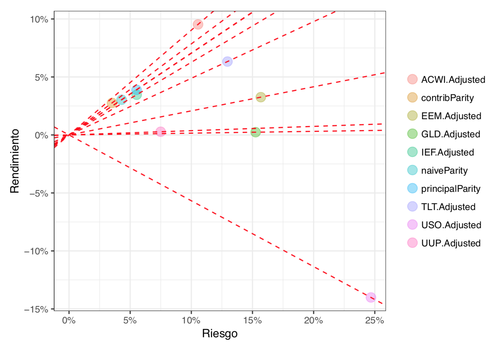

```{r, message=FALSE, warning=FALSE}
library(optimist)
```


> ¿Qué inputs requiere la optimización de media-varianza de Markowitz?

# Teoría Moderna de Portafolios 

Asumamos que tenemos $n$ activos cuyo rendimiento son variable aleatoria $\delta_1, \delta_2, \ldots, \delta_n$.

El valor esperado del rendimiento del activo $i$ está dado por $\mu_i={\rm E}(\delta_i)$ y su desviación estándar por $\sigma_i=\sqrt{\rm Var(\delta_i)}$. El comportamiento conjunto de las variables se explican con:

* el vector de rendimientos esperados $\mu = (\mu_1, \mu_2, \dots, \mu_n)$, y
* la matrix de covarianzas $\Sigma$.

Usando el supuesto que los manejadores de portafolios basan sus decisiones de inversión primordialmente con $\mu$ y $\Sigma$, **Harry Markowitz** definió los principios de la **Teoría Moderna de Portafolios** a partir de la cual se construyen portafolios con base en combinaciones óptimas de retornos esperados y apetitos de riesgo. Incluimos aquí la formulación básica de la optimización de media-varianza de Markowitz.

$$
\begin{aligned}
\max_{h} & & \mu^Th - \delta h^T \Sigma h \\
\text{sujeto a} & & h^T \textbf{1} = 1 \\
\end{aligned}
$$

donde $\delta$ es un parámetro que determina la **aversión al riesgo** del inversionista.

> Al usar la media observada de los rendimientos de los activos, ¿qué harías si quisieras darle mayor relevancia a las últimas observaciones?

## Half-life y Decaimento Geométrico

Un **half-life se alcanza cuando se acumula la mitad de la suma de los pesos**. En nuestro contexto el decaimiento ocurre de lo más reciente a lo más lejano. Por ejemplo, un half-life de 3 meses en el contexto de series con observaciones diarias implica que:

* los pesos diarios asignados en los tres meses más recientes acumulan aproximadamente $0.5$, y
* los pesos para el resto de la serie acumulan aproximadamente $0.5$.

De esta manera, series de pesos con un half-life de tres meses decaen más rápido que series de pesos con un half-life de un año.

-----

**Decaimiento Geométrico**

Método para obtener series diarias de pesos monotónicos decrecientes con un half-life de $m$ días. Buscamos una serie $w = (w^T, w^{T-1}, \dots, w^1)$ de pesos diarios tal que $w^t \geq w^{t-1}$, $\sum w^t = 1$ y que además se cumplan dos condiciones:

* $\sum^T_{k=m} w^k \leq 1/2$ 
* $\sum^m_{k=1} w^k \leq 1/2$

Para esto **nos basaremos en una distribución geométrica** en donde $X$ que es el número de fracasos antes del primer éxito con soporte en $\{1, 2, 3, \ldots\}$. Si $X\sim\text{Geom}(p)$ entonces $\Pr[X = k] = p(1-p)^{k-1}$ y la probabilidad acumulada hasta $x$ está dada por $\sum^x_{k=1}\Pr[X=k]$. Usando la serie geométrica tenemos que

$$
\begin{aligned}
\sum^x_{k=1}\Pr[X=k] & =
\sum^x_{k=1}p(1-p)^{k-1} \\
 &= p\sum^{x-1}_{k=0}(1-p)^k \\
 &= p\frac{1-(1-p)^x}{1-(1-p)}=
1-(1-p)^x
\end{aligned}
$$

Dado un half-life $m$, contruyamos una variable aleatoria $Y$ que tiene distribución geométrica truncada y cuya mediana es $m$: 

* Si $Y$ tiene una distribución geométrica truncada, entonces tiene soporte finito $\{1, 2, 3, \ldots, T\}$ y su función de probabilidad es $\Pr[Y = k] = \Pr[X=k|X \leq T] = \frac{1}{C}\Pr[X=k]$ donde $C=\sum^T_{k=1}\Pr[X=k]$.

$$
\begin{aligned}
\Pr[Y=k] & = \Pr[X=k|X \leq T] \\
& = \frac{\Pr[X=k]}{\sum^T_{k=1}\Pr[X=k]} & \\
& = \frac{p(1-p)^{k-1}}{\sum^T_{k=1}p(1-p)^{k-1}}  = 
\frac{p(1-p)^{k-1}}{1-(1-p)^T}
\end{aligned}
$$

* Si la mediana de $Y$ es $m$, entonces buscamos aquella $p$ que cumpla que $\sum^m_{k=1}\Pr[Y=k] = 1/2$. Esto es


$$
\begin{aligned}
\sum^m_{k=1}\Pr[Y=k] & = \frac{1}{C}\sum^m_{k=1}\Pr[X=k] \\
& = \frac{\sum^m_{k=1}p(1-p)^{k-1}}{\sum^T_{k=1}p(1-p)^{k-1}} \\
& = \frac{\sum^{m-1}_{k=0}(1-p)^k}{\sum^{T-1}_{k=0}(1-p)^k} =
\frac{1-(1-p)^m}{1-(1-p)^T}= 1/2
\end{aligned}
$$

No existe una solución analítica para $p$, pero podemos obtener soluciones numéricas; existirá una solución siempre y cuando $m\in (0,T/2)$, con $p \to 0$ si $m\to T/2$ y $p\to 1$ si $m\to 0$. 

Supongamos que tenemos $T = 1000$ y $m = 45$, **¿bajo qué $p$ la distribución de $Y$ acumula $0.5$ en $m$?** La solución es $p=0.01530232$ como se muestra en la figura \@ref(fig:pesos-geometricos)

```{r, pesos-geometricos, fig.cap='Obteniendo $p$ del half-life', out.width="70%", fig.align="center", fig.pos="H"}
T = 1000
m = 45

median_p <- function(p) (1-(1-p)^m) / (1-(1-p)^T) - 0.5
s <- uniroot(median_p, c(0.000001,0.999999))
p <- s$root

pseq = seq(0.000001, 0.999999, length.out = 1000)
plot(pseq, median_p(pseq), type = "l")
abline(h = 0.0)
abline(v = p, col = "red")
```

Con esto, proponemos la serie de pesos $w$ tal que

* $w^T \rightarrow Pr[Y = 1]$
* $w^{T-1} \rightarrow Pr[Y = 2]$
* $\vdots$
* $w^1 \rightarrow Pr[Y = T]$

En la figura \@ref(fig:pesos-geometricos2) se muestra la serie de pesos con decaimento geométrico con $T = 1000$ y $m = 45$. La línea vertical se encuentra sobre el half-life $m$ donde se acumula el 50% de los pesos.

```{r, pesos-geometricos2, fig.cap='Ejemplo con $T = 1000$ y $m = 45$', out.width="70%", fig.align="center", fig.pos="H"}
k <- 1:T
w <- p * (1-p)^{k-1} / (1-(1-p)^T)
plot(w, type = 'l')
abline(v=m, col = "red")
```

-----

> ¿Qué inconvenientes tiene la optimización de Markowitz?

  * **La estimación de los retornos esperados** - ¿tiene sentido usar promedios históricos? 
  * **Las posiciones óptimas resultantes suelen ser soluciones esquina** - tienen altas concentraciones y son inestables de un período a otro

**La teoría de Markowitz regularmente se asocia con la idea de diversificación**. Sin embargo, **la optimización de media-varianza no se basa en ninguna medida de diversificación**.

# Fuentes de Riesgo

Supongamos que la matriz de covarianzas $\hat\Sigma$ de un conjunto de activos es una matriz diagonal, es decir, los activos son no-correlacionados. En ese caso, la volatilidad de un portafolio compuesto por esos activos es la suma de las varianzas individuales de sus componentes. En la medida en que los activos de un portafolio tienen correlaciones positivas o negativas, el riesgo del portafolio aumenta o disminuye.

Para poder **controlar la asignación de riesgo de un portafolio**, nos resulta deseable identificar fuentes de riesgo que eliminen las correlaciones de nuestros activos. La forma más natural de lograr esto es a partir de componentes principales como mostramos a continuación.

Sean $\mathbf{\Delta}$ los retornos de $n$ activos y $\hat\Sigma$ la matriz de varianzas y covarianzas de $\mathbf{\Delta}$, la matriz de covarianzas se descompone en componentes principales $\hat\Sigma = \mathbf{P}\mathbf{\Lambda} \mathbf{P}^T$ con $\mathbf{P}$ la matriz ortogonal de **eigenvectores** y $\mathbf{\Lambda}$ la matriz diagonal de **eigenvalores** con elementos $\lambda_1, \geq \lambda_2 \geq \cdots \geq \lambda_n$. 

Denotamos por $\mathbf{p}_j$ al $j$-ésimo eigenvector, o **$j$-ésimo portafolio principal**, o **$j$-ésima fuente de riesgo**. Recordemos que las $\mathbf{p}_j$'s no están correlacionados y tienen norma 1. Como $\mathbf{P}$ es ortonormal, entonces $\mathbf{P}^T=\mathbf{P}^{-1}$.

**ETFs de Índices Sectoriales** 

Existen metodologías proprietarias que se usan para clasificar acciones en distintos grupos. En particular es común que se busque clasificar las empresas de acuerdo al sector industrial al que pertenecen. Este problema no es necesariamente sencillo pues existen empresas cuyos productos y servicios se encuentran muy diversificados. Un **índice sectorial** está compuesto por acciones que pertenecen a un sector industrial específico.

* IYC - ETF que replica al Dow Jones US Consumer Services Index. Este índice contiene emisiones en US del sector de servicios al consumidor
* IYE - Dow Jones US Energy Index - sector energético
* IYH - Dow Jones US Health Care Index - sector de salud
* IYR - Dow Jones US Real State Index - sector de bienes raíces
* IYW - Dow Jones US Technology Index - sector de tecnología

Guardamos en `sectors` los precios de los ETFs de Índices Sectoriales.

```{r}
sectors <- get_prices_yahoo(c('IYC', 
                             'IYE', 
                             'IYH',  
                             'IYR', 
                             'IYW'), 
                           from = '2012-12-31', 
                           to = '2017-12-31')
```

**ETFs de Bonos del Tesoso Americanos**

* IEF - Barclays U.S. 7-10 Year Treasury Bond Index - bonos del Tesoro de US con vencimiento entre 7 y 10 años.
* TLT - Barclays 20+ Yr Treasury Bond Index - bonos del Tesoro de US con vencimiento entre 20 y 30 años.
* TLH - Barclays 10-20 Yr Treasury Bond Index - bonos del Tesoro de US con vencimiento entre 10 y 20 años.
* SHY - Barclays U.S. 7-10 Year Treasury Bond Index - bonos del Tesoro de US con vencimiento entre 1 y 3 años.

```{r}
bonds <- get_prices_yahoo(c('TLT', 
                            'TLH', 
                            'IEF', 
                            'SHY'), 
                          from = '2012-12-31', 
                          to = '2017-12-31')
```

> Descomponemos en componentes principales los retornos **anuales** de estos ETF's

```{r}
price <- cbind(sectors, bonds)
dlyChg <- get_dlyChg_from_price(price)
annualChg <- get_rollChg_from_dlyChg(dlyChg, roll = 252) ^ 252

comps <- prcomp(annualChg)
evec <- comps$rotation #los renglones son loadings
eval <- comps$sdev^2
```

### Portafolios Principales

Los retornos de los portafolios principales están dados por $\mathbf{\Delta}\mathbf{P}= \mathbf{P}^T \mathbf{\Delta} = \mathbf{P}^{-1} \mathbf{\Delta}$. 

> Vemos los retornos de los primeros cuatro portafolios principales.

Podemos ver como el primer portafolio principal `PC1` muestra la mayor volatilidad, seguido por el segundo portafolio principal `PC2` y así sucesivamente.

```{r, princomp-scores, fig.cap='Retornos de los primeros cuatro portafolios principales', fig.align='center', out.width="80%", fig.pos="H"}
plot_xts(comps$x[, 1:4]) #scores centrados
```

Ahora, calculemos la varianza explicada por los componentes principales. 

```{r}
summary(comps)
```

De aquí concluimos que el 90\% de la volatilidad es explicada por los primeros tres portafolios principales.

Queremos darle una interpretación a los portafolios principales. Para esto, veamos las posiciones del primer portafolio principal $\mathbf{p}_1$.

```{r}
evec[, 1]
```

El primer portafolio principal toma posiciones dependiendo del tipo de activo, es decir, la dirección del primer componente principal distingue entre acciones y bonos pues los activos de renta variable tienen signo opuesto a los activos de renta fija:

* IYC, IYE, IYH, IYR, y IYW son ETF's de índices de acciones (activos de renta variable)
* TLT, TLH, IEF y SHY son ETF's de índices de bonos (activos de renta fija).

Por lo regular, **la primer componente se  interpreta como "la fuente de riesgo de mercado"**.

Las posiciones del segundo portafolio principal $\mathbf{p}_2$ son:

```{r}
evec[, 2]
```

En este caso el IYE es el único instrumento con signo opuesto a los demás. Este instrumento es el Dow Jones US Energy Index que replica el valor de una canasta de energéticos. Como el petróleo es el energético con más influencia en el valor del índice, concluimos que **la segunda fuente de riesgo es "petróleo"**.

> Vemos representados las covarianzas de los ETF's con los portafolios principales (escaladas por la varianza de los portafolios principales).

```{r, princomp, out.width="90%", fig.align="center", fig.cap="Loadings de las primeras dos componentes principales", echo = FALSE}
plot(evec[, 1:2], 
     cex = 1, 
     pch = 21, 
     bg = alpha("blue", 0.5), 
     xlim = c(-0.7, 0.2), 
     ylim = c(-0.7, 0.7), 
     col = "white", 
     xlab = "portafolio principal 1", 
     ylab = "portafolio principal 2")
abline(h = 0, col = "red", lty = 2)
abline(v = 0, col = "red", lty = 2)
text(evec[, 1:2], 
     gsub('.Adjusted', '', names(annualChg)), 
     cex = 0.6, adj = c(0,0))
```

En esta gráfica también podemos ver que el SHY es un instrumento **libre de riesgo** de "mercado" y "petróleo" pues se encuentra ubicado muy cerca del $(0,0)$.

Los eigenvectores determinan combinaciones lineales de rendimientos de activos, por esto se les llama "portafolios principales". Sin embargo, esta interpretación no es tan atinada pues **es cierto que la norma euclidiana de los eigenvectores es 1 y no que la suma de sus entradas es 1**. Por ejemplo, la suma de los elementos que conforman el primer eigenvector es `r sprintf("%0.2f", sum(evec[, 1]))`.

# Black Litterman

La función a optimizar para encontrar portafolios con máximo retorno dado un nivel de riesgo es

$$
\max_h \quad \mu^T h - 2\delta h^T \Sigma h \;.
$$

Al derivar e igualar a cero resulta que la asignación de portafolio $h$ que resuelve el problema a optimizar es

\begin{equation}
h^* = \frac{1}{\delta}\Sigma^{-1}\mu
\end{equation}

En la **optimización inversa**, los pesos $h^*$ son conocidos y los rendimientos $\mu^*$ son la variable que desconocemos. 

Fijando el valor de $\delta=1$ y usando la matriz de covarianzas empírica tenemos que 

$$
  \mu^* = \hat\Sigma h^*
$$

A los rendimientos en $\mu^*$ se les llama **rendimientos implícitos**. 

Se pueden obtener portafolios óptimos con estos rendimientos implícitos modificando el valor de $\delta$.

A principio de los noventas, el equipo quant de Goldman Sachs publicó una manera de incorporar las creencias del manejador a los retornos esperados [@rachev2008]. **El modelo conocido como Black-Litterman consiste en una actualización, en el sentido bayesiano, de los rendimientos implícitos que se obtienen a partir de un portafolio de equilibrio**. 

Si el manejador no tiene una creencia particular sobre el retorno o riesgo de un activo, los retornos esperados corresponden a los implícitos. En caso de que el manejador tenga una creencia particular sobre el retorno o riesgo de un activo, ésta debe expresarse como una expectativa. 

Una expectativa absoluta se expresa como "el retorno que va a obtener un activo". Una expectativa relativa se expresa en términos de "cuánto retorno en exceso va a obtener un activo contra otro". Adicionalmente, la certeza de estas creencias debe adicionarse a la información de incertidumbre que contiene la matriz de covarianzas.

**Utilizando el Teorema de Bayes**, se combinan los retornos implícitos y las expectativas relativas o absolutas del manejador. Esto resulta muy valioso para los manejadores pues los retornos esperados resultantes no sólo contienen información del pasado que se extrae del portafolio de equilibrio. 

# Paridad de Riesgo

# Diversificación

**Un portafolio se encuentra bien diversificado si no se encuentra altamente expuesto a shocks individuales**. La diversificación puede ser medida de acuerdo al porcentaje de riesgo asignado a distintas fuentes de riesgo (**risk budgeting**).


Como vimos, en nuestro ejemplo:

* El primer portafolio principal representa la fuente de riesgo "mercado"
* El segundo portafolio principal representa la fuente de riesgo "petróleo"

A partir de los renglones de la matriz de eigenvectores $(\mathbf{P})_{i,\bullet}$, veamos los loadings del IYE. Estos son los coeficientes de una transformación donde los retornos anuales del IYE son la variable dependiente y los rendimientos anuales de los portafolios principales son las variables dependientes.

```{r}
evec['IYE.Adjusted', ]
```

Denotemos por $\mathbf{p}_{\text{IYE},j}$ al $j$-ésimo loading del IYE. La varianza del IYE puede ser descompuesta en la suma de las varianzas de los portafolios principales $\lambda_j$s con la siguiente regla (pues los portafolios principales son ortogonales)

$$
{\hat{\sigma}_\text{IYE}}^2 = (\mathbf{p}_{\text{IYE},1})^2\lambda_1 + (\mathbf{p}_{\text{IYE},2})^2\lambda_2+ \ldots + (\mathbf{p}_{\text{IYE},n})^2\lambda_n \;. 
$$

Entonces el riesgo del IYE lo podemos calcular así.

```{r}
sqrt((evec['IYE.Adjusted', ])^2 %*% eval)
```


Como se explicó antes, un portafolio bien diversificado busca asignar de forma equilibrada su riesgo a distintos fuentes no correlacionados. Esto significa que para asignar el peso de un activo dentro de un portafolio se debe tomar en cuenta su descomposición en fuentes de riesgo. 

A continuación veremos un ejemplo en el que logramos diversificar la asignación de riesgo en las dos primeras fuentes de riesgo en un portafolio de dos activos.

Si se invierte el 37\% de un portafolio en IYE y el resto en efectivo tenemos que:

* `r sprintf("%0.4f", sqrt((0.37 * evec['IYE.Adjusted', 1])^2 * eval[1]))` $=\sqrt{(0.37 \mathbf{p}_{\text{IYE},1})^2 \lambda_1}$, es el riesgo del IYE en el portafolio que proviene de la fuente de “mercado”
* `r sprintf("%0.4f", sqrt((0.37 * evec['IYE.Adjusted', 2])^2 * eval[2]))` $=\sqrt{(0.37 \mathbf{p}_{\text{IYE},2})^2 \lambda_2}$, es el riesgo del IYE en el portafolio que proviene de la fuente “petróleo”

Si invertimos el 63\% restante del portafolio en el TLT en vez de efectivo, entonces:

* `r sprintf("%0.4f", sqrt((0.37 * evec['IYE.Adjusted', 1] + 0.63 * evec['TLT.Adjusted', 1])^2 * eval[1]))` $=\sqrt{(0.37 \mathbf{p}_{\text{IYE},1} + 0.63 \mathbf{p}_{\text{TLT},1})^2 \lambda_1}$, es el riesgo del portafolio que proviene de la fuente “mercado”
* `r sprintf("%0.4f", sqrt((0.37 * evec['IYE.Adjusted', 2] + 0.63 * evec['TLT.Adjusted', 2])^2 * eval[2]))` $=\sqrt{((0.37 \mathbf{p}_{\text{IYE},2} + 0.63 \mathbf{p}_{\text{TLT},2})^2 \lambda_2}$ es el riesgo del portafolio que proviene de la fuente “petróleo”

Como vemos, ¡hemos construido un portafolio cuyas asignaciones en riesgo de mercado y petróleo se encuentra perfectamente equilibradas! De esta manera, **hemos diversificado el riesgo del portafolio proveniente de estas dos fuentes de riesgo**. 

## Portafolio Tradicional

Un portafolio constituido por:

* 60% en el S&P 500 y
* 40% en el Bloomberg Barclays US Aggregate Bond Index.

```{r, message=FALSE, warning=FALSE}
#install.packages('mltools')
library(mltools)
```

```{r, echo=FALSE, message=FALSE, warning=FALSE}
traditional <- get_prices_yahoo(c('spy', 'agg'), 
                                from = '2010-12-31', 
                                to = '2018-06-30')
traditional_dlyChg <- get_dlyChg_from_price(traditional)
traditional_cumRet <- get_cumRet_from_dlyChg(traditional_dlyChg)

traditional_rebDates <-
  data.frame(dates = index(traditional_dlyChg)) %>% 
    mutate(quarters = mltools::date_factor(dates, 'yearquarter')) %>% 
    group_by(quarters) %>% 
    summarize(rebdates = min(dates)) %>% 
    pull(rebdates)

traditional_rebWeight <- data.frame(
  SPY.Adjusted = rep(0.6, length(traditional_rebDates)), 
  AGG.Adjusted = rep(0.4, length(traditional_rebDates))
)
traditional_rebWeight <- 
  xts(traditional_rebWeight, order.by = traditional_rebDates)

traditional_rebalance <- 
  get_rebalance(traditional_dlyChg, traditional_rebWeight)
plot_xts(cbind(
    traditional_rebalance$portValue, 
    traditional_rebalance$portContrib)) 
```

```{r}
traditional_sdRet <- get_sdRet_from_dlyChg(
  traditional_dlyChg, method = 'arithmetic') * c(0.6, 0.4)

traditional_sdRet / sum(traditional_sdRet)
```

* Multipliquemos el riesgo del S&P 500 por $0.6$ y el riesgo del AGG por $0.4$.
* Calculemos la proporción que representan estos riesgos con respecto a la suma de los dos
    + El riesgo del SPY representa el `r sprintf("%0.2f", as.numeric(traditional_sdRet[1] / sum(traditional_sdRet)) * 100)`% de la suma del riesgo de los ETFs
    + El riesgo del AGG representa el `r sprintf("%0.2f", as.numeric(traditional_sdRet[2] / sum(traditional_sdRet)) * 100)`%.

**La asignación de riesgo de la combinación 60/40 se encuentra poco balanceada**.

## ETFs Multiactivos

* **ETF's multiactivos**
    * ACWI - MSCI's All Country World Index - índice de capitalización de mercado de acciones listadas en todo el mundo
    * EEM - Emerging Markets Index - índice de capitalización de mercado de acciones listadas en países emergentes
    * USO -  Front Month Light Sweet Crude Oil Index - fondo compuesto por futuros de precios de petróleo
    * GLD - Precio del oro - fondo invertido directamente en oro físico
    * UUP - Deutsche Bank Long USD Currency Portfolio Index - índice que representa la fortaleza del dólar americano relativo a una canasta de seis monedas: el euro, el yen, la libra, el dólar canadiense, la corona sueca y el franco suizo.

```{r, include=FALSE}
multi <- get_prices_yahoo(c('acwi',
                            'eem',
                            'uso',
                            'tlt',
                            'ief',
                            'gld',
                            'uup'),
                          from = '2008-06-30',
                          to = '2019-04-30')
```

```{r, echo=FALSE}
dlyChg <- get_dlyChg_from_price(multi)
cumRet <- get_cumRet_from_dlyChg(dlyChg)
plot_xts(log(cumRet))
```

## Paridad de Riesgo Ingenua

La construcción de portafolios con **paridad ingenua de riesgo** consiste en asignar a cada activo $i$ un peso dado por 

$$
h_i =\frac{1/\hat\sigma_i}{\sum_{i = 1}^n 1/\hat\sigma_i} \;.
$$

**Con los pesos de paridad ingenua, se cumple que** 

$$\hat\sigma_1 h_1 = \hat\sigma_2 h_2 = \ldots = \hat\sigma_n h_n$$

Si el riesgo de un portafolio fuera la suma ponderada de los riesgos de sus componentes entonces, usando los pesos de paridad ingenua de riesgo, cada componente aportaría la misma cantidad de riesgo.

```{r, include=FALSE}
naiveParity_weights <- get_naiveParity_weights(dlyChg, halflife = 160)
sdRet <- get_sdRet_from_dlyChg(dlyChg, halflife = 160) 
```

```{r}
sdRet * naiveParity_weights
```

**El inconveniente de los pesos de paridad de riesgo es que ignoran las correlaciones que existen entre los activos*

## Paridad de Contribución al Riesgo

**contribución marginal al riesgo**

A $\frac{\partial\hat\sigma_\text{p}}{\partial h_i}$ lo llamaremos la contribución marginal al riesgo del componente $i$ del portafolio. El vector de contribuciones marginales al riesgo está dado por $\frac{\hat\Sigma h}{\sqrt{h^T \hat\Sigma h}}$.

$$
\frac{\partial\widehat\sigma_\text{p}}{\partial h_i} = \frac{\sum_j \widehat\sigma_{ij} h^j}{\sqrt{h^T \hat\Sigma h}} = \frac{(\Sigma h)_i}{\sqrt{h^T \hat\Sigma h}} \;.
$$

**contribución total al riesgo del componente $i$ del portafolio**

A $h_i\frac{\partial\hat\sigma_\text{p}}{\partial h_i}$ lo llamaremos la contribución total al riesgo del componente $i$ del portafolio.

$$
\sum_i h_i\frac{(\hat\Sigma h)_i}{\sqrt{h^T \hat\Sigma h}}=\frac{h^T \hat\Sigma h}{\sqrt{h^T \hat\Sigma h}} = \sqrt{h^T \hat\Sigma h} \;.
$$

Se cumple que el riesgo total del portafolio es la suma de las contribuciones totales al riesgo pues

**formulación del problema de paridad de contribución al riesgo**

Encontrar **un portafolio tal que las contribuciones totales al riesgo sean igual para todas las componentes del portafolio**

$$
\begin{aligned}
\min_{h} & & 
\sum_i\sum_j\left(h_i(\Sigma h)_i - h_j(\Sigma h)_j\right)^2 \\
\text{sujeto a} & &
h^T \mathbf{1} = 1\\
& &h \geq 0
\end{aligned}
$$

**Con los pesos de paridad de contribución al riesgo, se cumple que**

$$h_1(\hat\Sigma h)_1 = h_2(\hat\Sigma h)_2 = \ldots = h_n(\hat\Sigma h)_n$$

```{r, include=FALSE}
contribParity_weights <- get_contribParity_weights(dlyChg, 
                                                   halflife = 160)
covRet <- get_covRet_from_dlyChg(dlyChg, halflife = 160)
```

```{r}
contribParity_weights * covRet %*% contribParity_weights
```

## Paridad de Fuentes de Riesgo

Si invertimos $h$ en un portafolio, entonces invertimos $\mathbf{p}_i^\top h$ en el $i$-ésimo portafolio principal

$$
\lambda_i (\mathbf{p}_i^\top h)^2 = \lambda_j (\mathbf{p}_j^\top h)^2 \quad \text{ para toda } \quad i,j = 1,...,K.
$$

**formulación del problema de paridad de fuentes de riesgo**

$$
\begin{aligned}
\min_{h} & & \sum_i\sum_j 
\left( \lambda_i (\mathbf{p}_i^\top h)^2  - \lambda_j (\mathbf{p}_j^\top h)^2 \right)^2\\
\text{sujeto a} & & h^T \mathbf{1} = 1 \\
& & h \geq 0
\end{aligned}
$$

**Con los pesos de paridad de fuentes de riesgo se cumple, eligiendo tres fuentes de riesgo, que**

$$\lambda_1 (p_1^\top h)^2 = \lambda_j (p_2^\top h)^2= \lambda_i (p_3^\top h)^2$$

```{r, include=FALSE}
T <- nrow(dlyChg) 
w <- get_w_with_geomTruncDecay(T=T, halflife = 160)
Sigma <- cov.wt(dlyChg, w)$cov 
eig <- eigen(Sigma, symmetric=TRUE) #eigen vectors - loadings

evec <- eig$vectors
eval <- eig$values

heq <- function(x) {
    sum(x) - 1
}

heqjac <- function(x) {
    rep(1, length(x))
}

principal_parity_weights <- 
  get_principalParity_weights(  
    dlyChg, 
    halflife = 160, 
    num_factors = 3)
```

```{r}
eval * (principal_parity_weights %*% evec)^2
```

## Índices de Paridad de Riesgo

* Se calculan los pesos diarios de paridad de riesgo
* Se construyen portafolios con rebalanceos diarios

**retorno acumulado**

```{r, echo=FALSE, out.width="80%", fig.align="center"}
knitr::include_graphics("./figure/riskParity_index.png")
```

**relación riesgo-rendimiento**

```{r, echo=FALSE, out.width="80%", fig.align="center"}

```

